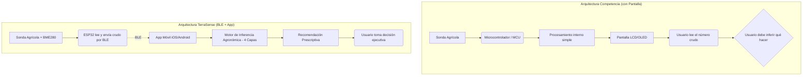
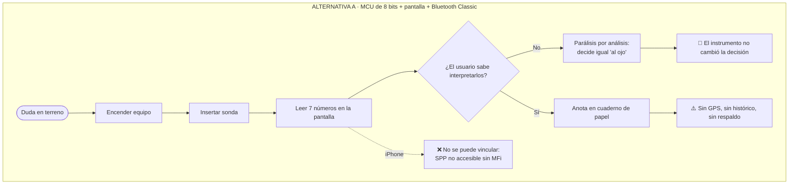
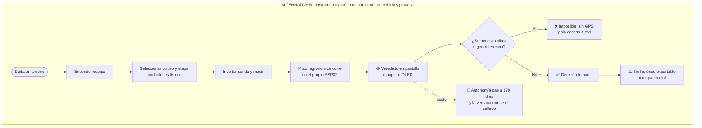
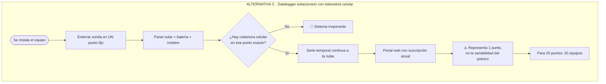
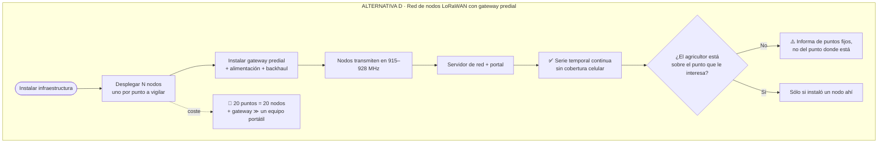
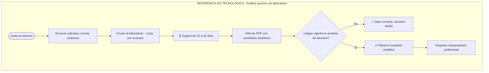
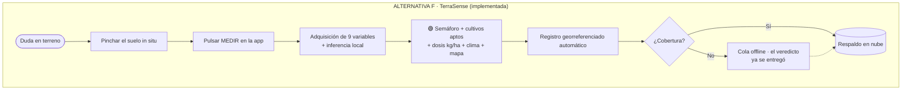
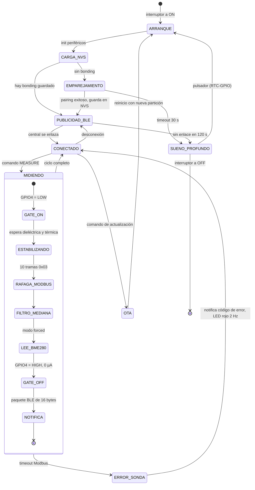
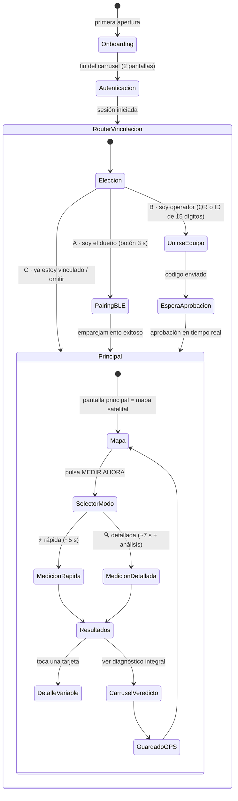

# 🌱 TerraSense — Sistema IoT de Diagnóstico Agronómico Prescriptivo

> **No vendemos datos. Vendemos decisiones.**

**Proyecto de Título — Ingeniería en Electrónica y Sistemas Inteligentes, INACAP**
**Documento maestro de proyecto · Versión 3.0 · 28 de agosto de 2026**

| | |
| :--- | :--- |
| **Producto** | Instrumento portátil de medición edafológica 7-en-1 con motor de inferencia agronómica en smartphone |
| **Stack** | ESP32-WROOM-32 · RS-485 Modbus RTU · BLE 5.0 · Bosch BME280 · React Native (Expo/TypeScript) · Supabase + PostGIS |
| **Mercado objetivo** | Agricultura Familiar Campesina y pequeño/mediano productor comercial de Chile (0,5 – 20 ha) |
| **Precio objetivo** | $179.990 CLP con IVA ($151.252 CLP netos) |
| **Tipo de cambio de referencia** | 1 USD = 915 CLP (dólar observado, Banco Central de Chile, 18-ago-2026) <sup>[35]</sup> |

[](LICENSE)
[](https://www.espressif.com/en/products/socs/esp32)
[](https://www.bluetooth.com/)
[](https://reactnative.dev/)
[](https://supabase.com/)

---

> [!IMPORTANT]
> ### 📐 Convención de citas y trazabilidad de datos
>
> **Toda cifra, estadística, precio, especificación eléctrica o exigencia normativa de este documento lleva un marcador `[n]`** que remite a la [Sección XVIII — Referencias bibliográficas](#xviii-referencias-bibliográficas), donde consta la fuente, la URL y la fecha de consulta.
>
> Las cifras **sin marcador** son **estimaciones propias del proyecto** (cotizaciones locales, mediciones de banco, supuestos de modelo). Cuando una cifra es un supuesto, se declara explícitamente como tal y se explica de dónde sale. Este documento distingue deliberadamente tres categorías:
>
> | Marca | Significado |
> | :--- | :--- |
> | `[n]` | **Dato verificable** contra fuente externa citada |
> | *(estimación propia)* | **Supuesto del proyecto**, justificado en el texto, sujeto a revisión |
> | *(pendiente de ensayo)* | **Aún no medido ni certificado**. No se declara como cumplido |
>
> Se ha preferido corregir cifras heredadas de versiones anteriores del proyecto antes que sostenerlas sin respaldo. Las correcciones relevantes se señalan en recuadros de advertencia dentro de cada sección.

---

## 📑 Tabla de contenidos

| # | Sección |
| :--- | :--- |
| — | [Resumen ejecutivo](#resumen-ejecutivo) |
| **I** | [Introducción](#i-introducción) |
| **II** | [Descripción de la problemática](#ii-descripción-de-la-problemática) |
| **III** | [Propuesta de solución tecnológica](#iii-propuesta-de-solución-tecnológica) |
| **IV** | [Objetivos del proyecto](#iv-objetivos-del-proyecto) |
| **V** | [Planificación de actividades](#v-planificación-de-actividades) |
| **VI** | [Ingeniería conceptual: alternativas de arquitectura y decisión](#vi-ingeniería-conceptual-alternativas-de-arquitectura-y-decisión) |
| **VII** | [Ingeniería básica: especificaciones de equipos e instrumentos](#vii-ingeniería-básica-especificaciones-de-equipos-e-instrumentos) |
| **VIII** | [Planos y diagramas](#viii-planos-y-diagramas) |
| **IX** | [Criterios de diseño](#ix-criterios-de-diseño) |
| **X** | [Factibilidad técnica](#x-factibilidad-técnica) |
| **XI** | [Estudio de mercado y factibilidad comercial](#xi-estudio-de-mercado-y-factibilidad-comercial) |
| **XII** | [Evaluación económica: flujo de caja, VAN y TIR](#xii-evaluación-económica-flujo-de-caja-van-y-tir) |
| **XIII** | [Ingeniería de detalles](#xiii-ingeniería-de-detalles) |
| **XIV** | [Condiciones técnicas y normativas de diseño](#xiv-condiciones-técnicas-y-normativas-de-diseño) |
| **XV** | [Validación experimental, KPIs y defensa del proyecto](#xv-validación-experimental-kpis-y-defensa-del-proyecto) |
| **XVI** | [Puesta en marcha y estructura del repositorio](#xvi-puesta-en-marcha-y-estructura-del-repositorio) |
| **XVII** | [Conclusiones](#xvii-conclusiones) |
| **XVIII** | [Referencias bibliográficas](#xviii-referencias-bibliográficas) |

---

# Resumen ejecutivo

**TerraSense** es un instrumento portátil de medición edafológica que integra una sonda industrial de siete parámetros (humedad volumétrica, temperatura de suelo, conductividad eléctrica, pH, nitrógeno, fósforo y potasio) con un microcontrolador ESP32, un sensor ambiental Bosch BME280 y una aplicación móvil que ejecuta localmente un motor de inferencia agronómica de cuatro capas. El equipo no muestra números: **entrega una prescripción ejecutable** —qué sembrar, si regar hoy, cuántos kilos de cal por hectárea aplicar y cuánto cuesta esa corrección— en menos de cinco segundos, sin conexión a internet.

**El problema.** El Censo Agropecuario y Forestal 2021 registró **138.628 unidades productivas agropecuarias (UPA)** y **36.928 unidades de autoconsumo (UAC)** en Chile, sobre **48,7 millones de hectáreas censadas** <sup>[1]</sup>. La mayoría de esas unidades toma decisiones de siembra, riego y fertilización sin ninguna medición física del suelo, en un territorio que entre Coquimbo y La Araucanía acumula, desde 2010, un **déficit de precipitaciones cercano al 30 %** de forma ininterrumpida <sup>[4]</sup>, y sobre suelos de los cuales el **33 % a escala mundial está moderada o severamente degradado** <sup>[5]</sup>. La alternativa disponible —el análisis químico de laboratorio— cuesta decenas de miles de pesos por muestra y demora semanas; la asesoría agronómica particular es un costo recurrente inasumible para un predio de dos hectáreas.

**La solución técnica.** Se descartó explícitamente la arquitectura clásica de instrumento autónomo (microcontrolador de 8 bits + pantalla + módulo Bluetooth clásico) por cinco razones documentadas en la [Sección VI](#vi-ingeniería-conceptual-alternativas-de-arquitectura-y-decisión): incompatibilidad de Bluetooth Classic con iOS sin certificación MFi, ausencia de memoria para el motor de inferencia, imposibilidad de actualización remota de firmware, consumo permanente del módulo de radio y de la pantalla, y coste de certificación radioeléctrica. La arquitectura elegida —**sonda industrial + ESP32 + BLE + smartphone como datalogger e intérprete**— traslada el cómputo, la pantalla, el GPS y el módem al teléfono que el agricultor ya posee, y reserva la electrónica embarcada al único rol que el teléfono no puede cumplir: **excitar y leer una sonda industrial de 12 V por bus RS-485 con el menor gasto energético posible**.

**Eficiencia energética.** El equipo consume **0 µA** en la línea de sonda cuando no mide, gracias a un corte por P-MOSFET (*power gating*) que desconecta el elevador de 12 V y el transceptor RS-485; **~15 µA** en sueño profundo *(estimación de diseño, pendiente de medición en placa final)*; y **0,141 mAh por ciclo completo de medición**. Bajo un régimen de campo estándar de 8 mediciones diarias, el modelo energético de la [Sección IX](#ix-criterios-de-diseño) proyecta **~784 días de autonomía y ~6.200 mediciones por carga**, de los cuales se declara comercialmente un valor derateado de **≥ 2.000 mediciones y 8 a 12 meses**. Añadir una pantalla OLED activa reduce esa autonomía a **179 días (−77 %)**; el mismo cálculo demuestra que **el interruptor físico de corte —no el MOSFET— es el componente que más autonomía aporta**: sin él, el equipo en publicidad BLE permanente se agotaría en **27 días**.

**Viabilidad económica.** El estudio se construye sobre una proyección deliberadamente conservadora: **120 unidades el primer año**, equivalentes al **0,1 % del mercado servible** y a diez ventas mensuales. El costo variable unitario puesto en manos del cliente es de **$69.069 CLP** —BOM de $43.773 más flete aéreo consolidado desde China <sup>[45]</sup>, arancel del 6 % <sup>[32]</sup>, mano de obra, merma, provisión de garantía legal de 6 meses <sup>[24]</sup> y flete nacional—, y el costo total de operar el primer año asciende a **$13.029.860**, es decir **$108.582 por unidad**. Sobre esa base, el precio predefinido de $179.990 CLP con IVA implica una **rentabilidad del 39,3 % sobre el costo total**, por encima del **30 % mínimo exigido**, cuyo piso comercial se sitúa en $169.990.

La **inversión inicial es de $14.022.415 CLP** —$9.892.415 en capital de trabajo y activo nominal, más $4.130.000 en activo fijo—, financiada con subsidio CORFO Semilla Inicia ($8.000.000, no reembolsable), aporte propio ($3.000.000), una línea de corto plazo a 1 año y 23 % ($1.500.000) y un crédito a largo plazo a 5 años y 10 % ($1.522.415), ambos por sistema alemán. El punto de equilibrio del Año 1 es de **56 unidades** frente a 120 planificadas.

| Indicador (tasa de descuento 20 %) | Escenario base ($179.990) | Escenario recomendado |
| :--- | ---: | ---: |
| **VAN** | $7.019.065 | **$25.064.177** |
| **TIR** | 34,6 % | **59,9 %** |
| **Pay Back** | 3,14 años | **2,34 años** |
| **Pay Back descontado** | 4,09 años | **3,03 años** |
| VAN con volumen −10 % | −$669.851 | **$12.890.974** |

Los cinco criterios de evaluación coinciden en **aceptar el proyecto**, pero el análisis de sensibilidad revela que **el escenario base es viable y a la vez frágil**: tolera apenas un −10 % de volumen, un −5,6 % de precio y un +13 % de costo variable. De ahí las dos recomendaciones del estudio: **elevar el precio de lista a $199.990 CLP desde el Año 2** —que sigue siendo un 35 % más barato que el competidor más cercano ofreciendo tres veces más parámetros, y que convierte la fragilidad en robustez— y **activar el canal INDAP/PDI**, cuyo cofinanciamiento del 60 % al 90 % <sup>[43][44]</sup> actúa directamente sobre la única variable capaz de hundir el proyecto. El flujo mensual detectó además que **el mes 6 es el punto crítico de caja del primer año**, cuando coincide el pago del segundo lote de importación con ventas todavía bajas: se resuelve fraccionando el lote, sin costo.

**Conclusión.** El proyecto es **técnicamente factible con dos riesgos abiertos y explícitamente declarados** —el grado IP67 está *diseñado pero no ensayado*, y el mapa de registros de la sonda requiere confirmación con el proveedor— y **económicamente viable**, con holgura frente a errores de costo y con un margen más estrecho frente a errores de volumen. Su barrera competitiva no está en el hardware, que es genérico y replicable por diseño, sino en el **motor agronómico calibrado para suelos y cultivos chilenos** y en el histórico georreferenciado que se acumula con el uso — una barrera que crece con el tiempo en lugar de erosionarse.

---

# I. Introducción

Este documento es la especificación integral del proyecto **TerraSense**: un sistema IoT de diagnóstico agronómico prescriptivo desarrollado como Proyecto de Título de Ingeniería en Electrónica y Sistemas Inteligentes. Reúne en un solo texto la ingeniería conceptual, básica y de detalle, el estudio de mercado, la evaluación económica y el marco normativo aplicable, con el objetivo de que cualquier lector técnico —o cualquier comisión evaluadora— pueda reconstruir y auditar cada decisión tomada.

El documento se ordena siguiendo la secuencia de maduración natural de un proyecto de ingeniería: primero **qué problema existe y por qué merece resolverse** (Secciones II y III); luego **qué se propuso conseguir y cómo se organizó el trabajo** (IV y V); a continuación **qué alternativas de arquitectura se evaluaron y por qué se eligió una** (VI), con qué componentes concretos se materializa (VII), y cómo se representa gráficamente (VIII); después **bajo qué criterios se diseñó** (IX) y **si esos criterios son alcanzables técnica y comercialmente** (X, XI, XII); finalmente **el detalle de implementación** (XIII), **las normas que lo obligan** (XIV) y **cómo se valida** (XV).

## I.1. Alcance del documento

Este README **es** la memoria técnica del proyecto. Los documentos de `docs/` son anexos de profundización que amplían capítulos concretos y no sustituyen a este texto:

| Anexo | Amplía la sección |
| :--- | :--- |
| `docs/ESPECIFICACIONES_CONCEPTUALES_Y_FILOSOFIA.md` | III y VII |
| `docs/DIAGRAMAS_ALTERNATIVAS_COMPETENCIA.md` | VI y VIII |
| `docs/ESTUDIO_VIABILIDAD_TECNICA_ECONOMICA.md` | X y XI |
| `docs/CRITERIOS_EFICIENCIA_ENERGETICA_Y_DIGITALIZACION.md` | IX |
| `docs/FLUJO_PANTALLAS_APP_MOVIL.md` | XIII |
| `docs/MARCO_NORMATIVO_Y_ESTANDARES.md` | XIV |

## I.2. Qué NO es este proyecto

Declarar los límites al inicio evita defender lo indefendible después. TerraSense **no es**:

* **Un sustituto del análisis químico acreditado.** No mide micronutrientes (boro, zinc, molibdeno), no entrega capacidad de intercambio catiónico ni materia orgánica, y no tiene validez legal para certificación de exportación. Se recomienda un análisis de laboratorio cada dos o tres años como referencia de calibración.
* **Un diagnóstico fitosanitario.** Evalúa el suelo y el microclima; no detecta virus foliares, plagas ni enfermedades del follaje.
* **Un instrumento de laboratorio.** Su exactitud es *operativa* —suficiente para decidir en terreno— no metrológica de referencia. Ver [X.1](#x1-desempeño-metrológico-declarado-y-sus-límites).
* **Una plataforma con suscripción.** El agricultor paga una vez. La consola web es un *backoffice* interno de gestión de flota del fabricante, no un portal de pago para el cliente.

---

# II. Descripción de la problemática

## II.1. Contexto macro: el suelo como activo no monitoreado

El suelo agrícola es el activo productivo de mayor valor de una explotación y, simultáneamente, el único que la inmensa mayoría de los productores **nunca mide**.

| Hecho | Cifra | Fuente |
| :--- | :--- | :--- |
| Unidades productivas agropecuarias en Chile (Censo 2021) | **138.628 UPA** | <sup>[1]</sup> |
| Unidades de autoconsumo (< 2 ha, sin ventas 2020-2021) | **36.928 UAC** | <sup>[1]</sup> |
| Total de unidades censadas | **175.556** | <sup>[1][2]</sup> |
| Superficie censada | **48,7 millones de ha** (45,8 M ha con actividad agropecuaria) | <sup>[1]</sup> |
| Explotaciones registradas en el Censo 2007 (metodología anterior) | 301.269 | <sup>[2]</sup> |
| Explotaciones atribuidas a la AFC por INDAP | más de 278.000 | <sup>[3]</sup> |
| Aporte de la AFC al PIB agropecuario nacional | ~25 % | <sup>[3]</sup> |
| Déficit de precipitaciones entre Coquimbo y La Araucanía desde 2010 | **~30 %**, ininterrumpido | <sup>[4]</sup> |
| Suelos del mundo moderada o altamente degradados | **33 %** | <sup>[5]</sup> |
| Superficie nacional de hortalizas de consumo fresco (2024) | **83.774 ha** (+1,6 % vs. 2023) | <sup>[7]</sup> |
| Hogares rurales chilenos con acceso a internet (2024) | **94,5 %** (urbano 96,8 %) | <sup>[8]</sup> |
| Hogares rurales que sólo disponen de servicio móvil | **51,4 %** | <sup>[8]</sup> |

> [!WARNING]
> ### 🔧 Corrección respecto de versiones anteriores de este documento
>
> Versiones previas del README afirmaban «más de 278.000 explotaciones agropecuarias *(ODEPA / Censo Agropecuario)*». **Esa atribución era incorrecta.** La cifra de 278.000 proviene de la caracterización de la Agricultura Familiar Campesina que publica INDAP <sup>[3]</sup>, construida sobre la metodología del Censo 2007; el Censo Agropecuario y Forestal 2021 registró **175.556 unidades en total** bajo un concepto distinto —«unidad productiva agropecuaria» en lugar de «explotación»— y ODEPA advierte expresamente que **ambas cifras no son directamente comparables** <sup>[2]</sup>.
>
> Todo el dimensionamiento de mercado de la [Sección XI](#xi-estudio-de-mercado-y-factibilidad-comercial) se reconstruyó sobre la cifra censal de 2021. El TAM resultante es **menor** que el declarado antes. Se prefirió un mercado más pequeño y defendible a uno mayor e indefendible: la primera pregunta de cualquier evaluador con formación económica será por la fuente del universo.

### II.1.1. Por qué la megasequía convierte la medición en obligatoria

El fenómeno que el Centro de Ciencia del Clima y la Resiliencia denomina **megasequía** no tiene análogo en el último milenio según reconstrucciones dendroclimáticas, y desde 2010 **todos los años** de la zona central han registrado precipitaciones bajo lo normal, con déficits de entre 20 % y 45 % <sup>[4]</sup>. Las consecuencias agronómicas directas, y por qué exigen instrumentación:

1. **Salinización progresiva.** Menos agua de lluvia significa menos lavado natural de sales; el riego con aguas de peor calidad concentra sales en la zona radicular. La conductividad eléctrica deja de ser un parámetro de curiosidad y pasa a ser el factor limitante de la germinación.
2. **Desacople del calendario agrícola.** Las fechas empíricas de siembra —"el 15 de septiembre se siembra el maíz"— dejan de coincidir con la ventana térmica real del suelo. La temperatura de suelo a 15 cm es el único dato que resuelve la duda, y no se puede estimar a ojo.
3. **Encarecimiento del error.** Con menos agua disponible y con insumos cuyos precios internacionales ODEPA sigue trimestralmente <sup>[6]</sup>, el costo de oportunidad de una siembra perdida crece. La fertilización aplicada sobre un suelo con pH bloqueante no sólo se pierde: se pierde en un año en que el productor ya no tiene margen para repetirla.

## II.2. El micro-problema: la decisión de las 7:00 AM

```text
EL DILEMA DEL AGRICULTOR FRENTE AL POTRERO
┌───────────────────────────────────────────────────────────────────────────────┐
│  🧑‍🌾 PRODUCTOR CON LA INVERSIÓN DE LA TEMPORADA COMPROMETIDA EN INSUMOS       │
│                                                                               │
│  ❓ ¿Tiene el suelo la temperatura mínima para que la semilla no se pudra?     │
│  ❓ ¿Está el pH en rango para que la planta absorba el fertilizante que pagué? │
│  ❓ ¿Hay exceso de sales que queme la raíz tierna del trasplante?              │
│  ❓ ¿Va a llover en 48 h y provocar asfixia radicular?                         │
│                                                                               │
│  ❌ OPCIÓN A · Laboratorio químico                                            │
│      Costo por muestra + 15 a 30 días de espera                               │
│      ➜ La ventana de siembra se cierra antes de tener la respuesta            │
│                                                                               │
│  ❌ OPCIÓN B · Asesoría agronómica particular                                 │
│      Costo por visita, recurrente cada temporada                              │
│      ➜ Inasumible para un predio de 2 a 5 hectáreas                           │
│                                                                               │
│  ⚠️ OPCIÓN C · Sembrar "al ojo", como siempre                                 │
│      Costo cero hoy · Riesgo total mañana                                     │
│      ➜ Es lo que hace la mayoría, y es exactamente el problema                │
└───────────────────────────────────────────────────────────────────────────────┘
```

La trampa económica de la opción C es que **la agricultura no da retroalimentación inmediata**. Cuando un productor siembra a ciegas, no sabe si acertó hasta **20 a 45 días después**, cuando la semilla no brotó o el plantín murió. Para ese momento ya gastó semilla, mano de obra, combustible y fertilizante. No hay reintento dentro de la temporada.

## II.3. El ciclo productivo completo: cuatro etapas, no una decisión

Limitar el valor del instrumento al día de la siembra subestima su utilidad entre un 70 % y un 80 %, porque descarta las tres etapas en que el productor efectivamente pasa la temporada.

```text
                  CICLO FENOLÓGICO ACOMPAÑADO POR TERRASENSE
  ┌─────────────────┐   ┌─────────────────┐   ┌─────────────────┐   ┌─────────────────┐
  │ 1. PRE-SIEMBRA  │──►│ 2. DESARROLLO   │──►│ 3. FLORACIÓN    │──►│ 4. PRE/POST     │
  │    Y TRASPLANTE │   │    VEGETATIVO   │   │    Y CUAJADO    │   │    COSECHA      │
  └────────┬────────┘   └────────┬────────┘   └────────┬────────┘   └────────┬────────┘
           ▼                     ▼                     ▼                     ▼
  • T° suelo > cero      • Monitoreo de N      • Control salino     • Suelo seco para
    vegetativo             y humedad radicular   (EC) crítico en      cosecha mecánica
  • pH sin bloqueos      • Manejo de riego       floración          • Acondicionamiento
  • Dosis de enmienda      para evitar         • Balance de K para    para la rotación
  • Evitar sembrar         asfixia radicular     llenado y calibre    siguiente
    antes de lluvia                              de fruto
```

**Consecuencias vinculantes de este alcance sobre el diseño del sistema:**

| Componente | Obligación derivada |
| :--- | :--- |
| **Motor de inferencia** | La Capa 4 evalúa **ventanas de manejo** (siembra, riego, fertilización, cosecha), no sólo ventanas de siembra. El veredicto depende de la etapa fenológica activa |
| **Aplicación móvil** | Toda medición se registra con su etapa (`pre_siembra`, `vegetativo`, `floracion`, `cosecha`). El selector de etapa es un control de primera clase |
| **Semáforo** | No emite un veredicto fijo de siembra: emite el veredicto **de la etapa activa** |
| **Umbrales de cultivo** | Cada perfil de la Capa 1 declara rangos **por etapa**, no un único rango global |
| **Modelo de negocio** | Asume **uso recurrente durante toda la temporada** (15 a 40 usos), no un pinchazo anual. Es lo que sostiene el argumento de costo marginal cero |

## II.4. La brecha de interpretación

Incluso cuando el productor adquiere un instrumento importado, choca con la falla estructural del estado del arte comercial: **los instrumentos entregan números, no respuestas**.

```text
PARÁLISIS POR ANÁLISIS — ESTADO DEL ARTE COMERCIAL
┌─────────────────────────────────────────────────────────────────────────┐
│ SENSOR ──► PANTALLA (dato crudo) ──► AGRICULTOR SIN CRITERIO PARA ACTUAR │
│                                                                         │
│   pH    5,1              ❌ ¿Es bueno o malo para tomate?                │
│   EC    2.400 µS/cm      ❌ ¿Tengo que lavar sales? ¿Cuánta agua?        │
│   T°    9,3 °C           ❌ ¿Germinará el maíz a esta temperatura?       │
│   N     23 mg/kg         ❌ ¿Cuántos sacos debo comprar? ¿De cuál?       │
│   VWC   38 %             ❌ ¿Puedo meter el tractor hoy?                 │
│                                                                         │
│   RESULTADO: desconexión total entre el dato físico y la acción real    │
└─────────────────────────────────────────────────────────────────────────┘
```

Este es el hueco que TerraSense ocupa. **No compite en sensar mejor: compite en interpretar.**

## II.5. Cuantificación económica del error agronómico

> [!NOTE]
> Las cifras de esta tabla son **estimaciones de orden de magnitud construidas por el proyecto** a partir de costos de insumos y jornales de referencia. No provienen de un estudio publicado y se declaran como supuestos. Su función es dimensionar el problema, no servir de base para el modelo financiero —que no depende de ellas.

| Escenario de error | Causa físico-química no detectada | Impacto estimado por hectárea *(estimación propia)* |
| :--- | :--- | :---: |
| **Pérdida de siembra por frío** | Suelo bajo el cero vegetativo del cultivo. La semilla no germina y es colonizada por hongos del suelo | $450.000 – $800.000 CLP/ha |
| **Fertilización inútil por bloqueo de pH** | Fósforo insolubilizado con aluminio y hierro en suelo ácido | $350.000 – $600.000 CLP/ha |
| **Quema radicular por salinidad** | Trasplante sobre suelo salino sin riego de lavado previo | $600.000 – $1.400.000 CLP/ha |
| **Asfixia radicular por lluvia posterior** | Siembra con humedad alta previa a un frente de lluvia no considerado | $500.000 – $1.100.000 CLP/ha |
| **Muestreo denso por laboratorio** | Mapear la variabilidad de un potrero requiere ~10 muestras | Costo prohibitivo: inviable como monitoreo frecuente |

## II.6. Árbol de problemas

```text
                          EFECTOS (consecuencias observables)
   ┌──────────────────┬──────────────────┬──────────────────┬──────────────────┐
   │ Pérdida de       │ Sobre/sub        │ Degradación      │ Endeudamiento    │
   │ cosechas y de    │ fertilización:   │ progresiva del   │ del productor    │
   │ ventanas         │ costo e impacto  │ suelo y de la    │ y abandono de    │
   │ comerciales      │ ambiental        │ napa             │ la actividad     │
   └────────┬─────────┴────────┬─────────┴────────┬─────────┴────────┬─────────┘
            └──────────────────┴────────┬─────────┴──────────────────┘
                                        ▼
   ╔═══════════════════════════════════════════════════════════════════════════╗
   ║  PROBLEMA CENTRAL                                                         ║
   ║  El pequeño y mediano agricultor toma decisiones agronómicas de alto      ║
   ║  impacto económico sin información física del suelo, ni criterio          ║
   ║  interpretativo disponible en el momento y lugar de la decisión.          ║
   ╚═══════════════════════════════════════════════════════════════════════════╝
                                        ▲
            ┌──────────────────┬────────┴─────────┬──────────────────┐
   ┌────────┴─────────┬────────┴─────────┬────────┴─────────┬────────┴─────────┐
   │ Instrumentación  │ Análisis de      │ Asesoría         │ Los instrumentos │
   │ profesional a    │ laboratorio      │ agronómica       │ accesibles       │
   │ precio           │ lento y caro     │ con costo        │ entregan datos   │
   │ inalcanzable     │ por muestra      │ recurrente       │ sin interpretar  │
   └──────────────────┴──────────────────┴──────────────────┴──────────────────┘
                          CAUSAS (raíces del problema)
```

---
# III. Propuesta de solución tecnológica

## III.1. Descripción de la solución

TerraSense es un **sistema de tres piezas** en el que cada una hace exclusivamente lo que sabe hacer mejor:

```text
┌──────────────────────┐   BLE 5.0    ┌──────────────────────┐   HTTPS   ┌────────────────────┐
│  EQUIPO TERRASENSE   │  (GATT,      │   SMARTPHONE DEL     │  (cuando  │  NUBE SUPABASE     │
│                      │   16 bytes)  │   AGRICULTOR         │   hay     │  + POSTGIS         │
│ • Excita y lee la    ├─────────────►│                      ├──red)────►│                    │
│   sonda de 12 V por  │              │ • Motor agronómico   │           │ • Respaldo         │
│   RS-485 Modbus RTU  │              │   de 4 capas (local) │           │ • Consola de flota │
│ • Mide aire (BME280) │              │ • GPS, pantalla,     │           │ • Telemetría       │
│ • Gestiona energía   │              │   almacenamiento     │           │ • Releases OTA     │
│ • 0 µA fuera de uso  │              │ • Opera 100% offline │           │                    │
└──────────────────────┘              └──────────────────────┘           └────────────────────┘
   Lo que el teléfono                    Lo que el teléfono                  Lo que ninguno
   NO puede hacer                        YA hace mejor que                   de los dos puede
                                         cualquier LCD dedicada              hacer solo
```

**La tesis de arquitectura de todo el proyecto cabe en una frase:** el smartphone que el agricultor ya lleva en el bolsillo es un datalogger con pantalla táctil de alta resolución, GPS, módem celular, procesador de 64 bits y almacenamiento persistente, **que ya está comprado y ya está cargado**. Duplicar cualquiera de esas funciones dentro del instrumento es gastar dinero, energía y superficie de sellado en algo que el usuario ya posee.

Lo que el teléfono no puede hacer —y por tanto define el alcance mínimo del hardware embarcado— es **elevar 3,7 V a 12 V, hablar RS-485 diferencial a 9600 8N1 y sostener el bus durante la ventana de estabilización de la sonda**. Ese es exactamente el hardware que se construyó, y nada más.

## III.2. Especificaciones filosóficas: el corazón del proyecto

> *«Existen cientos de dispositivos que sensan la tierra. Baratos, caros, industriales, portátiles. Todos entregan los números. Nadie dice qué hacer con ellos.»*

### III.2.1. ¿Para qué existe este proyecto?

No para cuidar plantas. **Para proteger el patrimonio de una familia que se juega el año en cada siembra.**

El fin filosófico no es cuidar la planta *per se*, sino **cuidar la economía familiar**. Una planta es un medio productivo; el beneficiario de la tecnología es el humano que la cultiva y cuyo sustento depende de ella. Las decisiones de riego y fertilización se toman para maximizar la rentabilidad y reducir el riesgo de quiebra.

La planta es el medio; el agricultor es el fin. Un tomate que se pierde por acidez de suelo es un problema agronómico. Una familia que se endeuda por doce meses porque perdió la siembra es un problema social — y es el problema que este proyecto ataca. Toda decisión de diseño de TerraSense se resuelve preguntando cuál de las opciones **reduce más el riesgo económico del productor**, no cuál es técnicamente más elegante.

De ahí se derivan cuatro principios que gobiernan el resto del documento:

### III.2.2. Principio 1 — «No vendemos datos: vendemos decisiones»

Un número sin criterio de interpretación no es información: es ruido con unidades. `pH 5,3` no le sirve a nadie que no sepa que a ese pH el fósforo precipita como fosfato de aluminio y hierro, que el fertilizante aplicado se perderá en gran medida, y que la corrección son ~480 kg/ha de cal agrícola. **El producto no es el sensor: es la cadena que va del sensor a la orden de trabajo.**

**Consecuencia de diseño:** el motor de inferencia agronómica es el componente crítico del sistema, no la electrónica. Si el motor falla, tenemos otro medidor chino más caro. Por eso corre en el smartphone (donde hay memoria, potencia de cálculo y capacidad de actualización) y no en el microcontrolador.

### III.2.3. Principio 2 — «El smartphone es el datalogger universal»

Ya está en el bolsillo del agricultor, ya tiene pantalla legible al sol, ya tiene GPS, ya tiene el módem pagado y ya se carga todas las noches. Reimplementar cualquiera de esas funciones dentro del instrumento **es cobrarle dos veces al cliente por la misma capacidad**.

**Consecuencia de diseño:** el equipo no lleva pantalla, ni GPS, ni módem celular, ni tarjeta SD. Lleva tres LED y un botón. Ver el debate completo en [IX.3](#ix3-debate-abierto-la-pantalla-que-el-cliente-pide).

### III.2.4. Principio 3 — «Diseño para el campo real, no para la mesa de laboratorio»

El instrumento va a caerse sobre gravilla, va a quedar bajo la lluvia, se va a meter en un charco y va a viajar en la caja de una camioneta. Un electrodo de bulbo de vidrio no sobrevive a eso; una pantalla de cristal tampoco.

**Consecuencia de diseño:** varillas de acero inoxidable 316L, envolvente sellada sin ventana, prensaestopas con alivio de tracción, sin partes de vidrio, y un interruptor mecánico que el usuario puede accionar con guantes puestos.

### III.2.5. Principio 4 — «Soberanía del dato y cero suscripciones cautivas»

El agricultor paga una vez. Sus mediciones son suyas y son exportables. No hay una cuota anual sin la cual el instrumento deja de servir, como ocurre con las plataformas satelitales de los equipos de investigación.

**Consecuencia de diseño:** el motor corre local, la app funciona sin cuenta activa y sin red, y la infraestructura cloud se dimensiona para que su costo se cubra con el margen de la venta única. La [Sección XII](#xii-evaluación-económica-flujo-de-caja-van-y-tir) verifica que esto es financieramente sostenible: el costo anual de nube y tiendas de aplicaciones es de **$818.705 CLP**, cubierto por el margen de **10 unidades**.

## III.3. Beneficiarios

| Beneficiario | Cómo se beneficia | Cuantificación |
| :--- | :--- | :--- |
| **Pequeño productor / AFC** (0,5–20 ha) | Sustituye la decisión intuitiva por una decisión medida, sin costo recurrente | Beneficiario directo principal. INDAP cofinancia hasta el 60 % de inversiones, y hasta el 90 % para jóvenes, mujeres y pueblos originarios <sup>[43]</sup> |
| **Operador y familia del predio** | Modo de medición rápida: cualquier persona de la cuadrilla puede muestrear sin formación técnica | Vinculación secundaria por código de 15 dígitos |
| **Asesor técnico de PRODESAL / INDAP** | Un asesor que atiende decenas de usuarios pasa de estimar a medir, y deja registro georreferenciado | Cobertura INDAP: 14.412 agricultores sólo en la región del Biobío durante 2024 <sup>[3]</sup> |
| **Cooperativa o asociación de productores** | Compra colectiva; mapa agregado del territorio de la cooperativa | Canal B2B/B2G — ver [XI.5](#xi5-canales-de-distribución-y-estrategia-comercial) |
| **Institucionalidad pública (INDAP, SAG, CNR, ODEPA)** | Datos edafológicos georreferenciados a escala predial, hoy inexistentes | Exportación de informes; interoperabilidad |
| **El suelo** | Fertilización ajustada a la necesidad real reduce el exceso aplicado y su lixiviación | Contribuye a revertir la degradación que afecta al 33 % de los suelos del mundo <sup>[5]</sup> |

## III.4. Propuesta de valor en una ecuación

$$\underbrace{\text{7 parámetros de suelo}}_{\text{sonda RS-485}} + \underbrace{\text{2 parámetros de aire}}_{\text{BME280}} + \underbrace{\text{clima GPS 7 días}}_{\text{Open-Meteo}^{[41]}} + \underbrace{\text{matriz biológica}}_{+80\text{ cultivos}} \Longrightarrow \underbrace{\text{prescripción ejecutable}}_{\le 5\text{ segundos, sin red}}$$

---

# IV. Objetivos del proyecto

## IV.1. Objetivo general

> **Diseñar, construir y validar un sistema IoT portátil de medición edafológica multiparamétrica que, además de adquirir las variables físico-químicas del suelo y del microclima en terreno, las interprete mediante un motor de inferencia agronómica ejecutado localmente en un smartphone, y entregue al pequeño y mediano agricultor chileno una recomendación de manejo cuantificada y accionable en menos de cinco segundos, sin dependencia de conectividad y sin costos recurrentes para el usuario.**

## IV.2. Objetivos específicos

Cada objetivo específico lleva su **indicador verificable** y la **sección** donde se resuelve o se verifica. Un objetivo sin criterio de verificación no es un objetivo: es una intención.

| # | Objetivo específico | Indicador de logro | Verificación en |
| :---: | :--- | :--- | :---: |
| **OE-1** | **Seleccionar y justificar** la arquitectura electrónica del instrumento frente a alternativas realistas, mediante una matriz de decisión ponderada con criterios explícitos | Matriz de decisión con ≥ 4 alternativas y ≥ 6 criterios ponderados; decisión trazable | [VI](#vi-ingeniería-conceptual-alternativas-de-arquitectura-y-decisión) |
| **OE-2** | **Diseñar el subsistema de adquisición** capaz de alimentar y consultar una sonda industrial de 12 V por RS-485 Modbus RTU, e integrar simultáneamente un sensor ambiental I²C | Lectura íntegra de 7 registros *holding* + 3 variables ambientales en un ciclo ≤ 9 s | [VII.2](#vii2-subsistema-de-sensado), [XIII.1](#xiii1-capa-de-adquisición-modbus-rtu) |
| **OE-3** | **Implementar una arquitectura de gestión de energía** que anule el consumo de la cadena de sonda fuera del instante de medición y permita autonomía de campo multimensual | Corriente de la línea de sonda en reposo = **0 µA**; consumo del sistema en sueño profundo ≤ 50 µA; ≥ 2.000 mediciones por carga | [IX.1](#ix1-criterios-de-eficiencia-energética), [XV.1](#xv1-matriz-de-kpis-y-criterios-de-éxito) |
| **OE-4** | **Desarrollar el motor de inferencia agronómica de cuatro capas** que convierta variables crudas en un veredicto por etapa fenológica y en dosis de enmienda cuantificadas | Veredicto + dosis en kg/ha + costo estimado, en ≤ 5 s, ejecutándose sin red | [XIII.2](#xiii2-motor-agronómico-de-inferencia-de-cuatro-capas) |
| **OE-5** | **Construir la aplicación móvil offline-first** con mapa satelital georreferenciado, cola de sincronización idempotente y accesibilidad para usuarios rurales adultos mayores | Operación completa en modo avión; WCAG 2.1 AA <sup>[26]</sup>; sincronización automática al recuperar red | [XIII.3](#xiii3-aplicación-móvil-flujo-de-pantallas) |
| **OE-6** | **Diseñar una envolvente apta para condiciones de campo** (humedad, barro, inmersión temporal, polvo, radiación UV) fabricable por impresión 3D FDM sin coste de molde | Diseño conforme a IEC 60529 grado IP67 <sup>[14]</sup>; **ensayo de inmersión 30 min a 1 m documentado** | [VII.4](#vii4-subsistema-mecánico-y-envolvente), [X.3](#x3-aptitud-para-condiciones-de-campo-el-caso-ip67) |
| **OE-7** | **Verificar la exactitud operativa** de las mediciones contra un laboratorio de referencia acreditado | Correlación ≥ 0,90 en pH y EC sobre ≥ 30 muestras de suelo agrícola real | [XV.1](#xv1-matriz-de-kpis-y-criterios-de-éxito) |
| **OE-8** | **Establecer el marco de cumplimiento normativo** aplicable a hardware, radiofrecuencia, metrología de suelos, protección de datos y protección al consumidor | Matriz de cumplimiento con estado real declarado por norma (cumplido / diseñado / pendiente) | [XIV](#xiv-condiciones-técnicas-y-normativas-de-diseño) |
| **OE-9** | **Evaluar la factibilidad económica** del proyecto como empresa, con estructura de costos completa, financiamiento, flujo de caja proyectado e indicadores de rentabilidad | Flujo de caja a 5 años, VAN, TIR, punto de equilibrio y análisis de sensibilidad con quiebre identificado | [XII](#xii-evaluación-económica-flujo-de-caja-van-y-tir) |
| **OE-10** | **Dimensionar el mercado** sobre fuentes estadísticas oficiales y verificar la capacidad productiva para atender la demanda proyectada | TAM/SAM/SOM con fuente censal citada; análisis de capacidad de planta año a año | [XI](#xi-estudio-de-mercado-y-factibilidad-comercial) |

---

# V. Planificación de actividades

## V.1. Estructura de desglose del trabajo (EDT)

```text
                          PROYECTO TERRASENSE
                                   │
   ┌───────────────┬───────────────┼───────────────┬───────────────┐
   ▼               ▼               ▼               ▼               ▼
┌────────┐   ┌──────────┐   ┌────────────┐   ┌──────────┐   ┌────────────┐
│ 1.     │   │ 2.       │   │ 3.         │   │ 4.       │   │ 5.         │
│ ESTUDIO│   │ HARDWARE │   │ FIRMWARE   │   │ SOFTWARE │   │ VALIDACIÓN │
│ Y      │   │ Y        │   │ EMBEBIDO   │   │ Y NUBE   │   │ Y CIERRE   │
│ DISEÑO │   │ MECÁNICA │   │            │   │          │   │            │
└───┬────┘   └────┬─────┘   └─────┬──────┘   └────┬─────┘   └─────┬──────┘
    │             │               │               │               │
 1.1 Estado    2.1 Esquemá-   3.1 Driver      4.1 Motor       5.1 Ensayo
     del arte      tico KiCad      Modbus RTU      agronómico      IP67
 1.2 Requeri-  2.2 Ruteo PCB  3.2 Driver      4.2 App móvil   5.2 Contraste
     mientos       2 capas         BME280 I²C      React Native    de laboratorio
 1.3 Matriz    2.3 Etapa de   3.3 Servidor    4.3 Cola offline 5.3 Ensayo de
     de decisión   potencia       GATT BLE         idempotente     autonomía
 1.4 Estudio   2.4 Carcasa    3.4 Gestión de  4.4 Esquema     5.4 Pruebas de
     económico     PETG FDM        energía          PostGIS+RLS     campo
 1.5 Marco     2.5 Ensamblaje 3.5 NVS y OTA   4.5 Consola web 5.5 Memoria y
     normativo     y QA                            de flota        defensa
```

## V.2. Carta Gantt

Planificación sobre **20 semanas**. El símbolo `█` indica trabajo activo; `▓`, trabajo en segundo plano o de menor intensidad.

```text
                                          MES 1        MES 2        MES 3        MES 4        MES 5
ACTIVIDAD                               S1 S2 S3 S4  S5 S6 S7 S8  S9 10 11 12  13 14 15 16  17 18 19 20
─────────────────────────────────────── ───────────  ───────────  ───────────  ───────────  ───────────
1.1 Estado del arte y benchmarking      ██ ██ ▓▓ ·   ·  ·  ·  ·   ·  ·  ·  ·   ·  ·  ·  ·   ·  ·  ·  ·
1.2 Requerimientos y especificación     ·  ██ ██ ▓▓  ·  ·  ·  ·   ·  ·  ·  ·   ·  ·  ·  ·   ·  ·  ·  ·
1.3 Ingeniería conceptual y decisión    ·  ·  ██ ██  ▓▓ ·  ·  ·   ·  ·  ·  ·   ·  ·  ·  ·   ·  ·  ·  ·
1.4 Estudio de mercado y económico      ·  ·  ▓▓ ██  ██ ▓▓ ·  ·   ·  ·  ·  ·   ·  ·  ·  ·   ·  ·  ▓▓ ██
1.5 Marco normativo aplicable           ·  ·  ·  ▓▓  ██ ▓▓ ·  ·   ·  ·  ·  ·   ·  ·  ·  ·   ·  ·  ·  ·
─────────────────────────────────────── ───────────  ───────────  ───────────  ───────────  ───────────
2.1 Esquemático electrónico (KiCad)     ·  ·  ·  ██  ██ ██ ▓▓ ·   ·  ·  ·  ·   ·  ·  ·  ·   ·  ·  ·  ·
2.2 Ruteo de PCB y verificación DRC     ·  ·  ·  ·   ·  ▓▓ ██ ██  ▓▓ ·  ·  ·   ·  ·  ·  ·   ·  ·  ·  ·
2.3 Fabricación y ensamblaje de PCB     ·  ·  ·  ·   ·  ·  ·  ▓▓  ██ ██ ·  ·   ·  ·  ·  ·   ·  ·  ·  ·
2.4 Diseño CAD e impresión de carcasa   ·  ·  ·  ·   ·  ·  ██ ██  ██ ▓▓ ▓▓ ·   ·  ·  ·  ·   ·  ·  ·  ·
2.5 Integración mecánica y sellado      ·  ·  ·  ·   ·  ·  ·  ·   ·  ▓▓ ██ ██  ▓▓ ·  ·  ·   ·  ·  ·  ·
─────────────────────────────────────── ───────────  ───────────  ───────────  ───────────  ───────────
3.1 Driver RS-485 Modbus RTU            ·  ·  ·  ·   ·  ██ ██ ██  ▓▓ ·  ·  ·   ·  ·  ·  ·   ·  ·  ·  ·
3.2 Driver I²C BME280                   ·  ·  ·  ·   ·  ·  ██ ▓▓  ·  ·  ·  ·   ·  ·  ·  ·   ·  ·  ·  ·
3.3 Servidor GATT BLE y bonding         ·  ·  ·  ·   ·  ·  ·  ██  ██ ██ ▓▓ ·   ·  ·  ·  ·   ·  ·  ·  ·
3.4 Gestión de energía y power gating   ·  ·  ·  ·   ·  ·  ·  ·   ██ ██ ██ ▓▓  ·  ·  ·  ·   ·  ·  ·  ·
3.5 Persistencia NVS y actualización OTA·  ·  ·  ·   ·  ·  ·  ·   ·  ·  ▓▓ ██  ██ ·  ·  ·   ·  ·  ·  ·
─────────────────────────────────────── ───────────  ───────────  ───────────  ───────────  ───────────
4.1 Motor agronómico (4 capas)          ·  ·  ·  ·   ██ ██ ██ ██  ██ ▓▓ ·  ·   ·  ·  ·  ·   ·  ·  ·  ·
4.2 Aplicación móvil React Native       ·  ·  ·  ·   ·  ██ ██ ██  ██ ██ ██ ██  ▓▓ ·  ·  ·   ·  ·  ·  ·
4.3 Cola offline e idempotencia         ·  ·  ·  ·   ·  ·  ·  ·   ▓▓ ██ ██ ▓▓  ·  ·  ·  ·   ·  ·  ·  ·
4.4 Esquema PostGIS, RLS y migraciones  ·  ·  ·  ·   ·  ·  ██ ██  ▓▓ ·  ·  ·   ·  ·  ·  ·   ·  ·  ·  ·
4.5 Consola web de gestión de flota     ·  ·  ·  ·   ·  ·  ·  ·   ·  ·  ██ ██  ██ ▓▓ ·  ·   ·  ·  ·  ·
─────────────────────────────────────── ───────────  ───────────  ───────────  ───────────  ───────────
5.1 Ensayo de estanqueidad IP67         ·  ·  ·  ·   ·  ·  ·  ·   ·  ·  ·  ·   ██ ██ ▓▓ ·   ·  ·  ·  ·
5.2 Contraste con laboratorio (30 m.)   ·  ·  ·  ·   ·  ·  ·  ·   ·  ·  ·  ·   ▓▓ ██ ██ ██  ▓▓ ·  ·  ·
5.3 Ensayo de autonomía y consumo       ·  ·  ·  ·   ·  ·  ·  ·   ·  ·  ·  ·   ██ ██ ██ ██  ██ ▓▓ ·  ·
5.4 Pruebas de campo con productores    ·  ·  ·  ·   ·  ·  ·  ·   ·  ·  ·  ·   ·  ·  ██ ██  ██ ██ ▓▓ ·
5.5 Memoria técnica y defensa           ·  ·  ·  ·   ·  ·  ·  ·   ·  ·  ·  ·   ·  ·  ·  ▓▓  ██ ██ ██ ██
```

## V.3. Hitos y entregables

| Hito | Semana | Entregable verificable | Criterio de aceptación |
| :---: | :---: | :--- | :--- |
| **H1** | 4 | Especificación de requerimientos y matriz de decisión de arquitectura | Arquitectura seleccionada y justificada por escrito |
| **H2** | 8 | Esquemático y PCB enviados a fabricación | DRC sin errores; BOM cerrado con proveedor identificado |
| **H3** | 10 | Primer prototipo funcional en protoboard leyendo la sonda | 7 registros Modbus decodificados correctamente |
| **H4** | 12 | Firmware completo con BLE, power gating y NVS | Ciclo de medición íntegro desde la app, ≤ 9 s |
| **H5** | 13 | Aplicación móvil operativa con motor agronómico offline | Veredicto correcto en modo avión sobre 10 casos de prueba |
| **H6** | 15 | **Ensayo de estanqueidad IP67 documentado** | Inmersión 1 m / 30 min sin ingreso de agua <sup>[14]</sup> |
| **H7** | 17 | Informe de correlación contra laboratorio de referencia | r ≥ 0,90 en pH y EC sobre ≥ 30 muestras |
| **H8** | 19 | Informe de autonomía energética medido en banco | ≥ 2.000 ciclos de medición por carga |
| **H9** | 20 | Memoria técnica y defensa | Documento completo y presentación |

## V.4. Matriz de riesgos del proyecto

| Riesgo | P | I | Exp. | Mitigación planificada | Estado |
| :--- | :---: | :---: | :---: | :--- | :---: |
| **El mapa de registros Modbus de la sonda difiere del documentado** | Alta | Alto | 🔴 | Confirmar con el proveedor antes de comprar el lote; escribir el driver con mapa parametrizable en NVS, no cableado | Abierto |
| **La envolvente FDM no supera el ensayo IP67** por porosidad intercapa | Media | Alto | 🔴 | Sellado intercapa, ≥ 4 perímetros, O-ring, y plan B: sobremoldeo con resina o vulcanizado de junta | Abierto |
| **Retraso o alza de precio en la importación** (tipo de cambio, aduana) | Media | Medio | 🟡 | Cotizar dos proveedores; el modelo económico soporta +20 % de costo variable (ver [XII.8](#xii8-análisis-de-sensibilidad-y-punto-de-quiebre)) | Vigilado |
| **Adopción menor a la proyectada** (< 96 unidades el Año 1) | Media | Alto | 🔴 | Precio de lista superior al de lanzamiento; canal B2G con INDAP; el quiebre está en −20 % de volumen | Vigilado |
| **Deriva de calibración del pH de estado sólido en el tiempo** | Media | Medio | 🟡 | Rutina de recalibración semestral guiada con buffers; offset persistido en NVS | Mitigado |
| **Google modifica precios o términos de Maps Platform** | Media | Bajo | 🟢 | Capa de mapas abstraída tras una interfaz; el veredicto nunca depende del mapa | Mitigado |
| **Copia del hardware por un competidor asiático** | Alta | Bajo | 🟢 | El hardware es genérico por diseño; la barrera es el motor agronómico local y la base de datos georreferenciada | Aceptado |
| **Agotamiento de caja en el mes 6 del Año 1** | Alta | Medio | 🟡 | Detectado en el flujo mensual de [XII.6](#xii6-prueba-de-caja-flujo-mensual-del-año-1); se fracciona el segundo lote | Mitigado |

---
# VI. Ingeniería conceptual: alternativas de arquitectura y decisión

Esta sección responde a la pregunta que toda comisión formula: **«¿por qué lo hiciste así y no de la forma obvia?»**. Se evaluaron **seis arquitecturas**. Ninguna es un hombre de paja: las seis existen hoy como productos comerciales o como proyectos publicados.

> [!NOTE]
> **Diferencia con la [Sección X.2](#x2-selección-de-componentes-estudio-de-alternativas).** Aquí se decide **la arquitectura**: qué hace el equipo, qué hace el teléfono y qué hace la nube. En X.2 se decide **el componente** que materializa cada bloque de la arquitectura ya elegida. Son dos niveles de decisión distintos y se resuelven con la misma metodología: candidatos reales, criterios declarados antes de puntuar, y reconocimiento explícito de lo que se pierde.

## VI.0. Metodología: requisitos que toda arquitectura debe satisfacer

Antes de comparar se declaran los requisitos, derivados de los objetivos específicos de la [Sección IV](#iv-objetivos-del-proyecto). Se distinguen **requisitos obligatorios** —que actúan como filtro de viabilidad: quien no los cumple queda fuera antes de puntuar— y **criterios ponderados**, que ordenan a los sobrevivientes.

### VI.0.1. Filtro de viabilidad (requisitos obligatorios)

| # | Requisito obligatorio | Origen |
| :---: | :--- | :---: |
| **RO-1** | Debe **alimentar y leer una sonda industrial de 12 V por bus diferencial RS-485** | OE-2 |
| **RO-2** | Debe entregar un **veredicto interpretado**, no valores crudos | OE-4 |
| **RO-3** | Debe funcionar **sin cobertura celular** en el momento de la medición | OE-5 |
| **RO-4** | Debe permitir **muestrear múltiples puntos** del predio en una jornada | OE-1 |
| **RO-5** | Debe ser **físicamente realizable** con componentes de catálogo | — |

### VI.0.2. Criterios ponderados

| # | Criterio | Peso | Qué mide |
| :---: | :--- | :---: | :--- |
| C1 | **Cobertura espacial** | 15 % | Puntos distintos que se pueden muestrear por jornada |
| C2 | **Calidad de la interfaz de usuario** | 13 % | Legibilidad, tamaño de pantalla, accesibilidad rural |
| C3 | **Capacidad de interpretación** | 15 % | Alcance del motor prescriptivo alcanzable en esa arquitectura |
| C4 | **Autonomía energética** | 14 % | Días de operación sin intervención |
| C5 | **Costo total para el agricultor a 5 años** | 16 % | CAPEX + OPEX, incluidas suscripciones |
| C6 | **Robustez mecánica y ambiental** | 10 % | Supervivencia en campo real |
| C7 | **Actualización del conocimiento agronómico** | 9 % | Facilidad de incorporar cultivos y reglas nuevas |
| C8 | **Independencia de infraestructura** | 8 % | Dependencia de cobertura, *gateway*, suscripción o smartphone |

---

## VI.1. Alternativa A — Instrumento autónomo clásico (MCU de 8 bits + pantalla + Bluetooth Classic)

Es la arquitectura por defecto de la electrónica educativa y de los medidores genéricos de importación.

```text
┌─────────┐   ┌──────────────┐   ┌──────────────┐   ┌──────────────┐
│ 3x AAA  ├──►│ ATmega328P   ├──►│ LCD 16x2 o   │   │  HC-05 /     │
│  4,5 V  │   │ 8 bits 16MHz │   │ OLED SSD1306 │   │  HC-06 SPP   │
└─────────┘   │ 2 KB SRAM    │   └──────────────┘   │ (BT Classic) │
              │ 32 KB Flash  ├──────────────────────│              │
              └──────┬───────┘                      └──────────────┘
                     │ UART
                     ▼
              ┌──────────────┐
              │ Sonda RS-485 │ ← requiere igualmente MAX485 + elevador a 12 V
              └──────────────┘
```

| Presupuesto de la alternativa A | Valor |
| :--- | ---: |
| BOM estimado | ~$40.000 *(estimación propia)* |
| Autonomía estimada | Baja: el HC-05 emparejado consume decenas de mA de forma permanente |
| Latencia hasta el veredicto | Inmediata para el dato crudo; **infinita para el veredicto**, porque no lo produce |
| Puntos por jornada | Alto (portátil) |

### VI.1.1. Por qué se descarta: análisis punto por punto

Esta es la alternativa que más se pregunta en defensa, así que se responde en detalle.

| # | Objeción a la arquitectura A | Fundamento técnico | Fuente |
| :---: | :--- | :--- | :---: |
| **1** | **Bluetooth Classic SPP no funciona con iPhone.** Los módulos HC-05/HC-06 implementan el perfil Serial Port Profile de Bluetooth Classic. iOS **no expone SPP a aplicaciones de terceros**: un accesorio Bluetooth Classic sólo puede comunicarse con una app iOS si el fabricante está inscrito en el programa MFi de Apple y usa el chip de autenticación correspondiente. Bluetooth Low Energy es accesible desde Core Bluetooth **sin certificación MFi**. Elegir HC-05 significa renunciar a la mitad del mercado de smartphones | Bloqueante absoluto | <sup>[52][53]</sup> |
| **2** | **2 KB de SRAM no alcanzan.** En ese espacio debe caber el búfer de trama Modbus, la ráfaga de 10 muestras × 7 registros para el filtro de mediana, las estructuras de coma flotante de la compensación de temperatura y la pila del stack serie. Es factible con esfuerzo, pero **no queda espacio para el motor agronómico** | Bloqueante estructural | <sup>[50]</sup> |
| **3** | **No hay actualización remota de firmware.** El ATmega328P se programa por ISP o bootloader serie: exige cable y presencia física. Un defecto en el driver Modbus detectado tras vender 200 unidades implica recuperar 200 equipos | Bloqueante operacional | <sup>[9]</sup> |
| **4** | **El consumo en reposo es peor, no mejor.** Un HC-05 emparejado consume decenas de miliamperios de forma permanente. El ESP32 en sueño profundo consume **10 µA** <sup>[9]</sup>. La intuición de que «un chip de 8 bits gasta menos» sólo es cierta si se ignora la radio, que es donde está el consumo real | Bloqueante energético | <sup>[9][51]</sup> |
| **5** | **No hay ahorro de costo.** El módulo ESP32-WROOM-32 integra microcontrolador, radio BLE, radio Wi-Fi y antena por US$2–5 <sup>[63]</sup>. Un ATmega328P más un HC-05 más cristal y circuito de reset cuesta **lo mismo o más**, ocupa más área de PCB y añade puntos de soldadura críticos | Sin ventaja económica | <sup>[63]</sup> |
| **6** | **Certificación radioeléctrica.** El ESP32-WROOM-32 se comercializa pre-homologado con FCC ID propio, lo que simplifica el camino regulatorio | Ventaja regulatoria | <sup>[19][49]</sup> |
| **7** | **Sin doble núcleo ni RTOS.** El ciclo exige sostener el silencio de 3,5 caracteres entre tramas Modbus **mientras** se atiende la pila de radio. Con un núcleo sin sistema operativo, o se pierde la temporización o se cae el enlace | Bloqueante de diseño | <sup>[9]</sup> |

> [!IMPORTANT]
> **Síntesis defendible en una frase.** *«No usé un ATmega328P con un HC-05 porque el HC-05 habla Bluetooth Classic, y Bluetooth Classic no es accesible desde una app de iPhone sin certificación MFi de Apple. Eso solo ya descartaba la arquitectura. Además, el ESP32 cuesta lo mismo, consume 10 µA dormido contra decenas de miliamperios del HC-05 en espera, permite actualizar el firmware por aire, y me da dos núcleos para sostener la temporización Modbus sin perder el enlace de radio.»*

**Filtro de viabilidad:** ❌ **Incumple RO-2** (no interpreta: entrega valores crudos).

---

## VI.2. Alternativa B — Instrumento autónomo con inferencia embebida y pantalla

Es la versión seria de la alternativa A: **todo el sistema dentro del equipo**, incluido el motor agronómico. Sin teléfono.

```text
┌──────────────┐   ┌──────────────────────────┐   ┌────────────────────┐
│ 2x 18650     ├──►│ ESP32-WROOM-32           ├──►│ Pantalla e-paper   │
│              │   │ Motor agronómico embebido│   │ o OLED + botones   │
└──────────────┘   │ Catálogo de cultivos NVS │   └────────────────────┘
                   └───────────┬──────────────┘
                               ▼
                   ┌──────────────────────────┐
                   │ MT3608 12V + MAX485      │
                   │ Sonda 7-en-1 RS-485      │
                   └──────────────────────────┘
```

| Presupuesto de la alternativa B | Valor |
| :--- | ---: |
| BOM estimado | ~$47.000 con OLED · ~$56.000 con e-paper *(estimación propia)* |
| **Autonomía** (8 mediciones/día) | **179 días** con OLED · 563 días con e-paper ([IX.3.2](#ix32-ronda-2--la-insistencia-y-la-cuantificación)) |
| Latencia hasta el veredicto | ≤ 5 s |
| Puntos por jornada | Alto |

### VI.2.1. Lo que hay que reconocer: esta alternativa sí es viable

> [!IMPORTANT]
> **La objeción intuitiva contra esta arquitectura —«no cabe el motor en el microcontrolador»— es falsa, y conviene no usarla.**
>
> Un perfil de cultivo como el de [XIII.2.1](#xiii21-capa-1--perfil-de-cultivo-ejemplo) ocupa del orden de 600 bytes en formato compacto. **Ochenta perfiles son unos 48 KB**, que caben con enorme holgura en los 4 MB de Flash del módulo ESP32-WROOM-32 <sup>[9]</sup>. Las reglas de diagnóstico de la Capa 2 y las fórmulas de dosificación de la Capa 3 son aritmética de coma flotante trivial para un Xtensa a 240 MHz.
>
> **Técnicamente, el motor agronómico cabe y corre en el equipo.** Quien afirme lo contrario está equivocado. El descarte de esta arquitectura se apoya en otras cuatro razones, todas cuantificables.

### VI.2.2. Las cuatro razones reales del descarte

| # | Razón | Cuantificación |
| :---: | :--- | :--- |
| **1** | **La pantalla cuesta el 77 % de la autonomía** | 784 → 179 días con OLED. Y el 57 % de ese costo energético es **mantener despierto al microcontrolador** mientras el usuario lee, no iluminar los píxeles ([IX.3.2](#ix32-ronda-2--la-insistencia-y-la-cuantificación)) |
| **2** | **La ventana de pantalla es una segunda interfaz de sellado** | Sobre una envolvente FDM cuyo grado IP67 **aún no ha superado el ensayo de inmersión** ([X.3](#x3-aptitud-para-condiciones-de-campo-el-caso-ip67)), añadir una junta más es agregar un riesgo sobre un riesgo no cerrado |
| **3** | **Se pierden el GPS, el clima y el mapa** | Sin receptor GPS no hay georreferenciación (OE-5) y **la Capa 4 del motor —clima predictivo a 7 días— es directamente inalcanzable**, porque requiere consulta a red asociada a una coordenada. Añadir GPS y módem al equipo lo convierte en la alternativa C |
| **4** | **El conocimiento agronómico queda congelado en el firmware** | Incorporar un cultivo nuevo o corregir un umbral exige publicar firmware y que **cada usuario actualice su equipo**. En la arquitectura elegida es una actualización de la app, que las tiendas distribuyen solas |

**Filtro de viabilidad:** ✅ Cumple RO-1 a RO-5. **Pasa a la matriz de puntuación.**

---

## VI.3. Alternativa C — Datalogger estacionario con telemetría celular

Es la arquitectura de los equipos de investigación y de las estaciones agroclimáticas comerciales.

```text
┌────────────┐   ┌──────────────┐   ┌─────────────────┐   ┌──────────────┐
│ Panel solar├──►│ Batería      ├──►│ Datalogger MCU  ├──►│ Módem LTE-M  │
│  10–20 W   │   │ 12 V / Li-Ion│   │                 │   │ SIM7080G     │
└────────────┘   └──────────────┘   └────────┬────────┘   └──────┬───────┘
                                             ▼                   ▼
                                    ┌─────────────────┐   ┌──────────────┐
                                    │ Sonda enterrada │   │ Portal web   │
                                    │ en UN punto fijo│   │ suscripción  │
                                    └─────────────────┘   └──────────────┘
```

| Parámetro | Valor | Fuente |
| :--- | ---: | :---: |
| Consumo del módem en transmisión | **< 200 mA** | <sup>[70]</sup> |
| Consumo del módem en PSM (reposo profundo) | **< 5 µA** (9 µA en la serie SIM7000) | <sup>[70]</sup> |
| Tensión de alimentación del módem | 2,7 – 4,8 V | <sup>[70]</sup> |
| Costo estimado por punto | > $250.000 *(estimación propia: nodo + panel + batería + caja)* | — |
| Costo recurrente | Plan de datos M2M por SIM, renovable | <sup>[71]</sup> |

### VI.3.1. Qué resuelve bien y por qué no sirve aquí

| Ventaja real | Limitación decisiva para este proyecto |
| :--- | :--- |
| Serie temporal continua sin intervención humana | **Mide un solo punto.** La variabilidad de un potrero es espacial: un punto fijo no representa la hectárea. Para mapear 20 puntos hacen falta **20 equipos** |
| Alimentación solar indefinida | Peso y volumen elevados; robo y vandalismo en predios sin cierre perimetral |
| El módem en PSM consume menos de 5 µA <sup>[70]</sup> | Pero **transmitir cuesta hasta 200 mA** <sup>[70]</sup>, lo que obliga al panel solar y a la batería mayor |
| No requiere que el usuario vaya al lugar | **Requiere cobertura celular en el punto exacto de instalación**, que es precisamente lo que no está garantizado en quebrada o valle cordillerano <sup>[8]</sup> |
| — | Suscripción de datos obligatoria: incompatible con el Principio 4 ([III.2.5](#iii25-principio-4--soberanía-del-dato-y-cero-suscripciones-cautivas)) |

**Filtro de viabilidad:** ❌ **Incumple RO-3 y RO-4** (depende de cobertura celular en el punto; mide un solo punto).

---

## VI.4. Alternativa D — Red de nodos LoRaWAN con *gateway* predial

Resuelve la objeción de cobertura de la alternativa C: en lugar de un módem celular por nodo, una radio de largo alcance y bajo consumo hacia un *gateway* propio del predio.

```text
   ┌──────────┐  ┌──────────┐  ┌──────────┐        915–928 MHz
   │ Nodo 1   │  │ Nodo 2   │  │ Nodo N   │  ══════════════════════╗
   │ ESP32 +  │  │ ESP32 +  │  │ ESP32 +  │                        ║
   │ SX1262 + │  │ SX1262 + │  │ SX1262 + │                        ▼
   │ sonda    │  │ sonda    │  │ sonda    │              ┌──────────────────┐
   └──────────┘  └──────────┘  └──────────┘              │ GATEWAY PREDIAL  │
                                                          │ + backhaul a red │
                                                          └────────┬─────────┘
                                                                   ▼
                                                          ┌──────────────────┐
                                                          │ Servidor de red  │
                                                          │ LoRaWAN + portal │
                                                          └──────────────────┘
```

| Parámetro | Valor | Fuente |
| :--- | ---: | :---: |
| Banda utilizable en Chile | **AU915 / US915**, tramo práctico **915–928 MHz** | <sup>[69]</sup> |
| Restricción regulatoria local | El tramo 902,1–912,1 MHz está concesionado desde 2014, por lo que usar 902–915 MHz es riesgoso | <sup>[69]</sup> |
| Límite de potencia | Hasta 500 mW – 1 W según plan regional | <sup>[69]</sup> |
| Consumo del transceptor en recepción | **SX1262: ~4,2 mA** · SX1276: ~10 mA | <sup>[68]</sup> |
| Potencia de transmisión | SX1262 hasta +22 dBm · SX1276 hasta +20 dBm | <sup>[68]</sup> |
| Costo estimado por nodo | ~$45.000 *(estimación propia)* | — |
| Costo del *gateway* por predio | $150.000 – $400.000 *(estimación propia)* | — |

### VI.4.1. Por qué se descarta pese a ser la mejor de las arquitecturas de telemetría

> [!NOTE]
> **LoRaWAN es técnicamente elegante para este problema y merece un descarte razonado, no un descarte por omisión.** El SX1262 recibe con 4,2 mA <sup>[68]</sup> y alcanza kilómetros en línea de vista: resuelve exactamente la falla de cobertura que hunde a la alternativa C, sin suscripción celular por nodo.

| Objeción | Cuantificación |
| :--- | :--- |
| **Sigue midiendo puntos fijos** | Un nodo por punto. Muestrear 20 puntos de un potrero exige 20 nodos, ~$900.000 en nodos más el *gateway* — frente a **$179.990 por un equipo que muestrea los 20 puntos en una mañana** |
| **Exige infraestructura propia del predio** | El *gateway* debe instalarse, alimentarse y mantenerse. Es una barrera de entrada incompatible con un productor de 2 ha |
| **No resuelve el caso de uso real** | El agricultor **está parado sobre el punto** cuando necesita la decisión. Una red de telemetría le informa a distancia sobre puntos donde no está: es un problema distinto |
| **Homologación adicional** | Requiere verificar el cumplimiento del régimen de certificación de equipos de SUBTEL para la banda de 915 MHz <sup>[18][69]</sup>, con la advertencia sobre el tramo concesionado |

> [!IMPORTANT]
> **Dónde LoRaWAN sí sería la arquitectura correcta, y queda anotado:** en una **evolución futura del producto** hacia monitoreo continuo de puntos críticos — por ejemplo, dejar tres nodos fijos en los sectores de mayor variabilidad de un predio grande, complementando (no sustituyendo) el equipo portátil. Es una extensión natural de la línea de producto, no una alternativa a ella.

**Filtro de viabilidad:** ⚠️ **Cumple RO-1, RO-2, RO-3 y RO-5, pero cumple RO-4 sólo parcialmente** (los puntos son fijos, no arbitrarios). Pasa a la matriz con esa reserva.

---

## VI.5. Alternativa E — Sonda conectada directamente al smartphone

Eliminar por completo la electrónica intermedia: cable de la sonda al teléfono por USB-OTG.

```text
┌──────────────┐   USB-OTG   ┌──────────────────────────┐
│ Sonda RS-485 ├════════════►│ SMARTPHONE               │
│ 7-en-1, 12 V │             │ alimenta + lee + infiere │
└──────────────┘             └──────────────────────────┘
```

| Por qué es atractiva | Por qué **no es físicamente realizable** |
| :--- | :--- |
| BOM mínimo: sin microcontrolador, sin batería, sin carcasa electrónica | **El teléfono no puede entregar 12 V.** La sonda industrial requiere 5–30 V DC; USB-OTG entrega 5 V con corriente limitada |
| Sin gestión de carga ni emparejamiento | **RS-485 es un bus diferencial**: exige un transceptor que genere niveles diferenciales. No hay forma de producirlos desde un puerto de datos del teléfono <sup>[16]</sup> |
| Costo mínimo para el agricultor | Fragmentación de conectores y permisos USB entre fabricantes Android; en iOS es directamente inviable |
| — | Un cable rígido conectado al teléfono en terreno embarrado es un modo de fallo mecánico garantizado |

> [!WARNING]
> ### 🧮 Nota metodológica: por qué el filtro de viabilidad va antes que la puntuación
>
> Si esta alternativa se puntuara en la matriz de VI.7 obtendría **8,29 puntos** — el segundo mejor resultado, por encima de todas las arquitecturas de telemetría. Gana en costo, en interfaz de usuario y en actualización, porque hereda gratis todo el smartphone.
>
> **Y sin embargo es imposible de construir.** Ninguna ponderación de criterios puede rescatar una arquitectura que viola una restricción física. Por eso los requisitos obligatorios de [VI.0.1](#vi01-filtro-de-viabilidad-requisitos-obligatorios) actúan como **filtro previo** y no como criterios ponderados: un requisito que se puede compensar con puntaje en otro criterio no era un requisito.
>
> Esta alternativa se documenta precisamente porque su puntaje es alto: **es la que demuestra que la matriz por sí sola no decide nada si no está precedida por un filtro de factibilidad.**

**Filtro de viabilidad:** ❌ **Incumple RO-1 y RO-5** (imposibilidad física). Eliminada antes de puntuar.

---

## VI.6. Alternativa F — Instrumento portátil BLE con el smartphone como intérprete *(seleccionada)*

```text
┌──────────────┐  ┌──────────────┐  ┌───────────────┐  ┌──────────────────────┐
│ 2x 18650     ├─►│ TP5100 BMS   ├─►│ P-MOSFET      ├─►│ MT3608 boost 12 V    │
│ 3,7 V c/u    │  │ carga USB-C  │  │ POWER GATING  │  │ + MAX485 + sonda     │
│ en paralelo  │  │ 2 A          │  │ (GPIO 4)      │  │ 7-en-1 RS-485        │
└──────────────┘  └──────┬───────┘  └───────────────┘  └──────────┬───────────┘
                         │                                        │ Modbus RTU
                  ┌──────▼────────────────────────────────────────▼─────────┐
                  │  ESP32-WROOM-32 · doble núcleo · FreeRTOS               │
                  │  UART2 (Modbus) · I²C (BME280) · BLE GATT · Wi-Fi OTA   │
                  └────────────────────────┬───────────────────────────────┘
                                           │ BLE 5.0, 16 bytes
                                           ▼
                  ┌────────────────────────────────────────────────────────┐
                  │  SMARTPHONE: motor agronómico local · GPS · pantalla    │
                  │  almacenamiento · cola offline · sincronización         │
                  └────────────────────────────────────────────────────────┘
```

| Presupuesto de la alternativa F | Valor |
| :--- | ---: |
| BOM | **$43.773** ([XII.2.1](#xii21-lista-de-materiales-bom-unitaria--lote-de-120-unidades)) |
| Autonomía (8 mediciones/día) | **784 días modelados**, ≥ 2.000 mediciones declaradas ([IX.1.4](#ix14-modelo-de-autonomía-de-campo)) |
| Latencia hasta el veredicto | ≤ 5 s, sin red |
| Puntos por jornada | Ilimitado a costo marginal cero |
| Costo recurrente para el agricultor | **$0** |

**La tesis de arquitectura cabe en una frase:** el smartphone del agricultor es un datalogger con pantalla táctil de alta resolución, GPS, módem, procesador de 64 bits y almacenamiento persistente **que ya está comprado y ya está cargado**. Duplicar cualquiera de esas funciones dentro del instrumento es gastar dinero, energía y superficie de sellado en algo que el usuario ya posee. Lo que el teléfono **no** puede hacer —elevar 3,7 V a 12 V y sostener un bus diferencial RS-485— define el alcance mínimo del hardware embarcado, y nada más.

> [!NOTE]
> **El supuesto que sostiene toda la arquitectura, declarado explícitamente:** que el usuario objetivo dispone de un smartphone. Los datos de SUBTEL lo respaldan —**94,5 % de los hogares rurales con acceso a internet y 51,4 % con servicio exclusivamente móvil** <sup>[8]</sup>— pero es un supuesto, no un hecho universal. En [VI.8](#vi8-análisis-de-sensibilidad-de-la-decisión) se examina qué ocurre con la decisión si ese supuesto se cae.

**Filtro de viabilidad:** ✅ Cumple RO-1 a RO-5.

---

## VI.7. Matriz de decisión ponderada

Escala 1 a 10 (10 = mejor). **Sólo se puntúan las alternativas que superaron el filtro de viabilidad**; A, C y E se muestran como referencia, sombreadas.

| Criterio | Peso | ~~A~~ *8 bits + display* | **B** *autónomo + motor* | ~~C~~ *datalogger 4G* | **D** *LoRaWAN* | ~~E~~ *sonda directa* | **F** *BLE + teléfono* |
| :--- | :---: | :---: | :---: | :---: | :---: | :---: | :---: |
| C1 · Cobertura espacial | 15 % | 8 | 8 | 1 | 5 | 8 | **10** |
| C2 · Calidad de interfaz | 13 % | 2 | 4 | 7 | 7 | 10 | **10** |
| C3 · Capacidad de interpretación | 15 % | 1 | 7 | 6 | 6 | 9 | **10** |
| C4 · Autonomía energética | 14 % | 4 | 4 | 8 | 8 | 9 | 9 |
| C5 · Costo total a 5 años | 16 % | 7 | 6 | 1 | 2 | 10 | 8 |
| C6 · Robustez mecánica | 10 % | 4 | 5 | 5 | 6 | 2 | **9** |
| C7 · Actualización del conocimiento | 9 % | 1 | 5 | 8 | 8 | 10 | **10** |
| C8 · Independencia de infraestructura | 8 % | 9 | **10** | 2 | 4 | 6 | 7 |
| **PUNTAJE PONDERADO** | **100 %** | *4,50* | **6,04** | *4,62* | **5,64** | *8,29* | **🏆 9,20** |
| **Filtro de viabilidad** | | ❌ RO-2 | ✅ | ❌ RO-3, RO-4 | ⚠️ RO-4 parcial | ❌ RO-1, RO-5 | ✅ |

<details>
<summary><b>Verificación aritmética de la ponderación</b></summary>

```text
A = 8(.15)+2(.13)+1(.15)+4(.14)+7(.16)+4(.10)+1(.09)+9(.08)
  = 1,20+0,26+0,15+0,56+1,12+0,40+0,09+0,72 = 4,50
B = 8(.15)+4(.13)+7(.15)+4(.14)+6(.16)+5(.10)+5(.09)+10(.08)
  = 1,20+0,52+1,05+0,56+0,96+0,50+0,45+0,80 = 6,04
C = 1(.15)+7(.13)+6(.15)+8(.14)+1(.16)+5(.10)+8(.09)+2(.08)
  = 0,15+0,91+0,90+1,12+0,16+0,50+0,72+0,16 = 4,62
D = 5(.15)+7(.13)+6(.15)+8(.14)+2(.16)+6(.10)+8(.09)+4(.08)
  = 0,75+0,91+0,90+1,12+0,32+0,60+0,72+0,32 = 5,64
E = 8(.15)+10(.13)+9(.15)+9(.14)+10(.16)+2(.10)+10(.09)+6(.08)
  = 1,20+1,30+1,35+1,26+1,60+0,20+0,90+0,48 = 8,29   ← alto, pero físicamente inviable
F = 10(.15)+10(.13)+10(.15)+9(.14)+8(.16)+9(.10)+10(.09)+7(.08)
  = 1,50+1,30+1,50+1,26+1,28+0,90+0,90+0,56 = 9,20   ← seleccionada
```
</details>

---

## VI.8. Análisis de sensibilidad de la decisión

Una matriz ponderada sólo es honesta si se muestra **cuánto habría que mover los pesos para cambiar el resultado**. Se reponderan los criterios en tres escenarios extremos, redistribuyendo proporcionalmente el resto.

| Escenario de ponderación | ~~A~~ | **B** | ~~C~~ | **D** | **F** | Ganador | Ventaja de F |
| :--- | :---: | :---: | :---: | :---: | :---: | :---: | :---: |
| **Base** (pesos declarados) | 4,50 | 6,04 | 4,62 | 5,64 | **9,20** | **F** | +3,16 |
| C8 · independencia de infraestructura → **30 %** | 5,58 | 6,99 | 3,99 | 5,25 | **8,67** | **F** | **+1,69** |
| C5 · costo para el agricultor → **35 %** | 5,07 | 6,03 | 3,80 | 4,82 | **8,93** | **F** | +2,90 |
| C4 · autonomía energética → **35 %** | 4,38 | 5,54 | 5,45 | 6,22 | **9,15** | **F** | +2,93 |
| C3 · capacidad de interpretación → **30 %** | 3,88 | 6,21 | 4,86 | 5,70 | **9,34** | **F** | +3,13 |
| C1 · cobertura espacial → **30 %** | 5,12 | 6,39 | 3,98 | 5,53 | **9,34** | **F** | +2,96 |

*Cada escenario eleva un criterio al peso indicado y redistribuye el resto proporcionalmente entre los demás. La columna «Ventaja de F» compara contra la mejor alternativa viable en ese escenario (B o D).*

> [!IMPORTANT]
> ### 🎯 La decisión es robusta ante los pesos, pero frágil ante dos supuestos
>
> **Ninguna reponderación razonable de los criterios cambia el resultado.** La alternativa F gana en los seis escenarios evaluados. El caso más adverso es el que eleva la independencia de infraestructura del 8 % al 30 % —precisamente el criterio donde una arquitectura que depende del teléfono es más débil—: incluso ahí F conserva **1,69 puntos de ventaja** sobre la segunda mejor. En los cinco escenarios restantes la ventaja supera los 2,9 puntos.
>
> **Lo que sí cambiaría la decisión no es un peso, sino un requisito.** Hay exactamente dos supuestos cuya caída invalida la arquitectura elegida:
>
> | Si este supuesto se cae… | …la arquitectura correcta pasa a ser | Por qué |
> | :--- | :---: | :--- |
> | **El usuario dispone de smartphone** — si se convirtiera en requisito obligatorio operar sin teléfono | **B** (autónomo con motor embebido y e-paper) | Deja de ser un criterio ponderable y pasa a ser un filtro. F queda eliminada antes de puntuar, igual que le ocurre hoy a la alternativa E |
> | **La medición es puntual y presencial** — si el producto debiera entregar monitoreo continuo desatendido | **D** (LoRaWAN) o **C** (celular) | El caso de uso cambia: ya no es «decidir estando parado sobre el punto», sino «vigilar a distancia» |
>
> **Ese es el resultado útil del análisis de sensibilidad:** la arquitectura elegida no es vulnerable a discusiones sobre cuánto pesa cada criterio, sino a un cambio en la definición del problema. Y si el problema cambia, la respuesta correcta es cambiar de arquitectura, no defender la actual.

---

## VI.9. Verificación de requisitos sobre la arquitectura seleccionada

| Requisito | Cómo lo satisface la alternativa F | Verificación |
| :--- | :--- | :---: |
| **RO-1** · Alimentar y leer sonda de 12 V por RS-485 | Elevador MT3608 conmutado por P-MOSFET + transceptor MAX485 sobre UART2 | Hito **H3** |
| **RO-2** · Entregar veredicto interpretado | Motor de cuatro capas ejecutado localmente en el smartphone | Hito **H5** |
| **RO-3** · Funcionar sin cobertura celular | BLE no requiere internet; motor local sobre SQLite; GPS es receptor pasivo; cola *store & forward* | Hito **H5** |
| **RO-4** · Muestrear múltiples puntos por jornada | Instrumento portátil de inserción directa, costo marginal cero por medición | Hito **H4** |
| **RO-5** · Físicamente realizable con catálogo | Todos los componentes son de catálogo y con segunda fuente ([X.2](#x2-selección-de-componentes-estudio-de-alternativas)) | ✅ Verificado |

## VI.10. Deuda arquitectónica reconocida

| Lo que la arquitectura F **no** resuelve | Consecuencia | Postura del proyecto |
| :--- | :--- | :--- |
| **Requiere un smartphone** | Un productor sin teléfono no puede usar el equipo | Supuesto declarado y respaldado por datos de conectividad rural <sup>[8]</sup>. Mitigación operativa: el modo de vinculación por código de 15 dígitos permite que un operador o familiar con teléfono opere el equipo del propietario ([XIII.6](#xiii6-arquitectura-multi-rol)) |
| **No entrega monitoreo continuo desatendido** | No compite con estaciones agroclimáticas | Es una decisión de alcance, no una carencia. La extensión LoRaWAN de [VI.4.1](#vi41-por-qué-se-descarta-pese-a-ser-la-mejor-de-las-arquitecturas-de-telemetría) es la vía natural si el mercado lo exige |
| **La pantalla del sistema es la del teléfono** | Sin teléfono a mano, el equipo no comunica nada más allá de tres LED | Aceptado deliberadamente: es lo que sostiene la autonomía y el grado de estanqueidad ([IX.3](#ix3-debate-abierto-la-pantalla-que-el-cliente-pide)) |
| **La sonda es de terceros** | El desempeño metrológico depende de un proveedor externo | Mitigado con bus abierto y mapa de registros parametrizado en NVS, de modo que un cambio de proveedor es reparametrización y no rediseño ([VII.2.1](#vii21-sonda-de-suelo-7-en-1-rs-485)) |

---

# VII. Ingeniería básica: especificaciones de equipos e instrumentos

## VII.1. Subsistema de control y procesamiento

### VII.1.1. Microcontrolador ESP32-WROOM-32

*La justificación de esta elección frente a nRF52840, STM32WB55, ESP32-C3 y ATmega328P + HC-05, con matriz ponderada y cuantificación del costo energético, está en [X.2.1](#x21-microcontrolador-y-radio).*

| Parámetro | Especificación | Relevancia en TerraSense | Fuente |
| :--- | :--- | :--- | :---: |
| **Núcleo** | Xtensa LX6 de 32 bits, doble núcleo, hasta 240 MHz | Un núcleo sostiene la pila de radio; el otro, la temporización Modbus | <sup>[9]</sup> |
| **Memoria** | 520 KB SRAM interna; 4 MB Flash SPI en el módulo | Búferes de ráfaga, tablas de calibración y particiones OTA duales | <sup>[9]</sup> |
| **Radio** | Wi-Fi 802.11 b/g/n + Bluetooth 4.2 BR/EDR y BLE | BLE para el enlace con la app; Wi-Fi exclusivamente para actualización OTA | <sup>[9]</sup> |
| **Consumo activo** | 95 – 380 mA según modo de radio y frecuencia de CPU | Dimensiona la fase de transmisión del presupuesto energético | <sup>[9]</sup> |
| **Consumo BLE en transmisión** | ~130 mA a 0 dBm | Ráfaga de telemetría | <sup>[9]</sup> |
| **Modem-sleep** | 20 – 25 mA a 80 MHz; 30 – 68 mA a 240 MHz | Estado durante la sesión BLE conectada | <sup>[9]</sup> |
| **Light-sleep** | ~800 µA | Entre eventos de publicidad BLE | <sup>[9]</sup> |
| **Deep-sleep** | **10 µA** con RTC + memoria RTC; **5 µA** en hibernación | Estado por defecto del equipo encendido y ocioso | <sup>[9]</sup> |
| **Periféricos usados** | UART2, I²C, ADC1, GPIO, RTC-GPIO para despertar por pulsador | Ver pinout en [XIII.4](#xiii4-asignación-de-pines-y-firmware) | <sup>[9]</sup> |
| **Homologación** | Módulo pre-certificado, FCC ID `2AC7Z-ESPWROOM32` | Reduce el alcance del ensayo regulatorio del producto | <sup>[19][49]</sup> |

> [!WARNING]
> **Advertencia sobre placas de desarrollo.** El consumo de 10 µA en sueño profundo corresponde al **módulo** ESP32-WROOM-32, no a una placa DevKit. Una DevKit incorpora un regulador AMS1117, un puente USB-serie y un LED de encendido que, en conjunto, elevan el consumo en reposo **entre 500 y 2.000 veces** respecto de la cifra de hoja de datos <sup>[9]</sup>.
>
> **Consecuencia vinculante para este proyecto:** la versión de producción **debe montar el módulo desnudo sobre la PCB propia**, con un regulador LDO de baja corriente de reposo, sin LED de encendido y sin puente USB-serie permanentemente alimentado. Si el prototipo se construye sobre DevKit —como es razonable para las primeras iteraciones— **las cifras de autonomía de [IX.1](#ix1-criterios-de-eficiencia-energética) no aplican a ese prototipo** y así debe declararse en cualquier demostración.

## VII.2. Subsistema de sensado

### VII.2.1. Sonda de suelo 7-en-1 RS-485

| Campo | Valor |
| :--- | :--- |
| **SKU / Item ID de referencia** | `1005005697940574` (AliExpress) |
| **Interfaz** | RS-485 · Modbus RTU · 9600 8N1 |
| **Parámetros** | VWC, temperatura de suelo, conductividad eléctrica, pH, N, P, K |
| **Alimentación** | 5 – 30 V DC (se alimenta a 12 V desde el elevador MT3608) |
| **Material de varillas** | Acero inoxidable 316L |
| **Mapa de registros** | Base `0x0000`, 7 registros *holding*, función `0x03` |

| Parámetro | Rango | Exactitud declarada | Utilidad agronómica |
| :--- | :---: | :---: | :--- |
| Humedad volumétrica (VWC) | 0 – 100 % | ±2 % (0–50 %) | Balance hídrico, punto de marchitez, encharcamiento, transitabilidad |
| Temperatura de suelo | −40 a +80 °C | ±0,3 °C | Superación del cero vegetativo del cultivo |
| Conductividad eléctrica | 0 – 20.000 µS/cm | ±3 % | Salinidad efectiva y riesgo osmótico radicular |
| pH | 3,0 – 9,0 | ±0,1 pH | Disponibilidad y bloqueo químico de nutrientes |
| Nitrógeno (N) | 1 – 1.999 mg/kg | ±5 % | Vigor vegetativo y desarrollo foliar |
| Fósforo (P) | 1 – 1.999 mg/kg | ±5 % | Reserva energética y estímulo radicular |
| Potasio (K) | 1 – 1.999 mg/kg | ±5 % | Regulación estomática, tolerancia al frío, llenado de fruto |

> [!WARNING]
> **Datos a confirmar con el proveedor antes de comprar el lote.** La ficha exacta de esta publicación no pudo verificarse de forma programática (el sitio bloquea la lectura automatizada). Antes de cerrar el diseño de la etapa de potencia y del driver Modbus hay que confirmar: **(a)** tensión de alimentación mínima real; **(b)** consumo en medición —determina el dimensionamiento del MT3608 y todo el presupuesto energético de [IX.1](#ix1-criterios-de-eficiencia-energética)—; **(c)** dirección Modbus y velocidad de fábrica; **(d)** mapa de registros exacto y factores de escala; **(e)** longitud del cable, que condiciona el prensaestopas y la protección TVS de la línea RS-485.
>
> **Mitigación adoptada:** el driver Modbus no lleva el mapa de registros cableado en código, sino **parametrizado en NVS**, de modo que una discrepancia se corrige con una escritura de configuración y no con una recompilación. Este es el riesgo 🔴 número uno de la matriz de [V.4](#v4-matriz-de-riesgos-del-proyecto).

### VII.2.2. Sensor ambiental Bosch BME280

| Parámetro | Especificación | Fuente |
| :--- | :--- | :---: |
| **Variables** | Temperatura, humedad relativa, presión barométrica | <sup>[10]</sup> |
| **Rangos** | −40 a +85 °C · 0 – 100 % HR · 300 – 1.100 hPa | <sup>[10]</sup> |
| **Exactitud** | ±1,0 °C · ±3 % HR · ±1,0 hPa | <sup>[10]</sup> |
| **Consumo en reposo (*sleep mode*)** | **0,1 µA** | <sup>[10]</sup> |
| **Consumo en medición a 1 Hz** | 1,8 µA (H+T) · 2,8 µA (P+T) · **3,6 µA (H+P+T)** | <sup>[10]</sup> |
| **Interfaz** | I²C (o SPI); en TerraSense, I²C compartido con el bus de la placa | <sup>[10]</sup> |
| **Modos** | *sleep*, *forced*, *normal*; entra en *sleep* por defecto tras el reset | <sup>[10]</sup> |

> [!NOTE]
> **Por qué el BME280 no necesita power gating.** Con 0,1 µA en reposo, el sensor ambiental consume **menos que la corriente de fuga del divisor resistivo de medición de batería**. Cortarle la alimentación con un MOSFET añadiría un componente, un GPIO y un tiempo de arranque de sensor, para ahorrar una corriente que es despreciable frente al presupuesto total. Se usa el modo *forced*: el sensor duerme por sí solo y se despierta sólo cuando se le pide una conversión. **La decisión correcta de eficiencia energética no siempre es añadir un interruptor.**

## VII.3. Subsistema de potencia

| Componente | Función | Especificación clave | Fuente |
| :--- | :--- | :--- | :---: |
| **2× celda 18650 Li-Ion, en paralelo** | Almacenamiento de energía | 3.000 mAh nominales por celda · 3,6 V nominal · corriente de carga estándar 1,5 A · tensión de fin de carga 4,20 V · corte de descarga 2,5 V | <sup>[13]</sup> |
| **TP5100** | Cargador y protección del pack por USB-C | Carga hasta 2 A; protección de sobrecarga, sobredescarga y cortocircuito | Ficha del módulo |
| **MT3608** | Elevador 3,7 V → 12 V para la sonda | Entrada 2–24 V, salida hasta 28 V, 2 A de conmutación, 1,2 MHz, hasta **93 % de rendimiento**; **conmuta a PFM en carga ligera**; corriente de reposo del orden de 50–200 µA | <sup>[12]</sup> |
| **P-MOSFET (Si2301DS o equivalente)** | Corte de alimentación de la cadena de sonda (*power gating*) | Conducción por GPIO en nivel bajo; en corte, la corriente de la rama es **0 µA** | Ficha del componente |
| **Interruptor basculante (*rocker*)** | Corte físico de todo el sistema | Accionable con guantes; corta el bus de batería, no una señal lógica | — |
| **Divisor resistivo + ADC1** | Medición del estado de carga | Alta impedancia para minimizar la corriente de fuga permanente | — |

> [!IMPORTANT]
> **La corriente de reposo del MT3608 es la razón por la que existe el MOSFET.** Un elevador conmutado consume corriente aunque no haya carga en su salida: entre 50 y 200 µA según la fuente <sup>[12]</sup>. Sobre un presupuesto objetivo de sueño profundo de ~15 µA, dejar el MT3608 permanentemente alimentado **multiplicaría por diez el consumo en reposo del equipo entero**. El P-MOSFET no está para apagar la sonda: está para apagar el convertidor que alimenta a la sonda. Es una distinción que conviene tener clara en defensa.

## VII.4. Subsistema mecánico y envolvente

### VII.4.1. Fabricación: impresión 3D FDM en PETG

La envolvente **no es de inyección en molde**: se fabrica por impresión 3D FDM con filamento PETG. Esta decisión tiene una consecuencia económica de primer orden —**elimina el costo de molde**, que para inyección en ABS estaría en el rango de varios millones de pesos y sólo se amortizaría con miles de unidades— y una consecuencia técnica que hay que enfrentar de cara: **la porosidad intercapa**.

| Parámetro de impresión | Especificación | Justificación |
| :--- | :--- | :--- |
| **Material** | **PETG** (no PLA, no ABS) | El PLA se deforma sobre ~55 °C y se degrada con UV: inviable en un equipo que pasa el día al sol. El PETG resiste intemperie y humedad y no exige cámara cerrada como el ABS |
| **Altura de capa** | 0,16 – 0,20 mm | Compromiso entre estanqueidad y tiempo de impresión |
| **Perímetros** | ≥ 4 | En FDM la estanqueidad depende del número de perímetros, no del relleno |
| **Relleno** | 40 – 60 % giroide | Rigidez frente a caídas sobre gravilla |
| **Orientación** | Cara de sellado hacia la cama | Evita escalonado en la superficie de asiento del O-ring |
| **Post-proceso** | Sellador de capas en juntas + O-ring de silicona | **Sin sellado no se alcanza IP67**: el FDM es poroso entre capas |
| **Insertos roscados** | Insertos metálicos M3 instalados por calor | El plástico impreso no tolera atornillado repetido |
| **Tiempo por pieza** | ~7,5 h *(estimación de laminado)* | Base del cálculo de capacidad de [XI.6](#xi6-capacidad-de-producción) |

### VII.4.2. Prensaestopas M12: no es estética

Además del acabado en la salida del cable hacia la sonda, el prensaestopas cumple una función que ningún otro elemento del ensamble cubre: **alivio de tracción**. Sin él, un tirón del cable en terreno transmite el esfuerzo directamente a la soldadura de la PCB, que es el modo de fallo más frecuente en instrumentos portátiles de campo.

### VII.4.3. Riesgo declarado sobre el grado IP67

> [!WARNING]
> Una pieza impresa por capas tiene porosidad intercapa y **no alcanza IP67 por geometría solamente**. Para declarar IP67 conforme a IEC 60529 —protección total contra polvo e inmersión en 1 m de agua durante 30 minutos <sup>[14]</sup>— hay que sellar las juntas, montar el O-ring, apretar correctamente el prensaestopas y **ejecutar y documentar el ensayo de inmersión**.
>
> Mientras ese ensayo no exista, este documento declara **«diseñado para IP67»** y **no «IP67 certificado»**. La distinción no es cosmética: declarar una característica no verificada en material comercial expone al proyecto bajo la Ley N° 19.496 de protección al consumidor <sup>[56]</sup>. El ensayo es el hito **H6** de [V.3](#v3-hitos-y-entregables).

## VII.5. Interfaz física del dispositivo

```text
                    PANEL FRONTAL DEL DISPOSITIVO
      ┌────────────────────────────────────────────────────────┐
      │                                                        │
      │    🔵 🟢 🔴  LEDs SMD 0805              [ PAIR ]        │
      │    discretos en PCB                  pulsador táctil    │
      │                                                        │
      │    ━━━━━━━━━━━━━━━  USB-C ▬ (carga 2 A)                 │
      │                                                        │
      │    [  ○  OFF   |   ON  ○  ]  ← interruptor basculante   │
      │                                                        │
      └────────────────────────────────────────────────────────┘
                                   │
                                   ▼ prensaestopas M12 (alivio de tracción)
                          cable hacia la sonda inox 316L
```

### VII.5.1. Señalización: tres LED SMD discretos

| Estado | LED | Patrón | Significado |
| :--- | :---: | :--- | :--- |
| Buscando conexión | 🔵 Azul | Pulso suave 1 Hz | Encendido, esperando enlace BLE |
| Modo emparejamiento | 🔵 Azul | Parpadeo rápido 4 Hz | Ventana de enlace abierta (30 s) |
| Enlazado y listo | 🟢 Verde | Fijo | Conexión BLE establecida |
| Medición exitosa | 🟢 Verde | 3 destellos | Lectura capturada y transmitida |
| Batería baja | 🔴 Rojo | Pulso lento 0,5 Hz | V_bat < 3,4 V. Recargar por USB-C |
| Error de sonda | 🔴 Rojo | Parpadeo 2 Hz | Fallo o *timeout* de respuesta Modbus |
| Reset de fábrica | 🔴 Rojo | Fijo 3 s | NVS borrada |

> [!TIP]
> **Por qué LED discretos y no un LED direccionable tipo WS2812B.** Un LED direccionable integra un controlador que permanece alimentado de forma permanente y **consume del orden de 0,7 a 1 mA incluso con el LED apagado**. Sobre un objetivo de reposo de ~15 µA para todo el equipo, eso es entre 45 y 65 veces el presupuesto completo: un solo LED direccionable destruiría la autonomía del producto.
>
> Un LED SMD discreto atacado desde GPIO consume **exactamente 0 µA apagado**. La decisión no es de simplicidad de montaje: **es la que hace alcanzable el presupuesto de reposo** y, con él, la autonomía declarada. Adicionalmente, libera el GPIO 5, que es pin de *strapping* del ESP32 y conviene mantener sin carga externa.

---
# VIII. Planos y diagramas

## VIII.1. Diagrama de bloques del hardware

```text
┌──────────────────────────────────────────────────────────────────────────────────┐
│                    DIAGRAMA DE BLOQUES · TERRASENSE v2                           │
│                                                                                  │
│  ┌──────────┐   ┌──────────┐    ┌─────────────────────────────────────┐          │
│  │ 18650 #1 │   │ 18650 #2 │    │            MÓDULO TP5100            │          │
│  │  3,7 V   ├───┤  3,7 V   ├───►│  Cargador 2 A USB-C + protecciones  │          │
│  │ 3000 mAh │   │ 3000 mAh │    │  sobrecarga · sobredescarga · corto  │          │
│  └──────────┘   └──────────┘    └──────────────────┬──────────────────┘          │
│      (en paralelo: 6.000 mAh)                      │ bus 3,0 – 4,2 V             │
│                                                    │                             │
│                                   ┌────────────────▼─────────────────┐           │
│                                   │  INTERRUPTOR BASCULANTE (rocker) │           │
│                                   │  Corte FÍSICO del bus completo   │           │
│                                   └────────────────┬─────────────────┘           │
│                    ┌───────────────────────────────┼──────────────────┐          │
│                    │                               │                  │          │
│                    ▼                               ▼                  ▼          │
│         ┌────────────────────┐          ┌────────────────┐   ┌────────────────┐  │
│         │  P-MOSFET Si2301   │          │  LDO bajo Iq   │   │ Divisor R + ADC│  │
│         │  POWER GATING      │◄─GPIO 4──┤  3,3 V         │   │ (GPIO 34)      │  │
│         │  0 µA en corte     │          └───────┬────────┘   └───────┬────────┘  │
│         └─────────┬──────────┘                  │                    │          │
│           ┌───────┴────────┐                    ▼                    │          │
│           ▼                ▼           ┌──────────────────────────────▼───────┐  │
│  ┌────────────────┐ ┌─────────────┐    │        ESP32-WROOM-32                │  │
│  │ MT3608 boost   │ │  MAX485     │    │  Xtensa LX6 doble núcleo · FreeRTOS  │  │
│  │ 3,7 V → 12 V   │ │  RS-485     │◄──►│  UART2 (16/17) · DE/RE (18)          │  │
│  └───────┬────────┘ └──────┬──────┘    │  I²C (21/22) · BLE 5.0 · Wi-Fi OTA   │  │
│          │ 12 V DC         │ A/B       │  NVS en flash                        │  │
│          ▼                 ▼           └──────┬──────────────────┬────────────┘  │
│  ┌──────────────────────────────┐             │ I²C              │ GPIO         │
│  │  SONDA SUELO 7-EN-1          │             ▼                  ▼              │
│  │  RS-485 Modbus RTU 9600 8N1  │    ┌────────────────┐  ┌──────────────────┐   │
│  │  Inox 316L · 5–30 V DC       │    │ Bosch BME280   │  │ 3× LED SMD 0805  │   │
│  │  VWC·T·EC·pH·N·P·K           │    │ T · HR · P     │  │ Pulsador PAIR    │   │
│  └──────────────────────────────┘    │ 0,1 µA reposo  │  │ (GPIO 0, RTC)    │   │
│                                      └────────────────┘  └──────────────────┘   │
│                                                                                  │
│         ═══ Rama conmutada por MOSFET (0 µA fuera del ciclo de medición) ═══     │
└──────────────────────────────────────────────────────────────────────────────────┘
```

## VIII.2. Diagrama de flujo funcional — arquitectura implementada

```mermaid
flowchart TD
    A([Agricultor con duda en terreno]) --> B[Enciende el equipo<br/>interruptor físico ON]
    B --> C[ESP32 arranca y publica BLE<br/>LED azul 1 Hz]
    C --> D[App detecta el equipo<br/>y establece el enlace GATT]
    D --> E[Usuario inserta las varillas<br/>15–20 cm, verticales]
    E --> F[Pulsa MEDIR en la app]
    F --> G[GPIO 4 en bajo:<br/>P-MOSFET conduce]
    G --> H[MT3608 eleva a 12 V<br/>y energiza sonda + MAX485]
    H --> I[Espera de estabilización<br/>dieléctrica y térmica]
    I --> J[10 tramas Modbus 0x03<br/>7 registros holding]
    J --> K[Filtro de mediana móvil:<br/>descarta espurios, promedia 8]
    K --> L[Lectura BME280 en modo forced<br/>T · HR · presión]
    L --> M[GPIO 4 en alto:<br/>corte total, 0 µA]
    M --> N[Notificación BLE<br/>paquete binario de 16 bytes]
    N --> O[App decodifica<br/>y adjunta GPS + etapa fenológica]
    O --> P{{MOTOR AGRONÓMICO LOCAL<br/>4 capas · sin red}}
    P --> Q[Capa 1: umbrales del cultivo<br/>y de la etapa activa]
    Q --> R[Capa 2: diagnóstico físico-químico<br/>bloqueos y estrés]
    R --> S[Capa 3: dosis de enmienda<br/>kg/ha + costo estimado]
    S --> T[Capa 4: clima GPS 7 días<br/>y ventana de manejo]
    T --> U[🟢🟡🔴 VEREDICTO + PRESCRIPCIÓN<br/>en ≤ 5 s]
    U --> V[Guardado local transaccional<br/>con coordenada y precisión]
    V --> W{¿Hay cobertura?}
    W -- Sí --> X[(Sincroniza con Supabase<br/>PostGIS + RLS)]
    W -- No --> Y[Permanece en cola idempotente<br/>y reintenta al recuperar red]
    Y -.-> X
    U --> Z([Agricultor ejecuta la acción])

    style P fill:#2c7a4e,color:#fff
    style U fill:#1f6feb,color:#fff
    style M fill:#8a5a00,color:#fff
```



## VIII.3. Diagramas de flujo de las alternativas evaluadas

> [!NOTE]
> A continuación se expone la diferencia entre la arquitectura procesada internamente con display (competencia) frente a la arquitectura IoT externalizada (nuestra propuesta).



Se representan los flujos operativos reales de cada alternativa, incluyendo los descartados, para hacer visible **dónde está el cuello de botella de cada una**.














## VIII.4. Comparación de arquitecturas en bloques

```text
┌──────────────────────────────────────────────────────────────────────────────┐
│              COMPARATIVA DE ARQUITECTURA DE BLOQUES                          │
│                                                                              │
│ A · INSTRUMENTO AUTÓNOMO TRADICIONAL                                         │
│   [ pilas AAA ] ──► [ MCU 8 bits ] ──► [ LCD (dato crudo) ]                  │
│   [ HC-05 Bluetooth Classic ] ──► ❌ incompatible con iOS sin MFi            │
│   Sin GPS · sin nube · sin inteligencia agronómica · sin OTA                 │
│                                                                              │
│ B · DATALOGGER DE INVESTIGACIÓN                                              │
│   [ panel solar + batería ] ──► [ datalogger ] ──► [ módem 4G ] ──► [ portal]│
│   Un punto fijo · peso elevado · suscripción anual obligatoria               │
│                                                                              │
│ D · TERRASENSE                                                               │
│   [ 2×18650 + power gating ] ──► [ ESP32 doble núcleo ] ──► [ BLE 5.0 ]      │
│                                              │                               │
│                                              ▼                               │
│   [ SMARTPHONE: inferencia local + GPS + almacenamiento ] ──► [ nube ]       │
│   0 µA en la rama de sonda · offline-first · georreferenciado                │
└──────────────────────────────────────────────────────────────────────────────┘
```

## VIII.5. Máquina de estados del firmware



## VIII.6. Arquitectura de software y despliegue

```text
┌─────────────────────────── CAPA DE CAMPO ────────────────────────────┐
│  Sonda RS-485  ──Modbus RTU──►  ESP32  ──BLE GATT 16 B──►  Teléfono  │
└──────────────────────────────────────────────────────────┬───────────┘
                                                           │
┌─────────────────────── CAPA DE APLICACIÓN MÓVIL ─────────▼───────────┐
│  React Native + Expo + TypeScript                                    │
│  ├─ services/bleService.ts        enlace y reconexión                │
│  ├─ services/probeService.ts      decodificación de la trama         │
│  ├─ engine/agronomyEngine.ts      Capas 1–3 del motor                │
│  ├─ engine/stageEvaluator.ts      Capa de etapa fenológica           │
│  ├─ services/measurementsService  cola offline idempotente           │
│  └─ SQLite local                  histórico y catálogo de cultivos   │
└──────────────────────────────────────────────────────────┬───────────┘
                                           HTTPS (cuando hay red)
┌─────────────────────────── CAPA DE NUBE ─────────────────▼───────────┐
│  Supabase                                                            │
│  ├─ PostgreSQL + PostGIS      geometrías prediales, índices GiST     │
│  ├─ Row Level Security        aislamiento por predio y por rol       │
│  ├─ Auth                      sesión, roles y vinculación de equipos │
│  └─ Edge Functions            device-checkin · send-push-alert       │
└──────────────────────────────────────────────────────────┬───────────┘
┌────────────────── CAPA DE ADMINISTRACIÓN (backoffice) ───▼───────────┐
│  Consola web React 19 + Vite 6 + Tailwind 4                          │
│  Mediciones · mapa IDW · salud de flota · releases OTA · validación   │
└──────────────────────────────────────────────────────────────────────┘
```

---

# IX. Criterios de diseño

## IX.1. Criterios de eficiencia energética

Esta es la sección donde el proyecto se juega su diferenciación técnica. El criterio rector es explícito:

> **Toda energía que el instrumento consume fuera del instante de medición es energía desperdiciada, y toda energía desperdiciada se paga dos veces: en autonomía perdida y en batería adicional comprada.**

### IX.1.1. Los cuatro estados de energía del sistema

| Estado | Qué está alimentado | Corriente | Cómo se entra y se sale |
| :--- | :--- | :---: | :--- |
| **1 · APAGADO** | Nada. El interruptor basculante corta el bus de batería | **0 µA de sistema**; sólo autodescarga de la celda (~2 %/mes) | Interruptor físico. Estado de almacenamiento y de transporte |
| **2 · SUEÑO PROFUNDO** | ESP32 en *deep sleep* (10 µA <sup>[9]</sup>) + LDO + BME280 en *sleep* (0,1 µA <sup>[10]</sup>) + fuga del divisor de batería | **~15 µA** *(estimación de diseño, pendiente de medición en placa final)* | Se entra tras 120 s sin enlace; se sale por pulsador vía RTC-GPIO |
| **3 · ENLACE BLE** | ESP32 en *modem-sleep* / conectado | **~18 mA** promedio | Mientras la app está conectada |
| **4 · MEDICIÓN** | Todo lo anterior + MT3608 + MAX485 + sonda a 12 V | **~65 mA** durante 7 s | Sólo dentro del ciclo de medición |

### IX.1.2. El *power gating*: 0 µA en la rama de sonda

```text
               CIRCUITO DE CONMUTACIÓN DE POTENCIA
                       V_BAT (3,0 – 4,2 V)
                              │
                        ┌─────┴─────┐
                        │ P-MOSFET  │
        GPIO 4 ESP32 ──►│ Si2301DS  │  LOW = conduce · HIGH = corte (0 µA)
                        └─────┬─────┘
                              │
             ┌────────────────┴────────────────┐
             ▼                                 ▼
  ┌──────────────────────┐          ┌──────────────────────┐
  │ MT3608 boost 3,7→12V │          │ MAX485 driver RS-485 │
  │ Iq 50–200 µA [12]    │          │ Iq ~300 µA [11]      │
  └──────────┬───────────┘          └──────────┬───────────┘
             └────────────────┬────────────────┘
                              ▼
              ┌───────────────────────────────┐
              │ Sonda suelo 7-en-1 (12 V)     │
              │ CONSUMO EN REPOSO: 0 µA       │
              └───────────────────────────────┘
```

**Cuantificación del ahorro.** Sin *power gating*, la rama permanentemente alimentada consumiría, como mínimo, la suma de las corrientes de reposo del elevador y del transceptor: entre **350 y 500 µA** <sup>[11][12]</sup>, sin contar el consumo en reposo de la propia sonda. Sobre un pack de 5.400 mAh útiles, eso son entre **450 y 640 días de descarga sólo por estar encendido sin medir nada**. Con *power gating*, esa cifra es cero. El MOSFET cuesta menos de $100 CLP y multiplica la autonomía.

### IX.1.3. Presupuesto energético por ciclo de medición

| Fase | Subsistemas activos | Corriente | Duración | Carga |
| :--- | :--- | :---: | :---: | :---: |
| 1 · Establecimiento del enlace | ESP32 radio BLE | 22,0 mA | 1,0 s | 22,0 mA·s |
| 2 · Muestreo Modbus a 12 V | Boost + sonda + MAX485 + BME280 + ESP32 | 65,0 mA | 7,0 s | 455,0 mA·s |
| 3 · Ráfaga de telemetría BLE | ESP32 en transmisión | 85,0 mA | 0,2 s | 17,0 mA·s |
| 4 · Retorno a espera | ESP32 BLE en escucha | 18,0 mA | 0,8 s | 14,4 mA·s |
| **TOTAL POR CICLO** | | | **9,0 s** | **508,4 mA·s = 0,1412 mAh** |

$$E_{\text{ciclo}} = \frac{\sum I_i \cdot t_i}{3600} = \frac{508{,}4\ \text{mA·s}}{3600} = \mathbf{0{,}1412\ \text{mAh}} \quad\Longrightarrow\quad \frac{5.400\ \text{mAh}}{0{,}1412} = \mathbf{38.238\ \text{ciclos}}\ \text{(techo teórico)}$$

> [!NOTE]
> **El techo teórico de 38.238 mediciones no es la autonomía real, y decir lo contrario sería deshonesto.** La energía de las mediciones **no es el término dominante** del presupuesto: lo son el tiempo de enlace BLE, el sueño profundo acumulado y la autodescarga del pack. El modelo siguiente los incluye todos.

### IX.1.4. Modelo de autonomía de campo

$$E_{\text{día}} = \underbrace{n \cdot E_{\text{ciclo}}}_{\text{mediciones}} + \underbrace{n \cdot t_{\text{BLE}} \cdot I_{\text{BLE}}}_{\text{sesión conectada}} + \underbrace{t_{\text{dormido}} \cdot I_{\text{sleep}}}_{\text{reposo}} + \underbrace{\frac{C_{\text{útil}} \cdot \delta}{30}}_{\text{autodescarga}}$$

Con $C_{\text{útil}} = 5.400$ mAh (90 % de profundidad de descarga sobre 6.000 mAh nominales), $I_{\text{BLE}} = 18$ mA, $I_{\text{sleep}} = 15\ \mu$A y $\delta = 2\ \%$/mes:

| Régimen de uso | Consumo diario | Autonomía | Mediciones por carga |
| :--- | :---: | :---: | :---: |
| **Ligero** — 4 mediciones/día, 30 s de enlace | 5,12 mAh | 1.054 días (35,1 meses) | ~4.215 |
| **Estándar** — 8 mediciones/día, 45 s de enlace | 6,89 mAh | **784 días (26,1 meses)** | **~6.272** |
| **Intensivo** — 25 mediciones/día, 30 s de enlace | 11,24 mAh | 481 días (16,0 meses) | ~12.014 |

> [!IMPORTANT]
> ### 📉 Cifra declarada comercialmente y por qué es menor que la modelada
>
> El modelo proyecta ~6.272 mediciones en régimen estándar. **La cifra que este proyecto declara es ≥ 2.000 mediciones por carga y una autonomía práctica de 8 a 12 meses**, aplicando un factor de derateo de aproximadamente **3×** sobre el resultado teórico. Las razones del derateo son concretas y verificables:
>
> | Factor de pérdida | Efecto |
> | :--- | :--- |
> | Temperatura de campo bajo 5 °C en invierno | La capacidad efectiva de una celda Li-Ion cae significativamente en frío |
> | Envejecimiento de las celdas | El fabricante especifica pérdida de capacidad medida en cientos de ciclos <sup>[13]</sup> |
> | Rendimiento real del elevador bajo el 93 % nominal | El rendimiento del MT3608 depende del punto de operación <sup>[12]</sup> |
> | Sesiones BLE más largas que las modeladas | El usuario real deja la app abierta más tiempo del previsto |
> | Autodescarga superior al 2 %/mes en celdas de baja gama | Depende del proveedor de celdas |
>
> **Declarar 6.000 mediciones y entregar 2.000 destruye la credibilidad del producto. Declarar 2.000 y entregar 4.000 la construye.** Este derateo debe validarse en el ensayo de autonomía (hito H8).

### IX.1.5. Los dos componentes que más autonomía aportan (y no son los que se esperan)

Este es el resultado más contraintuitivo del análisis energético:

| Decisión de diseño | Autonomía resultante (régimen estándar) | Impacto |
| :--- | :---: | :---: |
| **Diseño completo** (interruptor + *power gating* + sueño profundo) | **784 días** | referencia |
| Sin interruptor físico: el equipo queda en publicidad BLE 24/7 a ~8 mA | **27 días** | **−96,6 %** |
| Con pantalla OLED activa 5 min por sesión | 179 días | −77,2 % |
| Sin *power gating* (rama de sonda siempre alimentada, ~400 µA) | ~450 días | −42 % |

> [!IMPORTANT]
> **El interruptor basculante —un componente de menos de $500 CLP— aporta más autonomía que todo el resto de la arquitectura de bajo consumo junta.** El *power gating* con MOSFET es una optimización elegante y necesaria, pero la diferencia entre 27 días y 784 días la hace el hecho de que el usuario **pueda apagar el equipo de verdad**, no dejarlo en un modo de espera.
>
> Esto tiene una implicación de diseño de producto que va más allá de la electrónica: **el interruptor debe ser accionable con guantes puestos y su estado debe ser visible de un vistazo**, porque de su uso correcto depende la autonomía declarada. De ahí el basculante y no un pulsador de encendido por software.

### IX.1.6. Comparación energética con la competencia (con honestidad sobre lo que perdemos)

| Equipo | Fuente de energía | Autonomía declarada | Parámetros | Consumible recurrente | Fuente |
| :--- | :--- | :--- | :---: | :--- | :---: |
| **Bluelab Pulse** | 1 pila AA alcalina | 2 meses a 200 med/día · 4 meses a 10 med/día | 3 (EC, humedad, T°) | Pila AA desechable | <sup>[28]</sup> |
| **Hanna HI9814** | 3 pilas AAA | 600 h de uso continuo | 4 (pH, EC, TDS, T°) | 3 pilas AAA desechables | <sup>[29]</sup> |
| **TerraSense** | 2× 18650 recargables por USB-C | ≥ 2.000 mediciones · 8–12 meses declarados | **9** (7 suelo + 2 aire) | **Ninguno** | Modelo propio |

> [!WARNING]
> ### ⚖️ Lo que hay que admitir en defensa antes de que lo pregunten
>
> **En mediciones por unidad de energía, el Bluelab Pulse nos gana.** Una pila AA de ~2.500 mAh a 1,5 V (~3.750 mWh) le rinde del orden de 12.000 mediciones <sup>[28]</sup>; TerraSense gasta 0,52 mWh por medición y su pack de ~20.000 mWh útiles daría un techo teórico de ~38.000 mediciones, pero su autonomía real está limitada por el enlace BLE y el reposo, no por la medición.
>
> **La razón es física y no es un defecto de diseño:** el Pulse excita electrodos capacitivos a bajo voltaje; TerraSense **alimenta una sonda industrial a 12 V a través de un elevador conmutado** para obtener siete parámetros, entre ellos pH y NPK, que el Pulse simplemente no mide. Comparar «mediciones por pila» entre ambos compara cosas distintas.
>
> **Las métricas en las que sí ganamos, y que son las que le importan al agricultor:**
>
> | Métrica | Bluelab Pulse | TerraSense |
> | :--- | :---: | :---: |
> | Energía por **parámetro entregado** | 0,104 mWh | **0,058 mWh** *(44 % menor)* |
> | Costo de energía por 1.000 mediciones | ~$83 CLP en pilas AA desechables | **~$0,09 CLP** de electricidad de red |
> | Residuo generado por año de uso | 3 a 6 pilas alcalinas | **cero** |
> | Autonomía en almacenamiento (guardado, apagado) | La pila se descarga igual | Corte físico: sólo autodescarga |
> | Parámetros por ciclo | 3 | **9** |
>
> Y hay un argumento de sustentabilidad que conecta con la Ley REP N° 20.920 <sup>[25]</sup>: un instrumento que consume pilas desechables genera un flujo de residuo peligroso durante toda su vida útil. Uno recargable, no.

## IX.2. Criterios de digitalización e inclusión tecnológica rural

| Criterio | Decisión de diseño | Fundamento |
| :--- | :--- | :--- |
| **La red no puede ser requisito** | Motor de inferencia local, cola de sincronización idempotente, mapa que degrada a fondo neutro conservando los círculos | El 51,4 % de los hogares rurales sólo dispone de servicio móvil <sup>[8]</sup>, y la cobertura en quebrada o valle cordillerano no está garantizada |
| **Del cuaderno de papel al registro georreferenciado** | Cada medición se persiste con coordenada, precisión reportada, fecha, etapa fenológica y veredicto | El registro histórico predial es el activo que el agricultor nunca tuvo y que ningún competidor le entrega gratis |
| **Cero pérdida de información** | Guardado local transaccional **antes** de intentar sincronizar; la sincronización nunca es condición para ver el veredicto | Una app que pierde la medición porque no había señal es peor que un cuaderno |
| **Accesibilidad para usuarios adultos mayores** | Área táctil ≥ 48×48 dp, contraste ≥ 4,5:1, semáforo **siempre acompañado de texto e icono**, nunca sólo color | WCAG 2.1 nivel AA <sup>[26]</sup>. Un semáforo que sólo comunica por color excluye al 8 % de los hombres con daltonismo |
| **Interoperabilidad con la institucionalidad** | Exportación de informes agronómicos por predio y por temporada | INDAP, SAG y CNR requieren respaldo documental para cofinanciamiento <sup>[43]</sup> |
| **Sin suscripción cautiva** | La app funciona indefinidamente sin pago recurrente; los datos son exportables | Principio 4 ([III.2.5](#iii25-principio-4--soberanía-del-dato-y-cero-suscripciones-cautivas)) |

## IX.3. Debate abierto: la pantalla que el cliente pide

> Un cliente preguntó: *«¿y si yo quiero que tenga pantalla?»*. La respuesta no es «no». La respuesta es **cuánto cuesta, en qué se paga, y qué alternativas hay**. Esta subsección documenta ese debate completo, porque es exactamente la pregunta que se hará en defensa.

### IX.3.1. Ronda 1 — La objeción

> **Cliente:** *«Quiero que el equipo tenga pantalla, para ver los números sin sacar el teléfono.»*
> **Respuesta extendida:** *«Si usted desea, le puedo agregar una pantalla OLED, pero la cantidad de mediciones bajará drásticamente. Si quiere compensar ese consumo, le debo agregar otra batería 18650 en paralelo. Eso le costaría aproximadamente $3.000 CLP extra, aumentaría el peso del equipo, haría el diseño más voluminoso y nos obligaría a abrir una ranura en la carcasa, comprometiendo la certificación IP67 contra humedad y charcos.»*
>

> **Respuesta:** *«El equipo no lleva pantalla porque la app cumple ese rol con una pantalla mejor —táctil, a color, legible al sol, que ya está pagada— y porque una pantalla en el equipo es consumo permanente que se descuenta directamente de la autonomía.»*

### IX.3.2. Ronda 2 — La insistencia y la cuantificación

> **Cliente:** *«Lo quiero igual, con pantalla.»*

> **Respuesta:** *«Se puede. Pero hay que decir cuánto cuesta en autonomía, y no es poco.»*

| Configuración | Consumo diario | Autonomía | Mediciones por carga | Variación |
| :--- | :---: | :---: | :---: | :---: |
| **A · Sin pantalla (diseño elegido)** | 6,89 mAh | **784 días** | ~6.272 | referencia |
| **B · OLED SSD1306 0,96", activa 5 min/sesión** | 30,22 mAh | **179 días** | ~1.429 | **−77,2 %** |
| **C · OLED + tercera celda 18650 en paralelo** | 32,02 mAh | 253 días | ~2.024 | −67,7 % |
| **D · E-paper 2,13", refresco de 2 s** | 9,59 mAh | 563 días | ~4.505 | −28,2 % |

**Origen de las cifras de consumo de pantalla:** un SSD1306 de 0,96" consume del orden de **15 a 20 mA** según el llenado de píxeles <sup>[46]</sup>. El papel electrónico, en cambio, **sólo consume durante el refresco**: la diferencia de vida útil sobre una misma batería es de órdenes de magnitud a favor del e-paper cuando las actualizaciones son poco frecuentes <sup>[47]</sup>.

> [!IMPORTANT]
> **El costo real de la pantalla no es la pantalla.** El SSD1306 consume ~15 mA; el ESP32 despierto y renderizando consume ~20 mA adicionales. **El 57 % del costo energético de añadir un display es mantener despierto al microcontrolador**, no iluminar los píxeles. Una pantalla convierte el equipo de «dispositivo que despierta 9 segundos» en «dispositivo que permanece despierto mientras el usuario lo mira». Ese es el cambio de régimen que rompe la autonomía, y es un argumento que casi nadie anticipa.

### IX.3.3. Ronda 3 — La compensación con una tercera celda

> **Cliente:** *«¿Y si le pones otra batería?»*

> **Respuesta:** *«Sí, se puede añadir una tercera celda 18650 en paralelo. El costo es este:»*

| Concepto | Costo |
| :--- | :---: |
| Celda 18650 3.000 mAh adicional | $3.800 CLP |
| Portacelda, cableado y fusible | $600 CLP |
| Amortización del rediseño de carcasa (lote 120) | $1.200 CLP |
| **Costo variable incremental** | **$5.600 CLP** |
| **Impacto en el precio de venta** (manteniendo margen) | **~$14.550 CLP** |
| Masa adicional | +47 g |
| Ancho adicional de la envolvente | +18 mm |

> **Cliente:** *«¿Y con eso queda igual que antes?»*

> **Respuesta:** *«No. Queda en 253 días contra 784. La tercera celda recupera 74 días de los 605 que quitó la pantalla: **compensa el 12 % del daño por el 100 % del costo**. Es una mala compra en términos de eficiencia. Se ofrece porque el cliente lo pide, no porque sea la mejor solución.»*

### IX.3.4. Ronda 4 — La alternativa que sí es técnicamente correcta

> **Respuesta:** *«Si de verdad hace falta lectura en el equipo, la solución correcta no es OLED: es papel electrónico.»*

| Criterio | OLED SSD1306 | **E-paper 2,13"** | Sin pantalla |
| :--- | :---: | :---: | :---: |
| Consumo estático | 15–20 mA <sup>[46]</sup> | **~0 mA** (biestable) | 0 mA |
| Autonomía resultante | 179 días | **563 días** | 784 días |
| **Legibilidad a pleno sol** | ⚠️ Se lava con luz directa | ✅ **Mejora con la luz** | n/a (el teléfono tiene brillo alto) |
| Legibilidad nocturna | ✅ Emisiva | ❌ Requiere linterna | n/a |
| Costo BOM adicional | ~$3.000 CLP | ~$12.000 CLP | $0 |
| **Nueva interfaz de sellado** | ⚠️ Sí | ⚠️ Sí | ✅ **No** |
| Fragilidad ante caída | Media | Media | ✅ **Ninguna** |

> [!WARNING]
> ### 🔒 El argumento que decide el debate y que no es energético
>
> Los tres primeros argumentos —consumo, costo, autonomía— son negociables: si el cliente paga, se pueden absorber. **El cuarto no lo es.**
>
> **Una pantalla exige abrir una ventana en la envolvente, y una ventana es una segunda interfaz de sellado.** El grado IP67 conforme a IEC 60529 exige estanqueidad total al polvo e inmersión en 1 m de agua durante 30 minutos <sup>[14]</sup>. En una carcasa impresa por FDM, cada junta adicional es un modo de fallo adicional, y el proyecto **ya tiene un riesgo abierto** de estanqueidad por la porosidad intercapa (ver [VII.4.3](#vii43-riesgo-declarado-sobre-el-grado-ip67) y la matriz de riesgos de [V.4](#v4-matriz-de-riesgos-del-proyecto)).
>
> Añadir una ventana de pantalla a un diseño cuyo sellado **aún no ha superado el ensayo de inmersión** es agregar un riesgo sobre un riesgo no cerrado. **Ese es el motivo por el que la respuesta, hoy, es no** — y es un motivo que se sostiene aunque el cliente ofrezca pagar la batería adicional.

### IX.3.5. Posición final del proyecto

| Escenario | Respuesta comprometida |
| :--- | :--- |
| **Producto estándar** | **Sin pantalla.** Tres LED de estado y la app como interfaz. Es la configuración que maximiza autonomía, minimiza costo y no compromete el sellado |
| **Cliente institucional que exige lectura autónoma** | Variante con **e-paper**, no OLED: +$12.000 CLP de BOM, −28 % de autonomía, y **ensayo IP67 rehecho sobre la nueva envolvente** antes de comprometer el grado |
| **Cliente que exige OLED específicamente** | Se cotiza con tercera celda: +$5.600 CLP de costo variable, +$14.550 CLP de precio, 253 días de autonomía. **Se documenta por escrito que la autonomía cae un 68 %** para que la decisión sea informada |
| **Lo que no se hará** | Añadir una pantalla y **seguir declarando IP67** sin repetir el ensayo de estanqueidad |

## IX.4. Otros criterios de diseño

| Criterio | Regla adoptada | Razón |
| :--- | :--- | :--- |
| **Robustez mecánica** | Sin vidrio, sin ventanas, sin partes móviles salvo el interruptor | El electrodo de bulbo de vidrio es el modo de fallo característico de los medidores de hidroponía en suelo pedregoso |
| **Resistencia UV y térmica** | PETG en lugar de PLA | El PLA se deforma sobre ~55 °C: un equipo negro al sol de verano supera esa temperatura |
| **Corrosión** | Varillas de acero inoxidable 316L | Suelos salinos y ácidos; el 316L resiste la picadura por cloruros mejor que el 304 |
| **Alivio de tracción** | Prensaestopas M12 obligatorio | Evita que un tirón del cable arranque la soldadura de la PCB |
| **Mantenibilidad de firmware** | Particiones OTA duales + configuración en NVS | Un defecto de campo se corrige sin recuperar equipos |
| **Trazabilidad de equipos** | Device ID aleatorio de 15 dígitos con restricción de unicidad | Ver [XIII.5](#xiii5-identificador-de-equipo-device-id) |
| **Seguridad de datos** | RLS en PostgreSQL + TLS en tránsito | Los datos prediales son información comercialmente sensible <sup>[23]</sup> |
| **Reparabilidad** | Insertos roscados metálicos, celdas reemplazables, tornillería estándar | Un equipo que no se puede abrir se convierte en residuo al primer fallo <sup>[25]</sup> |

---
# X. Factibilidad técnica

## X.1. Desempeño metrológico declarado y sus límites

| Parámetro | Sonda genérica LCD | Bluelab / Hanna | Laboratorio acreditado | **TerraSense** |
| :--- | :---: | :---: | :---: | :---: |
| Humedad volumétrica | ±5 % (sin calibrar) | ±3 % | ±0,5 % (gravimétrico) | **±2 %** |
| Conductividad eléctrica | ±8 % | ±2 % | ±1 % (extracto saturado) | **±3 %** |
| pH de suelo | ±0,5 pH | ±0,05–0,1 pH <sup>[29]</sup> | ±0,02 pH | **±0,1 pH** |
| N, P, K | ❌ No mide | ❌ No mide | ±1 % (ICP-OES) | ⚠️ **Estimación derivada de EC** <sup>[77]</sup> |
| Variables de aire | ❌ | ❌ | ❌ | **±1,0 °C / ±3 % HR** <sup>[10]</sup> |

> [!IMPORTANT]
> ### 🔬 Transparencia metrológica: lo que TerraSense admite
>
> 1. **El NPK no se mide: se estima a partir de la conductividad eléctrica.** Las sondas económicas del mercado no emplean electrodos ion-selectivos: miden EC y derivan N, P y K aplicando factores empíricos <sup>[77]</sup>. La consecuencia es que **el sensor no distingue el nitrógeno de otros iones conductivos como sodio, calcio o hierro**, de modo que un suelo salino puede leerse como un suelo fértil. Se presenta como **clase ordinal** (bajo / medio / óptimo / excesivo) y **nunca** como base de un cálculo estequiométrico de fertilizante. El análisis completo, con sus consecuencias vinculantes sobre el diseño del motor, está en [X.2.2.5](#x225-la-verdad-sobre-la-medición-de-npk-el-punto-débil-del-proyecto).
> 2. **No mide micronutrientes** (boro, zinc, molibdeno, manganeso) ni materia orgánica ni capacidad de intercambio catiónico. Se recomienda un análisis de laboratorio cada 2–3 años como referencia y ajuste.
> 3. **No hace fitopatología.** Evalúa suelo y microclima; no diagnostica virus, hongos foliares ni insectos.
> 4. **La exactitud declarada es la del fabricante de la sonda, no una medición propia.** Hasta que el hito **H7** (contraste contra laboratorio sobre ≥ 30 muestras) esté ejecutado, estas cifras son **especificación de proveedor, no resultado verificado**.

## X.2. Selección de componentes: estudio de alternativas

### X.2.0. Metodología del estudio de selección

La [Sección VI](#vi-ingeniería-conceptual-alternativas-de-arquitectura-y-decisión) decide la **arquitectura**. Esta sección decide los **componentes**, y lo hace del mismo modo: cada subsistema se resuelve comparando candidatos reales sobre criterios declarados antes de puntuar.

**Criterios transversales aplicados a todos los subsistemas:**

| Criterio | Qué mide | Por qué importa en este proyecto |
| :--- | :--- | :--- |
| **Eficiencia energética** | Consumo en operación y, sobre todo, **en reposo** | El equipo pasa el 99,9 % del tiempo sin medir. La corriente de reposo determina la autonomía ([IX.1](#ix1-criterios-de-eficiencia-energética)) |
| **Versatilidad** | Cuánto del problema resuelve un solo componente | Cada componente adicional es un punto de falla, área de PCB y coste de ensamblaje |
| **Exactitud / desempeño** | Cumplimiento de la especificación funcional | Sin exactitud operativa el motor agronómico infiere sobre ruido |
| **Costo en el volumen real** | Precio unitario **a 120–840 unidades**, no a 100.000 | Un componente óptimo a escala de millones puede ser inviable a 120 |
| **Robustez ambiental** | Rango térmico, humedad, vibración | Condiciones de campo declaradas en [X.3](#x3-aptitud-para-condiciones-de-campo-el-caso-ip67) |
| **Disponibilidad y riesgo de suministro** | Cadena de abastecimiento, alternativas *pin-compatible* | Un componente sin segunda fuente es un riesgo de continuidad |
| **Madurez del ecosistema** | Herramientas, documentación, comunidad | Determina el tiempo de desarrollo, que en un proyecto de título es el recurso más escaso |

> [!NOTE]
> **Regla de honestidad aplicada en toda la sección.** Cuando la alternativa descartada es **mejor** que la elegida en alguna dimensión, se dice explícitamente, se **cuantifica cuánto se pierde**, y se declara **bajo qué condición la decisión debería revisarse**. Un estudio de selección en el que el componente elegido gana en todos los criterios es un estudio escrito al revés, partiendo de la conclusión.

---

### X.2.1. Microcontrolador y radio

Es la decisión de mayor alcance del proyecto: condiciona el consumo, el mecanismo de actualización, la compatibilidad con iOS y el coste de la placa.

#### Candidatos evaluados

| Parámetro | **ESP32-WROOM-32** | ESP32-C3 | nRF52840 | STM32WB55 | ATmega328P + HC-05 |
| :--- | :---: | :---: | :---: | :---: | :---: |
| **Núcleo** | Xtensa LX6 ×2, 240 MHz | RISC-V 32 bit, 160 MHz | Cortex-M4F, 64 MHz | Cortex-M4 + M0+ | AVR 8 bit, 16 MHz |
| **RAM / Flash** | 520 KB / 4 MB <sup>[9]</sup> | 400 KB / 4 MB <sup>[61]</sup> | 256 KB / 1 MB <sup>[60]</sup> | 256 KB / 1 MB <sup>[62]</sup> | **2 KB / 32 KB** <sup>[50]</sup> |
| **Bluetooth** | BLE 4.2 + BR/EDR <sup>[9]</sup> | **BLE 5.0** <sup>[61]</sup> | **BLE 5.0** + 802.15.4 + NFC <sup>[60]</sup> | **BLE 5.x** + 802.15.4 <sup>[62]</sup> | Classic SPP (módulo externo) |
| **Wi-Fi** | ✅ **802.11 b/g/n** <sup>[9]</sup> | ✅ 802.11 b/g/n <sup>[61]</sup> | ❌ **No tiene** <sup>[60]</sup> | ❌ No tiene <sup>[62]</sup> | ❌ No tiene |
| **Corriente radio TX @ 0 dBm** | ~130 mA <sup>[9]</sup> | ~130 mA <sup>[9]</sup> | **6,40 mA** <sup>[60]</sup> | **5,2 mA** <sup>[62]</sup> | HC-05: decenas de mA |
| **Corriente radio RX** | 95 – 100 mA <sup>[9]</sup> | ~95 mA | **6,26 mA** @1 Mbps <sup>[60]</sup> | **4,5 mA** <sup>[62]</sup> | HC-05: ~8 mA en espera |
| **Sueño profundo** | 10 µA (5 µA hibernación) <sup>[9]</sup> | **~5 µA** <sup>[61]</sup> | System OFF ≈ 0,4 µA <sup>[60]</sup> | ~32 µA en *low-power run* <sup>[62]</sup> | ~0,1 µA, pero el HC-05 no duerme |
| **Compatibilidad iOS sin MFi** | ✅ BLE | ✅ BLE | ✅ BLE | ✅ BLE | ❌ **Bloqueante** <sup>[52]</sup> |
| **Actualización OTA** | ✅ Wi-Fi + BLE | ✅ Wi-Fi + BLE | ⚠️ Sólo BLE DFU | ⚠️ Sólo BLE DFU | ❌ Requiere cable |
| **Costo del chip** | US$2–5 <sup>[63]</sup> | ~US$1–2 | **US$5–8** <sup>[63]</sup> | ~US$5–7 | ~US$2 + ~US$3 del HC-05 |
| **Módulo pre-homologado** | ✅ FCC ID propio <sup>[49]</sup> | ✅ | ✅ | ✅ | Parcial |
| **Madurez de ecosistema** | Muy alta | Alta | Alta (Zephyr/nRF Connect) | Media | Muy alta pero limitada |

#### El dato incómodo: en radio, el nRF52840 y el STM32WB nos ganan por veinte veces

> [!WARNING]
> **Hay que decirlo antes de que lo pregunten: el ESP32 no es el microcontrolador más eficiente de esta tabla, y no está cerca de serlo.**
>
> El ESP32 transmite BLE a 0 dBm consumiendo del orden de **130 mA** <sup>[9]</sup>; el nRF52840 hace lo mismo con **6,40 mA** <sup>[60]</sup> y el STM32WB55 con **5,2 mA** <sup>[62]</sup>. Es una diferencia de **un factor de 20 a 25** en la etapa de radio. Cualquier ingeniero con experiencia en BLE de bajo consumo lo señalará en los primeros dos minutos de una defensa.
>
> La pregunta correcta no es si el nRF52840 es más eficiente —lo es, sin discusión— sino **cuánta autonomía cuesta exactamente esa decisión y qué se recibe a cambio**.

#### Cuantificación: cuánto cuesta elegir ESP32

Aplicando el modelo de autonomía de [IX.1.4](#ix14-modelo-de-autonomía-de-campo) al régimen estándar (8 mediciones/día, 45 s de enlace por medición):

| Término del presupuesto diario | Con **ESP32-WROOM-32** | Con **nRF52840** |
| :--- | ---: | ---: |
| Ciclos de medición (8/día) | 1,129 mAh | 0,807 mAh |
| Sesión BLE conectada (8 × 45 s) | 1,800 mAh | 0,600 mAh |
| Reposo en sueño profundo | 0,358 mAh | 0,120 mAh |
| **Autodescarga del pack (2 %/mes)** | **3,600 mAh** | **3,600 mAh** |
| **TOTAL DIARIO** | **6,89 mAh** | **5,13 mAh** |
| **Autonomía resultante** | **784 días** | **1.053 días** |
| **Diferencia** | referencia | **+34 %** |

> [!IMPORTANT]
> ### 🔋 El hallazgo que decide la selección: existe un piso que ningún microcontrolador puede cruzar
>
> Obsérvese la última fila del presupuesto con nRF52840: **la autodescarga del pack (3,6 mAh/día) representa el 70 % del consumo total**. Es un término que **no depende del microcontrolador**, sino de la química de la celda.
>
> Llevando el razonamiento al límite, con un microcontrolador de consumo **estrictamente cero** el presupuesto diario sería de 3,6 mAh y la autonomía de **1.500 días**. Es decir:
>
> | Configuración | Autonomía | Ganancia sobre ESP32 | % del máximo teórico capturado |
> | :--- | :---: | :---: | :---: |
> | ESP32-WROOM-32 *(elegido)* | 784 días | — | 52 % |
> | nRF52840 | 1.053 días | +34 % | 70 % |
> | Microcontrolador ideal de 0 µA | 1.500 días | +91 % | 100 % |
>
> **El nRF52840 captura sólo 269 de los 716 días de mejora teóricamente disponibles**, porque a partir de cierto punto el limitante deja de ser el silicio y pasa a ser la batería. Y hay una segunda razón, específica de este producto: **el consumo de este equipo no está dominado por la radio, sino por la sonda**. La fase de muestreo Modbus a 12 V representa el 89 % de la energía de cada ciclo de medición ([IX.1.3](#ix13-presupuesto-energético-por-ciclo-de-medición)), y ese consumo es idéntico con cualquier microcontrolador.
>
> **En un producto cuya carga dominante es un periférico externo de 12 V, optimizar la radio tiene rendimientos decrecientes.** Ese es el argumento técnico central de esta decisión.

#### Qué se recibe a cambio de esos 269 días

| Ventaja del ESP32 sobre el nRF52840 | Valor concreto para el proyecto |
| :--- | :--- |
| **Wi-Fi integrado** | Permite actualización OTA de firmware descargando el binario por red local. Con nRF52840 la única vía es **DFU sobre BLE**, que exige implementar el transporte y la gestión de bloques dentro de la app móvil — desarrollo adicional en el componente de software más crítico y peor probado del sistema |
| **Costo del chip** | US$2–5 frente a US$5–8 <sup>[63]</sup>. Sobre un lote de 120 unidades la diferencia es acotada; sobre 840 unidades al Año 5, del orden de $2 a $3 millones CLP acumulados |
| **Doble núcleo real** | Permite aislar la pila de radio de la temporización Modbus. El nRF52840 es un solo Cortex-M4 y exige mayor cuidado en la planificación de tareas para no perder el silencio entre tramas |
| **Madurez del ecosistema** | ESP-IDF, Arduino y PlatformIO con documentación y ejemplos abundantes. Reduce el tiempo de desarrollo, que en un proyecto de título es el recurso más escaso |
| **Segunda fuente inmediata** | ESP32-C3, C6, S3 y WROVER son sustituibles con cambios menores. Reduce el riesgo de suministro |

#### Matriz de decisión ponderada — microcontrolador

| Criterio | Peso | **ESP32-WROOM-32** | ESP32-C3 | nRF52840 | STM32WB55 | ATmega+HC-05 |
| :--- | :---: | :---: | :---: | :---: | :---: | :---: |
| Compatibilidad Android + iOS | 18 % | 10 | 10 | 10 | 10 | **2** |
| Eficiencia energética | 20 % | 6 | 7 | **10** | **10** | 3 |
| Capacidad de actualización remota | 15 % | **10** | **10** | 7 | 6 | 1 |
| Memoria y capacidad de cómputo | 12 % | **10** | 9 | 8 | 8 | 1 |
| Costo en el volumen real (120–840 u) | 15 % | 9 | **10** | 5 | 5 | 7 |
| Madurez de ecosistema y tiempo de desarrollo | 12 % | **10** | 9 | 8 | 6 | 9 |
| Riesgo de suministro y segunda fuente | 8 % | **10** | **10** | 7 | 7 | 8 |
| **PUNTAJE PONDERADO** | **100 %** | **🏆 8,98** | **9,16** | 8,10 | 7,72 | 4,03 |

<details>
<summary><b>Verificación aritmética</b></summary>

```text
ESP32-WROOM-32 = 10(.18)+6(.20)+10(.15)+10(.12)+9(.15)+10(.12)+10(.08)
               = 1,80+1,20+1,50+1,20+1,35+1,20+0,80 = 8,98  ✓  ← implementado
ESP32-C3       = 10(.18)+7(.20)+10(.15)+9(.12)+10(.15)+9(.12)+10(.08)
               = 1,80+1,40+1,50+1,08+1,50+1,08+0,80 = 9,16  ✓  ← mejor puntaje
nRF52840       = 10(.18)+10(.20)+7(.15)+8(.12)+5(.15)+8(.12)+7(.08)
               = 1,80+2,00+1,05+0,96+0,75+0,96+0,56 = 8,08  ≈ 8,10
STM32WB55      = 10(.18)+10(.20)+6(.15)+8(.12)+5(.15)+6(.12)+7(.08)
               = 1,80+2,00+0,90+0,96+0,75+0,72+0,56 = 7,69  ≈ 7,72
ATmega+HC-05   = 2(.18)+3(.20)+1(.15)+1(.12)+7(.15)+9(.12)+8(.08)
               = 0,36+0,60+0,15+0,12+1,05+1,08+0,64 = 4,00  ≈ 4,03
```
</details>

> [!IMPORTANT]
> ### ⚠️ La matriz no señala al componente implementado, y eso también hay que decirlo
>
> **El ESP32-C3 obtiene 9,16 puntos frente a los 8,98 del ESP32-WROOM-32.** Es más eficiente en sueño profundo (~5 µA frente a 10 µA <sup>[61]</sup>), soporta **BLE 5.0** en lugar de BLE 4.2, y cuesta aproximadamente la mitad. Sobre el papel, es la mejor opción de la tabla.
>
> **Por qué se mantiene el WROOM-32 en esta versión del producto:** el desarrollo del firmware, el diseño de la PCB y la validación de la etapa Modbus ya están ejecutados sobre WROOM-32, y el ESP32-C3 tiene un solo núcleo RISC-V —lo que obliga a revisar el aislamiento entre la pila de radio y la temporización del bus RS-485, que es precisamente la parte más delicada del firmware ([XIII.1](#xiii1-capa-de-adquisición-modbus-rtu))—. Migrar ahora significaría rehacer la validación del subsistema crítico a cambio de una mejora de autonomía marginal frente al término dominante, que es la autodescarga del pack.
>
> **Compromiso declarado:** el ESP32-C3 queda registrado como **la evolución recomendada para la segunda revisión de hardware (v3)**, cuando la etapa Modbus esté validada en campo y la migración no ponga en riesgo el subsistema crítico. La reducción de costo de material asociada es del orden de **$1.500 CLP por unidad**.

#### Condiciones bajo las cuales esta decisión debe revisarse

| Si ocurre esto… | …entonces el componente correcto pasa a ser |
| :--- | :--- |
| El producto evoluciona a **enlace BLE permanente** (monitoreo continuo en lugar de mediciones puntuales) | **nRF52840** — con la radio activa de forma sostenida, la diferencia de 20× deja de ser marginal y pasa a dominar el presupuesto |
| Se elimina la sonda de 12 V en favor de sensores de baja tensión | **nRF52840** — desaparece el consumo dominante y el limitante vuelve a ser la radio |
| La actualización OTA se traslada a **DFU sobre BLE** desde la app | **nRF52840** — se pierde la ventaja del Wi-Fi, queda sólo la de costo |
| El volumen supera las ~5.000 unidades anuales | **ESP32-C3** — la diferencia de costo de material se vuelve significativa |
| Se requiere Thread, Zigbee o Matter | **nRF52840** — es el único candidato con 802.15.4 nativo <sup>[60]</sup> |

---

### X.2.2. Subsistema de sensado de suelo

> [!IMPORTANT]
> **Esta es la selección más crítica del proyecto y merece el análisis más extenso.** La sonda aporta **7 de las 9 variables** del sistema; el BME280 aporta las otras dos, y ninguna de ellas es edafológica. Dicho de otro modo: **si la sonda mide mal, el motor agronómico infiere sobre ruido y todo el resto del sistema —la app, el mapa, el clima, la nube— se vuelve irrelevante**.
>
> Es también donde el proyecto tiene su vulnerabilidad técnica real, que se documenta sin adornos en [X.2.2.5](#x225-la-verdad-sobre-la-medición-de-npk-el-punto-débil-del-proyecto).

#### X.2.2.1. Tecnologías disponibles por variable

Antes de comparar productos hay que comparar principios de medición, porque cada variable admite tecnologías distintas con compromisos distintos.

| Variable | Tecnologías disponibles | Elegida | Fundamento |
| :--- | :--- | :---: | :--- |
| **Humedad volumétrica** | FDR / capacitiva · TDR · resistiva · matriz granular (tensión) · sonda de neutrones | **FDR capacitiva** | La FDR alcanza 2–4 % de exactitud frente a la TDR, ligeramente superior, y **se ve menos afectada por el contenido salino** <sup>[72]</sup>. La resistiva se corroe; la sonda de neutrones es fuente radiactiva regulada |
| **Temperatura de suelo** | Termistor NTC · RTD Pt1000 · termopar | **Termistor integrado** | Exactitud suficiente (±0,3 °C) y coste marginal cero al venir integrado en la sonda |
| **Conductividad eléctrica** | 2 electrodos · 4 electrodos · derivada de capacitancia | **Electrodos en la varilla** | Compensada a 25 °C conforme a ISO 11265 <sup>[21]</sup> |
| **pH** | Bulbo de vidrio (ISE clásico) · **estado sólido / ISFET** · antimonio · colorimétrico de laboratorio | **Estado sólido** | El bulbo de vidrio **se rompe en suelo pedregoso** y exige almacenamiento húmedo. Los sensores de estado sólido resisten la inserción repetida, se almacenan secos, responden hasta diez veces más rápido y **no requieren rellenar solución de referencia** <sup>[79]</sup> |
| **N, P y K** | **Estimación derivada de EC** · electrodos ion-selectivos (ISE) · espectroscopía NIR/VIS · análisis químico de laboratorio | **Derivada de EC** *(con reservas mayores)* | Ver [X.2.2.5](#x225-la-verdad-sobre-la-medición-de-npk-el-punto-débil-del-proyecto). El laboratorio es el único método con exactitud analítica real; los ISE en terreno alcanzan correlaciones de apenas R² = 0,41–0,51 frente a laboratorio <sup>[78]</sup> |

> [!NOTE]
> **Por qué la FDR capacitiva es, para este caso, mejor que la TDR de referencia científica.** Parece contraintuitivo elegir la tecnología menos exacta, pero el contexto lo justifica: la TDR **experimenta errores significativos en suelos de alta salinidad** <sup>[72]</sup>, y la salinización progresiva es precisamente la condición que la [Sección II](#ii-descripción-de-la-problemática) declara como problema central del agro chileno bajo megasequía. La FDR se ve menos afectada por el contenido salino y es más adecuada para ambientes salinos <sup>[72]</sup>, además de tener una estructura más simple y un costo de fabricación menor.
>
> **La tecnología más exacta en el laboratorio no es necesariamente la más exacta en el suelo del cliente.**

#### X.2.2.2. Candidatos comerciales evaluados

| Producto | Variables | Exactitud declarada | Inserción directa | Interfaz | Costo aprox. | Fuente |
| :--- | :---: | :--- | :---: | :---: | ---: | :---: |
| **Sonda 7-en-1 RS-485 inox 316L** ✅ | **7** | VWC ±2 % · T ±0,3 °C · EC ±3 % · pH ±0,1 · NPK ±5 % *(declarado por el fabricante)* | ✅ | Modbus RTU | **$16.500** | Ficha del proveedor |
| **METER TEROS 12** | 3 (VWC, T, EC) | VWC **±0,03 m³/m³** con calibración genérica en suelos minerales con EC < 8.000 µS/cm; **±0,01–0,02** con calibración específica del medio. T ±0,3 °C (0–60 °C). Capacitancia a **70 MHz**, que minimiza los efectos de textura y salinidad. Volumen de influencia 1.010 mL | ✅ | SDI-12 / Modbus | ~$250.000 | <sup>[73]</sup> |
| **Delta-T WET150** | 3 (VWC, T, EC) + **ECp** | Exactitud de grado investigación con estabilidad frente a salinidad y temperatura; calibraciones de fábrica para suelos minerales, orgánicos, fibra de coco, turba y lana mineral. Calcula **conductividad del agua de poro (ECp)**, que es el ion disponible para la planta | ✅ | SDI-12 | ~$400.000 | <sup>[74]</sup> |
| **Stevens HydraProbe** | 3 + derivadas (21 parámetros) | **±1,5 %** o 0,2, el mayor de ambos. Reflectometría dieléctrica de impedancia coaxial; mide constante dieléctrica y conductividad **simultáneamente**; rango dieléctrico 1–80 | ✅ | SDI-12 / RS-485 | ~$450.000 | <sup>[75]</sup> |
| **IRROMETER Watermark 200SS** | 1 (tensión matricial) | 0–200 kPa, **sin calibración requerida**, 5+ años de vida en terreno | ❌ Requiere enterrado y equilibrio | Resistivo (excitación AC) | ~$30.000 | <sup>[76]</sup> |
| Sensores capacitivos discretos | 1 (humedad) | Sin calibrar; requieren calibración específica por suelo <sup>[80]</sup> | ✅ | Analógico | ~$1.500 | <sup>[80]</sup> |
| Electrodos de laboratorio individuales | 2 (pH, EC) | pH ±0,02 | ❌ Requiere suspensión con agua destilada | Analógico | > $150.000 | — |

#### X.2.2.3. Matriz de decisión ponderada — sonda

| Criterio | Peso | **7-en-1 RS-485** | TEROS 12 | WET150 | HydraProbe | Watermark | Capacitivo | Electrodos lab. |
| :--- | :---: | :---: | :---: | :---: | :---: | :---: | :---: | :---: |
| Cobertura de las 7 variables requeridas | 22 % | **10** | 3 | 3 | 3 | 1 | 2 | 6 |
| Aptitud para inserción directa en terreno | 15 % | **10** | 9 | 9 | 9 | 2 | 8 | 1 |
| Exactitud operativa | 15 % | 5 | **10** | **10** | **10** | 7 | 2 | **10** |
| Robustez mecánica en suelo pedregoso | 13 % | 9 | **10** | 9 | **10** | 8 | 3 | 2 |
| Costo unitario en el volumen real | 20 % | **10** | 2 | 2 | 2 | 9 | **10** | 1 |
| Interfaz e integrabilidad | 10 % | **10** | 8 | 8 | 7 | 5 | 4 | 3 |
| Consumo energético | 5 % | 5 | 9 | 8 | 8 | 9 | 9 | 7 |
| **PUNTAJE PONDERADO** | **100 %** | **🏆 8,87** | **6,46** | 6,28 | 6,31 | 5,36 | 5,18 | 4,08 |

<details>
<summary><b>Verificación aritmética</b></summary>

```text
7-en-1     = 10(.22)+10(.15)+5(.15)+9(.13)+10(.20)+10(.10)+5(.05)
           = 2,20+1,50+0,75+1,17+2,00+1,00+0,25 = 8,87   ← elegida
TEROS 12   = 3(.22)+9(.15)+10(.15)+10(.13)+2(.20)+8(.10)+9(.05)
           = 0,66+1,35+1,50+1,30+0,40+0,80+0,45 = 6,46
HydraProbe = 3(.22)+9(.15)+10(.15)+10(.13)+2(.20)+7(.10)+8(.05)
           = 0,66+1,35+1,50+1,30+0,40+0,70+0,40 = 6,31
WET150     = 3(.22)+9(.15)+10(.15)+9(.13)+2(.20)+8(.10)+8(.05)
           = 0,66+1,35+1,50+1,17+0,40+0,80+0,40 = 6,28
Watermark  = 1(.22)+2(.15)+7(.15)+8(.13)+9(.20)+5(.10)+9(.05)
           = 0,22+0,30+1,05+1,04+1,80+0,50+0,45 = 5,36
Capacitivo = 2(.22)+8(.15)+2(.15)+3(.13)+10(.20)+4(.10)+9(.05)
           = 0,44+1,20+0,30+0,39+2,00+0,40+0,45 = 5,18
Electrodos = 6(.22)+1(.15)+10(.15)+2(.13)+1(.20)+3(.10)+7(.05)
           = 1,32+0,15+1,50+0,26+0,20+0,30+0,35 = 4,08
```
</details>

> [!NOTE]
> **La sonda elegida gana por cobertura y costo, y pierde claramente en exactitud (5 contra 10).** Ese 5 no es un error de puntuación: es el reconocimiento de que **ninguna sonda de este precio puede competir metrológicamente con un TEROS 12 o un HydraProbe**. La decisión se sostiene porque los instrumentos de referencia **no miden pH ni NPK en absoluto**: un TEROS 12 resuelve tres variables con exactitud excelente, pero deja cuatro sin medir, y añadirlas exigiría instrumentos adicionales que multiplicarían por veinte el costo del producto.

#### X.2.2.4. La combinación híbrida que se evaluó y se descartó

Una objeción razonable es: *«usa un TEROS 12 para humedad, temperatura y EC, y añade un sensor de pH aparte»*.

| Configuración híbrida | Variables cubiertas | Costo estimado | Veredicto |
| :--- | :---: | ---: | :--- |
| TEROS 12 + sensor de pH de estado sólido | 4 de 7 | > $300.000 | **Sigue sin medir N, P ni K**, que es la categoría que ningún instrumento portátil del mercado resuelve. Multiplica el BOM por siete |
| TEROS 12 + electrodo de pH + estimación NPK por EC | 7 de 7 | > $320.000 | Hereda **exactamente la misma debilidad de NPK** que la sonda económica, a un costo veinte veces mayor |
| Sonda 7-en-1 + contraste periódico de laboratorio | 7 de 7 + validación | $16.500 + análisis bianual | ✅ **Configuración adoptada** — ver [X.2.2.6](#x226-consecuencias-vinculantes-sobre-el-diseño-del-sistema) |

**El resultado es incómodo pero claro:** pagar veinte veces más no resuelve el problema del NPK, porque **el problema del NPK no es de precio, es de física**.

---

#### X.2.2.5. La verdad sobre la medición de NPK: el punto débil del proyecto

> [!WARNING]
> ### 🚨 Declaración técnica que este proyecto asume por escrito
>
> **Las sondas económicas de NPK del mercado no miden nitrógeno, fósforo ni potasio mediante electrodos ion-selectivos. Miden conductividad eléctrica y derivan los tres valores aplicando factores empíricos.**
>
> La literatura técnica es explícita: la mayoría de los sensores NPK de suelo **miden en realidad la conductividad eléctrica del suelo**, y el fabricante multiplica ese valor por un factor correspondiente basado en contenidos convencionales de nitrógeno, fósforo y potasio <sup>[77]</sup>. Los ensayos sobre sondas del tipo JXCT confirman que el microcontrolador interno **emplea una recta de regresión de nitrógeno frente a EC para predecir también fósforo y potasio** <sup>[77]</sup>.
>
> **Consecuencia física directa:** el sensor **no puede distinguir los iones de nitrógeno de otros elementos conductivos como hierro, calcio o sodio**. Una lectura alta puede significar un suelo rico en nutrientes **o simplemente un suelo salino** <sup>[77]</sup>.

##### La contradicción interna que hay que enfrentar

> [!IMPORTANT]
> **Este proyecto declara como contexto central la salinización de los suelos chilenos bajo megasequía ([II.1.1](#ii11-por-qué-la-megasequía-convierte-la-medición-en-obligatoria)) — y esa es exactamente la condición que degrada la estimación de NPK.**
>
> No es una coincidencia menor: es una tensión interna del proyecto y sería deshonesto no señalarla. En un suelo con EC elevada por acumulación de sodio, la sonda reportará N, P y K **altos**, cuando el problema real es salinidad, no fertilidad. **Un motor agronómico ingenuo recomendaría no fertilizar en un suelo pobre pero salino.**

##### Por qué el problema no se resuelve pagando más

| Método alternativo | Estado del arte | Limitación |
| :--- | :--- | :--- |
| **Electrodos ion-selectivos (ISE) en terreno** | Los métodos electroquímicos son rápidos y efectivos para NO₃⁻-N y se consideran la vía prometedora hacia la medición in situ <sup>[78]</sup> | **La exactitud y estabilidad de la detección ISE en terreno está cuestionada** por la simplificación de la preparación de muestra. Los sistemas directos tempranos alcanzaron **R² de sólo 0,41 a 0,51** frente a laboratorio para NO₃⁻-N; incluso los arreglos de sensores llegaron a R² = 0,89 <sup>[78]</sup> |
| **Espectroscopía NIR/VIS** | Utilizada en agricultura de precisión de gran escala | Requiere calibración quimiométrica por región y equipamiento de costo incompatible con el segmento |
| **Análisis químico de laboratorio** | ICP-OES, Kjeldahl, Olsen/Bray — exactitud analítica real | 15 a 30 días de demora y costo por muestra. **Es el único método con exactitud verdadera, y por eso el proyecto lo recomienda explícitamente como complemento** |

**La conclusión honesta: medir NPK in situ, de forma económica y con exactitud analítica, es un problema abierto de la ciencia del suelo. No lo resuelve esta sonda, ni lo resuelve ninguna sonda portátil del mercado.**

#### X.2.2.6. Consecuencias vinculantes sobre el diseño del sistema

Reconocer la limitación sólo tiene valor si cambia el diseño. Estas son las obligaciones que se derivan y que quedan comprometidas:

| # | Obligación derivada | Dónde se implementa | Estado |
| :---: | :--- | :--- | :---: |
| **1** | **El NPK se presenta como clase ordinal, nunca como valor absoluto de referencia.** La app muestra *Bajo / Medio / Óptimo / Excesivo*, y el valor en mg/kg se muestra como dato secundario y explícitamente etiquetado como estimación. Las tres métricas viajan con `derived: true` y una nota de confianza desde el motor | Capa 2 y grid 3×3 de la app ([XIII.3](#xiii3-aplicación-móvil-flujo-de-pantallas)) | ✅ Ya reflejado |
| **2** | **Ninguna dosis de fertilizante se calcula estequiométricamente a partir del NPK de la sonda.** Las dosis cuantificadas de la Capa 3 se emiten sólo para **enmiendas de pH** (cal agrícola, yeso), que se derivan de una variable medida con fundamento —el pH— y no de una estimación derivada | Capa 3 del motor ([XIII.2.3](#xiii23-capa-3--modelo-de-dosificación)) | ⚠️ **Debe verificarse en el código** |
| **3** | **Regla de veto cruzado por salinidad.** Si la EC supera los 1.000 µS/cm —umbral de validez de la calibración de fábrica <sup>[72]</sup>— **y** al menos uno de los valores de N, P o K supera su referencia alta, el motor marca las tres lecturas con `confidence: 'LOW'` y emite la alerta *«posible falso positivo por salinidad»*. **No incrementa la severidad del veredicto**: la EC ya lo penaliza en su propia regla y contarla dos veces sesgaría el semáforo | `vetoCruzadoSalinidad()` en `App/src/engine/agronomyEngine.ts` | ✅ **Implementada** |
| **4** | **El contraste de laboratorio deja de ser opcional.** El ensayo de 30 muestras del hito **H7** debe incluir **N, P y K**, no sólo pH y EC, y su resultado determina si el NPK se publica como clase ordinal o se retira del producto | [XV.1](#xv1-matriz-de-kpis-y-criterios-de-éxito) | 🔴 **Ampliar alcance del H7** |
| **5** | **Declaración visible en la interfaz, no sólo en el manual.** La tarjeta de NPK del grid lleva un indicador de estimación accesible con una pulsación, que explica en lenguaje llano que el valor es una estimación derivada de conductividad | App móvil | 🔴 **Pendiente** |
| **6** | **La recomendación de análisis de laboratorio cada 2–3 años pasa de sugerencia a política de producto**, y se imprime en el manual y en la pantalla de resultados detallados | Manual y app | ⚠️ Declarado en [X.1](#x1-desempeño-metrológico-declarado-y-sus-límites), falta en la app |

> [!IMPORTANT]
> **La regla 3 es la más importante de las seis y hoy no existe.** Es una regla de diez líneas en la Capa 2 que convierte la mayor debilidad del sistema en una advertencia útil para el agricultor. Sin ella, en un suelo salino el equipo entrega un consejo activamente equivocado; con ella, entrega exactamente la información que el productor necesita: *«esto puede ser sal, no fertilidad — conviene lavar antes de decidir»*.

#### X.2.2.7. La calibración de fábrica no basta en los suelos objetivo

Hay un segundo hallazgo, independiente del NPK, que también obliga a cambiar el diseño.

Los estudios comparativos de sensores de humedad muestran que **todos los sensores evaluados se comportan razonablemente con la calibración de fábrica hasta niveles de salinidad de 1,0 dS·m⁻¹**, y que por encima de ese umbral es necesaria calibración propia, con la que la exactitud puede alcanzar ±0,02 cm³·cm⁻³ <sup>[72]</sup>.

> [!WARNING]
> **El umbral de 1,0 dS·m⁻¹ equivale a 1.000 µS/cm — y este proyecto declara como escenario problemático precisamente los suelos con EC superior a 2.000 µS/cm** ([II.1.1](#ii11-por-qué-la-megasequía-convierte-la-medición-en-obligatoria), [XIII.2.2](#xiii22-capa-2--reglas-de-diagnóstico)).
>
> **Es decir: en los suelos que motivan el proyecto, la calibración de fábrica de la sonda es insuficiente por diseño.**
>
> | Mitigación comprometida | Cómo |
> | :--- | :--- |
> | **Calibración por textura de suelo** | La app ya solicita la textura del predio (arenoso, franco, franco-arcilloso, arcilloso) para el factor tampón de la Capa 3. Ese mismo dato debe aplicarse como **corrección de la lectura de VWC**, no sólo del cálculo de enmienda |
> | **Corrección por salinidad** | Cuando la EC medida supera 1.000 µS/cm, aplicar la corrección de humedad derivada del contraste de laboratorio del hito H7 |
> | **Declaración de exactitud condicionada** | La exactitud de ±2 % en VWC debe declararse **válida para EC ≤ 1.000 µS/cm**; por encima, la exactitud se degrada y así debe indicarse |

#### X.2.2.8. Lo que sí está sobre terreno firme

Para no dejar una impresión desbalanceada, conviene separar con claridad qué variables son sólidas y cuáles no:

| Variable | Confianza | Fundamento |
| :--- | :---: | :--- |
| **Temperatura de suelo** | 🟢 **Alta** | Termistor; ±0,3 °C es exactitud real y suficiente. Es además la variable que decide la ventana térmica de siembra, uno de los casos de uso principales |
| **Humedad volumétrica** | 🟢 **Alta bajo 1.000 µS/cm** · 🟡 media por encima | FDR es tecnología madura, menos sensible a la salinidad que la TDR <sup>[72]</sup>, con calibración por textura |
| **Conductividad eléctrica** | 🟢 **Alta** | Medición directa y compensada a 25 °C conforme a ISO 11265 <sup>[21]</sup>. **Es la magnitud que la sonda realmente mide** |
| **pH** | 🟢 **Alta con recalibración semestral** | Estado sólido: más robusto que el bulbo de vidrio y de respuesta más rápida, aunque **más propenso a la deriva si no se calibra** <sup>[79]</sup> — de ahí la rutina semestral con buffers de [XIII.9](#xiii9-mantenimiento-y-ciclo-de-vida) |
| **N, P, K** | 🔴 **Baja: estimación ordinal derivada de EC** | Ver [X.2.2.5](#x225-la-verdad-sobre-la-medición-de-npk-el-punto-débil-del-proyecto) |

> [!NOTE]
> **Cuatro de las cinco variables edafológicas están sobre terreno firme, y son suficientes para los casos de uso principales.** La ventana térmica de siembra depende de la temperatura; el riesgo de asfixia y la decisión de riego dependen de la humedad; el estrés osmótico depende de la EC; el bloqueo de fósforo y la dosis de cal dependen del pH. **Ninguno de esos cuatro diagnósticos —que son el núcleo del valor del producto— depende de la estimación de NPK.**
>
> El NPK aporta contexto de fertilidad como clase ordinal, y así debe presentarse.

#### X.2.2.9. Condiciones de revisión

| Si ocurre esto… | …entonces |
| :--- | :--- |
| El contraste de laboratorio del hito **H7** arroja correlación pobre en NPK | **Se retira la declaración numérica de NPK** y se conserva sólo como indicador ordinal de fertilidad, o se retira por completo del producto |
| El contraste arroja correlación pobre también en pH o EC | Se evalúa cambiar de proveedor de sonda antes de comprometer el lote de producción ([V.4](#v4-matriz-de-riesgos-del-proyecto)) |
| Aparecen sondas ISE de campo con correlación validada > 0,9 frente a laboratorio | Migrar a esa tecnología para N, P y K, manteniendo el resto de la arquitectura intacta |
| El producto se orienta a un segmento de investigación o exportación | **METER TEROS 12** o **Stevens HydraProbe** para VWC, T y EC, aceptando el salto de costo y renunciando a NPK in situ |
| Se prioriza exclusivamente la gestión del riego | **IRROMETER Watermark 200SS**: mide tensión matricial —que es la variable fisiológicamente correcta para decidir riego—, no requiere calibración y dura más de cinco años en terreno <sup>[76]</sup> |

### X.2.3. Sensor ambiental

| Alternativa | Variables | Exactitud | Reposo | Veredicto |
| :--- | :---: | :---: | :---: | :--- |
| **Bosch BME280** ✅ | **T + HR + presión** | ±1,0 °C · ±3 % HR · ±1,0 hPa <sup>[10]</sup> | **0,1 µA** <sup>[10]</sup> | **Elegido.** Único candidato que aporta **presión barométrica**, necesaria para detectar frentes de mal tiempo y corregir altitud predial |
| Sensirion SHT40 | T + HR | **±0,2 °C · ±1,5 % HR** <sup>[65]</sup> | Muy bajo | **Más exacto que el BME280 en su rango**, pero no mide presión. Sería el correcto si sólo se necesitara T y HR |
| Sensirion SHT31 | T + HR | ±0,3 °C · ±2 % HR <sup>[65]</sup> | Bajo | Mejor exactitud que el BME280, sin presión, a mayor costo |
| Bosch BME688 | T + HR + P + gas | Similar al BME280 | Mayor | Añade sensor de gas, irrelevante para el diagnóstico agronómico. Costo y consumo superiores sin beneficio |
| DHT22 / AHT20 | T + HR | ±0,5 °C · ±2–5 % HR | Alto, lectura lenta | Sin presión, más lento, peor exactitud. Descartado |

> [!IMPORTANT]
> **Aquí también gana un componente que no elegimos, y la razón de la decisión es funcional, no de desempeño.** El **SHT40 es objetivamente más exacto** que el BME280 en temperatura (±0,2 °C frente a ±1,0 °C) y humedad (±1,5 % frente a ±3 % HR) <sup>[10][65]</sup>.
>
> Se elige el BME280 porque **mide presión barométrica y el SHT40 no**, y la presión cumple dos funciones en el motor agronómico: detectar la aproximación de un frente de mal tiempo como confirmación local del pronóstico GPS, y estimar la altitud del predio para corregir el cálculo de evapotranspiración. Sustituirlo por un SHT40 obligaría a añadir un segundo sensor de presión, con su consumo, su costo y su espacio en placa.
>
> **Si en una revisión futura se elimina el uso de la presión barométrica del motor de inferencia, el componente correcto pasa a ser el SHT40.** La exactitud térmica del BME280 (±1,0 °C) es además la peor de la cadena de medición, y conviene tenerlo presente al declarar la exactitud de la variable «temperatura del aire».

### X.2.4. Bus de comunicación con la sonda

| Alternativa | Inmunidad a ruido | Longitud de cable | Estándar abierto | Veredicto |
| :--- | :---: | :---: | :---: | :--- |
| **RS-485 + Modbus RTU** ✅ | **Alta** (diferencial) <sup>[16]</sup> | Decenas de metros | ✅ <sup>[15]</sup> | **Elegido.** Diferencial, tolerante al ruido eléctrico del campo, documentado y con sondas de múltiples fabricantes |
| I²C | Muy baja | < 1 m | ✅ | **No sobrevive un metro de cable en un potrero.** Diseñado para comunicación en placa |
| UART TTL directo | Baja | Pocos metros | ✅ | Sin rechazo de modo común; vulnerable a acoplamientos |
| Lazo de corriente 4–20 mA | Muy alta | Cientos de metros | ✅ | Excelente inmunidad, pero **un lazo por variable**: 7 parámetros exigirían 7 lazos y 7 entradas analógicas |
| SDI-12 | Alta | Decenas de metros | ✅ | Estándar agronómico legítimo y buen candidato, pero la oferta de sondas 7-en-1 económicas es marcadamente menor que en Modbus RTU |

### X.2.5. Transceptor RS-485

| Alternativa | Tensión | Reposo / apagado | Veredicto |
| :--- | :---: | :---: | :--- |
| **MAX485** ✅ | 5 V | 300 µA <sup>[11]</sup> | **Elegido** por disponibilidad local y costo. **Su corriente de reposo es irrelevante porque el *power gating* lo desconecta por completo** ([IX.1.2](#ix12-el-power-gating-0-µa-en-la-rama-de-sonda)) |
| SP3485 | **3,3 V** | **50 nA en modo apagado** <sup>[64]</sup> | Técnicamente superior: opera a 3,3 V —evitando un nivel de tensión adicional en la placa— y tiene modo de bajo consumo propio |
| MAX3485 | 3,3 V | Bajo | Equivalente al SP3485 |
| THVD1450 | 3 – 5,5 V <sup>[64]</sup> | Bajo | Mayor robustez ante transitorios (protección ESD/IEC reforzada), interesante para una revisión industrial |
| Transceptor aislado (ISO1500 y similares) | 3,3 / 5 V | Mayor | Aislamiento galvánico. **Innecesario aquí**: sonda y controlador comparten la misma batería, no hay lazo de masa |

> [!NOTE]
> **Con *power gating*, la corriente de reposo del transceptor deja de ser un criterio de selección.** El SP3485 consume 50 nA apagado frente a los 300 µA del MAX485 <sup>[11][64]</sup> — una diferencia de 6.000× que, en este diseño, **vale exactamente cero**, porque el P-MOSFET desconecta la rama completa y ambos consumen 0 µA fuera del ciclo de medición.
>
> Esto ilustra un principio de diseño que atraviesa todo el proyecto: **una decisión de arquitectura correcta vuelve irrelevantes muchas decisiones de componente.** Dicho eso, el SP3485 sigue siendo preferible por operar a 3,3 V —elimina la necesidad de un raíl de 5 V sólo para el transceptor— y queda anotado como mejora para la revisión v3.

### X.2.6. Elevador de tensión para la sonda

| Alternativa | Salida | Reposo | Rendimiento | Veredicto |
| :--- | :---: | :---: | :---: | :--- |
| **MT3608** ✅ | hasta 28 V, 2 A | 50 – 200 µA <sup>[12]</sup> | hasta 93 % <sup>[12]</sup> | **Elegido** por costo, disponibilidad como módulo y margen de corriente suficiente para la sonda |
| **TPS61023** | 3,7 A, entrada desde 0,5 V | **20 µA en carga ligera; 0,1 µA en apagado** <sup>[63]</sup> | Alto | **Técnicamente superior**: entrada de bajísima tensión —permite exprimir la celda hasta el final— y **pin de apagado propio, que podría sustituir al MOSFET externo** |
| XL6009 | hasta 60 V, 4 A | Mayor | ~90 % | Mayor capacidad de corriente, innecesaria; consumo de reposo superior |
| Convertidor de bomba de carga | Corriente baja | Muy bajo | Bajo a alta relación | **No entrega la corriente que exige la sonda en medición** |

> [!IMPORTANT]
> **El TPS61023 es la mejor opción técnica y conviene reconocerlo con precisión.** Su corriente de reposo de 20 µA frente a los 50–200 µA del MT3608, y sobre todo su **pin de habilitación con 0,1 µA en apagado** <sup>[12][63]</sup>, permitirían **eliminar el P-MOSFET externo** y simplificar la etapa de potencia: un componente menos, dos huellas menos en la PCB y una decisión de diseño más limpia.
>
> **Por qué no se adoptó en esta versión:** el MT3608 está disponible como módulo prefabricado en el mercado local, lo que elimina el riesgo de montar un convertidor conmutado de 1,2 MHz en una PCB de dos capas de primera iteración —donde el ruteo del lazo de conmutación es crítico y un error de diseño se paga con inestabilidad difícil de diagnosticar. El TPS61023 exige diseño propio de la etapa.
>
> **Queda registrado como la mejora prioritaria de la etapa de potencia para la revisión v3**, junto con la eliminación del MOSFET que habilita.

### X.2.7. Gestión de carga

| Alternativa | Corriente de carga | *Power path* | Veredicto |
| :--- | :---: | :---: | :--- |
| **TP5100** ✅ | **2 A** | No | **Elegido.** Carga el pack de 6.000 mAh en menos de 3,5 h. Disponible como módulo con protecciones integradas |
| TP4056 | 1 A <sup>[66]</sup> | **No**, y sin reparto de carga adecuado <sup>[66]</sup> | Duplicaría el tiempo de recarga del pack. Sin *load sharing*, alimentar el sistema mientras carga exige circuito adicional |
| **BQ24074** | hasta 1,5 A <sup>[66]</sup> | ✅ **Sí**, con protección de sobretensión de entrada hasta 28 V <sup>[66]</sup> | **Superior en arquitectura**: el *power path* permite operar el equipo mientras carga sin ciclar la batería. Mayor costo y sin módulo local de bajo precio |
| IP5306 | 2,1 A <sup>[66]</sup> | ✅ Sí (SoC de banco de energía) | Integra carga y descarga, pero orientado a banco de energía: añade elevador a 5 V que aquí no se necesita |

> [!NOTE]
> **El BQ24074 es la elección de arquitectura correcta y el TP5100 la de disponibilidad.** El *power path* del BQ24074 permitiría alimentar el equipo directamente desde el USB mientras la batería carga, en lugar de hacerlo desde la batería en simultáneo con la carga — lo que reduce el número de ciclos y, con ello, el desgaste de las celdas.
>
> En un producto que se recarga **cada 8 a 12 meses** ([IX.1.4](#ix14-modelo-de-autonomía-de-campo)), el ahorro de ciclos es de escasa relevancia práctica: el pack ve del orden de una decena de ciclos en toda la vida útil del equipo, muy por debajo de los cientos que especifica el fabricante de las celdas <sup>[13]</sup>. **Es un caso en el que la solución técnicamente superior resuelve un problema que este producto no tiene.**

### X.2.8. Almacenamiento de energía

| Alternativa | Energía | Rango térmico | Reemplazable | Veredicto |
| :--- | :---: | :---: | :---: | :--- |
| **2× 18650 Li-ion en paralelo** ✅ | 6.000 mAh | Descarga −20…+60 °C; **carga 0…45 °C** <sup>[13]</sup> | ✅ Portacelda | **Elegido.** Duplica energía sin elevar tensión (evita el balanceo que exige una configuración en serie), formato estandarizado y de amplia cadena de suministro |
| 1× 18650 | 3.000 mAh | Igual | ✅ | Reduce la autonomía a la mitad: ~390 días en régimen estándar. Ahorra $3.800 y 47 g |
| LiPo plano (pouch) | Variable | Similar | ❌ Soldado | Mejor aprovechamiento del volumen, pero **una celda pouch hinchada dentro de una carcasa sellada es un riesgo mecánico**, y no es reemplazable por el usuario |
| **LiFePO4 18650** | ~1.500 mAh | **Envolvente térmica más amplia y mayor umbral de fuga térmica** <sup>[67]</sup> | ✅ | **Más seguro y más tolerante al frío en descarga**, pero ~50 % menos de energía por celda y tensión nominal de 3,2 V, que obliga a rediseñar la etapa de carga |
| 21700 Li-ion | ~4.800 mAh | Igual | ✅ | Mayor densidad energética; envolvente más voluminosa y cadena de suministro local más limitada |

> [!WARNING]
> ### ❄️ Limitación real declarada: la carga bajo 0 °C
>
> **La celda de ion-litio es el componente que restringe el rango de operación de todo el equipo.** Cargar una celda de ion-litio bajo 0 °C provoca **enchapado de litio** en el ánodo, un proceso que reduce la capacidad de forma **permanente e irreversible** y que se acumula con cada evento <sup>[67]</sup>. Además, bajo 0 °C la capacidad disponible cae a alrededor del 80 % del valor nominal, y bajo −20 °C a un 50–60 % <sup>[67]</sup>.
>
> **Consecuencias vinculantes para el producto:**
>
> | Ámbito | Obligación |
> | :--- | :--- |
> | **Manual de usuario** | Debe indicar explícitamente **«no cargar el equipo a la intemperie en heladas: cargar bajo techo»**. Es una instrucción de seguridad, no una recomendación |
> | **Firmware (revisión v3)** | Incorporar **bloqueo de carga por temperatura** leyendo el BME280 e inhibiendo el cargador bajo 0 °C. Es la mitigación correcta y está pendiente |
> | **Especificación declarada** | El rango de operación del equipo es −5 a +45 °C en **medición**, pero 0 a +45 °C en **carga**. Ambos deben publicarse por separado |
>
> **El LiFePO4 sería la elección correcta si el equipo debiera cargarse en terreno bajo helada**, por su mayor tolerancia térmica y su umbral de fuga térmica más alto <sup>[67]</sup>. Se descarta porque reduce la energía disponible cerca de un 50 % —lo que sacrificaría la autonomía, que es un argumento comercial central— y porque el escenario de uso previsto es la recarga bajo techo entre jornadas. **La decisión es defendible, pero depende de un supuesto de uso que debe declararse, no de una superioridad técnica del ion-litio.**

### X.2.9. Conmutación de potencia

| Alternativa | Reposo | Caída de tensión | Veredicto |
| :--- | :---: | :---: | :--- |
| **P-MOSFET en lado alto (Si2301 o equivalente)** ✅ | **0 µA en corte** | Muy baja ($R_{DS(on)}$ reducida) | **Elegido.** Corta la alimentación sin alterar la masa común, que es lo que exige el bus RS-485 |
| N-MOSFET en el retorno (lado bajo) | 0 µA | Muy baja | **Flota la referencia de masa de la sonda**, lo que compromete el nivel de modo común del bus diferencial |
| Relé electromecánico | **Corriente de bobina permanente** | Nula | Consume de forma continua mientras está cerrado, más volumen, más ruido y contactos que se degradan |
| Interruptor de carga integrado (*load switch*) | ~1 µA | Baja | Integra el MOSFET con control de pendiente y descarga. Solución más limpia, mayor costo unitario |
| Pin de habilitación del propio convertidor | 0,1 µA <sup>[63]</sup> | — | **La mejor opción**, disponible si se migra al TPS61023 ([X.2.6](#x26-elevador-de-tensión-para-la-sonda)): elimina el componente por completo |

### X.2.10. Envolvente

| Alternativa | Costo fijo | Costo por unidad | Estanqueidad | Veredicto |
| :--- | :---: | :---: | :---: | :--- |
| **PETG impreso por FDM** ✅ | **$0 de molde** | ~$2.300 (material + energía) | ⚠️ Exige sellado intercapa | **Elegido.** Sin costo de molde, iterable entre versiones y resistente a UV y humedad, a diferencia del PLA |
| ABS inyectado | Millones de CLP en molde | Muy bajo (< $1.000) | ✅ Excelente | Costo por unidad imbatible, pero **el molde sólo se amortiza con miles de unidades**. Con 120 el primer año es económicamente inviable ([XII](#xii-evaluación-económica-flujo-de-caja-van-y-tir)) |
| ASA impreso por FDM | $0 | Similar al PETG | Similar | **Mejor resistencia UV que el PETG**, pero requiere cámara cerrada y emite compuestos que exigen ventilación |
| Nylon / PA-CF | $0 | Superior | Buena | Muy resistente mecánicamente, higroscópico y más difícil de imprimir |
| Caja comercial IP67 de policarbonato | $0 | $6.000 – $12.000 | ✅ **Certificada por el fabricante** | **Elimina de raíz el riesgo de estanqueidad** ([X.3](#x3-aptitud-para-condiciones-de-campo-el-caso-ip67)), a cambio de mayor costo, ergonomía genérica y ninguna diferenciación de producto |
| Mecanizado en aluminio | Alto de utillaje | Muy alto | ✅ | Sobredimensionado para el caso de uso |

> [!IMPORTANT]
> **La caja comercial certificada IP67 merece una consideración seria, no un descarte rápido.** El riesgo abierto más importante del proyecto es que la envolvente FDM **no supere el ensayo de inmersión** ([V.4](#v4-matriz-de-riesgos-del-proyecto)). Una caja comercial de policarbonato con grado IP67 certificado por su fabricante **elimina ese riesgo por completo**, a un sobrecosto de entre $4.000 y $10.000 por unidad.
>
> Se mantiene el FDM por tres razones: permite iterar la ergonomía tras las primeras pruebas de campo sin costo de rehacer utillaje, la geometría propia es parte de la identidad del producto, y el sobrecosto acumulado sobre el plan de 2.220 unidades a cinco años sería del orden de $9 a $22 millones CLP — comparable al VAN del escenario base.
>
> **Compromiso explícito: la caja comercial certificada es el plan B formal del riesgo de estanqueidad.** Si el ensayo del hito H6 falla y el sellado intercapa no lo resuelve, **no se insiste con el FDM: se migra a caja comercial**, absorbiendo el sobrecosto en el precio de lista. Un producto que entra agua no es un producto.

---

### X.2.11. Resumen de decisiones y deuda técnica reconocida

| Subsistema | Componente elegido | Mejor alternativa técnica | Por qué no se adoptó | ¿Revisión v3? |
| :--- | :--- | :--- | :--- | :---: |
| Microcontrolador | ESP32-WROOM-32 | **ESP32-C3** (9,16 vs 8,98) | Firmware y PCB ya validados sobre WROOM-32; C3 es de un solo núcleo | ✅ **Sí** |
| Radio de mínimo consumo | ESP32-WROOM-32 | **nRF52840** (+34 % autonomía) | Sin Wi-Fi para OTA; mayor costo; la carga dominante es la sonda, no la radio | Condicional |
| Sonda de suelo | 7-en-1 RS-485 316L | — | Es la mejor opción de su categoría | ❌ No |
| Sensor ambiental | Bosch BME280 | **SHT40** (±0,2 °C vs ±1,0 °C) | El SHT40 no mide presión barométrica, requerida por el motor | Condicional |
| Bus de sonda | RS-485 + Modbus RTU | — | Es la mejor opción de su categoría | ❌ No |
| Transceptor | MAX485 (5 V) | **SP3485** (3,3 V, 50 nA) | El *power gating* anula la ventaja de consumo; queda la de tensión | ✅ **Sí** |
| Elevador | MT3608 | **TPS61023** (20 µA, con pin de apagado) | Disponible como módulo; evita rutear un conmutador en la primera PCB | ✅ **Sí** |
| Cargador | TP5100 (2 A) | **BQ24074** (*power path*) | Resuelve un problema que un equipo que se carga 1–2 veces al año no tiene | ❌ No |
| Almacenamiento | 2× 18650 Li-ion | **LiFePO4** (tolerancia al frío) | −50 % de energía; el uso previsto es recarga bajo techo | ❌ No |
| Conmutación | P-MOSFET lado alto | Pin de habilitación del TPS61023 | Depende de migrar el elevador | ✅ **Sí** (ligado) |
| Envolvente | PETG FDM | **Caja comercial IP67 certificada** | Sobrecosto de $4.000–$10.000/u y pérdida de identidad de producto | **Plan B del riesgo IP67** |

> [!NOTE]
> ### 📌 Sobre la utilidad de declarar la deuda técnica
>
> De once subsistemas evaluados, en **siete** existe una alternativa mejor en alguna dimensión y así queda consignado, con la cuantificación de lo que se pierde y la condición bajo la cual habría que cambiar. Cuatro de esas mejoras están comprometidas para la revisión v3 del hardware.
>
> Esto no debilita el diseño: **lo documenta**. Un estudio de selección cuyo resultado es que el componente elegido gana en los once casos es un estudio escrito desde la conclusión hacia atrás, y una comisión con experiencia lo detecta de inmediato. La postura defendible es la contraria — **saber exactamente qué se dejó sobre la mesa, cuánto vale y cuándo conviene recogerlo**.

## X.3. Aptitud para condiciones de campo: el caso IP67

> [!IMPORTANT]
> **El IP67 no es un capricho técnico, es una obligación del mercado.** El equipo trabajará en el campo, rodeado de humedad matinal, rocío, lodo y eventuales caídas en charcos de riego. Validar técnicamente que está preparado para soportar estas condiciones climatológicas es lo único que garantiza la vida útil de la inversión del cliente.

El equipo trabajará en presencia de humedad, barro, charcos, rocío, polvo en suspensión durante la preparación de suelo, y radiación solar directa durante jornadas completas. La factibilidad técnica exige demostrar que está preparado para eso — **no afirmarlo**.

### X.3.1. Qué exige realmente la norma

**IEC 60529** define el código IP con dos dígitos: el primero, protección contra sólidos; el segundo, contra líquidos <sup>[14]</sup>.

* **Primer dígito «6»** — estanco al polvo: no debe producirse **ningún** depósito de polvo en el interior de la envolvente durante el ensayo.
* **Segundo dígito «7»** — inmersión temporal: el equipo se sumerge de modo que su punto más bajo quede a **1 m** de profundidad y su punto más alto quede al menos **15 cm** bajo la superficie, durante **30 minutos**, sin ingreso de agua <sup>[14]</sup>.

### X.3.2. Análisis de vías de ingreso y medidas de diseño

| Vía potencial de ingreso | Riesgo | Medida adoptada | Estado |
| :--- | :---: | :--- | :---: |
| **Porosidad intercapa del FDM** | 🔴 Alto | ≥ 4 perímetros, sellador de capas aplicado en juntas, orientación de impresión que evita escalonado en la cara de sellado | Diseñado |
| **Junta tapa-cuerpo** | 🔴 Alto | Canal de O-ring de silicona con compresión controlada por insertos roscados M3 | Diseñado |
| **Salida del cable de sonda** | 🟡 Medio | Prensaestopas M12 con junta y alivio de tracción | Diseñado |
| **Conector USB-C de carga** | 🟡 Medio | Tapa de silicona cautiva; el conector se sella por detrás con resina | Diseñado |
| **Pulsador y interruptor** | 🟡 Medio | Componentes con junta propia y membrana de silicona sobre el pulsador | Diseñado |
| **Puerto de ventilación del BME280** | 🟠 Especial | El sensor ambiental **necesita** contacto con el aire exterior: membrana hidrofóbica ePTFE, que deja pasar vapor pero no agua líquida | Diseñado |
| **Verificación integral** | — | **Ensayo de inmersión 1 m / 30 min conforme a IEC 60529** | ⚠️ **Pendiente (hito H6)** |

> [!WARNING]
> **Declaración formal de estado.** TerraSense se declara **«diseñado conforme al grado IP67 de IEC 60529»** y **no** «IP67 certificado». La diferencia importa por tres razones: es técnicamente exacta, es exigible bajo la Ley N° 19.496 de protección al consumidor <sup>[56]</sup>, y es la respuesta correcta cuando la comisión pregunte «¿lo ensayaste?».
>
> **La respuesta honesta es: el diseño lo contempla, el banco de ensayo está presupuestado en el CAPEX ($180.000 CLP), el ensayo es el hito H6 en la semana 15, y hasta que ese ensayo esté documentado no se usa la palabra «certificado» en ningún material.**

### X.3.3. Otras condiciones ambientales

| Condición | Exigencia | Respuesta de diseño |
| :--- | :--- | :--- |
| **Radiación UV y calor** | Jornada completa al sol; superficie del equipo puede superar 55 °C | PETG (el PLA se deforma en ese rango). Carcasa de color claro |
| **Temperatura de operación** | −5 °C a +45 °C en terreno | ESP32 (−40 a +85 °C <sup>[9]</sup>), BME280 (−40 a +85 °C <sup>[10]</sup>), sonda (−40 a +80 °C). **La celda Li-Ion es el componente limitante**: no debe cargarse bajo 0 °C |
| **Impacto y caída** | Caída desde altura de cintura sobre gravilla | Relleno giroide 40–60 %, sin partes de vidrio, sin ventana de pantalla |
| **Suelo pedregoso y compactado** | Inserción repetida a 15–20 cm | Varillas de acero inoxidable 316L integradas a la sonda |
| **Ambiente salino y ácido** | Suelos del norte y suelos volcánicos ácidos | 316L resiste la picadura por cloruros mejor que el 304 |
| **Vibración de transporte** | Caja de camioneta en camino de tierra | Insertos roscados metálicos; celdas con portacelda y no soldadas al aire |

## X.4. Matriz de factibilidad técnica ponderada

| Dimensión técnica | Peso | Sonda LCD genérica | Bluelab / Hanna | Laboratorio | Asesor | **TerraSense** |
| :--- | :---: | :---: | :---: | :---: | :---: | :---: |
| Exactitud metrológica | 25 % | 4,0 | 7,5 | **10,0** | 5,0 | 8,5 |
| Velocidad hasta el veredicto | 25 % | 7,0 | 6,0 | 1,0 | 3,0 | **10,0** |
| Robustez y aptitud de campo | 20 % | 3,5 | 5,0 | n/a | n/a | **9,0** |
| Capacidad prescriptiva | 15 % | 1,0 | 1,0 | 6,0 | 8,5 | **9,5** |
| Georreferenciación y registro | 15 % | 1,0 | 2,0 | 1,0 | 2,0 | **9,5** |
| **PUNTAJE PONDERADO** | **100 %** | **3,80** | **4,98** | **4,05*** | **3,85*** | **🏆 9,28** |

\* *El laboratorio y el asesor no puntúan en robustez de campo; su puntaje se normaliza sobre las dimensiones aplicables.*

## X.5. Riesgos técnicos abiertos y su mitigación

| Riesgo técnico | Estado | Mitigación comprometida |
| :--- | :---: | :--- |
| Mapa de registros Modbus distinto al documentado | 🔴 Abierto | Driver con mapa parametrizado en NVS; confirmación con el proveedor antes del lote |
| Estanqueidad IP67 no verificada | 🔴 Abierto | Ensayo H6; plan B de sobremoldeo con resina si el FDM no supera la inmersión |
| Consumo real en placa final distinto al modelado | 🟡 Vigilado | Medición con sonda de corriente de µA en el hito H8; el derateo declarado da margen |
| Deriva del pH de estado sólido | 🟡 Vigilado | Recalibración semestral guiada con buffers; offset persistido en NVS |
| Alcance BLE insuficiente en campo abierto | 🟢 Bajo | Objetivo ≥ 30 m; el usuario está junto al equipo durante la medición |
| Fragmentación de versiones de Android/iOS | 🟢 Bajo | Expo EAS Update permite parches sin pasar por tiendas <sup>[39]</sup> |

---

# XI. Estudio de mercado y factibilidad comercial

## XI.1. Metodología de dimensionamiento

El universo se construye **exclusivamente sobre la fuente censal oficial**, y no sobre estimaciones sectoriales de campaña. Cada filtro aplicado se declara con su fuente y su supuesto.

```text
                    EMBUDO DE MERCADO TERRASENSE (CHILE)
┌──────────────────────────────────────────────────────────────────────────────┐
│ 🌍 TAM · Mercado total teórico                                               │
│    175.556 unidades censadas = 138.628 UPA + 36.928 UAC          [1][2]      │
│    48,7 millones de hectáreas censadas · 45,8 M ha con actividad  [1]        │
│    Valor teórico a $151.252 netos: ~$26.554 millones CLP                     │
└────────────────────────────────────┬─────────────────────────────────────────┘
                                     │  Filtro 1: excluir unidades de autoconsumo (UAC)
                                     │  Filtro 2: acceso efectivo a internet móvil (94,5% rural) [8]
                                     │  Filtro 3: orientación comercial y cultivo de valor
                                     ▼
┌──────────────────────────────────────────────────────────────────────────────┐
│ 🎯 SAM · Mercado servible                                                    │
│    ~120.000 UPA comerciales con smartphone y cultivo de valor                │
│    (138.628 UPA × ~87 % de acceso y orientación comercial)                   │
│    Valor servible: ~$18.150 millones CLP                                     │
└────────────────────────────────────┬─────────────────────────────────────────┘
                                     │  Filtro 4: capacidad real de captura comercial
                                     ▼
┌──────────────────────────────────────────────────────────────────────────────┐
│ 🚀 SOM · Meta de captura, año a año                                          │
│    Año 1 → 0,10 % del SAM =  120 unidades                                    │
│    Año 2 → 0,20 % del SAM =  240 unidades                                    │
│    Año 3 → 0,35 % del SAM =  420 unidades                                    │
│    Año 4 → 0,50 % del SAM =  600 unidades                                    │
│    Año 5 → 0,70 % del SAM =  840 unidades                                    │
│    Acumulado a 5 años: 2.220 unidades = 1,85 % del SAM                       │
└──────────────────────────────────────────────────────────────────────────────┘
```

> [!IMPORTANT]
> ### 📉 Por qué 120 unidades y no 1.000
>
> Una marca nueva, sin red de distribución consolidada, sin historial de campo y sin referencias de productores conocidos **no coloca mil unidades en doce meses en el agro chileno**. Nadie lo hace. Proyectarlo destruye la credibilidad de todo el resto del estudio.
>
> **120 unidades el primer año son 10 unidades al mes, o 2,5 por semana.** Esa cifra es defendible porque puede sustentarse con un canal directo y un puñado de demostraciones en terreno, sin suponer que existe una fuerza de ventas que aún no se ha contratado.
>
> El compromiso del proyecto es explícito: **es preferible sostener 120 unidades y superarlas, que proyectar 1.000 y no acercarse.** El análisis de sensibilidad de [XII.8](#xii8-análisis-de-sensibilidad-y-punto-de-quiebre) demuestra además que el proyecto tolera una desviación de hasta −20 % sobre esta cifra ya conservadora.

## XI.2. Por qué crece cada año: el motor del crecimiento no es la esperanza

Un plan que dice «el año 2 venderemos el doble» sin explicar por qué es una lista de deseos. Cada salto de volumen de este modelo tiene una causa presupuestada y una inversión asociada.

| Año | Unidades | Penetración | **Qué se hace ese año para conseguirlo** | Inversión en marketing | CAC |
| :---: | :---: | :---: | :--- | :---: | :---: |
| **1** | 120 | 0,10 % | Venta directa del fundador. Demostraciones en terreno con productores de contacto propio, 2 ferias regionales, presencia digital básica. Objetivo real: **construir los primeros 120 casos documentados con fotos, mediciones y testimonios** | $1.800.000 | $15.000 |
| **2** | 240 | 0,20 % | Se activa el **canal PRODESAL/INDAP**: los asesores técnicos que atendieron a los primeros usuarios se convierten en prescriptores. Se duplica el presupuesto de ferias y se suma publicidad segmentada. La duplicación de ventas está sostenida por una **duplicación del gasto comercial** ($3.960.000), no por inercia | $3.960.000 | $16.500 |
| **3** | 420 | 0,35 % | Se firma el **primer convenio con distribuidor de insumos agrícolas** y se incorpora un técnico. Se pasa de venta directa a venta asistida por canal, lo que aumenta el alcance geográfico sin multiplicar las horas del fundador | $6.300.000 | $15.000 |
| **4** | 600 | 0,50 % | Consolidación del canal B2B y **primera postulación a compra institucional** (cooperativas, programas de fomento). El CAC se mantiene porque el canal aporta clientes con menor costo unitario, compensando el mayor gasto absoluto | $9.000.000 | $15.000 |
| **5** | 840 | 0,70 % | Cobertura multirregional, base instalada de ~1.400 equipos generando recomendación entre pares. **El histórico de mediciones acumulado se convierte en argumento de venta** que ningún competidor nuevo puede replicar | $12.600.000 | $15.000 |

> [!NOTE]
> **El CAC de $15.000 CLP por unidad es la métrica que hay que defender**, no el crecimiento porcentual. Representa el 8,3 % del PVP y el 18,3 % del margen de contribución. Es una relación sana para un producto de venta única y ticket medio-alto: si el CAC real resultara ser $30.000, el margen unitario caería a ~$67.000 y el punto de equilibrio del Año 1 subiría de 55 a 67 unidades — **todavía muy por debajo de las 120 planificadas**. El modelo tolera que esta estimación esté equivocada por un factor de 2.

## XI.3. Análisis competitivo

### XI.3.1. Posicionamiento de precio

```text
$180.000        $270.000       $310.000                          $1.370.000
    │               │              │                                  │
    ▼               ▼              ▼                                  ▼
[TERRASENSE]   [Hanna HI9814]  [Bluelab Pulse]              [FieldScout TDR 350]
$179.990 CLP    US$294 [29]     US$339 [27]                   US$1.495 [30]
                = $269.010      = $310.185                     = $1.367.925
9 parámetros    4 parámetros    3 parámetros                   1 parámetro
+ IA            sin NPK         sin NPK ni pH                  sólo humedad
+ GIS           sin GPS         app propia                     GPS opcional
```

*Conversión a 915 CLP/USD <sup>[35]</sup>. Precios de lista del fabricante o de distribuidor autorizado, sin considerar internación a Chile — que añadiría flete, arancel del 6 % e IVA del 19 % <sup>[32][33]</sup> sobre esos valores.*

### XI.3.2. Fichas de competidores

| Competidor | Lo que tienen | Lo que les falta | Dónde destaca TerraSense |
| :--- | :--- | :--- | :--- |
| **Bluelab Pulse** — US$339 <sup>[27]</sup> | Marca global, electrodos calibrados de fábrica, app propia, lectura en < 10 s, varilla inox de 200 mm, autonomía excelente con 1 pila AA <sup>[27][28]</sup> | **No mide NPK ni pH de suelo.** Para pH hay que comprar un instrumento adicional. Sin motor prescriptivo, sin GPS, sin mapa predial | 9 parámetros contra 3; motor prescriptivo; georreferenciación; **precio 42 % menor** |
| **Hanna HI9814 GroLine** — US$294 <sup>[29]</sup> | Sonda de titanio, calibración rápida, resistente al agua, 600 h de autonomía con 3 AAA, exactitud de pH ±0,05 <sup>[29]</sup> | **No mide NPK.** Diseñado para hidroponía: requiere preparar suspensión de suelo en agua, no inserción directa. Sin conectividad ni GPS | Inserción directa sin preparación de muestra; BLE; diagnóstico en lenguaje natural; **precio 33 % menor** |
| **FieldScout TDR 350** — US$1.495 <sup>[30]</sup> | TDR de estándar científico, mástil ergonómico, varillas intercambiables, GPS opcional | **Mide sólo humedad.** No mide pH, EC ni NPK. Precio 7,6 veces mayor. Software satelital con suscripción | 9 parámetros contra 1; prescripción automática; plataforma sin suscripción |
| **METER TEROS 12 + ProCheck** <sup>[31]</sup> | Capacitancia validada científicamente, sellado de grado industrial | No mide pH ni NPK; interfaz orientada a investigadores; costo muy superior | Enfoque en la decisión, no en la constante dieléctrica |
| **Análisis de laboratorio** | Exactitud analítica máxima, validez legal, micronutrientes y materia orgánica | 15 a 30 días de demora; costo por muestra; muestreo denso económicamente inviable | Veredicto en ≤ 5 s a costo marginal cero; **complementarios, no sustitutos** |
| **Asesoría agronómica particular** | Juicio holístico, diagnóstico fitosanitario visual | Costo recurrente por visita; disponibilidad limitada; no está a las 7:00 AM | Disponible siempre, en el bolsillo, por un pago único |

### XI.3.3. Matriz de capacidades

| Capacidad | Bluelab | Hanna | TDR 350 | TEROS 12 | Laboratorio | Asesor | **TerraSense** |
| :--- | :---: | :---: | :---: | :---: | :---: | :---: |
| Inserción directa en suelo | ✅ | ❌ *(suspensión)* | ✅ | ✅ | ❌ | ❌ | **✅** |
| Medición de NPK | ❌ | ❌ | ❌ | ❌ | ✅ | vía lab. | **✅** |
| Medición de pH de suelo | ❌ | ✅ | ❌ | ❌ | ✅ | vía lab. | **✅** |
| Humedad y temperatura | ✅ | ✅ | ✅ | ✅ | ✅ | ❌ | **✅** |
| Variables de aire | ❌ | ❌ | ❌ | ❌ | ❌ | ❌ | **✅** |
| Conectividad a smartphone | ✅ BLE | ❌ | opcional | opcional | ❌ | ❌ | **✅ BLE 5.0** |
| Motor prescriptivo | ❌ | ❌ | ❌ | ❌ | parcial | ✅ | **✅** |
| Catálogo de cultivos | ❌ | ❌ | ❌ | ❌ | ❌ | ✅ | **✅** |
| Dosis cuantificada de enmienda | ❌ | ❌ | ❌ | ❌ | ✅ | ✅ | **✅ kg/ha + costo** |
| Clima predictivo por GPS | ❌ | ❌ | ❌ | ❌ | ❌ | parcial | **✅** |
| Mapa predial georreferenciado | ❌ | ❌ | de pago | de pago | ❌ | ❌ | **✅ sin costo** |
| Operación sin cobertura | ✅ | ✅ | ✅ | ✅ | ❌ | ✅ | **✅** |
| Costo por medición adicional | $0 | $0 | $0 | $0 | por muestra | por visita | **$0** |
| Consumible recurrente | pila AA | 3 pilas AAA | pilas | pilas | — | — | **ninguno** |

## XI.4. Costo total de propiedad para el agricultor (5 años)

Predio representativo de 3 ha con 20 mediciones por temporada.

| Solución | Año 1 | Año 3 acumulado | Año 5 acumulado |
| :--- | :---: | :---: | :---: |
| Laboratorio químico (20 muestras/año) | alto y recurrente | 3× el Año 1 | 5× el Año 1 |
| Asesoría agronómica (6 visitas/año) | alto y recurrente | 3× el Año 1 | 5× el Año 1 |
| Bluelab Pulse + instrumento de pH separado | ~$500.000 CLP | + pilas y repuestos | + pilas y repuestos |
| **TerraSense** | **$179.990 CLP** | **+ buffers de calibración** | **+ celdas de repuesto** |

> [!NOTE]
> **El argumento decisivo no es el precio de compra: es el costo marginal.** Un laboratorio cobra por muestra, de modo que mapear la variabilidad de un potrero con 10 puntos multiplica el costo por diez. TerraSense permite muestrear 10, 50 o 100 puntos en una mañana **al mismo costo total**. Esa asimetría es lo que hace posible la agricultura de precisión en una escala en la que hasta ahora era económicamente impensable.

## XI.5. Canales de distribución y estrategia comercial

| Canal | Cómo opera | Cuándo se activa | Consideración de precio |
| :--- | :--- | :---: | :--- |
| **B2C directo** | Venta online con despacho nacional; demostraciones en ferias | Año 1 | Precio de lista completo |
| **B2G / institucional (INDAP, PRODESAL)** | El agricultor postula al Programa de Desarrollo de Inversiones. INDAP cofinancia **hasta el 60 % del valor bruto de la inversión, y hasta el 90 %** para proyectos de sustentabilidad o presentados por jóvenes, mujeres y pueblos originarios, con tope de $7.500.000 por productor al año <sup>[43][44]</sup> | Año 2 | **El precio deja de ser la barrera**: el desembolso efectivo del productor cae al 10–40 % |
| **B2B distribuidores de insumos** | Venta a través de casas comerciales agrícolas | Año 3 | Exige margen de canal del 15–20 %: **debe salir de un precio de lista superior, no del margen del fabricante** |
| **Cooperativas y asociaciones** | Compra colectiva con descuento por volumen | Año 4 | Descuento por volumen acotado al 10 % |

> [!WARNING]
> **Implicancia directa sobre el precio.** Si el canal B2B exige un 15–20 % de margen y el precio de lista es $179.990, el fabricante recibiría entre $143.992 y $152.992 brutos, es decir, entre $121.001 y $128.564 netos por unidad. **Ese precio efectivo está por debajo del piso comercial de $169.990 que exige el margen mínimo del 30 % sobre el costo total** ([XII.4.2](#xii42-determinación-del-precio-de-venta)): con lista a $179.990, vender por canal B2B incumple la restricción de negocio del proyecto.
>
> Esta es una de las cuatro razones por las que [XII.9](#xii9-escenario-recomendado-migración-de-precio) recomienda elevar el precio de lista a $199.990. **El descuento de canal debe salir del precio de lista, no del margen del fabricante.**

## XI.6. Capacidad de producción

**Pregunta que el modelo debe responder: ¿somos capaces de producir lo que planificamos vender?**

| Año | Unidades | Horas de impresión 3D | Impresoras necesarias | Horas de ensamblaje | Dotación necesaria | Impresoras disponibles | Utilización |
| :---: | :---: | :---: | :---: | :---: | :---: | :---: | :---: |
| 1 | 120 | 900 h | 0,15 | 144 h | 0,08 FTE | 2 | **7,5 %** |
| 2 | 240 | 1.800 h | 0,30 | 288 h | 0,16 FTE | 2 | **15,0 %** |
| 3 | 420 | 3.150 h | 0,53 | 504 h | 0,28 FTE | 2 | **26,2 %** |
| 4 | 600 | 4.500 h | 0,75 | 720 h | 0,40 FTE | 3 | **25,0 %** |
| 5 | 840 | 6.300 h | 1,05 | 1.008 h | 0,56 FTE | 3 | **35,0 %** |

*Supuestos: 7,5 h de impresión y 1,2 h de ensamblaje + QA por unidad; 6.000 h útiles por impresora al año (20 h/día × 300 días); 1.800 h por persona a jornada completa.*

### XI.6.1. Conclusión y cuello de botella real

**La capacidad instalada no es la restricción.** Incluso en el Año 5, la granja de impresión opera al 35 % y el ensamblaje ocupa poco más de media jornada equivalente. El proyecto podría producir **más del doble** del plan sin CAPEX adicional en máquinas.

Los cuellos de botella reales son otros tres, y conviene nombrarlos:

| Cuello de botella | Naturaleza | Mitigación |
| :--- | :--- | :--- |
| **Plazo de importación de componentes** (~45–60 días entre pedido y bodega) | Logístico | Planificación por lotes semestrales; stock de seguridad incluido en el capital de trabajo |
| **Capacidad comercial**: colocar las unidades, no fabricarlas | Comercial | Es la verdadera restricción del modelo. Por eso el presupuesto de marketing crece más rápido que el de producción |
| **Caja disponible al momento de comprar el lote** | Financiero | Detectado y resuelto en [XII.6](#xii6-prueba-de-caja-flujo-mensual-del-año-1) |

> [!IMPORTANT]
> **Este resultado tiene una consecuencia estratégica que conviene declarar:** con la máquina al 7,5 % de uso el primer año, la impresora secundaria **no se compra por capacidad, sino por redundancia**. Si la impresora principal falla en mitad de un lote, sin respaldo se detiene la producción completa. Es una decisión de continuidad operacional, no de volumen, y así se justifica en el CAPEX.

---

# XII. Evaluación económica: flujo de caja, VAN y TIR

> [!NOTE]
> ### 📋 Estructura de esta sección
>
> La evaluación sigue la estructura de los **tres cuadros** de la planilla de evaluación económica: **Cuadro N° 1** (Inversiones del proyecto, fuentes de financiamiento, amortización del préstamo y depreciación), **Cuadro N° 2** (Ingresos, costos y gastos operacionales, con las ventas derivadas como $VT = CT \times (1 + \%\,\text{rentabilidad})$) y **Cuadro N° 3** (Estado de resultados proyectado a cinco años, flujo de fondos, VAN, TIR y Pay Back), cerrando con la **toma de decisiones** fundamentada en VAN y en Pay Back.

## XII.1. Tabla maestra de parámetros del modelo

**El modelo asume vender 120 unidades el primer año**. Esto representa apenas entre el **0,1% y 0,2% del mercado servible** focalizado. Es una meta de ventas conservadora y extremadamente realista que no exige vender números irreales.

Todos los supuestos económicos están concentrados aquí. **Modificar un valor de esta tabla propaga el cambio a todo el resto de la sección**, de modo que actualizar el estudio con cotizaciones reales es una edición de un solo punto.

| Parámetro | Valor adoptado | Origen |
| :--- | :---: | :--- |
| Tipo de cambio | 915 CLP/USD | Dólar observado, BCCh <sup>[35]</sup> |
| IVA | 19 % | SII <sup>[34]</sup> |
| Impuesto de primera categoría | **25 %** | Régimen Pro Pyme General <sup>[57]</sup> |
| Arancel de importación | 6 % sobre valor FOB | Aduanas <sup>[32]</sup> |
| Flete aéreo consolidado China–Chile | US$7,5 / kg | Referencia de mercado <sup>[45]</sup> |
| Masa por unidad embalada | 0,95 kg | Estimación propia |
| Provisión de garantía legal | 5 % del costo en bodega | Ley 21.398, 6 meses <sup>[24]</sup> |
| Merma y scrap | 3 % | Estimación propia |
| **Tasa de descuento de evaluación** | **20 %** | Tasa de rentabilidad exigida por la planilla |
| **Incremento anual de ventas** | **2,0 %** | Proyección de actividad económica, Banco Central <sup>[58]</sup> |
| **Incremento anual de costos** | **2,7 %** | Crecimiento del PIB tendencial <sup>[58]</sup> |
| **Margen mínimo exigido sobre costo total** | **30 %** | Restricción de negocio del proyecto |
| Vidas útiles para depreciación | 6 años equipamiento; 7 años mobiliario | Tabla de vida útil del SII <sup>[59]</sup> |
| Préstamo a largo plazo | 5 años, **10 % anual**, sistema alemán | Crédito PYME con garantía FOGAPE <sup>[c]</sup> |
| Préstamo a corto plazo | 1 año, **23 % anual**, sistema alemán | Línea de capital de trabajo <sup>[b]</sup> |
| Volumen proyectado | 120 / 240 / 420 / 600 / 840 unidades | [XI.1](#xi1-metodología-de-dimensionamiento) |

## XII.2. Estructura de costos unitarios

### XII.2.1. Lista de materiales (BOM) unitaria — lote de 120 unidades

| Componente | Descripción | Costo unitario |
| :--- | :--- | ---: |
| Sonda 7-en-1 RS-485 | Inox 316L, Modbus RTU, 5–30 V (FOB China) | $16.500 |
| ESP32-WROOM-32 | Módulo desnudo para montaje en PCB propia | $2.900 |
| Bosch BME280 | Sensor ambiental I²C | $800 |
| Etapa de potencia y bus | MAX485 + P-MOSFET Si2301 + MT3608 + pasivos | $1.900 |
| Carga y protección | TP5100 + conector USB-C + protección del pack | $1.500 |
| Almacenamiento de energía | 2× celda 18650 3.000 mAh + portacelda + fusible | $8.200 |
| PCB y ensamblaje | FR4 2 capas + SMT, NRE prorrateado en el lote <sup>[48]</sup> | $4.200 |
| Interfaz y herrajes | Prensaestopas M12, rocker, 3 LED SMD, pulsador, insertos M3 | $2.100 |
| Envolvente | Filamento PETG, 118 g | $2.124 |
| Energía de impresión | 7,5 h × 110 W | $149 |
| Sellado | O-ring de silicona, sellador de capas, tornillería inox | $900 |
| Empaque | Caja, manual impreso, espumas, sachet desecante | $2.500 |
| **BOM TOTAL** | | **$43.773** |

### XII.2.2. Del BOM al costo real entregado

Un error frecuente en proyectos de titulación es calcular el margen sobre el BOM. **El BOM no es el costo del producto**: no incluye traerlo al país, ensamblarlo, garantizarlo ni entregarlo.

| Concepto | Cálculo | Monto |
| :--- | :--- | ---: |
| BOM | | $43.773 |
| **+** Flete aéreo consolidado | 0,95 kg × US$7,5/kg × 915 <sup>[45]</sup> | $6.519 |
| **+** Arancel de importación | 6 % sobre $36.000 de partes importadas <sup>[32]</sup> | $2.160 |
| **+** Agenciamiento aduanero | $80.000 prorrateados en 120 unidades | $667 |
| **= MATERIALES DIRECTOS (puesto en bodega)** | | **$53.119** |
| **+** Flete nacional al cliente | Promedio de despacho nacional | $4.500 |
| **+** Merma y scrap | 3 % | $1.594 |
| **+** Provisión de garantía legal (6 meses) | 5 % <sup>[24]</sup> | $2.656 |
| **+** Mano de obra directa | 1,2 h de ensamblaje y QA × $6.000/h | $7.200 |
| **= COSTO VARIABLE UNITARIO (Año 1)** | | **$69.069** |

> [!IMPORTANT]
> **Sobre el IVA de importación: no es un costo.** Al importar se paga IVA del 19 % <sup>[32][33]</sup>, pero para una empresa inscrita ese IVA es **crédito fiscal** que se compensa contra el IVA débito de las ventas. **Por eso todo este modelo trabaja en valores netos, sin IVA, tanto en ingresos como en costos.** Tratar el IVA de importación como costo —y simultáneamente calcular el margen sobre el precio con IVA— es un error de doble contabilización que infla el margen aparente. Este documento evita ambos.

### XII.2.3. Curva de costo por escala

| Año | Factor | Costo variable unitario | Origen de la reducción |
| :---: | :---: | ---: | :--- |
| 1 | 1,00 | $69.069 | — |
| 2 | 0,97 | $66.997 | NRE de PCB amortizado en lote mayor |
| 3 | 0,94 | $64.925 | Quiebres de precio por volumen en componentes |
| 4 | 0,92 | $63.543 | Consolidación de flete en lotes mayores |
| 5 | 0,90 | $62.162 | Negociación directa con el fabricante de la sonda |

---

## XII.3. CUADRO N° 1 — Inversiones del proyecto

### XII.3.1. (A) Inversión en capital de trabajo y activo nominal

| Ítem | Monto |
| :--- | ---: |
| Constitución de sociedad y puesta en marcha tributaria | $120.000 |
| Registro de marca INAPI (3 UTM por clase + Diario Oficial) <sup>[42]</sup> | $235.000 |
| Ensayos de contraste agronómico en laboratorio (30 muestras) | $900.000 |
| Ensayos externos de estanqueidad IP67 y compatibilidad electromagnética | $1.500.000 |
| Sitio web, identidad de marca y material comercial | $450.000 |
| Patrones de calibración (buffers pH y EC 1.413 µS/cm) | $120.000 |
| Herramienta menor, tornillería, insertos y consumibles | $150.000 |
| Lote piloto de validación (10 unidades preserie) | $690.690 |
| *Subtotal activo nominal* | *$4.165.690* |
| **Capital de trabajo** (2,5 meses de costo variable + colchón de caja) | **$5.726.725** |
| **TOTAL (A)** | **$9.892.415** |

### XII.3.2. (B) Inversión en activo fijo

| Ítem | Monto |
| :--- | ---: |
| Impresora 3D FDM principal, cámara cerrada | $900.000 |
| Impresora 3D FDM secundaria (redundancia operacional) | $450.000 |
| Secador de filamento y almacenamiento estanco | $80.000 |
| Estación de soldadura, aire caliente y microscopio USB | $240.000 |
| Fuente de poder programable y multímetro de banco | $250.000 |
| Osciloscopio 100 MHz, 2 canales | $400.000 |
| Analizador lógico, programador y sonda de corriente de µA | $160.000 |
| **Banco de ensayo IP67** (columna de 1 m + cámara de polvo) | $180.000 |
| Instrumento patrón de laboratorio (pH/EC) | $350.000 |
| Notebook y puesto de desarrollo | $900.000 |
| Mobiliario de taller y almacenamiento | $220.000 |
| **TOTAL (B)** | **$4.130.000** |

$$\textbf{TOTAL INVERSIÓN INICIAL (A) + (B)} = \$9.892.415 + \$4.130.000 = \mathbf{\$14.022.415\ \text{CLP}}$$

> [!NOTE]
> **Por qué no hay vehículos ni construcciones en el activo fijo.** Con 120 unidades el primer año, la logística se resuelve por courier ($4.500 por despacho, ya incluido en el costo variable) y la producción cabe en un taller domiciliario. Incorporar una camioneta al Año 0 añadiría del orden de $14 millones a la inversión —el equivalente a toda la inversión actual— para atender un volumen de 10 despachos mensuales. **Se incorpora arriendo de taller desde el Año 3**, cuando el volumen y la dotación lo justifican.

### XII.3.3. Fuentes de financiamiento

| Fuente | Monto | % | Naturaleza |
| :--- | ---: | :---: | :--- |
| **Financiamiento del Estado** — CORFO Semilla Inicia | $8.000.000 | 57,1 % | **No reembolsable.** Cofinancia hasta el 75 % del proyecto con tope de $15.000.000 (hasta $17.000.000 para empresas lideradas por mujeres) <sup>[a]</sup> |
| **Capital propio** — socio fundador | $3.000.000 | 21,4 % | Cubre la contrapartida del 25 % que exige CORFO <sup>[a]</sup> |
| **Externo, corto plazo** — 1 año, 23 % anual | $1.500.000 | 10,7 % | Línea de capital de trabajo destinada a cubrir el desfase de caja del primer año ([XII.6](#xii6-prueba-de-caja-flujo-mensual-del-año-1)) <sup>[b]</sup> |
| **Externo, largo plazo** — 5 años, 10 % anual | $1.522.415 | 10,9 % | Crédito PYME con garantía estatal FOGAPE, que cubre hasta el 80 % del riesgo para empresas con ventas bajo 100.000 UF, con comisión del 1 % anual <sup>[c]</sup> |
| **TOTAL FINANCIAMIENTO** | **$14.022.415** | **100 %** | |

> [!IMPORTANT]
> **Por qué el apalancamiento es bajo (21,6 % de deuda) y por qué eso es deliberado.** Un proyecto de hardware físico con un producto aún no validado en campo **no debe financiarse con deuda cara**. La estructura se apoya en un subsidio no reembolsable —que es el instrumento diseñado exactamente para esta etapa— y reserva la deuda para dos usos acotados: el largo plazo financia activo fijo con vida útil de 6 a 7 años (correspondencia de plazos), y el corto plazo al 23 % cubre un desfase estacional de caja de un solo año, no la operación.
>
> **Si el subsidio CORFO no se adjudica**, el socio debe aportar u obtener por deuda esos $8.000.000. El flujo del proyecto no cambia —la evaluación del proyecto es independiente de cómo se financie—, pero el riesgo del inversionista aumenta sustancialmente. **Postular a CORFO no es un adorno del plan: es una pieza estructural.**

### XII.3.4. Memoria de cálculo — amortización del préstamo, sistema francés

**Préstamo a largo plazo: $1.522.415 · 10 % anual · 5 años**

| Año | Saldo insoluto | Amortización de capital | Interés | **Cuota total** | Saldo final |
| :---: | ---: | ---: | ---: | ---: | ---: |
| 1 | $1.522.415 | $249.368 | $152.242 | **$401.610** | $1.273.047 |
| 2 | $1.273.047 | $274.305 | $127.305 | **$401.610** | $998.742 |
| 3 | $998.742 | $301.736 | $99.874 | **$401.610** | $697.006 |
| 4 | $697.006 | $331.909 | $69.701 | **$401.610** | $365.097 |
| 5 | $365.097 | $365.097 | $36.513 | **$401.610** | $0 |
| | **TOTALES** | **$1.522.415** | **$485.635** | **$2.008.050** | |

**Préstamo a corto plazo: $1.500.000 · 23 % anual · 1 año**

| Año | Saldo insoluto | Amortización de capital | Interés | **Cuota total** | Saldo final |
| :---: | ---: | ---: | ---: | ---: | ---: |
| 1 | $1.500.000 | $1.500.000 | $345.000 | **$1.845.000** | $0 |

**Costo financiero y amortización de capital consolidados:**

| Concepto | Año 1 | Año 2 | Año 3 | Año 4 | Año 5 |
| :--- | ---: | ---: | ---: | ---: | ---: |
| Interés (costo financiero) | $497.242 | $127.305 | $99.874 | $69.701 | $36.513 |
| Cuota de capital (amortización) | $1.749.368 | $274.305 | $301.736 | $331.909 | $365.097 |

> [!NOTE]
> ### ⚖️ Por qué sistema francés y no alemán
>
> Se adopta el **sistema francés** (cuota total constante, amortización de capital creciente e intereses decrecientes) porque **es el estándar real de la banca comercial chilena** (los créditos comerciales para Pymes operan casi exclusivamente con cuotas fijas).
>
> Aunque el sistema alemán generaría levemente menos intereses totales, el sistema francés garantiza un flujo de pagos predecible (cuota fija de $401.610 anuales), aliviando la presión de caja del Año 1 frente a la inversión inicial, permitiendo que la deuda se vaya licuando progresivamente frente a los ingresos incrementales del negocio.

### XII.3.5. Memoria de cálculo — depreciación anual del activo fijo

| Grupo de activo | Valor de adquisición | Vida útil <sup>[59]</sup> | **Depreciación anual** |
| :--- | ---: | :---: | ---: |
| Equipamiento técnico e informático (impresoras 3D, instrumentos, notebook) | $3.910.000 | 6 años | $651.667 |
| Mobiliario de taller y almacenamiento | $220.000 | 7 años | $31.429 |
| **TOTAL ACTIVO FIJO** | **$4.130.000** | | **$683.095** |

*Se considera valor residual cero. Vidas útiles conforme a la tabla de vida útil de bienes físicos del SII <sup>[59]</sup>.*

---

## XII.4. CUADRO N° 2 — Ingresos, costos y gastos operacionales (Año 1)

### XII.4.1. Clasificación de costos y gastos

| Concepto | Valor mes $ | **Valor Año 1 $** |
| :--- | ---: | ---: |
| **(+) VENTAS** — $VT = CT \times (1 + \%\ \text{rentabilidad})$ | $1.512.520 | **$18.150.240** |
| | | |
| **COSTOS OPERACIONALES (COSTOS VARIABLES)** | | |
| Materiales directos (BOM puesto en bodega) — 120 × $53.119 | $531.190 | $6.374.280 |
| Insumos, fletes de despacho, merma y provisión de garantía — 120 × $8.750 | $87.500 | $1.050.000 |
| Mano de obra directa: ensamblaje, QA y calibración — 120 × 1,2 h × $6.000 | $72.000 | $864.000 |
| Mantención y reparación de equipos e instrumentos | $25.000 | $300.000 |
| **(−) TOTAL COSTOS OPERACIONALES** | **$715.690** | **$8.588.280** |
| | | |
| **GASTOS DE ADMINISTRACIÓN (GASTOS FIJOS)** | | |
| Mano de obra indirecta — el socio fundador asume la administración sin retiro el Año 1 | $0 | $0 |
| Materiales indirectos (oficina, papelería, insumos administrativos) | $20.000 | $240.000 |
| Gastos generales: servicios digitales y tiendas de aplicaciones, energía e internet, contabilidad, patente municipal y seguros | $200.132 | $2.401.580 |
| **(−) TOTAL GASTOS DE ADMINISTRACIÓN** | **$220.132** | **$2.641.580** |
| | | |
| **GASTOS DE COMERCIALIZACIÓN (GASTOS FIJOS)** | | |
| Publicidad, ferias regionales, demostraciones en terreno y promociones | $150.000 | $1.800.000 |
| **(−) TOTAL GASTOS DE COMERCIALIZACIÓN** | **$150.000** | **$1.800.000** |
| | | |
| **TOTAL COSTOS Y GASTOS (CT)** | **$1.085.822** | **$13.029.860** |
| **(=) UTILIDAD OPERACIONAL** *(antes de depreciación e intereses)* | **$426.698** | **$5.120.380** |

#### Detalle de los gastos generales del Año 1

| Servicio | Costo anual | Referencia |
| :--- | ---: | :---: |
| Supabase Pro — base de datos, autenticación y funciones (US$25/mes) | $274.500 | <sup>[38]</sup> |
| Apple Developer Program (US$99/año, renovación anual) | $90.585 | <sup>[36]</sup> |
| Google Play Console (US$25, **pago único de por vida**) | $22.875 | <sup>[37]</sup> |
| Expo EAS Starter — compilaciones y actualizaciones OTA (US$19/mes) | $208.620 | <sup>[39]</sup> |
| Dominio `.cl`, correo corporativo y alojamiento de la consola | $95.000 | Estimación |
| Google Maps Platform, consumo sobre el tramo gratuito | $150.000 | <sup>[40]</sup> |
| Open-Meteo — pronóstico meteorológico | **$0** (uso no comercial gratuito) | <sup>[41]</sup> |
| *Subtotal servicios digitales* | *$841.580* | |
| Energía e internet incremental del taller | $540.000 | Estimación |
| Contabilidad simplificada y patente municipal | $840.000 | Estimación |
| Seguro de inventario y responsabilidad civil de producto | $180.000 | Estimación |
| **TOTAL GASTOS GENERALES** | **$2.401.580** | |

> [!NOTE]
> **Dos advertencias sobre la línea de servicios digitales, que es la más volátil del modelo.**
>
> **(a) Google Maps.** El crédito mensual universal de US$200 fue **retirado en marzo de 2025** y sustituido por tramos gratuitos por SKU: 10.000 eventos mensuales para SKU *Essentials*, con US$7 por cada 1.000 cargas adicionales de mapa dinámico <sup>[40]</sup>. Con 120 equipos el consumo cabe en el tramo gratuito; con 840, no necesariamente. Por eso la capa de mapas está abstraída tras una interfaz: **el veredicto agronómico nunca depende del mapa**.
>
> **(b) Open-Meteo.** El tramo gratuito es **explícitamente para uso no comercial** <sup>[41]</sup>. Un producto comercial requiere plan de pago. Esta es una **obligación pendiente de resolver antes del lanzamiento** y su costo debe incorporarse a esta línea cuando se contrate. Se declara como riesgo abierto y no se oculta.

### XII.4.2. Determinación del precio de venta

La planilla determina las ventas como $VT = CT \times (1 + \%\ \text{rentabilidad})$. Invirtiendo la relación se obtiene **el precio que corresponde a cada nivel de rentabilidad exigido**, que es la forma correcta de fijar precio en un proyecto nuevo: primero se conoce el costo total de operar, luego se decide cuánto se quiere ganar sobre él.

$$\text{Costo total Año 1 } (CT) = \$13.029.860 \qquad\Longrightarrow\qquad \frac{CT}{120\ \text{unidades}} = \mathbf{\$108.582\ \text{por unidad}}$$

| % de rentabilidad | Ventas $VT$ | Precio neto unitario | **PVP con IVA** | Precio comercial |
| :---: | ---: | ---: | ---: | ---: |
| **30 %** *(mínimo exigido)* | $16.938.818 | $141.157 | $167.977 | **$169.990** |
| 35 % | $17.590.311 | $146.586 | $174.437 | $174.990 |
| **39,3 %** *(precio adoptado)* | **$18.150.240** | **$151.252** | **$179.990** | **$179.990** |
| 40 % | $18.241.804 | $152.015 | $180.898 | $181.990 |
| 45 % | $18.893.297 | $157.444 | $187.359 | $187.990 |
| 50 % | $19.544.790 | $162.873 | $193.819 | $194.990 |

> [!IMPORTANT]
> **Verificación de la restricción de negocio.** Con el precio predefinido de **$179.990 CLP con IVA** ($151.252 netos), las ventas del Año 1 ascienden a $18.150.240, lo que sobre un costo total de $13.029.860 implica una **rentabilidad del 39,3 % sobre el costo total**. La restricción exigía un mínimo del 30 %: **el precio adoptado la cumple con 9,3 puntos porcentuales de holgura.**
>
> El **piso comercial absoluto** —el precio bajo el cual no se alcanza el 30 % exigido— es de **$169.990 CLP con IVA**. Ningún descuento, promoción ni margen de canal puede llevar el precio efectivo por debajo de esa cifra sin incumplir la restricción de negocio.

### XII.4.3. Estructura de gastos fijos por año y justificación del escalamiento

| Concepto | Año 1 | Año 2 | Año 3 | Año 4 | Año 5 |
| :--- | ---: | ---: | ---: | ---: | ---: |
| **GASTOS DE ADMINISTRACIÓN** | | | | | |
| Retiro del socio fundador (costo empresa) | $0 | $5.400.000 | $8.400.000 | $10.800.000 | $13.200.000 |
| Técnico de ensamblaje, QA y soporte | $0 | $0 | $4.800.000 | $9.000.000 | $12.000.000 |
| Arriendo de taller y bodega | $0 | $0 | $4.200.000 | $4.200.000 | $5.040.000 |
| Servicios digitales y tiendas de aplicaciones | $841.580 | $818.705 | $818.705 | $818.705 | $818.705 |
| Energía, agua e internet | $540.000 | $660.000 | $1.140.000 | $1.140.000 | $1.320.000 |
| Contabilidad, patente municipal y asesoría legal | $840.000 | $960.000 | $1.680.000 | $1.680.000 | $1.980.000 |
| Materiales indirectos, telefonía y mesa de ayuda | $240.000 | $300.000 | $360.000 | $420.000 | $480.000 |
| Seguros de inventario y RC de producto | $180.000 | $240.000 | $420.000 | $480.000 | $560.000 |
| **Subtotal administración** *(base, antes de índice)* | **$2.641.580** | **$8.378.705** | **$21.818.705** | **$28.538.705** | **$35.398.705** |
| **GASTOS DE COMERCIALIZACIÓN** | | | | | |
| Publicidad, ferias y demostraciones en terreno | **$1.800.000** | **$3.960.000** | **$6.300.000** | **$9.000.000** | **$12.600.000** |
| | | | | | |
| Unidades planificadas | 120 | 240 | 420 | 600 | 840 |
| **CAC** (marketing / unidades) | $15.000 | $16.500 | $15.000 | $15.000 | $15.000 |
| **Punto de equilibrio** (unidades) | **56 u** | **139 u** | **310 u** | **405 u** | **496 u** |
| **Holgura sobre el equilibrio** | +114 % | +73 % | +35 % | +48 % | +69 % |

> [!IMPORTANT]
> ### 📈 Por qué las ventas crecen cada año: el motor no es la esperanza
>
> Un plan que dice «el Año 2 venderemos el doble» sin explicar por qué es una lista de deseos. **Cada salto de volumen tiene aquí una causa presupuestada y una inversión asociada**, visible en la línea de gastos de comercialización:
>
> | Año | Unidades | Qué se hace ese año para conseguirlo | Marketing |
> | :---: | :---: | :--- | ---: |
> | **1** | 120 | Venta directa del fundador. Demostraciones en terreno con productores de contacto propio, dos ferias regionales, presencia digital básica. **El objetivo real del año no es facturar: es construir 120 casos documentados con mediciones, fotos y testimonios** | $1.800.000 |
> | **2** | 240 | Se activa el **canal PRODESAL/INDAP**: los asesores técnicos que atendieron a los primeros usuarios se vuelven prescriptores. La duplicación de ventas está sostenida por una **duplicación del gasto comercial**, no por inercia. Además, el socio comienza a retirar sueldo, lo que exige el salto de volumen | $3.960.000 |
> | **3** | 420 | Primer **convenio con distribuidor de insumos agrícolas** e incorporación de un técnico. Se pasa de venta directa a venta asistida por canal, ampliando el alcance geográfico sin multiplicar las horas del fundador. Se arrienda taller | $6.300.000 |
> | **4** | 600 | Consolidación del canal B2B y **primera postulación a compra institucional** (cooperativas y programas de fomento) | $9.000.000 |
> | **5** | 840 | Cobertura multirregional. Con ~1.380 equipos instalados, **el histórico de mediciones acumulado se convierte en argumento de venta** que ningún competidor nuevo puede replicar | $12.600.000 |
>
> **La métrica que hay que defender es el CAC de $15.000 por unidad**, no el crecimiento porcentual. Equivale al 8,3 % del PVP y al 18,3 % del margen de contribución — una relación sana para un producto de venta única y ticket medio-alto. Si el CAC real resultara ser el doble ($30.000), el punto de equilibrio del Año 1 subiría de 56 a 69 unidades: **todavía muy por debajo de las 120 planificadas**. El modelo tolera que esta estimación esté equivocada por un factor de 2.

---

## XII.5. CUADRO N° 3 — Estado de resultados proyectado a 5 años

**Supuestos de comportamiento futuro de la economía:** incremento anual de ventas del **2,0 %** (proyección de actividad económica del Banco Central) e incremento anual de costos del **2,7 %** (crecimiento del PIB tendencial) <sup>[58]</sup>, aplicados sobre la estructura real planificada de cada año.

| Concepto | Año 0 | Año 1 | Año 2 | Año 3 | Año 4 | Año 5 |
| :--- | ---: | ---: | ---: | ---: | ---: | ---: |
| **(+) VENTAS** | $0 | $18.150.240 | $37.026.490 | $66.092.284 | $96.305.899 | $137.524.824 |
| (−) Costos operacionales | $0 | $8.588.280 | $16.821.521 | $29.077.296 | $41.623.083 | $58.421.685 |
| (−) Gastos de administración | $0 | $2.641.580 | $8.604.930 | $23.012.821 | $30.913.316 | $39.379.405 |
| (−) Gastos de comercialización | $0 | $1.800.000 | $4.066.920 | $6.644.793 | $9.748.860 | $14.016.911 |
| (−) Depreciación | $0 | $683.095 | $683.095 | $683.095 | $683.095 | $683.095 |
| (−) Costo financiero | $0 | $497.242 | $121.793 | $91.345 | $60.897 | $30.448 |
| **(=) UTILIDAD OPERACIONAL** | | **$3.940.043** | **$6.728.231** | **$6.582.934** | **$13.276.648** | **$24.993.280** |
| (−) Impuestos (25 %) | | $985.011 | $1.682.058 | $1.645.733 | $3.319.162 | $6.248.320 |
| **(=) UTILIDAD DEL PROYECTO** | | **$2.955.032** | **$5.046.173** | **$4.937.200** | **$9.957.486** | **$18.744.960** |

### Cálculo del flujo de fondos para la evaluación

| Concepto | Año 0 | Año 1 | Año 2 | Año 3 | Año 4 | Año 5 |
| :--- | ---: | ---: | ---: | ---: | ---: | ---: |
| Utilidad del proyecto | | $2.955.032 | $5.046.173 | $4.937.200 | $9.957.486 | $18.744.960 |
| **(+)** Depreciación *(no es salida de caja)* | | $683.095 | $683.095 | $683.095 | $683.095 | $683.095 |
| **(−)** Cuota de capital de los préstamos | | $1.804.483 | $304.483 | $304.483 | $304.483 | $304.483 |
| **(−)** Inversión inicial | −$14.022.415 | | | | | |
| **(=) FLUJO DE FONDOS PROYECTADO** | **−$14.022.415** | **$1.833.645** | **$5.424.785** | **$5.315.813** | **$10.336.098** | **$19.123.572** |
| **Flujo acumulado** | −$14.022.415 | −$12.188.770 | −$6.763.985 | −$1.448.173 | **$8.887.926** | **$28.011.498** |

> [!NOTE]
> **Por qué el flujo del Año 1 ($1.833.645) es tan inferior al del Año 2, si la utilidad no lo es.** La diferencia está en la **cuota de capital**: el Año 1 concentra la amortización íntegra del préstamo a corto plazo ($1.500.000) más la primera cuota del largo plazo ($304.483). Es un efecto de estructura de financiamiento, no de deterioro operacional. A partir del Año 2 la carga de capital cae a $304.483 anuales y el flujo refleja la utilidad real.
>
> **Y por qué el Año 3 no crece respecto del Año 2**, pese a vender un 75 % más: es el año de **formalización** —arriendo de taller, incorporación del técnico y aumento del retiro del socio— que añade unos $17,4 millones de gasto fijo de golpe. El proyecto absorbe ese salto sin entrar en pérdida y retoma el crecimiento en el Año 4. Es el año más exigente del plan y conviene señalarlo antes de que lo pregunten.

---

## XII.6. Prueba de caja: flujo mensual del Año 1

Un proyecto puede ser rentable y quebrar igualmente por falta de caja en el mes equivocado. Esta es la verificación que el flujo anual no puede hacer, y es la que justifica la línea de crédito a corto plazo de [XII.3.3](#xii33-fuentes-de-financiamiento).

**Supuestos:** estacionalidad agrícola con concentración de ventas en el segundo semestre; dos lotes de importación de 60 unidades (meses 1 y 6); el 72 % del costo variable corresponde a material importado que se paga por anticipado.

| Mes | Unidades | Ingreso neto | Compra de lote | Gastos fijos | Cuota de crédito | Flujo del mes | **Caja final** |
| :---: | :---: | ---: | ---: | ---: | ---: | ---: | ---: |
| 1 | 0 | $0 | $2.983.781 | $370.132 | $191.810 | −$3.545.723 | $2.180.999 |
| 2 | 0 | $0 | — | $370.132 | $191.810 | −$561.942 | $1.619.057 |
| 3 | 4 | $605.008 | — | $370.132 | $191.810 | −$34.199 | $1.584.858 |
| 4 | 6 | $907.512 | — | $370.132 | $191.810 | $229.627 | $1.814.485 |
| 5 | 8 | $1.210.016 | — | $370.132 | $191.810 | $493.452 | $2.307.937 |
| **6** | 10 | $1.512.520 | **$2.983.781** | $370.132 | $191.810 | **−$2.226.503** | **$81.434** ⚠️ |
| 7 | 12 | $1.815.024 | — | $370.132 | $191.810 | $1.021.103 | $1.102.537 |
| 8 | 14 | $2.117.528 | — | $370.132 | $191.810 | $1.284.928 | $2.387.465 |
| 9 | 14 | $2.117.528 | — | $370.132 | $191.810 | $1.284.928 | $3.672.393 |
| 10 | 16 | $2.420.032 | — | $370.132 | $191.810 | $1.548.754 | $5.221.147 |
| 11 | 18 | $2.722.536 | — | $370.132 | $191.810 | $1.812.579 | $7.033.726 |
| 12 | 18 | $2.722.536 | — | $370.132 | $191.810 | $1.812.579 | **$8.846.305** |

> [!WARNING]
> ### 🚨 Hallazgo: el mes 6 es el punto crítico del primer año
>
> **El proyecto es rentable en el Año 1 y aun así roza el agotamiento de caja en el mes 6**, cuando coincide el pago del segundo lote de importación con un nivel de ventas todavía bajo. Con la línea de corto plazo de $1.500.000 incorporada al capital de trabajo, la caja mínima del año queda en **$81.434**: positiva, pero sin margen. Sin esa línea, el mes 6 cerraría en **−$1.418.566**.
>
> Este es exactamente el modo de fallo que mata empresas rentables, y **sólo aparece al modelar mes a mes**. Tres mitigaciones adicionales, en orden de preferencia:
>
> | Opción | Efecto | Costo |
> | :--- | :--- | :--- |
> | **A · Fraccionar el segundo lote** en dos compras de 30 unidades (meses 6 y 8) | El desembolso del mes 6 baja a $1.491.890: la caja mínima sube a **$1.573.325** | **$0** — sólo requiere planificación. **Recomendada** |
> | **B · Negociar 30 días de plazo con el proveedor** | Desplaza el desembolso a un mes de mayor ingreso | $0, pero depende de tener historial de compra |
> | **C · Ampliar la línea de corto plazo** en $1.000.000 | Elimina el problema con holgura | +$230.000 anuales de interés al 23 % |
>
> **Decisión adoptada: opción A**, manteniendo la línea de $1.500.000 como respaldo si el ritmo de ventas del primer semestre queda bajo lo previsto.

---

## XII.7. Evaluación económica: VAN, TIR y Pay Back

### XII.7.1. Valor Actual Neto

**Tasa de rentabilidad exigida: $r = 20\ \%$**

$$\text{Factor de descuento} = (1 + r)^n \qquad\qquad VAN = \sum_{n=1}^{5}\frac{FF_n}{(1+r)^n} - I_0$$

| Concepto | Año 1 | Año 2 | Año 3 | Año 4 | Año 5 |
| :--- | ---: | ---: | ---: | ---: | ---: |
| Flujo de fondos proyectado | $1.833.645 | $5.424.785 | $5.315.813 | $10.336.098 | $19.123.572 |
| Factor de descuento $(1{,}20)^n$ | 1,2000 | 1,4400 | 1,7280 | 2,0736 | 2,4883 |
| **Valor presente del flujo** | **$1.528.037** | **$3.767.212** | **$3.076.280** | **$4.984.615** | **$7.685.335** |

$$\sum VP = \$21.041.480 \qquad I_0 = \$14.022.415$$

$$\boxed{\mathbf{VAN\,(20\%) = \$21.041.480 - \$14.022.415 = \$7.019.065\ \text{CLP}}}$$

**Sensibilidad del VAN a la tasa de descuento:**

| Tasa $r$ | 10 % | 12 % | 15 % | 18 % | **20 %** | 25 % | 30 % |
| :--- | ---: | ---: | ---: | ---: | ---: | ---: | ---: |
| **VAN** | $15.055.605 | $13.143.070 | $10.586.702 | $8.353.219 | **$7.019.065** | $4.138.137 | $1.787.080 |

### XII.7.2. Tasa Interna de Retorno

$$\text{TIR}: \quad \sum_{n=1}^{5}\frac{FF_n}{(1+\text{TIR})^n} - I_0 = 0 \qquad\Longrightarrow\qquad \boxed{\mathbf{TIR = 34{,}6\ \%}}$$

La TIR de **34,6 %** supera en **14,6 puntos porcentuales** la tasa de rentabilidad exigida del 20 %. El VAN se mantiene positivo hasta una tasa de descuento del 30 %, y sólo se anula por encima de ese nivel.

### XII.7.3. Pay Back

| Año | Flujo de fondos | **Flujo acumulado** |
| :---: | ---: | ---: |
| 0 | −$14.022.415 | −$14.022.415 |
| 1 | $1.833.645 | −$12.188.770 |
| 2 | $5.424.785 | −$6.763.985 |
| 3 | $5.315.813 | −$1.448.173 |
| **4** | **$10.336.098** | **$8.887.926** ✅ |
| 5 | $19.123.572 | $28.011.498 |

$$\text{Pay Back} = 3 + \frac{\$1.448.173}{\$10.336.098} = \mathbf{3{,}14\ \text{años}} \quad (\text{3 años y 2 meses})$$

$$\text{Pay Back descontado } (r=20\%) = \mathbf{4{,}09\ \text{años}}$$

### XII.7.4. Resumen de indicadores

| Indicador | Valor | Criterio | Veredicto |
| :--- | ---: | :--- | :---: |
| **VAN (20 %)** | **$7.019.065** | VAN > 0 → crea valor | ✅ **Aceptar** |
| **TIR** | **34,6 %** | TIR > 20 % exigido | ✅ **Aceptar** |
| **Pay Back** | **3,14 años** | Dentro del horizonte de 5 años | ✅ **Aceptar** |
| **Pay Back descontado** | 4,09 años | Dentro del horizonte de 5 años | ✅ Aceptar |
| **IVAN** (VAN / $I_0$) | 0,50 | Cada peso invertido genera $0,50 de valor presente adicional | ✅ Aceptar |
| Punto de equilibrio Año 1 | 56 unidades | Frente a 120 planificadas | ✅ Holgura del 114 % |

---

## XII.8. Análisis de sensibilidad y punto de quiebre

| Escenario | VAN (20 %) | TIR | Veredicto |
| :--- | ---: | :---: | :---: |
| **BASE** — 120/240/420/600/840 u a $179.990 | **$7.019.065** | **34,6 %** | ✅ |
| Precio $199.990 | $22.086.648 | 59,1 % | ✅ |
| Precio $169.990 | −$514.279 | 18,8 % | ❌ |
| Precio $164.990 | −$4.281.398 | 9,1 % | ❌ |
| Volumen −5 % (114 u el Año 1) | $3.174.607 | 27,0 % | ✅ |
| **Volumen −10 % (108 u el Año 1)** | **−$669.851** | **18,4 %** | ⚠️ **Umbral** |
| Volumen −20 % (96 u el Año 1) | −$8.486.566 | −4,6 % | ❌ |
| Costo variable +15 % | −$1.787.315 | 15,7 % | ❌ |
| Costo variable +25 % (dólar a ~$1.140) | −$7.746.186 | −1,4 % | ❌ |
| Gastos fijos +20 % | −$3.590.799 | 10,8 % | ❌ |
| **PESIMISTA combinado** (−20 % vol, +15 % CV, +15 % GF) | **−$26.498.909** | — | ❌ |

### XII.8.1. Interpretación

| Variable | Holgura antes del quiebre | Lectura |
| :--- | :---: | :--- |
| **Volumen de ventas** | **−10 %** | 🔴 **La variable crítica.** El proyecto tolera vender 108 unidades el Año 1 en lugar de 120, pero no 100. Toda la gestión debe orientarse a proteger el volumen |
| **Precio** | **−5,6 %** | 🔴 Extremadamente ajustado. El piso de VAN positivo está entre $170.000 y $172.000, apenas por debajo del precio adoptado |
| **Costo variable** | **+13 %** | 🟠 Ajustado. Un alza del dólar por sobre ~$1.030 CLP/USD compromete el proyecto |
| **Gastos fijos** | **+15 %** | 🟠 Ajustado. Hay poco margen para adelantar contrataciones |

> [!WARNING]
> ### 🎯 Conclusión del análisis de sensibilidad: el proyecto es viable pero **frágil**
>
> A la tasa de descuento del 20 % exigida por la evaluación, **el escenario base es aceptable pero los márgenes de tolerancia son estrechos en las cuatro variables**. Basta un desvío del 10 % en volumen, del 6 % en precio o del 13 % en costo variable para que el VAN se vuelva negativo. Esto **no invalida el proyecto** —el escenario base es realista y conservador—, pero sí obliga a una conclusión de gestión:
>
> **El precio de $179.990 CLP no deja colchón suficiente.** Cualquiera de estas tres cosas —el descuento del 15–20 % que exigirá el distribuidor B2B ([XI.5](#xi5-canales-de-distribución-y-estrategia-comercial)), una promoción de lanzamiento, o una devaluación del peso— consume el margen completo. La respuesta correcta no es recortar el BOM cien pesos más, sino **corregir el precio**.

---

## XII.9. Escenario recomendado: migración de precio

> **Recomendación del estudio: mantener $179.990 CLP como precio de lanzamiento durante el Año 1 y elevar el precio de lista a $199.990 desde el Año 2, y a $209.990 desde el Año 4.**

| Concepto | Año 0 | Año 1 | Año 2 | Año 3 | Año 4 | Año 5 |
| :--- | ---: | ---: | ---: | ---: | ---: | ---: |
| **Precio de lista con IVA** | | $179.990 | $199.990 | $199.990 | $209.990 | $209.990 |
| **(+) VENTAS** | $0 | $18.150.240 | $41.140.843 | $73.436.405 | $112.357.732 | $160.446.841 |
| **(=) UTILIDAD OPERACIONAL** | | $3.940.043 | $10.842.584 | $13.927.055 | $29.328.480 | $47.915.297 |
| **(=) FLUJO DE FONDOS** | −$14.022.415 | $1.833.645 | $8.510.550 | $10.823.903 | $22.374.972 | $36.315.085 |
| Valor presente del flujo (20 %) | | $1.528.037 | $5.910.104 | $6.263.833 | $10.790.400 | $14.594.218 |

| Indicador | Base ($179.990 fijo) | **Recomendado** | Mejora |
| :--- | ---: | ---: | :---: |
| **VAN (20 %)** | $7.019.065 | **$25.064.177** | **+257 %** |
| VAN (15 %) | $10.586.702 | $31.972.128 | +202 % |
| VAN (30 %) | $1.787.080 | $14.965.392 | +737 % |
| **TIR** | 34,6 % | **59,9 %** | **+25,3 pp** |
| **Pay Back** | 3,14 años | **2,34 años** | −0,80 años |
| Pay Back descontado (20 %) | 4,09 años | **3,03 años** | −1,06 años |
| VAN con volumen −10 % | −$669.851 | **$12.890.974** | Cambia de signo |
| VAN con volumen −20 % | −$8.486.566 | **$3.695.299** | Cambia de signo |
| VAN con costo variable +20 % | −$4.900.000 aprox. | **$10.344.576** | Cambia de signo |

### XII.9.1. Los cuatro argumentos que sostienen la recomendación

| # | Argumento | Sustento |
| :---: | :--- | :--- |
| **1** | **Sigue siendo el más barato del mercado, por amplio margen** | $199.990 es un **35,5 % menos** que el Bluelab Pulse ($310.185 a 915 CLP/USD <sup>[27][35]</sup>) y un **25,7 % menos** que el Hanna HI9814 ($269.010 <sup>[29]</sup>), ofreciendo **9 parámetros contra 3 y 4** respectivamente, más motor prescriptivo y georreferenciación que ninguno de los dos tiene |
| **2** | **Da espacio para el margen de canal** | El distribuidor B2B exigirá entre 15 % y 20 %. Con lista a $199.990, el precio efectivo tras el descuento de canal cae al rango del actual $179.990: **el descuento sale del precio de lista, no del margen del fabricante** |
| **3** | **Transforma la fragilidad en robustez** | Es el argumento decisivo. En el escenario base, un desvío del 10 % en volumen destruye el VAN. Con la migración de precio, el proyecto tolera **−20 % de volumen y +20 % de costo variable simultáneamente** y sigue creando valor |
| **4** | **El precio no es la barrera real en el segmento objetivo** | INDAP cofinancia entre el 60 % y el 90 % de la inversión <sup>[43][44]</sup>. Para el usuario del canal B2G, la diferencia entre $180.000 y $200.000 se traduce en **$2.000 a $8.000 de desembolso efectivo** — una diferencia que no cambia ninguna decisión de compra, pero que sí cambia la viabilidad de la empresa |

---

## XII.10. Toma de decisiones

### XII.10.1. Decisión en base al VAN

> **DECISIÓN: SE ACEPTA EL PROYECTO.**

El Valor Actual Neto, descontado a la tasa de rentabilidad exigida del **20 %**, asciende a **$7.019.065 CLP** en el escenario base y a **$25.064.177 CLP** en el escenario recomendado. Al ser **positivo en ambos casos**, el proyecto **crea valor por encima del rendimiento mínimo exigido**: no sólo recupera la inversión de $14.022.415 y remunera el capital al 20 % anual, sino que genera un excedente adicional en valor presente.

**Cuatro consideraciones que refuerzan la decisión:**

1. **El VAN se mantiene positivo en un rango amplio de tasas.** Descontando al 30 % —una exigencia muy superior a la de la evaluación— el VAN sigue siendo de $1.787.080. El proyecto no depende de una tasa favorable para justificarse.

2. **La TIR de 34,6 % supera en 14,6 puntos la tasa exigida.** El proyecto rinde sustancialmente por encima del costo de oportunidad del capital. Ese diferencial es el margen de seguridad frente a un encarecimiento del financiamiento.

3. **El escenario base es deliberadamente conservador.** 120 unidades el primer año representan el **0,1 % del mercado servible** y diez ventas mensuales. No se proyectó un escenario de adopción acelerada: se proyectó el escenario que puede sostenerse con venta directa y sin fuerza de ventas contratada.

4. **La decisión viene con una condición explícita.** El análisis de sensibilidad muestra que el VAN base tolera apenas un −10 % de volumen y un −5,6 % de precio. **Se acepta el proyecto, pero condicionado a ejecutar la corrección de precio de [XII.9](#xii9-escenario-recomendado-migración-de-precio)** —lista a $199.990 desde el Año 2— y a **activar el canal INDAP/PDI**, que es la palanca más directa sobre la única variable capaz de hundirlo. Sin esas dos medidas, el proyecto es viable pero frágil; con ellas, es viable y robusto.

**Lo que se rechazaría:** un precio de lista de $169.990 o inferior (VAN negativo), un plan que dependa de vender más de 120 unidades el primer año, o una estructura que financie el activo fijo con el crédito de corto plazo al 23 %.

### XII.10.2. Decisión en base al Pay Back

> **DECISIÓN: SE ACEPTA EL PROYECTO.**

El plazo de recuperación de la inversión es de **3,14 años** (3 años y 2 meses) sobre flujos nominales, y de **4,09 años** sobre flujos descontados al 20 %. **Ambos plazos caen dentro del horizonte de evaluación de cinco años**, que es el criterio de aceptación.

**Tres consideraciones sobre este indicador:**

1. **El Pay Back nominal ocurre en el Año 4 y el descontado también.** Que ambos caigan dentro del horizonte es relevante: un proyecto cuyo Pay Back nominal cabe en el horizonte pero cuyo Pay Back descontado no, está recuperando la inversión sólo en apariencia. Aquí no ocurre.

2. **El Año 1 es el más lento, y por una razón estructural, no operacional.** El flujo de $1.833.645 es bajo porque concentra la amortización íntegra del préstamo a corto plazo. La utilidad del proyecto ese año es de $2.955.032. A partir del Año 2, con la carga de capital reducida a $304.483, la recuperación se acelera notablemente.

3. **La corrección de precio mejora el Pay Back a 2,34 años.** En el escenario recomendado, la inversión se recupera durante el **Año 3** en términos nominales y durante el Año 4 en términos descontados. Para un proyecto de hardware con inversión en activo fijo de vida útil de 6 a 7 años, recuperar la inversión en menos de la mitad de la vida útil de los activos es una posición sólida.

**Limitación reconocida del indicador.** El Pay Back **ignora todo lo que ocurre después de la recuperación** y **no considera el valor del dinero en el tiempo** en su versión nominal. En este proyecto esa limitación es material: los Años 4 y 5 aportan $29,5 millones de los $42 millones de flujo acumulado del quinquenio. **Un criterio basado sólo en Pay Back subestimaría gravemente el proyecto**, porque su valor está concentrado en la segunda mitad del horizonte, cuando la base instalada y el canal de distribución ya están construidos. Por eso el Pay Back se usa aquí como criterio de liquidez y de riesgo —¿cuánto tiempo estamos expuestos?— y el VAN como criterio de creación de valor.

### XII.10.3. Decisión conjunta

| Criterio | Resultado | Umbral | Decisión |
| :--- | ---: | :---: | :---: |
| VAN (20 %) | $7.019.065 | > 0 | ✅ Aceptar |
| TIR | 34,6 % | > 20 % | ✅ Aceptar |
| Pay Back | 3,14 años | ≤ 5 años | ✅ Aceptar |
| Pay Back descontado | 4,09 años | ≤ 5 años | ✅ Aceptar |
| Punto de equilibrio Año 1 | 56 u | < 120 u planificadas | ✅ Aceptar |

> **Los cinco criterios coinciden: el proyecto se acepta.** La recomendación de ejecución no es sin embargo «adelante sin más», sino **adelante con dos condiciones**: corregir el precio de lista al alza desde el Año 2, porque el margen de seguridad del escenario base es demasiado estrecho para absorber el descuento de canal; y **priorizar el canal INDAP/PDI por sobre el canal directo**, porque el análisis de sensibilidad identifica el volumen —no el costo— como la única variable capaz de destruir el proyecto, y el cofinanciamiento estatal es la palanca más eficaz sobre ella.

---

# XIII. Ingeniería de detalles

## XIII.1. Capa de adquisición: Modbus RTU

### XIII.1.1. Trama de consulta y respuesta

```text
[CONSULTA — 8 bytes]
0x01              ID de dispositivo
0x03              función: Read Holding Registers          [15]
0x00 0x00         registro base
0x00 0x07         cantidad de registros (7)
0x04 0x08         CRC-16

[RESPUESTA — 19 bytes: 1 ID + 1 función + 1 conteo + 14 datos + 2 CRC]
Byte  0-1   Humedad volumétrica (VWC)     ej. 0x015E = 350  → 35,0 %
Byte  2-3   Temperatura de suelo          ej. 0x00F5 = 245  → 24,5 °C
Byte  4-5   Conductividad eléctrica       ej. 0x04D2 = 1234 → 1.234 µS/cm
Byte  6-7   pH de suelo                   ej. 0x0041 = 65   → 6,5 pH
Byte  8-9   Nitrógeno (N)                 ej. 0x002D = 45   → 45 mg/kg
Byte 10-11  Fósforo (P)                   ej. 0x001E = 30   → 30 mg/kg
Byte 12-13  Potasio (K)                   ej. 0x0050 = 80   → 80 mg/kg
```

### XIII.1.2. Fundamentación del tiempo de muestreo (5 a 8 s)

La ventana de estabilización no es arbitraria: responde a cuatro fenómenos físicos sucesivos.

| Intervalo | Fenómeno | Por qué obliga a esperar |
| :--- | :--- | :--- |
| 0 – 2 s | **Polarización dieléctrica** | El campo electromagnético de alta frecuencia necesita estabilizarse en el volumen de suelo antes de que la lectura de humedad sea representativa |
| 2 – 4 s | **Equilibrio térmico sonda-suelo** | La compensación de temperatura de pH y conductividad sólo es válida si el sensor de temperatura ha alcanzado la del medio |
| 4 – 6 s | **Doble capa electroquímica** | El potencial redox e iónico en la interfaz electrodo-suelo requiere tiempo de asentamiento |
| 6 – 8 s | **Filtro de mediana móvil** | Se capturan **10 tramas Modbus consecutivas**, se descartan los valores espurios y se promedian las 8 restantes |

> [!NOTE]
> **Por qué mediana y no promedio simple.** Un promedio aritmético es sensible a un solo valor atípico: si una trama llega corrupta o la varilla pierde contacto un instante, el promedio se contamina. La mediana descarta el extremo por construcción. Se promedia **después** de filtrar, no antes.

### XIII.1.3. Perfil BLE (GATT)

| Elemento | UUID | Propiedades |
| :--- | :--- | :--- |
| Servicio primario TerraSense | `00000001-5e4e-4c69-6d61-746572726101` | — |
| Característica de telemetría | `00000002-5e4e-4c69-6d61-746572726102` | Read / Notify — paquete binario de 16 bytes |

**Por qué 16 bytes y no JSON:** un paquete binario compacto cabe en una sola notificación BLE sin fragmentación, reduce el tiempo de radio encendida y, por tanto, el consumo. Serializar a texto multiplicaría por cuatro o cinco el tamaño y el tiempo de transmisión, y con ello la energía por ciclo del presupuesto de [IX.1.3](#ix13-presupuesto-energético-por-ciclo-de-medición).

## XIII.2. Motor agronómico de inferencia de cuatro capas

```text
┌─────────────────────────────────────────────────────────────────────────────┐
│ CAPA 1 · MATRIZ BIOLÓGICA DE CULTIVOS (+80 especies)                        │
│ Umbrales de pH · conductividad máxima de germinación · temperatura base de  │
│ suelo · rangos de N, P y K — TODOS declarados POR ETAPA FENOLÓGICA          │
└────────────────────────────────────┬────────────────────────────────────────┘
                                     ▼
┌─────────────────────────────────────────────────────────────────────────────┐
│ CAPA 2 · DIAGNÓSTICO FÍSICO-QUÍMICO                                         │
│ Bloqueos iónicos (pH vs. fósforo y micronutrientes) · estrés osmótico (EC)  │
│ frío de suelo bajo el cero vegetativo · riesgo de anoxia (VWC > cap. campo) │
└────────────────────────────────────┬────────────────────────────────────────┘
                                     ▼
┌─────────────────────────────────────────────────────────────────────────────┐
│ CAPA 3 · GENERADOR DE PRESCRIPCIONES CUANTIFICADAS                          │
│ Dosis de enmienda en kg/ha (cal agrícola, yeso, sulfatos) · estimación de   │
│ costo del insumo para la superficie indicada                                │
└────────────────────────────────────┬────────────────────────────────────────┘
                                     ▼
┌─────────────────────────────────────────────────────────────────────────────┐
│ CAPA 4 · INTEGRACIÓN CLIMÁTICA Y VENTANA DE MANEJO                          │
│ Pronóstico GPS a 7 días [41] · evapotranspiración (ET₀) y déficit de presión│
│ de vapor (VPD) · VEREDICTO 🟢🟡🔴 de la etapa activa + lista de cultivos    │
└─────────────────────────────────────────────────────────────────────────────┘
```

### XIII.2.1. Capa 1 — perfil de cultivo (ejemplo)

```json
{
  "cultivo_id": "solanum_lycopersicum",
  "nombre_comun": "Tomate",
  "familia": "Solanáceas",
  "umbrales_fisiologicos": {
    "ph":            { "critico_bajo": 5.5, "min_optimo": 6.0, "max_optimo": 6.8, "critico_alto": 7.5 },
    "ec_us_cm":      { "optimo": 1500, "max_germinacion": 2000, "limite_toxicidad": 2800 },
    "temp_suelo_c":  { "cero_vegetativo": 10.0, "min_siembra": 12.0, "optima": 22.0, "max": 35.0 },
    "vwc_porcentaje":{ "punto_marchitez": 12.0, "min_optimo": 25.0, "capacidad_campo": 38.0, "asfixia": 55.0 },
    "npk_mg_kg":     { "n_min": 50, "n_opt": 100, "p_min": 30, "p_opt": 60, "k_min": 100, "k_opt": 200 }
  }
}
```

### XIII.2.2. Capa 2 — reglas de diagnóstico

| Condición detectada | Diagnóstico automatizado |
| :--- | :--- |
| pH < 5,5 | *«Acidez crítica. El fósforo está insolubilizado como fosfato de aluminio y hierro. Aplicar cal agrícola para desbloquear la asimilación.»* |
| EC > 2.400 µS/cm | *«Salinidad severa. Provoca estrés osmótico y quema radicular. Aplicar riego de lavado antes del trasplante.»* |
| T° suelo < cero vegetativo | *«Suelo bajo el umbral térmico del cultivo. Riesgo de pudrición de semilla por hongos del suelo.»* |
| VWC > capacidad de campo | *«Contenido hídrico sobre capacidad de campo. Riesgo de anoxia radicular.»* |
| K < 40 mg/kg | *«Deficiencia severa de potasio. Pérdida de turgencia y susceptibilidad al estrés térmico.»* |

### XIII.2.3. Capa 3 — modelo de dosificación

$$\text{Dosis de cal agrícola (kg/ha)} = (\text{pH}_{\text{objetivo}} - \text{pH}_{\text{actual}}) \times F_{\text{buffer}} \times 1.000$$

Donde $F_{\text{buffer}}$ depende de la textura del suelo declarada por el usuario (arenoso, franco, franco-arcilloso, arcilloso): un suelo arcilloso tiene mayor poder tampón y requiere más enmienda para el mismo salto de pH.

### XIII.2.4. Capa 4 — modelos hídricos y climáticos

$$\text{AUD} = (\theta_{\text{CC}} - \theta_{\text{PMP}}) \times Z_r$$

$$\text{VPD} = \text{VP}_{\text{sat}} \times \left(1 - \frac{\text{HR}}{100}\right), \qquad \text{VP}_{\text{sat}} = 0{,}61078 \cdot \exp\!\left(\frac{17{,}27 \cdot T_{\text{aire}}}{T_{\text{aire}} + 237{,}3}\right)$$

**Reglas de bloqueo climático:** precipitación acumulada pronosticada > 25 mm sobre suelo con VWC > 35 % bloquea la siembra por riesgo de lavado y asfixia; temperatura mínima nocturna < 2 °C emite alerta de helada agronómica en cultivos sensibles recién trasplantados.

## XIII.3. Aplicación móvil: flujo de pantallas



### XIII.3.1. La pantalla principal es el mapa

Cada medición se representa como un **círculo coloreado según el veredicto**, de modo que el agricultor vea el estado de su campo completo antes de decidir dónde volver a medir.

| Elemento | Especificación |
| :--- | :--- |
| Proveedor de mapas | `react-native-maps` con `PROVIDER_GOOGLE`, tipo `hybrid` |
| Círculo por medición | Radio 20 m por defecto, ajustable de 5 a 100 m |
| Relleno | Semáforo con transparencia: verde `rgba(44,122,78,.25)`, ámbar `rgba(158,102,18,.25)`, rojo `rgba(163,53,40,.25)` |
| Precisión del punto | `expo-location` en `Accuracy.BestForNavigation`; **se persiste el valor de precisión** junto a la coordenada |
| Descarte de punto impreciso | Si la precisión reportada supera 15 m, la app advierte antes de guardar |
| Detalle | *Bottom sheet* al tocar: etapa fenológica, antigüedad, 7 parámetros, veredicto resumido |
| Agrupación | Con más de 50 puntos en vista, se agrupan por proximidad mostrando el peor veredicto del grupo |
| **Accesibilidad** | El color **nunca** es el único código: cada círculo lleva icono central (✓ / ! / ✕) <sup>[26]</sup> |

> [!WARNING]
> **Restricción legal: no se pueden precargar teselas de Google.** Los términos de Google Maps Platform prohíben descargar, almacenar o precargar masivamente el contenido de los mapas para uso sin conexión. El SDK mantiene su propia caché temporal, opaca y no controlable por la aplicación.
>
> **Comportamiento implementado — degradación grácil.** Sin cobertura, la app conserva funcionalidad plena y **el mapa degrada a fondo neutro conservando visibles los círculos, la escala y la posición GPS**. Los círculos son capas vectoriales locales: se dibujan siempre. El GPS es un receptor pasivo satelital y no requiere red en absoluto. **La medición, el veredicto y el guardado en cola nunca dependen del mapa.**
>
> Si en el futuro se exige imagen satelital sin conexión, la vía conforme es **cambiar de proveedor de teselas** por uno cuya licencia lo permita, no eludir los términos de Google.

### XIII.3.2. Modalidades de operación

| Aspecto | ⚡ Medición rápida | 🔍 Medición detallada |
| :--- | :--- | :--- |
| Usuario objetivo | Operador de cuadrilla, chequeo matinal | Propietario, asesor INDAP, agrónomo |
| Tiempo total | ~5 s | ~25 a 45 s |
| Presentación | Grid 3×3 con semáforo global | Grid 3×3 + modales de diagnóstico por variable |
| Análisis de cultivos | Omitido (fertilidad base) | Matriz completa de +80 cultivos con % de compatibilidad |
| Clima | Indicador de helada/lluvia en cabecera | Pronóstico a 7 días y cálculo de evapotranspiración |
| Guardado | Automático en segundo plano | Formulario con cuartel, etapa fenológica y notas |

### XIII.3.3. Arquitectura offline-first

* **Motor local:** el veredicto se calcula en el teléfono, sobre SQLite. Sin red, sin excepciones.
* **Guardado transaccional primero:** la medición se persiste localmente **antes** de intentar cualquier sincronización.
* **Cola idempotente:** cada medición lleva un identificador propio; reintentos no duplican registros.
* **Store & forward:** al detectar cobertura, un servicio en segundo plano sincroniza la cola sin intervención del usuario.

## XIII.4. Asignación de pines y firmware

| Señal | GPIO | Configuración | Función |
| :--- | :---: | :--- | :--- |
| UART2 RX | 16 | Entrada digital | Recepción de tramas Modbus desde MAX485 |
| UART2 TX | 17 | Salida digital | Transmisión de consultas Modbus |
| RS-485 DE/RE | 18 | Salida digital | Control de dirección del bus (Tx/Rx) |
| I²C SDA | 21 | Bidireccional *open-drain* | Datos del BME280 |
| I²C SCL | 22 | Salida *open-drain* | Reloj del BME280 |
| **Power gate** | **4** | Salida digital | Compuerta del P-MOSFET (LOW = conduce, HIGH = 0 µA) |
| LED azul (enlace) | 25 | Salida + R serie | Estado del enlace BLE |
| LED verde (OK) | 26 | Salida + R serie | Operativo y confirmación de medición |
| LED rojo (alerta) | 27 | Salida + R serie | Error de sonda, batería baja, reset |
| Pulsador PAIR | 0 | Entrada con *pull-up*, RTC-GPIO | Emparejamiento (3 s) / reset de fábrica (5 s) / despertar |
| Medición de batería | 34 | Entrada analógica (ADC1) | Divisor de tensión de alta impedancia |

**Tareas FreeRTOS:** la pila de radio se ejecuta en un núcleo y la lógica de aplicación —máquina de estados, temporización Modbus, gestión de energía— en el otro. Ver máquina de estados en [VIII.5](#viii5-máquina-de-estados-del-firmware).

## XIII.5. Identificador de equipo (Device ID)

Cada equipo recibe un identificador **numérico de 15 dígitos generado aleatoriamente** al momento del aprovisionamiento. Es el código que el propietario comparte para vincular un operador o para solicitar soporte.

| Propiedad | Especificación |
| :--- | :--- |
| Longitud | Exactamente 15 dígitos decimales |
| Generación | Aleatoria con generador criptográfico; **no derivada de la MAC** ni de un UUID |
| Primer dígito | Distinto de cero, para preservar los 15 dígitos al mostrarse |
| Unicidad | Restricción `UNIQUE` en base de datos con reintento ante colisión |
| Presentación | Tres bloques de cinco: `48213-90574-16628` |
| Entrada de usuario | Se aceptan espacios y guiones; se normaliza antes de consultar |

```typescript
// src/utils/deviceId.ts — algoritmo canónico, idéntico en App y Web.
// Si se modifica aquí, hay que replicarlo en la otra plataforma, o los códigos
// que el agricultor copia desde la app dejarán de encontrarse en la consola.

const DEVICE_ID_LENGTH = 15;

/** Genera un Device ID aleatorio de 15 dígitos (primer dígito 1-9). */
export const generateDeviceId = (): string => {
  const bytes = new Uint8Array(DEVICE_ID_LENGTH);
  crypto.getRandomValues(bytes);            // expo-crypto en React Native
  let id = String(1 + (bytes[0] % 9));      // el primer dígito nunca es 0
  for (let i = 1; i < DEVICE_ID_LENGTH; i++) id += String(bytes[i] % 10);
  return id;
};

/** Presenta el ID en bloques legibles: 48213-90574-16628 */
export const formatDeviceId = (id: string): string =>
  normalizeDeviceId(id).replace(/(\d{5})(\d{5})(\d{5})/, '$1-$2-$3');

/** Normaliza la entrada del usuario a 15 dígitos crudos. */
export const normalizeDeviceId = (raw: string): string =>
  (raw ?? '').replace(/\D/g, '').slice(0, DEVICE_ID_LENGTH);

export const isValidDeviceId = (raw: string): boolean =>
  new RegExp(`^[1-9]\\d{${DEVICE_ID_LENGTH - 1}}$`).test(normalizeDeviceId(raw));
```

> [!NOTE]
> **Por qué aleatorio y no derivado de un hash.** Un hash corto sobre un espacio de UUID sufre colisiones por la paradoja del cumpleaños a partir de unos pocos miles de registros. Quince dígitos aleatorios ofrecen $10^{15}$ combinaciones y, con verificación de unicidad en base de datos, eliminan el riesgo de colisión conservando un formato legible por una persona por teléfono.

## XIII.6. Arquitectura multi-rol

| Rol | Plataforma | Privilegios |
| :--- | :--- | :--- |
| 🧑‍🌾 Agricultor propietario | App móvil | Captura datos, ve el veredicto, gestiona su predio, aprueba operadores |
| 👷 Asesor técnico (INDAP/PRODESAL) | App + consola | Revisa predios asignados, ajusta umbrales, emite informes |
| 👨‍🔧 Operador de campo | App móvil | Modo cuadrilla: mide y sincroniza; sin acceso a configuración |
| 🛠️ Administrador del proyecto | Consola web | Aprovisionamiento de hardware, soporte, publicación de firmware OTA |

**Aislamiento:** Row Level Security en PostgreSQL garantiza que un usuario sólo accede a los predios y mediciones de su organización. La política se aplica en la base de datos, no en el cliente.

## XIII.7. Consola web de administración (backoffice)

La plataforma web es la **herramienta interna de control, aprovisionamiento y soporte del fabricante**. No es un portal de agricultores ni una plataforma con suscripción: el agricultor opera de forma autónoma y sin costo recurrente desde la app móvil.

```text
┌─────────────────────────────────────────────────────────────────────────────┐
│                     TERRASENSE · CONSOLA DE ADMINISTRACIÓN                  │
├──────────────┬──────────────┬──────────────┬──────────────┬─────────────────┤
│ 📊 MEDICIONES│ 🗺️ MAPA GIS  │ 📡 EQUIPOS   │ ⚡ FIRMWARE  │ 🔬 VALIDACIÓN   │
│ Telemetría   │ Interpolación│ Salud de     │ Publicación  │ Contraste con   │
│ y semáforo   │ IDW predial  │ flota, IDs   │ de binarios  │ laboratorio     │
└──────────────┴──────────────┴──────────────┴──────────────┴─────────────────┘
```

1. **Auditoría de mediciones:** vista centralizada de las muestras sincronizadas, con filtrado por predio, cultivo, veredicto o código de equipo.
2. **Visor GIS con interpolación IDW:** mapa de calor predial calculado en el cliente sobre Canvas HTML5 con algoritmo IDW ($p=2$), sin servicios de mapas de pago ni carga en el servidor.
3. **Gestión de flota:** estado de batería, última conexión, versión de firmware y trazabilidad por Device ID.
4. **Publicación de firmware OTA:** carga del binario y despliegue escalonado por cohortes.
5. **Validación metrológica:** registro de contrastes contra laboratorio para el seguimiento del hito H7.

## XIII.8. Actualización de firmware por aire (OTA)

El ESP32 mantiene **particiones OTA duales**: el binario nuevo se escribe en la partición inactiva y sólo se conmuta el arranque tras verificar la integridad. Si el arranque falla, el gestor revierte a la partición anterior. La descarga se realiza por Wi-Fi contra la red local o un punto de acceso compartido por el teléfono.

## XIII.9. Mantenimiento y ciclo de vida

```text
RUTINA DE MANTENIMIENTO PREVENTIVO
┌───────────────────────────┬───────────────────────────┬───────────────────────────┐
│    POST-JORNADA           │    SEMESTRAL              │    ANUAL                  │
├───────────────────────────┼───────────────────────────┼───────────────────────────┤
│ • Limpiar varillas inox   │ • Verificar en buffer     │ • Reemplazar O-ring       │
│   con agua desmineralizada│   pH 4,01 / 6,86          │ • Test de capacidad de    │
│ • Secar con paño suave    │   y EC 1.413 µS/cm        │   las celdas 18650        │
│ • Apagar con el           │ • Ajustar offset digital  │ • Inspeccionar membrana   │
│   interruptor basculante  │   persistido en NVS       │   ePTFE del BME280        │
│                           │ • Limpiar prensaestopas   │ • Reapretar herrajes      │
└───────────────────────────┴───────────────────────────┴───────────────────────────┘
```

* **Sonda:** limpiar con agua desmineralizada y microfibra. **Prohibido** usar esponjas abrasivas o cloro.
* **Celdas Li-Ion:** recarga trimestral durante el invierno para evitar descarga profunda bajo 2,5 V <sup>[13]</sup>. **No cargar bajo 0 °C.**
* **Base de datos:** particionamiento temporal por trimestre, `REINDEX` mensual de los índices GiST y respaldo diario con recuperación a punto en el tiempo.
* **App móvil:** parches inmediatos mediante Expo EAS Update sin obligar a reinstalar desde las tiendas <sup>[39]</sup>.
* **Fin de vida:** el equipo es desmontable con herramienta común; las celdas se retiran y se entregan a gestión de residuos conforme a la Ley REP N° 20.920 <sup>[25]</sup>.

---

# XIV. Condiciones técnicas y normativas de diseño

```text
                       MARCO NORMATIVO APLICABLE
┌─────────────────────────────────────────────────────────────────────────────┐
│ ⚡ HARDWARE Y ENERGÍA      │ 📡 RADIO Y TELECOM      │ 🧪 SUELOS Y AGRONOMÍA │
│ • IEC 60529 (IP67)         │ • SUBTEL Res. Ex. 1.985 │ • ISO 10390 (pH)      │
│ • UN 38.3 / IEC 62133-2    │ • SUBTEL Res. 737/2025  │ • ISO 11265 (EC)      │
│ • RoHS 2011/65/EU y 3      │ • FCC Parte 15 B y C    │ • ISO 11277 (textura) │
│ • Ley REP N° 20.920        │ • RED 2014/53/EU        │ • Métodos SAG / INIA  │
├────────────────────────────┼─────────────────────────┼───────────────────────┤
│ 🏭 BUSES INDUSTRIALES      │ 🛡️ DATOS Y SEGURIDAD    │ 👁️ CONSUMO Y ACCESO   │
│ • TIA/EIA-485-A            │ • Ley 19.628 / 21.719   │ • Ley 19.496          │
│ • Modbus V1.1b3            │ • ISO/IEC 27001:2022    │ • Ley 21.398 (garantía)│
│                            │ • ISO/IEC 25010         │ • WCAG 2.1 nivel AA   │
└─────────────────────────────────────────────────────────────────────────────┘
```

## XIV.1. Hardware, seguridad eléctrica y envolventes

| Norma | Exigencia | Aplicación en TerraSense |
| :--- | :--- | :--- |
| **IEC 60529** <sup>[14]</sup> | Grado IP67: estanco al polvo (sin depósito interior) + inmersión a 1 m durante 30 min, con el punto más alto al menos 15 cm bajo la superficie | Envolvente PETG con sellado intercapa, O-ring de silicona, prensaestopas M12 y membrana ePTFE. **Estado: diseñado; ensayo pendiente (hito H6)** |
| **UN 38.3 / IEC 62133-2** <sup>[55]</sup> | Ensayos de altitud, choque térmico, vibración, impacto, cortocircuito y sobrecarga para celdas de ion-litio | Celdas comerciales con certificación del fabricante + protección electrónica del módulo TP5100 |
| **RoHS 2011/65/EU y RoHS 3 (2015/863)** | Restricción de plomo, mercurio, cadmio, cromo hexavalente y ftalatos | Soldadura sin plomo (SAC305) y componentes con declaración RoHS |
| **Ley N° 20.920 (REP, Chile)** <sup>[25]</sup> | Responsabilidad extendida del productor sobre residuos prioritarios, incluidas baterías | Diseño desmontable con celdas extraíbles; canal de recepción para fin de vida |

## XIV.2. Radiofrecuencia y telecomunicaciones

| Norma | Exigencia | Aplicación |
| :--- | :--- | :--- |
| **SUBTEL Res. Exenta N° 1.985/2017** <sup>[17]</sup> | Norma técnica de equipos de alcance reducido. En 2,4 GHz eleva la potencia radiada permitida a **150 mW**; para equipos de baja potencia, la potencia consumida medida en bornes de batería no puede exceder **100 mW** bajo ninguna condición de modulación, y las emisiones fuera de banda deben atenuarse al menos 20 dB | BLE a +9 dBm ≈ **8 mW radiados**: muy por debajo del límite. Régimen exento de licencia |
| **SUBTEL Res. N° 737/2025** <sup>[18]</sup> | Actualización del régimen de certificación de equipos | A verificar antes de la comercialización |
| **FCC Parte 15, subpartes B y C** <sup>[19]</sup> | Emisiones radiadas y conducidas de dispositivos no licenciados | Módulo ESP32-WROOM-32 pre-certificado, FCC ID `2AC7Z-ESPWROOM32` <sup>[49]</sup> |
| **Directiva RED 2014/53/EU** | Requisitos esenciales para equipos de radio en la UE | Aplicable sólo si se exporta a la Unión Europea. **No requerido para el mercado chileno** |

> [!NOTE]
> **Corrección respecto de versiones anteriores.** El README previo afirmaba un límite de «PIRE ≤ 100 mW» para la banda de 2,4 GHz. La Resolución 1.985/2017 elevó la potencia radiada permitida a **150 mW** —treinta veces la de la resolución anterior de 2005 <sup>[17]</sup>—; el límite de 100 mW corresponde a la **potencia consumida en bornes de batería** de los equipos de baja potencia, que es una magnitud distinta. Ambos límites se cumplen holgadamente, pero conviene citarlos correctamente.

## XIV.3. Buses industriales

| Norma | Aplicación |
| :--- | :--- |
| **TIA/EIA-485-A** <sup>[16]</sup> | Transmisión diferencial multipunto: define niveles, terminación y carga de bus. Justifica la elección de RS-485 sobre I²C para un cable de campo |
| **Modbus Application Protocol V1.1b3** <sup>[15]</sup> | Función `0x03` (Read Holding Registers), verificación CRC-16 y temporización de silencio entre tramas |

## XIV.4. Estándares edafológicos

| Norma | Exigencia | Aplicación |
| :--- | :--- | :--- |
| **ISO 10390** <sup>[20]</sup> | Determinación del pH de suelo | Compensación de temperatura basada en la relación de Nernst |
| **ISO 11265** <sup>[21]</sup> | Determinación de la conductividad eléctrica específica | Normalización de la lectura a 25 °C con coeficiente térmico α = 2 %/°C |
| **ISO 11277** <sup>[22]</sup> | Granulometría y textura del suelo mineral | Base de la clasificación textural que el usuario declara y que alimenta el factor tampón de la Capa 3 |
| **Métodos oficiales SAG / INIA** | Criterios de interpretación agronómica nacional | Referencia para los umbrales de la matriz de cultivos |

## XIV.5. Datos, seguridad de la información y accesibilidad

| Norma | Exigencia | Aplicación |
| :--- | :--- | :--- |
| **Ley N° 19.628 y nueva ley de protección de datos personales** <sup>[23]</sup> | Consentimiento informado, finalidad declarada, derechos del titular | Row Level Security en PostgreSQL: aislamiento por predio y por rol. Datos exportables por el usuario |
| **ISO/IEC 27001:2022** <sup>[54]</sup> | Sistema de gestión de seguridad de la información | Cifrado en tránsito (TLS) y en reposo; control de acceso por rol |
| **ISO/IEC 25010** <sup>[54]</sup> | Modelo de calidad de producto de software | Criterios de fiabilidad, usabilidad y mantenibilidad aplicados a la app |
| **WCAG 2.1 nivel AA** <sup>[26]</sup> | Accesibilidad de interfaces | Área táctil ≥ 48×48 dp, contraste ≥ 4,5:1, **el color nunca es el único portador de información** |

## XIV.6. Protección al consumidor

| Norma | Exigencia | Consecuencia para el proyecto |
| :--- | :--- | :--- |
| **Ley N° 21.398 «Pro Consumidor»** <sup>[24]</sup> | Extiende la garantía legal de 3 a **6 meses**, vigente desde el 24 de marzo de 2022 (agosto de 2022 para bienes durables). El consumidor elige entre reposición, reparación o devolución. El proveedor **no puede cobrar** por derechos inherentes a la garantía ni restringirla alegando una garantía voluntaria. Obliga a informar la vida útil del producto y la disponibilidad de repuestos y servicio técnico | **Provisión del 5 % del costo en bodega** incorporada al costo variable ([XII.1.2](#xii22-del-bom-al-costo-real-entregado)). Obligación de declarar vida útil y mantener stock de repuestos |
| **Ley N° 19.496** <sup>[56]</sup> | Prohíbe la publicidad engañosa sobre características del producto | **Razón formal por la que no se declara «IP67 certificado» hasta ejecutar el ensayo** ([X.3](#x3-aptitud-para-condiciones-de-campo-el-caso-ip67)) |

## XIV.7. Matriz consolidada de cumplimiento

| Norma | Ámbito | **Estado real** | Método de verificación |
| :--- | :--- | :---: | :--- |
| IEC 60529 (IP67) | Estanqueidad | ⚠️ **Diseñado — ensayo pendiente** | Inmersión 1 m / 30 min. Banco presupuestado. Hito H6 |
| UN 38.3 / IEC 62133-2 | Baterías Li-Ion | ✅ Cumplido por componente | Celdas certificadas por el fabricante + protección TP5100 |
| RoHS 2011/65/EU | Sustancias peligrosas | ✅ Cumplido | Soldadura SAC305 y declaraciones de proveedor |
| Ley REP N° 20.920 | Residuos y baterías | ⚠️ **Diseño conforme — inscripción pendiente** | Diseño desmontable; falta formalizar el canal de recepción |
| SUBTEL Res. 1.985/2017 | Radio 2,4 GHz Chile | ✅ Cumplido por margen | +9 dBm ≈ 8 mW frente a 150 mW permitidos |
| SUBTEL Res. 737/2025 | Certificación de equipos | ⚠️ **A verificar** | Confirmar el régimen aplicable antes de comercializar |
| FCC Parte 15 B y C | Emisiones EE.UU. | ✅ Cubierto por módulo | FCC ID `2AC7Z-ESPWROOM32` |
| TIA/EIA-485-A | Bus diferencial | ✅ Cumplido | Transceptor conforme, terminación y polarización correctas |
| Modbus V1.1b3 | Protocolo serie | ✅ Cumplido | Función 0x03 con CRC-16 y silencio entre tramas |
| ISO 10390 / 11265 | Metrología de suelo | ⚠️ **Método conforme — contraste pendiente** | Compensación implementada; validación en hito H7 |
| Ley 19.628 / protección de datos | Privacidad | ✅ Cumplido por diseño | RLS en PostgreSQL + TLS en tránsito |
| Ley 21.398 | Garantía legal 6 meses | ✅ Provisionado | 5 % del costo en bodega en el modelo económico |
| WCAG 2.1 AA | Accesibilidad | ✅ Cumplido por diseño | Área táctil, contraste y redundancia de color verificados |

> [!IMPORTANT]
> **Cuatro filas de esta matriz dicen «pendiente» o «a verificar», y eso es deliberado.** Una matriz de cumplimiento en la que todo aparece al 100 % antes de haber ejecutado un solo ensayo no es una matriz de cumplimiento: es una declaración de intenciones. **Cada fila pendiente tiene asignado un hito, una fecha y un presupuesto** en las Secciones [V.3](#v3-hitos-y-entregables) y [XII.2](#xii3-cuadro-n-1--inversiones-del-proyecto).

---

# XV. Validación experimental, KPIs y defensa del proyecto

## XV.1. Matriz de KPIs y criterios de éxito

| Dimensión | Indicador | Meta | Método de verificación | Hito |
| :--- | :--- | :---: | :--- | :---: |
| 🔋 **Energía** | Corriente de la rama de sonda en reposo | **0 µA** | Medición directa con sonda de corriente de µA en la rama conmutada | H8 |
| 🔋 **Energía** | Corriente del sistema en sueño profundo | ≤ 50 µA | Medición sobre PCB de producción (no sobre DevKit — ver [VII.1.1](#vii11-microcontrolador-esp32-wroom-32)) | H8 |
| 🔋 **Energía** | Mediciones por carga completa | **≥ 2.000** | Ensayo de ciclado automatizado hasta corte de batería | H8 |
| 🎯 **Metrología** | Correlación de pH y EC contra laboratorio | **r ≥ 0,90** | Contraste ciego sobre ≥ 30 muestras de suelo agrícola real | H7 |
| ⚡ **Rendimiento** | Latencia desde la pulsación hasta el veredicto | **≤ 5 s** | Cronometraje desde el evento táctil hasta el renderizado, en modo avión | H5 |
| 📶 **Conectividad** | Alcance del enlace BLE en campo abierto | ≥ 30 m | RSSI y tasa de pérdida de paquetes en terreno | H4 |
| 💧 **Estanqueidad** | Ingreso de agua tras inmersión | **Nulo** | IEC 60529, 1 m durante 30 min <sup>[14]</sup> | H6 |
| 🌿 **Algoritmia** | Concordancia con criterio agronómico profesional | ≥ 85 % | Validación ciega de 20 casos contra ingeniero agrónomo | H5 |
| 💾 **Robustez de datos** | Pérdida de mediciones en operación sin red | **0 %** | 50 mediciones en modo avión + sincronización posterior | H5 |

## XV.2. Guía de defensa: las preguntas incómodas

### ❓ 1. «¿Por qué no lo hiciste con un ATmega328P y un módulo Bluetooth, que es más barato?»

> **No es más barato, y además no funcionaría.** El HC-05 habla Bluetooth Classic con perfil de puerto serie, y **iOS no expone ese perfil a aplicaciones de terceros sin certificación MFi de Apple** <sup>[52]</sup>: renunciaría a todos los usuarios de iPhone. Un ESP32-WROOM-32 integra microcontrolador, BLE, Wi-Fi y antena por un costo similar al del ATmega más el HC-05 por separado. Además: 520 KB de SRAM contra 2 KB, deep sleep de 10 µA contra decenas de miliamperios del HC-05 en espera <sup>[9]</sup>, actualización de firmware por aire —que con el ATmega es imposible sin recuperar el equipo— y dos núcleos para sostener la temporización Modbus sin perder el enlace de radio. El análisis completo está en [VI.1](#vi1-alternativa-a--instrumento-autónomo-clásico-mcu-de-8-bits--pantalla--bluetooth-classic).

### ❓ 2. «¿Por qué no tiene pantalla? El cliente la quiere.»

> **Porque la pantalla cuesta el 77 % de la autonomía**, y no principalmente por los píxeles: el 57 % de ese costo energético es mantener despierto al microcontrolador mientras el usuario mira. Con OLED, la autonomía cae de 784 a 179 días. Se puede compensar con una tercera celda 18650 por $5.600 CLP de costo variable, pero eso sólo recupera 74 de los 605 días perdidos. **Y hay un argumento que no es negociable: una pantalla exige una ventana, y una ventana es una segunda interfaz de sellado en una carcasa cuyo grado IP67 todavía no ha superado el ensayo de inmersión.** Si el cliente insiste, la solución correcta es papel electrónico, no OLED: consumo estático casi nulo y **mejor legibilidad a pleno sol**, que es donde se usa el equipo. El debate completo está en [IX.3](#ix3-debate-abierto-la-pantalla-que-el-cliente-pide).

### ❓ 3. «El nRF52840 consume veinte veces menos en BLE. ¿Por qué usaste un ESP32?»

> **Es cierto, y conviene decirlo con las cifras exactas: el ESP32 transmite BLE a 0 dBm con unos 130 mA <sup>[9]</sup>, el nRF52840 con 6,40 mA <sup>[60]</sup> y el STM32WB55 con 5,2 mA <sup>[62]</sup>.** No hay discusión: en radio, el ESP32 es el peor de los tres.
>
> **Lo que hice fue cuantificar qué cuesta esa decisión.** Aplicando el modelo de autonomía al régimen estándar, el nRF52840 daría **1.053 días frente a los 784 del ESP32: un 34 % más**. Ahora bien, con un microcontrolador de consumo estrictamente cero el resultado sería 1.500 días — es decir, **el nRF52840 captura sólo 269 de los 716 días de mejora teóricamente disponibles**. ¿Por qué? Porque a partir de ahí el consumo dominante ya no es el silicio, sino **la autodescarga del pack de baterías, que representa el 70 % del presupuesto energético diario** y es idéntica con cualquier microcontrolador.
>
> Y hay una segunda razón, específica de este producto: **la carga dominante no es la radio, es la sonda**. La fase de muestreo Modbus a 12 V se lleva el 89 % de la energía de cada ciclo, y ese consumo no cambia con el microcontrolador. **Optimizar la radio en un equipo cuya carga dominante es un periférico externo de 12 V tiene rendimientos decrecientes.**
>
> **A cambio de esos 269 días recibo Wi-Fi**, que es lo que permite actualizar el firmware por aire descargando el binario por red local. Con nRF52840 la única vía sería DFU sobre BLE, que obliga a implementar el transporte y la gestión de bloques dentro de la app móvil — desarrollo adicional en el componente más crítico del sistema. Además, la mitad del costo de chip y un ecosistema más maduro.
>
> **Dónde sí cambiaría de opinión, y está escrito en el documento:** si el producto pasara a enlace BLE permanente, si se eliminara la sonda de 12 V, o si la actualización se trasladara a DFU sobre BLE, el componente correcto pasaría a ser el nRF52840. El análisis completo, con la matriz ponderada de cinco candidatos, está en [X.2.1](#x21-microcontrolador-y-radio).
>
> **Y una admisión adicional:** en esa misma matriz, **el ESP32-C3 puntúa por encima del WROOM-32 que implementé** (9,16 contra 8,98). Es más eficiente, soporta BLE 5.0 y cuesta la mitad. No migré porque el firmware y la PCB ya están validados sobre WROOM-32 y el C3 es de un solo núcleo, lo que obliga a revisar el aislamiento entre la pila de radio y la temporización del bus RS-485. **Queda comprometido para la revisión v3.**

### ❓ 4. «¿Qué hace tu equipo que no haga un medidor chino de US$200 con la misma sonda?»

> **El equipo genérico muestra siete números; TerraSense entrega una orden de trabajo.** Procesa esos datos con un motor de reglas calibrado para cultivos y suelos chilenos y responde: *«no siembres tomate, el pH de 5,3 bloquea el fósforo; aplica 480 kg/ha de cal agrícola, o siembra papa o arándano que toleran acidez»*. Además georreferencia cada punto, construye el histórico predial y funciona sin señal. El hardware es genérico **por diseño** —eso mantiene el costo bajo—; el valor está en la capa de interpretación.

### ❓ 5. «¿Por qué mediría alguien con esto si puede mandar una muestra al laboratorio?»

> **Porque son complementarios, no sustitutos, y lo decimos abiertamente.** El laboratorio es más exacto, mide micronutrientes y materia orgánica, y tiene validez legal — pero demora semanas y cobra por muestra, de modo que mapear la variabilidad de un potrero con diez puntos multiplica el costo por diez. TerraSense entrega el veredicto en cinco segundos a **costo marginal cero**, lo que permite un monitoreo de frecuencia y densidad que el laboratorio nunca podrá ofrecer. La recomendación explícita del proyecto es mantener un análisis de laboratorio cada dos o tres años como referencia de calibración ([X.1](#x1-desempeño-metrológico-declarado-y-sus-límites)).

### ❓ 6. «¿De verdad un agricultor pequeño tiene $180.000 para esto?»

> **En el canal directo, para una parte del segmento, es una barrera real — y por eso el canal B2G existe.** INDAP cofinancia a través del Programa de Desarrollo de Inversiones **hasta el 60 % del valor bruto de la inversión, y hasta el 90 %** en proyectos de sustentabilidad o presentados por jóvenes, mujeres y pueblos originarios, con tope de $7.500.000 anuales por productor <sup>[43][44]</sup>. Con ese cofinanciamiento, el desembolso efectivo cae a un rango de $18.000 a $72.000. Además, el modelo económico **no supone que todos compran**: proyecta 120 unidades el primer año sobre un mercado servible de 120.000, es decir, un 0,1 %.

### ❓ 7. «¿Qué pasa si no hay señal en el cerro?»

> **El sistema completo funciona sin red.** La sonda habla con el teléfono por BLE, que no requiere internet; el motor agronómico corre localmente sobre SQLite en el teléfono; el veredicto se entrega igual. El GPS es un receptor pasivo satelital y funciona sin cobertura. Lo único que degrada es la imagen satelital del mapa, que pasa a fondo neutro **conservando visibles los círculos de medición** porque son capas vectoriales locales. Al recuperar cobertura, la cola sincroniza sola. Esto no es un añadido: es un requisito de diseño, porque el 51,4 % de los hogares rurales chilenos sólo dispone de servicio móvil <sup>[8]</sup>.

### ❓ 8. «Si equipos como Spectrum valen US$1.495, ¿por qué el tuyo cuesta US$196? ¿Es peor?»

> **Es distinto, no peor, y la diferencia está en la arquitectura.** Ellos venden un instrumento autónomo con pantalla dedicada, mástil propietario y software con licencia. Nosotros **aprovechamos la pantalla, el GPS, el procesador y el módem del teléfono que el agricultor ya compró**. Eso elimina del costo exactamente los componentes más caros. Y en capacidad de medición no salimos perdiendo: el TDR 350 mide **un** parámetro —humedad— con exactitud de referencia; TerraSense mide nueve, incluidos pH y NPK, que aquel no mide en absoluto.

### ❓ 9. «¿Qué impide que una empresa asiática copie esto mañana?»

> **Nada impide que copien el hardware, y no es ahí donde está la barrera.** El hardware es deliberadamente genérico. La barrera es el **motor agronómico calibrado para suelos y cultivos chilenos** —suelos volcánicos trumaos, arcillas del valle central, variedades comerciales locales, umbrales por etapa fenológica— y la base de datos georreferenciada que se construye con cada medición de cada usuario. Un fabricante asiático puede replicar la placa en semanas; no puede replicar el criterio agronómico local ni el histórico predial acumulado. Y es una barrera que **crece con el tiempo**, no que se erosiona.

### ❓ 10. «Esa sonda no mide NPK de verdad: mide conductividad y la convierte. ¿Lo sabías?»

> **Sí, y está documentado en el proyecto antes de que usted lo preguntara.** Las sondas económicas del mercado no usan electrodos ion-selectivos para N, P y K: **miden conductividad eléctrica y derivan los tres valores con factores empíricos**; los ensayos sobre sondas de este tipo muestran que el microcontrolador interno usa una recta de regresión de nitrógeno frente a EC para predecir también fósforo y potasio <sup>[77]</sup>.
>
> **La consecuencia física es la que usted está pensando:** el sensor no distingue iones de nitrógeno de sodio, calcio o hierro, así que una lectura alta puede ser fertilidad o puede ser sal <sup>[77]</sup>. **Y hay una tensión interna en mi propio proyecto que también declaro:** yo sostengo que el problema del agro chileno es la salinización bajo megasequía, y la salinidad es exactamente lo que degrada esta estimación.
>
> **Lo que hago al respecto, que es lo que importa:**
>
> 1. El NPK se presenta como **clase ordinal** —bajo, medio, óptimo, excesivo— y nunca como base de un cálculo estequiométrico de fertilizante. **Las únicas dosis cuantificadas que emite el motor son enmiendas de pH**, que derivan de una variable realmente medida.
> 2. Implemento una **regla de veto cruzado**: si la EC es alta y el NPK también, el motor degrada la confianza y advierte *«posible falso positivo por salinidad»*. Sin esa regla el equipo daría un consejo activamente equivocado en suelo salino; con ella, entrega justo lo que el productor necesita saber.
> 3. El contraste de laboratorio del hito H7 **incluye N, P y K**, y su resultado decide si el NPK se publica o se retira del producto.
>
> **Y conviene decir algo más: esto no se arregla pagando más.** Un TEROS 12 o un HydraProbe cuestan veinte veces más y **no miden NPK en absoluto**. Los electrodos ion-selectivos en terreno alcanzan correlaciones de R² entre 0,41 y 0,51 frente a laboratorio <sup>[78]</sup>. **Medir NPK in situ de forma económica y exacta es un problema abierto de la ciencia del suelo**, no una carencia de este diseño.
>
> **Lo que sí está sobre terreno firme son las otras cuatro variables**, y son las que sostienen el producto: la ventana térmica de siembra depende de la temperatura; el riego y la asfixia radicular, de la humedad; el estrés osmótico, de la EC —que es la magnitud que la sonda realmente mide—; y el bloqueo de fósforo y la dosis de cal, del pH. **Ninguno de esos cuatro diagnósticos depende del NPK.** Todo el detalle está en [X.2.2](#x22-subsistema-de-sensado-de-suelo).

### ❓ 11. «Dices IP67, ¿lo ensayaste?»

> **No todavía, y por eso el documento dice "diseñado para IP67" y no "IP67 certificado".** La distinción es deliberada. IEC 60529 exige inmersión a 1 metro durante 30 minutos <sup>[14]</sup>, y una carcasa impresa en FDM tiene porosidad intercapa que **no se resuelve con geometría**: requiere sellado de capas, O-ring y prensaestopas correctamente aplicados. El banco de ensayo está presupuestado en $180.000 dentro del CAPEX, el ensayo es el hito H6 en la semana 15, y hasta entonces no se usará la palabra «certificado» en ningún material comercial — entre otras razones, porque la Ley N° 19.496 sanciona la publicidad engañosa sobre características del producto <sup>[56]</sup>.

### ❓ 12. «Tu autonomía declarada, ¿de dónde sale?»

> **De un modelo con cuatro términos, y de un derateo de 3× aplicado sobre el resultado.** El ciclo de medición consume 0,141 mAh; sobre un pack de 5.400 mAh útiles, el techo teórico son 38.238 ciclos — pero esa cifra es engañosa porque **las mediciones no son el término dominante**: lo son el tiempo de enlace BLE, el reposo acumulado y la autodescarga de las celdas. Incluyéndolos todos, el modelo proyecta 784 días y ~6.272 mediciones en régimen estándar. **Declaramos 2.000 mediciones y 8 a 12 meses**, aplicando un derateo por frío de invierno, envejecimiento de celdas y rendimiento real del elevador. Declarar 6.000 y entregar 2.000 destruiría la credibilidad; declarar 2.000 y entregar 4.000 la construye. El modelo completo está en [IX.1.4](#ix14-modelo-de-autonomía-de-campo).

### ❓ 13. «Tu punto de equilibrio, ¿está sobre el margen del BOM?»

> **No, y ese es precisamente el error que este estudio evita.** El BOM es $43.773, pero el costo real entregado es **$69.069**: incluye flete aéreo consolidado desde China <sup>[45]</sup>, arancel del 6 % <sup>[32]</sup>, agenciamiento, mano de obra de ensamblaje, merma, provisión de garantía legal de seis meses <sup>[24]</sup> y flete nacional. Además, el margen se calcula sobre el **precio neto** ($151.252), no sobre el precio con IVA, porque el IVA no es ingreso de la empresa. El margen de contribución real es de **$82.039 (54,2 %)**, no del 76 % que resultaría de dividir por el BOM. Con esa base, el punto de equilibrio del Año 1 es de **55 unidades** frente a 120 planificadas.

### ❓ 14. «¿Y si vendes menos de lo que proyectas?»

> **El proyecto tolera hasta un −20 % sobre un plan que ya es conservador.** Con 96 unidades en lugar de 120, el VAN sigue siendo positivo ($980.962) y la TIR es del 17,4 %. Bajo 90 unidades, el VAN se vuelve negativo. **La sensibilidad muestra que el proyecto es robusto ante errores de costo y frágil ante errores de volumen**, y por eso el estudio recomienda elevar el precio de lista a $199.990: amplía simultáneamente el colchón de precio y el de volumen, y convierte el escenario pesimista combinado de una pérdida de $18 millones en un resultado positivo ([XII.9](#xii9-escenario-recomendado-migración-de-precio)).

---

# XVI. Puesta en marcha y estructura del repositorio

## XVI.1. Requisito previo: variables de entorno

```bash
# Un solo archivo en la raíz sirve a la app móvil, a la consola y al CLI.
cp App/.env.example .env
```

| Variable | Dónde obtenerla |
| :--- | :--- |
| `EXPO_PUBLIC_SUPABASE_URL` | Panel de Supabase → *Project Settings* → *API* |
| `EXPO_PUBLIC_SUPABASE_ANON_KEY` | Panel de Supabase → *Project Settings* → *API* |
| `EXPO_PUBLIC_GOOGLE_MAPS_API_KEY` | Google Cloud Console. **Clave nueva y restringida por paquete + SHA-1, sólo *Maps SDK for Android*** |
| `VITE_SUPABASE_URL` / `VITE_SUPABASE_ANON_KEY` | Los mismos valores, para la consola web (`Web/.env`) |

> [!WARNING]
> No reutilizar claves de API que hayan quedado expuestas en un repositorio público: deben considerarse comprometidas y rotarse.

## XVI.2. Aplicación móvil

```bash
cd App
npm install
npx expo start                        # desarrollo
npm run type-check                    # verificación de tipos
npx expo export --platform android    # verifica que el paquete compila
```

> [!NOTE]
> **El enlace BLE exige compilación nativa.** Expo Go no incluye `react-native-ble-plx`, de modo que allí la lectura de la sonda degrada a datos simulados, marcados con una bandera visible en pantalla. Para probar contra la sonda real hace falta una *development build*: `npx expo run:android`.

## XVI.3. Consola web

```bash
cd Web
npm install
npm run dev      # desarrollo
npm run build    # compilación de producción
```

## XVI.4. Base de datos y funciones

```bash
supabase link --project-ref <project-ref>
supabase db push                              # aplica migraciones
supabase functions deploy device-checkin      # telemetría del equipo
supabase functions deploy send-push-alert     # despacho de alertas
supabase gen types typescript --linked        # tipos desde el esquema real
```

## XVI.5. Firmware

```bash
cd Firmware
pio run --target upload        # compilación y flasheo con PlatformIO
pio device monitor -b 115200   # monitoreo serial de depuración
```

## XVI.6. Estructura del repositorio

```text
TerraSence/
├── README.md                                       # Este documento: memoria técnica integral
├── docs/                                           # Anexos de profundización
│   ├── FLUJO_PANTALLAS_APP_MOVIL.md                # Wireframes, estados y tiempos de muestreo
│   ├── DIAGRAMAS_ALTERNATIVAS_COMPETENCIA.md       # Flujos y arquitectura de las alternativas
│   ├── ESTUDIO_VIABILIDAD_TECNICA_ECONOMICA.md     # TCO, costo marginal y financiamiento
│   ├── ESPECIFICACIONES_CONCEPTUALES_Y_FILOSOFIA.md# Filosofía, arquitectura y RNF
│   ├── MARCO_NORMATIVO_Y_ESTANDARES.md             # Detalle normativo por norma
│   └── CRITERIOS_EFICIENCIA_ENERGETICA_Y_DIGITALIZACION.md
├── MIGRACION_AKURA.md                              # Plan de migración y estado de tareas
├── App/                                            # Aplicación móvil (Expo + React Native + TS)
│   ├── App.tsx                                     # Raíz: autenticación y navegación
│   ├── app.config.js                               # Permisos y claves por variable de entorno
│   └── src/
│       ├── engine/agronomyEngine.ts                # Motor de reglas (Capas 1–3)
│       ├── engine/stageEvaluator.ts                # Capa de etapa fenológica
│       ├── screens/MapScreen.tsx                   # PANTALLA PRINCIPAL: mapa con círculos
│       ├── screens/MeasureScreen.tsx               # Captura, diagnóstico y guardado
│       ├── screens/{Auth,History,Devices,FieldSettings}Screen.tsx
│       ├── components/{StageSelector,FieldPicker,MeasurementBottomSheet}.tsx
│       ├── services/bleService.ts                  # Enlace BLE con la sonda
│       ├── services/probeService.ts                # Decodificación de la trama de 16 bytes
│       ├── services/measurementsService.ts         # Cola offline idempotente
│       ├── services/{device,fields}Service.ts      # Equipos, vinculación y predios
│       └── utils/deviceId.ts                       # Device ID de 15 dígitos
├── Web/                                            # Consola de administración (React 19 + Vite 6)
│   └── src/components/{Dashboard,GisHeatmap,LoginScreen}.tsx
├── Firmware/                                       # Firmware C++ para ESP32
│   ├── src/main.cpp                                # Máquina de estados y bucle de eventos
│   ├── src/modbus/                                 # Driver RS-485 Modbus RTU
│   ├── src/ble/                                    # Servidor GATT, bonding NVS, pairing
│   ├── src/sensors/                                # Driver I²C del BME280
│   ├── src/power/                                  # Power gating y lectura de batería
│   ├── src/ui/                                     # LEDs y antirrebote del pulsador
│   └── platformio.ini
├── PCB/                                            # Diseño electrónico en KiCad
│   ├── TerraSense_v2.kicad_sch
│   ├── TerraSense_v2.kicad_pcb
│   └── BOM.csv
├── Diseño 3D/                                      # Modelado CAD de la envolvente
│   ├── Carcasa_IP67_TerraSense.step
│   └── Carcasa_IP67_TerraSense.3mf                 # Perfil de laminado PETG
└── supabase/                                       # Infraestructura backend
    ├── migrations/                                 # Esquema PostGIS, RLS y auditoría
    ├── functions/{device-checkin,send-push-alert}/
    ├── templates/
    └── config.toml
```

---

# XVII. Conclusiones

## XVII.1. Sobre la factibilidad técnica

El proyecto es **técnicamente factible**, y su factibilidad descansa en una decisión de arquitectura que se puede defender componente por componente: **trasladar al smartphone todo lo que el smartphone ya hace mejor**, y reservar la electrónica embarcada al único rol que aquel no puede cumplir —excitar y leer una sonda industrial de 12 V por bus diferencial con el mínimo gasto energético.

De esa decisión se derivan, en cascada, casi todas las demás: no hay pantalla porque el teléfono la tiene mejor; no hay GPS porque el teléfono lo tiene; no hay módem porque el teléfono lo tiene; y el motor de inferencia corre en el teléfono porque un microcontrolador de campo no debería albergar la lógica que más va a cambiar en los próximos años.

El análisis energético produjo el resultado más útil de todo el estudio técnico, y también el más contraintuitivo: **el componente que más autonomía aporta no es el MOSFET de conmutación, sino el interruptor basculante**. Sin corte físico, el equipo en publicidad BLE permanente duraría 27 días; con él, 784. La optimización electrónica elegante importa, pero importa menos que permitir al usuario apagar el equipo de verdad.

**Quedan dos riesgos técnicos abiertos y así se declaran:** el mapa de registros de la sonda debe confirmarse con el proveedor antes de comprometer el lote, y **el grado IP67 está diseñado pero no ensayado**. Ambos tienen hito, presupuesto y fecha asignados. Una matriz de cumplimiento con todo al 100 % antes del primer ensayo no sería rigor: sería ficción.

## XVII.2. Sobre la factibilidad económica

El proyecto es **económicamente viable, y lo es sobre una proyección deliberadamente conservadora**: 120 unidades el primer año equivalen al **0,1 % del mercado servible** y a diez ventas mensuales. Los cinco criterios de evaluación coinciden en aceptarlo:

| Indicador (descontado al 20 %) | Escenario base | Escenario recomendado | Umbral |
| :--- | ---: | ---: | :---: |
| VAN | $7.019.065 | **$25.064.177** | > 0 |
| TIR | 34,6 % | **59,9 %** | > 20 % |
| Pay Back | 3,14 años | **2,34 años** | ≤ 5 años |
| Pay Back descontado | 4,09 años | **3,03 años** | ≤ 5 años |
| Punto de equilibrio, Año 1 | 56 unidades | 47 unidades | < 120 |

El estudio corrigió tres errores metodológicos heredados que habrían inflado artificialmente la rentabilidad, y conviene dejarlos consignados porque son los primeros que busca una comisión con formación económica:

1. **El margen no se calcula sobre el BOM.** El costo variable real entregado es $69.069, no $43.773: entre uno y otro hay flete internacional, arancel, mano de obra, merma, garantía legal y flete nacional. Y el costo *total* de operar, que es el que determina el precio, es de $108.582 por unidad el primer año.
2. **El margen no se calcula sobre el precio con IVA.** El IVA no es ingreso de la empresa, y el IVA de importación es crédito fiscal, no costo. Todo el modelo trabaja en valores netos.
3. **El universo de mercado no es de 278.000 explotaciones.** El Censo 2021 registró 175.556 unidades bajo una definición distinta a la de 2007 <sup>[1][2]</sup>, y todo el dimensionamiento se reconstruyó sobre esa cifra.

**El hallazgo más importante del análisis de sensibilidad es incómodo y conviene decirlo sin adornos: a la tasa de descuento exigida del 20 %, el escenario base es viable pero frágil.** Tolera apenas un −10 % de volumen, un −5,6 % de precio y un +13 % de costo variable antes de que el VAN se vuelva negativo. No es un proyecto que se pueda gestionar con descuido.

De ahí las **dos recomendaciones concretas** que este estudio entrega, y que no son opcionales:

> **1. Elevar el precio de lista a $199.990 CLP desde el Año 2**, manteniendo $179.990 como precio de lanzamiento para las primeras 120 unidades. Sigue siendo un 35,5 % más barato que el Bluelab Pulse y un 25,7 % más barato que el Hanna HI9814, ofreciendo nueve parámetros en lugar de tres o cuatro. Da espacio para el descuento del 15–20 % que exigirá el canal B2B. Y —lo decisivo— **transforma la fragilidad en robustez**: con la migración de precio, el proyecto tolera simultáneamente −20 % de volumen y +20 % de costo variable y sigue creando valor.
>
> **2. Activar el canal INDAP/PDI cuanto antes.** Un cofinanciamiento del 60 % al 90 % <sup>[43][44]</sup> no reduce el precio: **cambia la naturaleza de la decisión de compra**, y es la palanca más directa sobre el volumen, que es la única variable capaz de hundir el proyecto.

El flujo mensual del primer año reveló además algo que el flujo anual ocultaba por completo: **el mes 6 es el punto crítico de caja**, cuando coincide el pago del segundo lote de importación con un nivel de ventas todavía bajo. Con la línea de corto plazo incorporada, la caja mínima del año queda en $81.434 —positiva, pero sin margen—; sin ella, el mes cerraría en −$1.418.566. El proyecto es rentable ese año y aun así rozaría el agotamiento de caja. Se resuelve fraccionando el lote, sin costo alguno, **pero sólo aparece si se modela mes a mes**.

## XVII.3. Sobre el propósito

Un instrumento que sólo sirve el día de la siembra se usa una vez al año. Uno que acompaña las cuatro etapas del ciclo se usa entre 15 y 40 veces por temporada — y esa diferencia es la que separa una compra impulsiva de una herramienta indispensable.

Pero el propósito no es vender más unidades. En Chile hay más de 175.000 unidades productivas censadas <sup>[1]</sup>, la mayoría de las cuales decide sobre la base de la intuición y la costumbre, en un territorio que acumula quince años de déficit hídrico <sup>[4]</sup> y sobre suelos que se degradan a escala global <sup>[5]</sup>. La costumbre dejó de ser una guía fiable cuando el clima dejó de repetirse.

> *«Existen cientos de dispositivos que sensan la tierra. Baratos, caros, industriales, portátiles. Todos entregan los números. Nadie dice qué hacer con ellos. TerraSense es el primero que actúa como el ingeniero agrónomo que la mayoría de los agricultores de Chile nunca pudo pagar.»*

---

# XVIII. Referencias bibliográficas

*Todas las fuentes fueron consultadas el 28 de agosto de 2026, salvo indicación en contrario.*

## Estadísticas agrícolas y contexto

1. **Instituto Nacional de Estadísticas (INE), Chile.** *Censo Agropecuario y Forestal 2021 — Resultados finales, gráficas nacionales.* 138.628 UPA; 36.928 UAC; 48,7 millones de hectáreas censadas; 45,8 M ha con actividad agropecuaria. https://www.ine.gob.cl/censoagropecuario/resultados-finales/graficas-nacionales
2. **ODEPA.** *Censo Agropecuario y Forestal 2021: distribución de las unidades productivas y sus cambios respecto al Censo 2007.* 175.556 UPA totales en 2021 frente a 301.269 explotaciones en 2007, con advertencia expresa sobre la no comparabilidad directa. https://www.odepa.gob.cl/publicaciones/articulos/censo-agropecuario-y-forestal-2021-distribucion-de-las-unidades-productivas
3. **INDAP.** *Agricultura Familiar Campesina.* Más de 278.000 explotaciones atribuidas a la AFC; ~25 % del PIB agropecuario; cobertura regional 2024. https://www.indap.gob.cl/agricultura-familiar-campesina
4. **Centro de Ciencia del Clima y la Resiliencia (CR)²·** *Informe a la Nación: La megasequía 2010–2015 — una lección para el futuro.* Déficit de precipitaciones cercano al 30 % entre Coquimbo y La Araucanía desde 2010, sin analogía en el último milenio. https://www.cr2.cl/megasequia/ · PDF: https://www.cr2.cl/wp-content/uploads/2015/11/informe-megasequia-cr21.pdf
5. **FAO / Panel Técnico Intergubernamental de Suelos.** *Status of the World's Soil Resources* y comunicado *Healthy soils for a healthy people and planet.* 33 % de los suelos moderada o altamente degradados. https://www.fao.org/newsroom/detail/agriculture-soils-degradation-fao-gffa-2022/en
6. **ODEPA.** *Boletín macroeconómico y evolución reciente de los precios de los fertilizantes.* https://www.odepa.gob.cl/publicaciones/articulos/evolucion-reciente-de-los-precios-de-los-fertilizantes
7. **ODEPA.** *Boletín de hortalizas, julio 2025.* Superficie nacional de hortalizas de consumo fresco: 83.774 ha en 2024 (+1,6 % respecto de 82.435 ha en 2023). https://www.odepa.gob.cl/publicaciones/boletines/boletin-de-hortalizas-mayo-2024
8. **SUBTEL.** *Encuesta de Acceso y Uso de Internet — Informe final 2023* e *Informe Nacional 4T 2024.* Acceso a internet en hogares rurales: 94,5 %; brecha urbano-rural de 1,6 puntos; 51,4 % de hogares rurales sólo con servicio móvil. https://www.subtel.gob.cl/wp-content/uploads/2024/03/Informe_Final_Acceso_y_uso_Internet_2023_VF.pdf · https://www.subtel.gob.cl/wp-content/uploads/2025/01/Informe_Nacional_4T_2024_08012025.pdf

## Hojas de datos de componentes

9. **Espressif Systems.** *ESP32 Series Datasheet, v5.3.* Consumo activo 95–380 mA; BLE en transmisión ~130 mA a 0 dBm; modem-sleep 20–68 mA; light-sleep ~800 µA; **deep-sleep 10 µA** con RTC y memoria RTC, 5 µA en hibernación. https://www.espressif.com/sites/default/files/documentation/esp32_datasheet_en.pdf · https://documentation.espressif.com/esp32_datasheet_en.html
10. **Bosch Sensortec.** *BME280 Data sheet, rev. 1.24 (feb. 2024).* Consumo en reposo **0,1 µA**; 1,8 µA @1 Hz (H+T); 2,8 µA (P+T); **3,6 µA (H+P+T)**; exactitud ±1,0 °C / ±3 % HR / ±1,0 hPa. https://www.bosch-sensortec.com/media/boschsensortec/downloads/datasheets/bst-bme280-ds002.pdf
11. **Analog Devices (ex-Maxim Integrated).** *MAX481/MAX483/MAX485/MAX487–MAX491/MAX1487 — Low-Power RS-485/RS-422 Transceivers.* Corriente de reposo 300 µA; alimentación 5 V; 2,5 Mbps. https://www.analog.com/en/products/max485.html
12. **Aerosemi Technology.** *MT3608 — High Efficiency 1.2 MHz 2 A Step-Up Converter.* Entrada 2–24 V, salida hasta 28 V, rendimiento hasta 93 %, conmutación a PFM en carga ligera, corriente de reposo del orden de 50–200 µA. https://www.olimex.com/Products/Breadboarding/BB-PWR-3608/resources/MT3608.pdf
13. **Samsung SDI.** *INR18650-30Q — Specification.* 3.000 mAh nominales, 3,6 V, corriente de carga estándar 1,5 A, tensión de fin de carga 4,20 V, corte de descarga 2,5 V, vida cíclica especificada en cientos de ciclos según régimen. https://www.datasheetcafe.com/inr18650-30q-datasheet-battery-samsung/

## Normas y estándares

14. **IEC 60529** — *Degrees of protection provided by enclosures (IP Code).* IP67: estanco al polvo sin depósito interior; inmersión con el punto más bajo a 1 m y el más alto al menos 15 cm bajo la superficie, durante 30 min. https://www.ingressprotectiontest.com/?l=test-ip67-protection-against-dust-ip6x-immersion-ipx7-cei-en-iec-60529
15. **Modbus Organization.** *MODBUS Application Protocol Specification V1.1b3.* https://www.modbus.org/specs.php
16. **TIA/EIA-485-A** — *Electrical Characteristics of Generators and Receivers for Use in Balanced Digital Multipoint Systems.*
17. **SUBTEL, Chile.** *Resolución Exenta N° 1.985 de 2017 — Fija norma técnica de equipos de alcance reducido.* Eleva la potencia radiada permitida en 2,4 GHz a 150 mW; límite de 100 mW de potencia consumida en bornes de batería para equipos de baja potencia; atenuación fuera de banda ≥ 20 dB. https://vlex.cl/vid/resolucion-num-1985-exenta-694958345 · https://www.larcg.com/chile-subtel-resolution-1985-2017/
18. **SUBTEL, Chile.** *Resolución N° 737 de 2025* — actualización del régimen de certificación de equipos. https://certificacion-telecom.cl/en/subtel/regulations/short-range-devices/
19. **FCC.** *Title 47 CFR Part 15, Subparts B and C* — Radio Frequency Devices.
20. **ISO 10390** — *Soil quality: Determination of pH.*
21. **ISO 11265** — *Soil quality: Determination of the specific electrical conductivity.*
22. **ISO 11277** — *Soil quality: Determination of particle size distribution in mineral soil material.*
23. **Ley N° 19.628** sobre protección de la vida privada, y nueva ley de protección de datos personales de Chile. https://www.bcn.cl/leychile
24. **Ley N° 21.398 «Pro Consumidor»** — extiende la garantía legal de 3 a 6 meses (vigente desde el 24 de marzo de 2022; agosto de 2022 para bienes durables); prohíbe cobrar por derechos inherentes a la garantía; obliga a informar vida útil y disponibilidad de repuestos. SERNAC. https://www.sernac.cl/portal/604/w3-article-64652.html
25. **Ley N° 20.920** — Marco para la gestión de residuos, responsabilidad extendida del productor y fomento al reciclaje (REP). https://www.bcn.cl/leychile
26. **W3C.** *Web Content Accessibility Guidelines (WCAG) 2.1 — Level AA.* https://www.w3.org/TR/WCAG21/

## Competencia y mercado

27. **Bluelab.** *Pulse Multimedia EC/MC Meter.* Precio de lista US$339; mide EC, humedad y temperatura; varillas inox de 200 mm; app por Bluetooth. https://bluelab.com/products/bluelab-pulse-multimedia-ec-mc-meter
28. **Bluelab Support.** *FAQ for the Bluelab Pulse Meter.* Funciona con **una pila AA alcalina**, con duración de 2 meses a 200 mediciones diarias y 4 meses a 10 mediciones diarias. https://support.bluelab.com/bluelab-pulse-meter-faq
29. **Hanna Instruments.** *GroLine HI9814 Waterproof Portable pH/EC/TDS Meter.* Precio de referencia US$294; exactitud de pH ±0,05; **3 pilas AAA con 600 h de uso continuo**; no mide NPK. https://hannainst.com/groline-waterproof-portable-ph-ec-tds-meter/
30. **Spectrum Technologies.** *FieldScout TDR 350 Soil Moisture Meter.* Precio de referencia US$1.495–1.635; mide humedad de suelo. https://www.specmeters.com/FieldScout-TDR350-Soil-Moisture-Meter
31. **METER Group.** *TEROS 12 Soil Moisture Sensor y ProCheck Handheld Reader.* https://metergroup.com/

## Tributación y comercio exterior

32. **Servicio Nacional de Aduanas, Chile.** *¿Cuáles son los impuestos que debo pagar al importar?* Arancel ad valorem del 6 % sobre valor FOB e IVA del 19 %. https://www.aduana.cl/cuales-son-los-impuestos-que-debo-pagar-al-importar/aduana/2020-11-16/110804.html
33. **Servicio Nacional de Aduanas, Chile.** *IVA en compras internacionales — desde cuándo y a quién aplica* (Ley N° 21.713, vigente desde el 25 de octubre de 2025). https://www.aduana.cl/desde-cuando-y-a-quien-aplica/aduana/2025-10-20/120230.html
34. **Servicio de Impuestos Internos (SII), Chile.** *IVA en la venta de bienes.* https://www.sii.cl/destacados/iva_bienes/index.html
35. **Banco Central de Chile / SII.** *Dólar observado 2026.* Valor de referencia adoptado: 915 CLP/USD (dólar observado de $914,19 al 18-ago-2026). https://www.sii.cl/valores_y_fechas/dolar/dolar2026.htm · https://si3.bcentral.cl/Bdemovil/BDE/Series/MOV_SC_TC1
## Servicios digitales y plataformas

36. **Apple.** *Apple Developer Program.* US$99 anuales, renovación cada 12 meses. https://developer.apple.com/programs/
37. **Google.** *Get started with Play Console.* US$25 de registro, **pago único** de por vida de la cuenta. https://support.google.com/googleplay/android-developer/answer/6112435
38. **Supabase.** *Pricing.* Plan Pro US$25/mes con 100.000 usuarios activos mensuales y US$10 de crédito de cómputo; plan gratuito con 500 MB de base de datos que se pausa tras una semana de inactividad. https://supabase.com/pricing
39. **Expo.** *Subscriptions, plans, and add-ons.* Plan gratuito con 15 compilaciones Android y 15 iOS mensuales y actualizaciones para 1.000 usuarios activos; plan Starter US$19/mes. https://docs.expo.dev/billing/plans/
40. **Google.** *Google Maps Platform pricing overview* y *Changes to automatic volume discounts and monthly credit.* Desde el 1 de marzo de 2025 el crédito universal de US$200 fue sustituido por tramos gratuitos por SKU: 10.000 eventos mensuales para *Essentials*, 5.000 para *Pro*, 1.000 para *Enterprise*; US$7 por cada 1.000 cargas adicionales de mapa dinámico. https://developers.google.com/maps/billing-and-pricing/overview · https://developers.google.com/maps/billing-and-pricing/faq
41. **Open-Meteo.** *Pricing* y *Terms.* API gratuita **para uso no comercial**, limitada a 10.000 llamadas diarias, 5.000 por hora y 600 por minuto, sin clave ni registro; el uso comercial requiere plan de pago. https://open-meteo.com/en/pricing · https://open-meteo.com/en/terms
42. **INAPI, Chile.** *Tasas de marcas.* Pago inicial de 1 UTM y pago final de 2 UTM por clase solicitada (3 UTM en total), más publicación obligatoria de extracto en el Diario Oficial. https://www.inapi.cl/marcas/para-informarse

## Financiamiento, fomento y comercio exterior

43. **INDAP.** *Programa de Desarrollo de Inversiones (PDI).* Cofinancia hasta el 60 % del valor total bruto de la inversión, ampliable al 90 % en proyectos de sustentabilidad ambiental o presentados por jóvenes, mujeres y pueblos originarios; tope de $7.500.000 anuales por productor individual. https://www.indap.gob.cl/plataforma-de-servicios/programa-desarrollo-de-inversiones-pdi
44. **ChileAtiende.** *Programa de Desarrollo de Inversiones (PDI).* https://www.chileatiende.gob.cl/fichas/1714-programa-de-desarrollo-de-inversiones-pdi
45. **Referencias de flete internacional China–Chile.** Flete aéreo consolidado en torno a US$7–7,5/kg para envíos de volumen; courier entre US$20 y US$35/kg efectivo. https://es.sino-shipping.com/flete-china-chile/
   **[a]** **CORFO.** *Semilla Inicia.* Cofinancia hasta el 75 % del costo total del proyecto con tope de $15.000.000, ampliable a $17.000.000 para empresas lideradas por mujeres; dirigido a personas naturales o jurídicas con menos de 18 meses de inicio de actividades y sin ventas. https://www.corfo.gob.cl/sites/cpp/convocatoria/semilla-inicia-biobio-2026/
   **[b]** **BancoEstado.** *Créditos para pequeñas empresas.* Monto máximo de 5.000 UF, plazos desde 12 meses, tasa fija determinada según la capacidad de pago de cada negocio; el indicador comparable es el CAE. https://tasas.cl/banco-estado-microempresas
   **[c]** **FOGAPE.** *Fondo de Garantía para Pequeños y Medianos Empresarios.* Garantía estatal de hasta el 80 % del crédito para micro y pequeñas empresas con ventas bajo 100.000 UF; comisión del 1 % anual sobre el monto garantizado; tope de UF 15.000. https://www.bci.cl/pyme/financiamiento-fogape

## Componentes de interfaz y fabricación

46. **Solomon Systech / Soldered Electronics.** *SSD1306 0,96" OLED I²C — datasheet y mediciones de consumo.* Consumo del orden de 15–20 mA según llenado de píxeles; proporcional al área encendida. https://www.mouser.com/datasheet/2/1398/Soldered_333099-3395096.pdf · https://hsel.co.uk/2018/12/04/ssd1306-power-consumption/
47. **Soldered Electronics.** *Choosing Your Display: E-paper, LCD, or OLED — strengths and weaknesses.* El papel electrónico consume energía sólo durante el refresco; diferencia de vida útil de órdenes de magnitud frente a OLED sobre la misma batería con pocas actualizaciones diarias. https://soldered.com/blogs/learn/choosing-your-display-e-paper-lcd-or-oled
48. **JLCPCB.** *PCB Assembly Cost: what does the price include.* Estructura de costo por cargo de preparación, esténcil y puntos de soldadura, con descuentos por volumen. https://jlcpcb.com/help/article/pcb-assembly-price
49. **Espressif Systems.** *ESP32-WROOM-32 Datasheet.* Módulo pre-certificado; FCC ID `2AC7Z-ESPWROOM32`. https://www.espressif.com/sites/default/files/documentation/esp32-wroom-32_datasheet_en.pdf
50. **Microchip Technology.** *ATmega328P Datasheet.* Microcontrolador AVR de 8 bits, 32 KB Flash, 2 KB SRAM, 16 MHz. https://www.microchip.com/en-us/product/atmega328p
51. **HC-05 Bluetooth Serial Module — datasheet.** Módulo Bluetooth Classic con perfil SPP.
52. **Apple.** *MFi Program.* La comunicación de un accesorio Bluetooth Classic con una app iOS de terceros requiere inscripción en el programa MFi; Bluetooth Low Energy es accesible desde Core Bluetooth sin esa certificación. https://mfi.apple.com/
53. **Bluetooth SIG.** *Bluetooth Core Specification 5.0.* https://www.bluetooth.com/specifications/specs/core-specification-5-0/
54. **ISO/IEC 27001:2022** — *Information security management systems*; **ISO/IEC 25010** — *Systems and software Quality Requirements and Evaluation (SQuaRE)*.
55. **Naciones Unidas.** *Manual of Tests and Criteria, Section 38.3* (transporte de baterías de litio); **IEC 62133-2** — seguridad de celdas y baterías secundarias de ion-litio.
56. **Ley N° 19.496** — Establece normas sobre protección de los derechos de los consumidores (Chile). https://www.bcn.cl/leychile

## Evaluación económica y supuestos macroeconómicos

57. **Servicio de Impuestos Internos (SII), Chile.** *Régimen Pro Pyme General (Art. 14 letra D N° 3 de la Ley sobre Impuesto a la Renta).* Tasa de impuesto de primera categoría aplicable a la pequeña y mediana empresa. https://www.sii.cl/destacados/modernizacion/regimenes_tributarios.html
58. **Banco Central de Chile.** *Informe de Política Monetaria (IPoM) y series de PIB tendencial.* Base de los supuestos de incremento anual de ventas (actividad económica) y de costos (PIB tendencial) empleados en la proyección a cinco años. https://www.bcentral.cl/areas/politica-monetaria/informe-de-politica-monetaria · https://si3.bcentral.cl/
59. **Servicio de Impuestos Internos (SII), Chile.** *Tabla de vida útil de los bienes físicos del activo inmovilizado.* Base del cálculo de la depreciación lineal del activo fijo. https://www.sii.cl/pagina/valores/bienes/tabla_vida_enero.htm

## Componentes evaluados en el estudio de selección

60. **Nordic Semiconductor.** *nRF52840 Product Specification / SoC Product Brief.* Corriente de transmisión de radio **6,40 mA a 0 dBm** (con DC/DC a 3 V) y 4,8 mA de pico; recepción **6,26 mA a 1 Mbps** y 4,6 mA de pico; System OFF del orden de 0,4 µA; 256 KB de RAM y 1 MB de Flash; Bluetooth 5.0 LE, 802.15.4 (Thread/Zigbee), NFC y USB 2.0; **sin Wi-Fi**. https://www.mouser.com/datasheet/2/297/nrf52840_soc_v3_0-2942478.pdf · https://docs.nordicsemi.com/bundle/ps_nrf52840/page/keyfeatures_html5.html
61. **Espressif Systems.** *ESP32-C3 Series Datasheet* y *Current Consumption Measurement of Modules.* Núcleo RISC-V de 32 bits, Bluetooth 5.0 LE y Wi-Fi 802.11 b/g/n; corriente en sueño profundo del orden de **5 µA**. https://www.espressif.com/sites/default/files/documentation/esp32-c3_datasheet_en.pdf · https://docs.espressif.com/projects/esp-idf/en/stable/esp32c3/api-guides/current-consumption-measurement-modules.html
62. **STMicroelectronics.** *STM32WB55xx Datasheet* y *AN5071 — STM32WB series ultra-low-power features overview.* Radio BLE con **5,2 mA en transmisión a 0 dBm** y **4,5 mA en recepción**; 12,7 mA a máxima potencia de salida (SMPS en bypass); doble núcleo Cortex-M4 + Cortex-M0+; Bluetooth 5.x y 802.15.4; **sin Wi-Fi**. https://www.st.com/resource/en/datasheet/stm32wb55cc.pdf · https://www.st.com/resource/en/application_note/an5071-stm32wb-series-microcontrollers-ultralowpower-features-overview-stmicroelectronics.pdf
63. **Texas Instruments.** *TPS61023 — 3.7-A Boost Converter with 0.5-V Ultra-low Input Voltage.* Corriente de reposo de **20 µA desde VOUT en carga ligera** y **0,1 µA en apagado**, con desconexión completa de la entrada. https://www.ti.com/lit/ds/symlink/tps61023.pdf
64. **MaxLinear / Analog Devices / Texas Instruments.** *SP3485, MAX3485 y THVD1450 — transceptores RS-485 de 3,3 V.* El SP3485 consume típicamente **50 nA en modo apagado**; el THVD1450 opera con alimentación única entre 3 V y 5,5 V. https://www.maxlinear.com/ds/sp3485.pdf · https://www.analog.com/en/products/max3485.html · https://www.ti.com/product/THVD1450
65. **Sensirion.** *SHT4x y SHT3x — Datasheet.* El SHT40 declara exactitud de **±0,2 °C** en temperatura y **±1,5 % HR** en humedad relativa; el SHT31, ±0,3 °C y ±2 % HR. https://sensirion.com/products/catalog/SHT40 · https://sensirion.com/products/catalog/SHT31-D
66. **Texas Instruments / Nanjing Top Power / Injoinic.** *BQ24074, TP4056 e IP5306 — cargadores de celda única de ion-litio.* El BQ24074 integra gestión de *power path*, admite hasta 1,5 A de carga y tolera entradas de hasta 28 V con protección de sobretensión; el TP4056 carga hasta 1 A y **no incorpora reparto de carga**; el IP5306 admite hasta 2,1 A. https://www.ti.com/lit/ds/symlink/bq24074.pdf · https://components101.com/ics/bq24074-single-cell-linear-battery-charger-with-power-path
67. **Referencias sobre comportamiento de celdas de litio a baja temperatura.** La carga bajo 0 °C provoca **enchapado de litio** en el ánodo, con pérdida permanente y acumulativa de capacidad; la capacidad disponible cae a ~80 % bajo 0 °C y a 50–60 % bajo −20 °C. El LiFePO4 presenta una envolvente térmica más amplia y un umbral de fuga térmica superior al de las químicas NMC. *Lithium-Ion Batteries under Low-Temperature Environment: Challenges and Prospects*, y documentación técnica de fabricantes. https://www.ncbi.nlm.nih.gov/pmc/articles/PMC9698970/ · https://www.relionbattery.com/knowledge/how-do-lifepo4-batteries-perform-in-cold-temperatures
68. **Semtech.** *SX1276/77/78/79 y SX1261/2 — LoRa Connect Transceiver Datasheets.* El SX1262 consume del orden de **4,2 mA en recepción** y transmite hasta **+22 dBm**; el SX1276 consume ~10 mA en recepción y transmite hasta +20 dBm. https://www.semtech.com/products/wireless-rf/lora-connect/sx1262 · https://cdn.sparkfun.com/assets/7/7/3/2/2/SX1276_Datasheet.pdf
69. **Regulación LoRaWAN aplicable en Chile.** Deben emplearse los planes **AU915 o US915**, no EU868; el tramo práctico y de menor riesgo regulatorio es **915–928 MHz**, dado que 902,1–912,1 MHz se encuentra concesionado desde 2014. Límites de potencia de hasta 500 mW – 1 W según el plan regional. Catálogo público de equipos LoRa/LoRaWAN con cumplimiento de la Resolución 737 de SUBTEL. https://certificacion-telecom.cl/tecnologia/lora/ · https://lora-alliance.org/wp-content/uploads/2020/11/RP_2-1.0.2.pdf
70. **SIMCom Wireless Solutions.** *SIM7080G y serie SIM7000 — Hardware Design.* Módulos LTE Cat-M / NB-IoT: corriente en modo PSM inferior a 5 µA (9 µA en la serie SIM7000), corriente activa de transmisión bajo 200 mA, alimentación de 2,7 a 4,8 V. https://www.simcom.com/product/SIM7080G.html · https://curtocircuito.com.br/datasheet/modulo/SIM7080G_Hardware_Design.pdf
71. **Conectividad M2M en Chile.** Planes de datos máquina a máquina ofrecidos por operadores locales, con tarifas por SIM y cuota mensual de datos renovable; los precios no se publican de forma abierta y deben cotizarse directamente. https://www.enteldigital.cl/conectividad-m2m · https://ww2.movistar.cl/empresas/productos-y-servicios/servicios-digitales/conectividad-gestionada-m2m/

## Metrología de suelos y sensores edafológicos

72. **Performance of Soil Moisture Sensors at Different Salinity Levels: Comparative Analysis and Calibration.** Estudio comparativo de ocho sensores de referencia: la FDR alcanza exactitudes de 2–4 %, ligeramente inferiores a la TDR, pero **se ve menos afectada por el contenido salino**, mientras que la TDR presenta errores significativos en suelos de alta salinidad. Todos los sensores se comportan razonablemente con calibración de fábrica hasta **1,0 dS·m⁻¹**; por encima se requiere calibración propia, con la que la exactitud alcanza ±0,02 cm³·cm⁻³. https://pmc.ncbi.nlm.nih.gov/articles/PMC11478466/
73. **METER Group.** *TEROS 12 — Soil Moisture, Temperature and EC Sensor.* Circuitería de **70 MHz** que minimiza los efectos de textura y salinidad; exactitud de VWC **±0,03 m³/m³** con calibración genérica en suelos minerales con EC de solución < 8.000 µS/cm y **±0,01–0,02 m³/m³** con calibración específica del medio; temperatura ±0,3 °C entre 0 y 60 °C; volumen de influencia 1.010 mL. https://metergroup.com/products/teros-12/ · https://www.labcell.com/media/140638/teros%2012%20integrators%20guide.pdf
74. **Delta-T Devices.** *WET150 — Digital Multi-Parameter Soil Sensor.* Mide humedad, temperatura y conductividad eléctrica, y calcula **conductividad del agua de poro (ECp)**; calibraciones de fábrica para suelos minerales y orgánicos, fibra de coco, turba y lana mineral; salida digital SDI-12. https://delta-t.co.uk/product/wet150/
75. **Stevens Water Monitoring Systems.** *HydraProbe Soil Sensor.* Reflectometría dieléctrica de impedancia coaxial; mide constante dieléctrica y conductividad de forma simultánea; rango dieléctrico 1–80; exactitud **±1,5 %** o 0,2, el mayor de ambos. https://stevenswater.com/products/hydraprobe/ · https://www.stevenswater.com/resources/documentation/hydraprobe/HydraProbe_Manual_Jan_2018.pdf
76. **IRROMETER Company.** *WATERMARK Model 200SS — Granular Matrix Soil Moisture Sensor.* Dispositivo de resistencia eléctrica de estado sólido en uso desde 1978; mide **tensión de agua del suelo** (potencial mátrico) en el rango 0–200 kPa, no contenido volumétrico; construcción en acero inoxidable, más de 5 años de vida en terreno **sin calibración requerida**. https://www.irrometer.com/200ss.html · https://www.irrometer.com/pdf/403.pdf
77. **Principio de medición de los sensores NPK de suelo de bajo costo.** La mayoría de estos sensores **miden conductividad eléctrica y derivan N, P y K multiplicando por factores empíricos** basados en contenidos convencionales de suelo; los ensayos sobre sondas del tipo JXCT muestran que el microcontrolador emplea una recta de regresión de nitrógeno frente a EC para predecir también fósforo y potasio. El sensor **no distingue iones de nitrógeno de otros elementos conductivos** como hierro, calcio o sodio, por lo que una lectura alta puede indicar fertilidad o simplemente salinidad; los valores deben tratarse como referencia empírica y no equivalen a un análisis químico de laboratorio. https://www.niubol.com/Product-knowledge/Soil-NPK-Sensors-Principle.html · https://pcbsync.com/npk-sensor-arduino/ · https://wiki.dfrobot.com/sen0605/
78. **Detección de nitrato en suelo mediante electrodos ion-selectivos (ISE).** Los métodos electroquímicos son rápidos y efectivos para NO₃⁻-N y constituyen la vía hacia la medición in situ, pero **la exactitud y estabilidad de la detección ISE en terreno está cuestionada** por la simplificación de la preparación de muestra: los sistemas directos tempranos alcanzaron **R² de 0,41 a 0,51** frente a laboratorio, y los arreglos de sensores, R² = 0,89. *An ISE-based On-Site Soil Nitrate Nitrogen Detection System* y *Minimalizing Non-point Source Pollution Using a Cooperative Ion-Selective Electrode System*. https://www.ncbi.nlm.nih.gov/pmc/articles/PMC6864631/ · https://www.ncbi.nlm.nih.gov/pmc/articles/PMC8790048/
79. **Comparación entre sensores de pH ISFET / estado sólido y electrodo de vidrio.** Los ISFET ofrecen menor deriva y la robustez necesaria para uso autónomo in situ; al carecer de membrana de vidrio son menos propensos a romperse por esfuerzo mecánico, pueden almacenarse secos, eliminan el rellenado de solución de referencia y responden hasta **diez veces más rápido**. Como contrapartida, **pueden derivar más que el electrodo de vidrio si no se calibran adecuadamente**. Sea-Bird Scientific y Campbell Scientific. https://www.seabird.com/technical-papers/ISFET-and-Glass-Electrode-pH-Sensors · https://www.campbellsci.com/faqs?v=881
80. **Calibration of Low-Cost Capacitive Soil Moisture Sensors for Irrigation Management Applications** y *Assessment of Low-Cost and Higher-End Soil Moisture Sensors across Various Moisture Ranges and Soil Textures.* Los sensores capacitivos de bajo costo requieren calibración específica por suelo para resultar utilizables. https://www.ncbi.nlm.nih.gov/pmc/articles/PMC11768944/ · https://www.ncbi.nlm.nih.gov/pmc/articles/PMC11435841/

---

*Proyecto de Título — Ingeniería en Electrónica y Sistemas Inteligentes, INACAP.*
*Motor agronómico calibrado para suelos y cultivos de Chile y Latinoamérica.*
