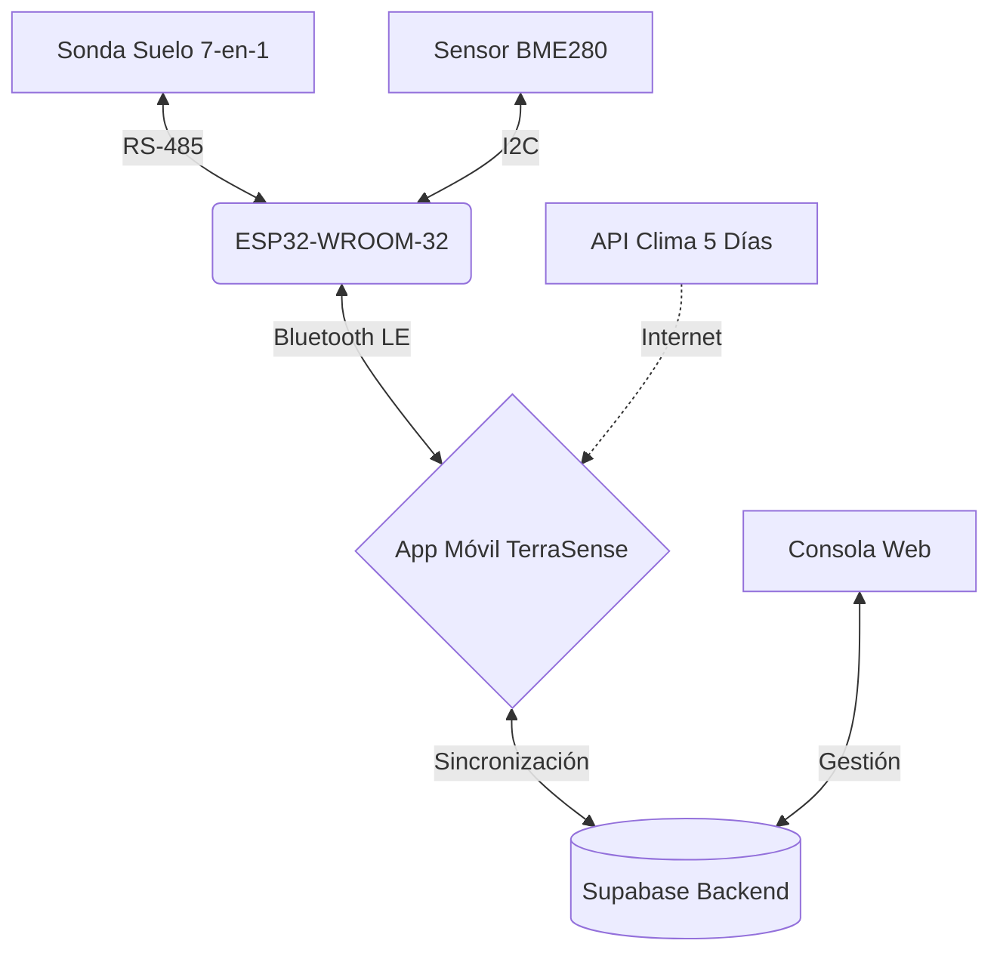

<div align="center">
  
  # 🌱 TerraSense
  **Diagnóstico agronómico de suelo y microclima impulsado por IoT**

  [](#)
  [](#)
  [](#)
  [](#)
  [](#)

  *Convirtiendo lecturas de terreno en recomendaciones prácticas de siembra, riego y manejo de cultivos.*

  [Informe Completo](docs/INFORME%201%20.docx.md) · [Índice de Documentación](docs/README.md) · [Arquitectura](#arquitectura-del-sistema)

</div>

---

## 📖 Descripción General

**TerraSense** es una herramienta portátil diseñada para pequeños y medianos agricultores, asesores agronómicos y administradores de predios. Combina una sonda de suelo 7-en-1 de nivel industrial, un sensor ambiental local (BME280), y un cerebro procesador ESP32 integrado en una carcasa portátil impresa en 3D.

El objetivo principal no es solo mostrar números crudos, sino entregar un **diagnóstico prescriptivo** del punto de muestreo según la etapa del cultivo (pre-siembra, vegetativo, floración o cosecha) sin requerir conexión a internet durante la medición. La nube interviene solo para el respaldo diferido, la gestión de cuentas y el pronóstico climático.

## ✨ Características Principales

* 📡 **Medición Integral (Grilla 3x3):** Diagnóstico edafológico (humedad, temperatura del suelo, conductividad, pH, y registros N/P/K) mediante sonda RS-485.
* 🌦️ **Microclima Local + Pronóstico:** El sensor **BME280** lee temperatura, humedad relativa y presión en el lugar físico de la medición. Como **apoyo y complemento**, una API gratuita de clima aporta el pronóstico de los próximos 5 días, permitiendo planificar labores a futuro (ej. posponer siembra si hay riesgo de lluvias intensas).
* 🔋 **Diseño de Bajo Consumo:** La rama de medición se corta por MOSFET fuera del instante de lectura y la batería LiPo se recarga por USB-C, sin pilas desechables. El reposo total del equipo y la autonomía **están pendientes de medición desde batería**; no se declara una cifra hasta ensayarla.
* 📱 **Ecosistema Interconectado:** Comunicación Bluetooth Low Energy (BLE) hacia la App móvil que no requiere internet para diagnosticar, respaldado por una plataforma Web y base de datos.

---

## 🧩 Módulos del Proyecto

El repositorio está dividido en áreas de dominio específicas, cada una con su propia documentación detallada:

| Directorio | Descripción | Tecnologías |
|:---|:---|:---|
| 🪛 [**`/PCB`**](PCB/README.md) | Esquemáticos KiCad, arquitectura de potencia, contrato de trama BLE y diseño de carcasa 3D. | ESP32, BME280, RS-485 |
| 📱 [**`/App`**](App/README.md) | Aplicación móvil que recibe las lecturas vía BLE y genera el diagnóstico agronómico. | React Native, Expo, BLE |
| 💻 [**`/Web`**](Web/README.md) | Consola de administración y soporte web para gestión del sistema. | React, Vite, TypeScript |
| ☁️ [**`/supabase`**](supabase/README.md) | Funciones de backend (RPC), políticas RLS, migraciones y PostGIS. | PostgreSQL, Edge Functions |
| 📄 [**`/docs`**](docs/README.md) | Informes formales del proyecto de título, manuales, normativas y planes de validación. | Markdown, Documentación |
| 📈 [**`/finanzas`**](docs/MODELO_ECONOMICO.md) | Estudio de viabilidad, cálculo de costos (BOM) y simulador de flujo de caja. | Python, Excel |

---

<a id="arquitectura-del-sistema"></a>

## ⚙️ Arquitectura del Sistema



---

## 🚀 Ejecución Local Rápida

### 1. Variables de Entorno
La App utiliza el archivo `.env` en la raíz del proyecto. La consola web utiliza el suyo propio en `Web/.env`.
```env
# .env (Raíz)
EXPO_PUBLIC_SUPABASE_URL=https://<proyecto>.supabase.co
EXPO_PUBLIC_SUPABASE_ANON_KEY=<anon_key>
```

### 2. Aplicación Móvil (App)
> **Nota:** La conexión real por BLE requiere un build nativo en el teléfono físico. La simulación está disponible en desarrollo.
```bash
cd App
npm install
npm test            # Ejecutar pruebas unitarias
npx tsc --noEmit    # Chequeo de tipos
npx expo start      # Servidor de desarrollo
```

### 3. Consola Administrativa (Web)
```bash
cd Web
npm install
npm run dev         # Servidor en http://localhost:5173
```

### 4. Modelo Financiero (Scripts de simulación)
Desde la raíz del proyecto:
```bash
python -m pip install -r finanzas/requirements.txt
python finanzas/modelo.py
```

---

## 📊 Viabilidad y Modelo Comercial

TerraSense está planteado como un proyecto económicamente sustentable y escalable:
- **Modelo de Ingreso:** Venta directa del hardware con IVA incluido. La app y el diagnóstico local no tienen costos de suscripción mensual.
- **Costos y Margen:** La sonda RS-485 concentra la mayor parte de la BOM; el ensamblaje final se paga en la nómina y no se duplica como costo variable.
- **Financiamiento:** Aporte de socios más crédito de largo plazo, dimensionado para sostener la reserva de los primeros 24 meses.
- **Evaluación:** Flujos mensuales sobre 60 meses, sin valor terminal, distinguiendo el retorno económico del proyecto de la cobertura de deuda (DSCR).

> 💡 Las cifras del bloque siguiente se generan desde `finanzas/supuestos.json`. **No editar a mano:** ejecutar `python finanzas/modelo.py`.

<!-- FINANZAS:INICIO -->

## Finanzas y modelo económico

Precio de venta: **$349.990 CLP con IVA** ($294.109 netos). Evaluación del proyecto a cinco años, 2027–2031, con flujos mensuales y tasa de descuento del 20 % anual.

### BOM y margen por equipo

| Componente | Cantidad | Costo unitario neto CLP | Subtotal CLP |
|---|---:|---:|---:|
| Sonda RS485 7-en-1 (SKU pendiente de ficha) | 1 | $48.000 | $48.000 |
| Placa de desarrollo ESP32-WROOM-32 | 1 | $6.723 | $6.723 |
| Módulo ambiental Bosch BME280 I2C | 1 | $2.941 | $2.941 |
| PCB combinada USB-C carga + boost | 1 | $900 | $900 |
| LiPo 2000 mAh protegida | 1 | $4.500 | $4.500 |
| SP3485 transceptor RS485 3.3 V | 1 | $900 | $900 |
| Conector JST batería 3 pines con contraparte/cable | 1 | $450 | $450 |
| Pulsador | 1 | $250 | $250 |
| LED SMD | 3 | $40 | $120 |
| Pasivos, protección y terminación RS485 | 1 | $1.200 | $1.200 |
| PCB portadora y montaje externo SMD | 1 | $2.500 | $2.500 |
| Carcasa impresa en 3D PETG (servicio externo) | 1 | $6.000 | $6.000 |
| Prensaestopas, fijaciones, juntas y respiradero BME280 | 1 | $1.500 | $1.500 |
| Cableado y conectores internos adicionales | 1 | $700 | $700 |
| Embalaje, manual y etiqueta | 1 | $2.000 | $2.000 |
| Flete de insumos y contingencia importación | 1 | $2.500 | $2.500 |
| **Total BOM** | | | **$81.184** |

El **BME280 cuesta $3.500 con IVA** por equipo. La **carcasa impresa en 3D** se incluye como servicio externo a $6.000 netos, con material, impresión, energía y acabado. Las fijaciones, juntas y ventilación protegida del sensor se contabilizan aparte a $1.500 netos.

Merma (3 %), reposiciones (5 %), envío y comisión suman **$29.994 por equipo**. El costo variable total es **$111.178** y el margen de contribución es **$182.931 (62.2% de la venta neta)**. El ensamblaje final se paga en la nómina. La API de pronóstico tiene costo directo de **$0**; los servicios digitales restantes conservan su presupuesto.

### Inversión y financiamiento

| Concepto | CLP |
|---|---:|
| Activos, desarrollo y formalización | $10.353.000 |
| Inventario inicial, IVA incluido | $964.378 |
| **Desembolso inicial** | **$11.317.378** |
| Aporte de socios | $9.000.000 |
| Crédito a 10 años, 12 % efectivo anual | $31.000.000 |
| Gastos de apertura | $620.000 |
| Caja inicial, reserva incluida | $28.062.622 |
| Cuota mensual | $433.836 |

El crédito cubre el desembolso y las necesidades de caja estacionales. Se dimensiona en tramos de $100.000 para mantener, durante los primeros 24 meses, una reserva de tres meses de gastos fijos y cuotas más 10 % del desembolso inicial.

### Flujo de caja anual

| Año | Equipos vendidos | EBITDA | Servicio deuda | Caja final | DSCR | Equilibrio operativo / con deuda |
|---|---:|---:|---:|---:|---:|---:|
| 2027 | 200 | $4.426.234 | $5.206.035 | $26.470.982 | 0.69 | 176 / 205 |
| 2028 | 350 | $19.015.320 | $5.206.035 | $38.647.148 | 3.34 | 250 / 277 |
| 2029 | 500 | $31.680.620 | $5.206.035 | $57.237.408 | 4.57 | 337 / 364 |
| 2030 | 650 | $35.729.124 | $5.206.035 | $77.360.857 | 4.87 | 472 / 498 |
| 2031 | 850 | $49.915.370 | $5.206.035 | $110.083.164 | 7.29 | 608 / 634 |

La nómina incluye socios, producción y soporte. La contabilidad externa se incorpora desde el primer mes; la contratación aumenta con las horas de trabajo y la base de equipos activos. El DSCR compara la caja disponible para deuda con capital e intereses.

### VAN, TIR y payback

| Escenario | Inversión económica mes 0 | VAN al 20 % | TIR efectiva anual | Payback simple | Payback descontado al 20 % |
|---|---:|---:|---:|---:|---:|
| Base | $20.489.116 | $15.504.053 | 35,43 % | 34,61 meses (2,88 años) | 47,15 meses (3,93 años) |
| Estrés | $20.478.616 | −$50.774.058 | -30,28 % | No recupera en 60 meses | No recupera en 60 meses |
| Crecimiento | $23.661.182 | $69.653.316 | 76,70 % | 22,54 meses (1,88 años) | 23,30 meses (1,94 años) |

Los tres indicadores se calculan sobre el flujo del proyecto: inversión inicial, operación, impuestos, inventario, reinversión y variaciones de caja mínima operativa. La TIR se expresa como tasa efectiva anual y el payback interpola el mes de recuperación. El horizonte de evaluación es de 60 meses, sin valor terminal.

La inversión económica incluye el desembolso inicial y la caja mínima operativa. El préstamo y sus cuotas se analizan en el flujo de financiamiento; los sueldos forman parte del costo de operación.

[Flujo de caja Excel](Flujo%20de%20caja%20y%20financiamiento%20-%20TerraSense.xlsx) · [BOM Excel](PCB/BOM_TerraSense.xlsx) · [Resultados completos](docs/RESULTADOS_FINANCIEROS.md) · [Metodología y supuestos](docs/MODELO_ECONOMICO.md)

Actualizar cifras: `python finanzas/modelo.py`.

<!-- FINANZAS:FIN -->

Para un desglose completo, revisa el [Modelo Económico](docs/MODELO_ECONOMICO.md), el [Informe 1](docs/INFORME%201%20.docx.md#analisis-economico), la [Planilla de Flujo de Caja](Flujo%20de%20caja%20y%20financiamiento%20-%20TerraSense.xlsx), y la [BOM de Componentes](PCB/BOM_TerraSense.xlsx).

---

<div align="center">
  <b>Autores:</b> Álvaro Villena y Alan <br>
  Proyecto de Ingeniería en Electrónica y Sistemas Inteligentes - INACAP (2026)
</div>
