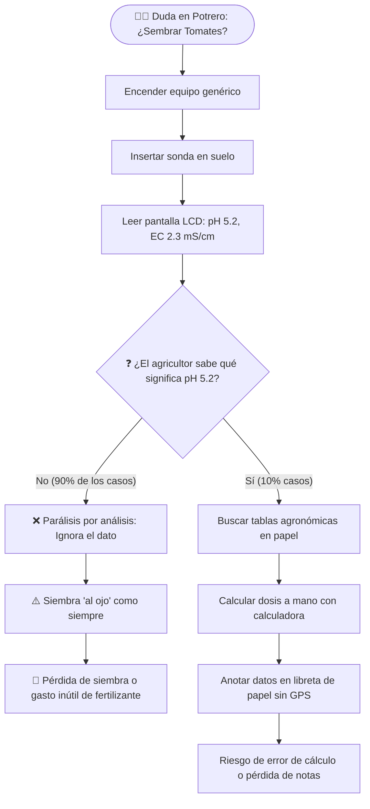
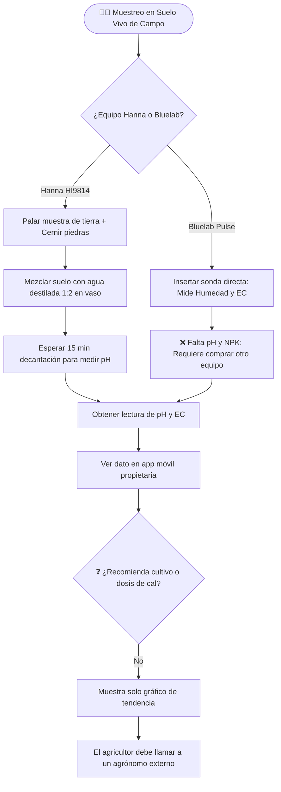
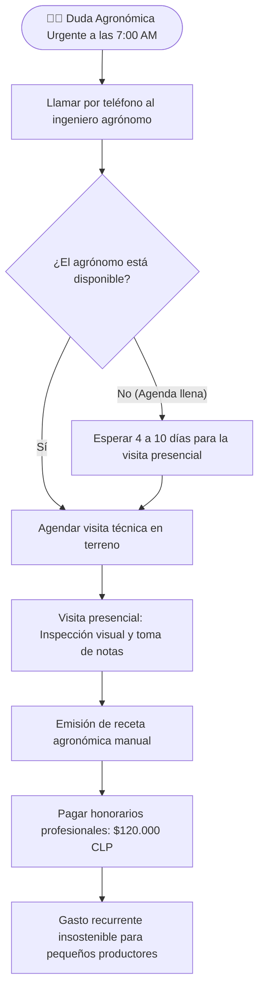

# 📊 Diagramas de Flujo y Arquitectura de Bloques de las Alternativas de la Competencia vs. TerraSense

> **Proyecto:** TerraSense — Tu Ingeniero Agrónomo en el Bolsillo  
> **Documento Técnico de Benchmarking:** Análisis Funcional, Operativo y Arquitectónico del Estado del Arte  
> **Área:** Ingeniería en Electrónica y Sistemas Inteligentes — INACAP  

---

## 📑 Tabla de Contenidos

1. [Introducción y Metodología de Comparación](#1-introducción-y-metodología-de-comparación)
2. [Diagramas de Flujo de Proceso Operativo (Workflow)](#2-diagramas-de-flujo-de-proceso-operativo-workflow)
   - [2.1. Alternativa 1: Sonda Genérica Asiática con Pantalla LCD (Lectura Voltimétrica)](#21-alternativa-1-sonda-genérica-asiática-con-pantalla-lcd-lectura-voltimétrica)
   - [2.2. Alternativa 2: Instrumentos Portátiles de Hidroponía (Bluelab Pulse / Hanna HI9814)](#22-alternativa-2-instrumentos-portátiles-de-hidroponía-bluelab-pulse--hanna-hi9814)
   - [2.3. Alternativa 3: Análisis Químico Tradicional de Laboratorio (INIA / AGQ)](#23-alternativa-3-análisis-químico-tradicional-de-laboratorio-inia--agq)
   - [2.4. Alternativa 4: Asesoría Agronómica Presencial Particular](#24-alternativa-4-asesoría-agronómica-presencial-particular)
   - [2.5. Alternativa 5: Sistema IoT TerraSense (Flujo Prescriptivo en ≤ 5 Segundos)](#25-alternativa-5-sistema-iot-terrasense-flujo-prescriptivo-en--5-segundos)
3. [Diagramas de Bloques de Arquitectura Tecnológica](#3-diagramas-de-bloques-de-arquitectura-tecnológica)
   - [3.1. Arquitectura de Sondas Comerciales Tradicionales](#31-arquitectura-de-sondas-comerciales-tradicionales)
   - [3.2. Arquitectura de Dataloggers de Investigación de Alto Costo (TDR / TEROS)](#32-arquitectura-de-dataloggers-de-investigación-de-alto-costo-tdr--teros)
   - [3.3. Arquitectura Integral de TerraSense IoT](#33-arquitectura-integral-de-terrasense-iot)
4. [Matriz Comparativa de Cuellos de Botella, Puntos Únicos de Falla y Costos Ocultos](#4-matriz-comparativa-de-cuellos-de-botella-puntos-únicos-de-falla-y-costos-ocultos)
5. [Conclusiones del Análisis de Alternativas](#5-conclusiones-del-análisis-de-alternativas)

---

## 1. Introducción y Metodología de Comparación

Para justificar técnica y económicamente el desarrollo del sistema **TerraSense**, es imperativo analizar cómo operan los actores y métodos disponibles actualmente en el mercado agrícola nacional e internacional.

Se evalúan cinco soluciones desde dos perspectivas de ingeniería:
1. **Flujo Operativo y de Decisión (Workflow):** Pasos requeridos por el usuario desde que surge la interrogante agronómica en el potrero hasta que se aplica una medida correctiva.
2. **Arquitectura de Bloques del Sistema:** Subsistemas de alimentación, sensado, procesamiento, almacenamiento y visualización.

---

## 2. Diagramas de Flujo de Proceso Operativo (Workflow)

### 2.1. Alternativa 1: Sonda Genérica Asiática con Pantalla LCD (Lectura Voltimétrica)

*Equipos de bajo costo ($150 – $250 USD) ensamblados con microcontroladores genéricos y pantallas LCD monocromáticas.*



* **Cuello de Botella Crítico:** La "Última Milla Cognitiva". Entrega números crudos (`5.2`), pero no entrega la decisión agronómica. Genera parálisis en el usuario no técnico.

---

### 2.2. Alternativa 2: Instrumentos Portátiles de Hidroponía (Bluelab Pulse / Hanna HI9814)

*Instrumentos de alta precisión de electrodo ($250 – $400 USD), diseñados principalmente para viveros e hidroponía.*



* **Cuello de Botella Crítico:** Protocolo engorroso (preparación de *slurry* líquido para Hanna) e información incompleta (falta NPK y pH integrado en Bluelab Pulse). No hay motor biológico prescriptivo.

---

### 2.3. Alternativa 3: Análisis Químico Tradicional de Laboratorio (INIA / AGQ)

*Método clásico de envío de muestras físicas a centros acreditados ($40.000 – $65.000 CLP / muestra).*

```mermaid
flowchart TD
    A([🧑‍🌾 Planificación de Temporada]) --> B[Excavar 10 a 20 calicatas en zigzag en el predio]
    B --> C[Homogeneizar tierra en balde limpio y embolsar 1 kg]
    C --> D[Rotular y llevar muestra a oficina de courier / ciudad]
    D --> E[Pagar $45.000 CLP por muestra]
    E --> F[⏳ ESPERA EN LABORATORIO: 15 a 30 DÍAS HÁBILES]
    F --> G[Recepción de Informe en PDF de 5 páginas con valores químicos]
    G --> H{❓ ¿La ventana de siembra sigue abierta?}
    H -- No --> I[🔴 Ventana de siembra expiró: Se perdió la fecha óptima de venta]
    H -- Sí --> J{❓ ¿El agricultor entiende el informe PDF?}
    J -- No --> K[Pagar agrónomo para interpretar PDF ($100.000 CLP)]
    J -- Sí --> L[Aplicar enmiendas con 3 semanas de desfase temporal]
```

* **Cuello de Botella Crítico:** Latencia destructiva de **15 a 30 días**. El suelo es un ente biológico dinámico; para cuando llega el PDF, la lluvia, la temperatura y la salinidad ya cambiaron radicalmente.

---

### 2.4. Alternativa 4: Asesoría Agronómica Presencial Particular

*Contratación de un profesional agrónomo independiente ($90.000 – $200.000 CLP por visita técnica).*



* **Cuello de Botella Crítico:** Costo recurrente inasumible ($1.200.000+ CLP al año) y disponibilidad temporal limitada (no está disponible un domingo a las 7:00 AM ante una helada).

---

### 2.5. Alternativa 5: Sistema IoT TerraSense (Flujo Prescriptivo en ≤ 5 Segundos)

*El ecosistema TerraSense integra sensado, interpretación y prescripción en un solo ciclo cerrado.*

```mermaid
flowchart TD
    A([🧑‍🌾 Duda en Potrero a las 7:00 AM]) --> B[Encender TerraSense: Conexión BLE automática <1.5s]
    B --> C[Insertar sonda Inox 316L en suelo junto a la planta]
    C --> D[Presionar 'EMPEZAR MEDICIÓN' en la App Móvil]
    D --> E[Animación 2D + Muestreo de estabilización: 5 a 8 s]
    E --> F[Adquisición 9 variables: VWC, T° suelo, EC, pH, N, P, K, T° aire, HR aire]
    F --> G[MOTOR AGRONÓMICO IA EN SMARTPHONE (OFFLINE)]
    G --> H[🟢 SEMÁFORO VISUAL + VEREDICTO INMEDIATO EN ≤ 5 SEG]
    H --> I[🌿 Matriz de Cultivos Aptos + 💊 Dosis de Cal/Abono en kg/ha]
    H --> J[🌦️ Alerta Meteorológica GPS (7 Días) + Manejo de Riego]
    H --> K[🗺️ Registro Georreferenciado Automático en Mapa GIS]
    K --> L([✅ Decisión Tomada con Certeza Científica en Terreno])
```

---

## 3. Diagramas de Bloques de Arquitectura Tecnológica

### 3.1. Arquitectura de Sondas Comerciales Tradicionales

```text
┌─────────────────────────────────────────────────────────────────────────────┐
│             ARQUITECTURA DE INSTRUMENTOS COMERCIALES TRADICIONALES          │
│                                                                             │
│  ┌─────────────────┐       ┌─────────────────┐       ┌──────────────────┐  │
│  │ Batería Alcalina│──────►│  MCU 8-Bits     │──────►│ Pantalla LCD     │  │
│  │ 9V o 3xAAA      │       │  Propietario    │       │ Monocromática    │  │
│  └─────────────────┘       └────────┬────────┘       │ (Solo Números)   │  │
│                                     │                └──────────────────┘  │
│                                     ▼                                       │
│                            ┌─────────────────┐                              │
│                            │ ADC / Acondic.  │                              │
│                            │ Analógico       │                              │
│                            └────────┬────────┘                              │
│                                     │                                       │
│                                     ▼                                       │
│                            ┌─────────────────┐                              │
│                            │ Electrodo Vidrio│                              │
│                            │ Frágil (pH/EC)  │                              │
│                            └─────────────────┘                              │
│                                                                             │
│  ❌ Sin almacenamiento Cloud     ❌ Sin Bluetooth / WiFi                    │
│  ❌ Sin GPS                     ❌ Sin Motor Agronómico                    │
└─────────────────────────────────────────────────────────────────────────────┘
```

---

### 3.2. Arquitectura de Dataloggers de Investigación de Alto Costo (TDR / TEROS)

```text
┌─────────────────────────────────────────────────────────────────────────────┐
│            ARQUITECTURA DE DATALOGGERS CIENTÍFICOS ($1.500 - $2.500 USD)    │
│                                                                             │
│  ┌─────────────────┐       ┌─────────────────┐       ┌──────────────────┐  │
│  │ Panel Solar 20W │──────►│ Regulador Solar │──────►│ Batería Plomo-Ác.│  │
│  │ en Mástil Acero │       │ PWM / MPPT      │       │ 12V 7Ah (Pesada) │  │
│  └─────────────────┘       └─────────────────┘       └────────┬─────────┘  │
│                                                               │            │
│  ┌─────────────────┐       ┌─────────────────┐                │            │
│  │ Módem 4G/LTE    │◄──────│ Datalogger      │◄───────────────┘            │
│  │ Propietario     │       │ Industrial      │                             │
│  │ (Plan $300 USD) │       │ (Campbell/Meter)│                             │
│  └─────────────────┘       └────────┬────────┘                             │
│                                     │ SDI-12 / RS-485                      │
│                                     ▼                                       │
│                            ┌─────────────────┐                             │
│                            │ Sonda TEROS 12  │                             │
│                            │ o Varillas TDR  │ (Solo VWC + Temp + EC)      │
│                            └─────────────────┘                             │
│                                                                             │
│  ❌ Peso excesivo (> 8 kg)       ❌ Costo inasumible para AFC              │
│  ❌ Requiere suscripción anual   ❌ No mide pH ni NPK                      │
└─────────────────────────────────────────────────────────────────────────────┘
```

---

### 3.3. Arquitectura Integral de TerraSense IoT

```text
┌─────────────────────────────────────────────────────────────────────────────┐
│                    ARQUITECTURA INTEGRAL TERRASENSE IoT                     │
│                                                                             │
│ ┌─────────────────────────────────────────────────────────────────────────┐ │
│ │ HARDWARE DE TERRENO (CHASIS PORTÁTIL COMPACTO IP67)                     │ │
│ │                                                                         │ │
│ │  ┌───────────────┐     ┌───────────────┐     ┌───────────────────────┐  │ │
│ │  │ Batería LiPo  │────►│ Módulo Combo  │────►│ ESP32-WROOM-32        │  │ │
│ │  │ 3.7V 2.000mAh │     │ TP4056+Boost5V│     │ Xtensa Dual-Core      │  │ │
│ │  └───────────────┘     └───────┬───────┘     │ BLE 5.0 + Flash NVS   │  │ │
│ │                                │             └───────┬───────────────┘  │ │
│ │                                │  GPIO5 Gate         │ UART2 Modbus RTU │ │
│ │                                └────────────┐        │                  │ │
│ │                                             ▼        ▼                  │ │
│ │                                    ┌─────────────────┐   ┌────────────┐ │ │
│ │                                    │ P-MOSFET Switch │   │ SP3485 RS  │ │ │
│ │                                    └────────┬────────┘   └─────┬──────┘ │ │
│ │                                             └──────────┬───────┘        │ │
│ │                                                        ▼ RS-485 5V      │ │
│ │   ┌─────────────────┐                    ┌─────────────────┐            │ │
│ │   │ Bosch BME280    │◄─── I2C Bus ───────┤ Sonda Inox 316L │            │ │
│ │   │ (T° + HR + Bar) │                    │ 7-en-1 NPK+pH+EC│            │ │
│ │   └─────────────────┘                    └─────────────────┘            │ │
│ └───────────────────────────────────────────────────┬─────────────────────┘ │
│                                                     │ BLE 5.0 Telemetría    │
│                                                     ▼ (GATT 16 Bytes)       │
│ ┌─────────────────────────────────────────────────────────────────────────┐ │
│ │ SMARTPHONE DEL AGRICULTOR (REACT NATIVE / EXPO / TYPESCRIPT)            │ │
│ │                                                                         │ │
│ │  ┌─────────────────┐     ┌─────────────────┐     ┌───────────────────┐  │ │
│ │  │ SQLite Local    │◄───►│ MOTOR AGRONÓMICO│◄───►│ GPS Submétrico    │  │ │
│ │  │ (Offline-First) │     │ IA (4 Capas)    │     │ del Smartphone    │  │ │
│ │  └─────────────────┘     └────────┬────────┘     └───────────────────┘  │ │
│ │                                   │                                     │ │
│ │                                   ▼                                     │ │
│ │                    ┌─────────────────────────────┐                      │ │
│ │                    │ UI: Semáforo + Grid 3x3     │                      │ │
│ │                    │ + Prescripciones + Cultivos │                      │ │
│ │                    └──────────────┬──────────────┘                      │ │
│ └───────────────────────────────────┼─────────────────────────────────────┘ │
│                                     │ Sync HTTPS / WSS (Store & Forward)   │
│                                     ▼                                       │
│ ┌─────────────────────────────────────────────────────────────────────────┐ │
│ │ CLOUD & PLATAFORMA WEB GIS (SUPABASE + POSTGIS + EDGE FUNCTIONS)        │ │
│ │                                                                         │ │
│ │  ┌─────────────────┐     ┌─────────────────┐     ┌───────────────────┐  │ │
│ │  │ PostgreSQL 15   │     │ Consola Web GIS │     │ Motor Open-Meteo  │  │ │
│ │  │ + Ext. PostGIS  │     │ Mapas de Calor  │     │ Pronóstico 7 Días │  │ │
│ │  └─────────────────┘     └─────────────────┘     └───────────────────┘  │ │
│ └─────────────────────────────────────────────────────────────────────────┘ │
└─────────────────────────────────────────────────────────────────────────────┘
```

---

## 4. Matriz Comparativa de Cuellos de Botella, Puntos Únicos de Falla y Costos Ocultos

| Criterio Evaluado | Sonda Asiática LCD | Bluelab / Hanna | Laboratorio Tradicional | Asesor Privado | **TerraSense IoT** |
| :--- | :---: | :---: | :---: | :---: | :---: |
| **Tiempo de Entrega de Decisión** | Números sin decisión | Números sin decisión | 15 a 30 días hábiles | 2 a 10 días | **≤ 5 segundos** |
| **Variables Medidas en 1 Paso** | 3 a 7 (incompletas) | 2 a 3 (sin NPK) | +15 (exhaustivas) | Visual / Ojo humano | **9 Variables Físicas** |
| **Punto Único de Falla (SPOF)** | Pantalla LCD frágil | Electrodo vidrio frágil | Pérdida de muestra courier | Indisponibilidad física | Ninguno (Sonda Inox + Celular) |
| **Costo Oculto Principal** | Pérdida de siembra | Comprar 2 sondas ($500K) | $500K por 10 muestras | $1.2M anual en visitas | **$0 CLP (Costo Marginal Cero)** |
| **Dependencia de Conectividad** | No requiere | No requiere | Envío físico obligatorio | Presencial | **100% Offline-First (BLE)** |
| **Integración con Clima GPS** | ❌ No | ❌ No | ❌ No | Parcial (empírica) | **✅ 7 Días Predictivo GPS** |
| **Mapeo Satelital GIS** | ❌ No | ❌ No | ❌ No | ❌ No | **✅ PostGIS Automático** |

---

## 5. Conclusiones del Análisis de Alternativas

1. **La Parálisis por Análisis es el Rival Real:** Ninguno de los instrumentos de medición física comerciales (< $400 USD) interpreta los datos para el agricultor. TerraSense no compite en "mostrar números más bonitos", sino en **automatizar el juicio agronómico**.
2. **Eficiencia Arquitectónica:** Al desacoplar la pantalla y el módem (aprovechando el smartphone que el agricultor ya posee), TerraSense reduce el costo del hardware a **$70.656 CLP (BOM)**, entregando capacidades superiores a sistemas científicos de $2.000 USD.
3. **Complementariedad con el Laboratorio:** TerraSense no pretende eliminar el laboratorio químico acreditado (necesario cada 3 años para micronutrientes y metales pesados), sino proveer la herramienta de **decisión operativa diaria** a costo cero.

---

*Documento técnico elaborado para el proyecto TerraSense — INACAP 2026.*
