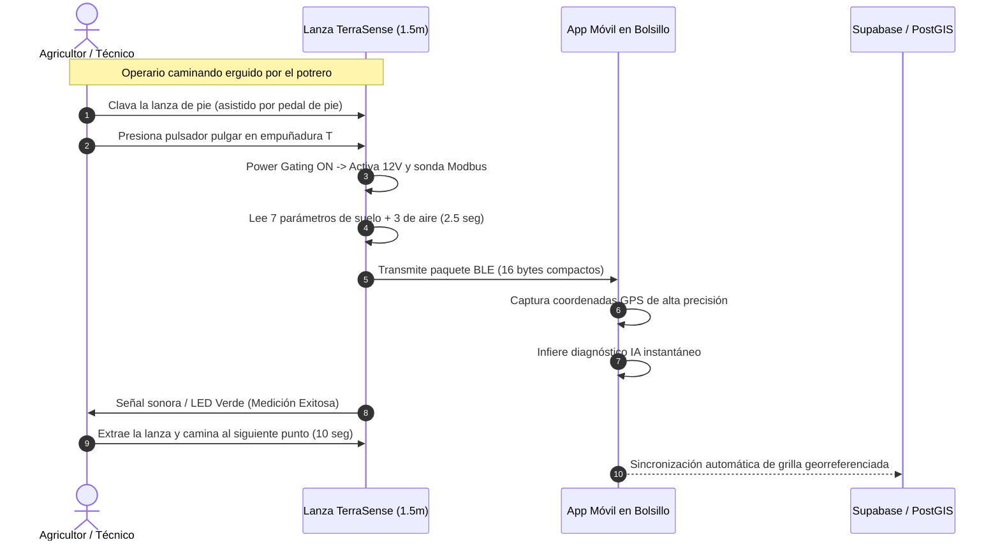

# 🌾 Especificación Técnica y Estudio de Viabilidad: Lanza / Estaca Agronómica de Muestreo Rápido (1.5 m)

> **Proyecto:** TerraSense — Tu Ingeniero Agrónomo en el Bolsillo  
> **Módulo:** Ingeniería Mecánica, Electrónica Embebida y Ergonomía de Campo  
> **Versión de Prototipo:** Lanza de Muestreo Continuo v2.0 (1500 mm / 1.5 metros)  
> **Institución:** Ingeniería en Electrónica y Sistemas Inteligentes — INACAP  

---

## 📑 Tabla de Contenidos

1. [Resumen Ejecutivo y Justificación del Factor de Forma](#1-resumen-ejecutivo-y-justificación-del-factor-de-forma)
2. [Análisis Comparativo de Materiales para el Mástil](#2-análisis-comparativo-de-materiales-para-el-mástil)
3. [Dimensiones Geométricas y Tolerancias del Tubo](#3-dimensiones-geométricas-y-tolerancias-del-tubo)
4. [Arquitectura Electromecánica y Distribución Interna](#4-arquitectura-electromecánica-y-distribución-interna)
   - [4.1. Cabezal Superior / Empuñadura en T (Módulo Inteligente)](#41-cabezal-superior--empuñadura-en-t-módulo-inteligente)
   - [4.2. Columna Central (Vástago y Conducción Eléctrica)](#42-columna-central-vástago-y-conducción-eléctrica)
   - [4.3. Extremo Inferior (Portasonda de Choque y Puntas 316L)](#43-extremo-inferior-portasonda-de-choque-y-puntas-316l)
5. [Ergonomía de Penetración y Sistema de Apoyo de Pie](#5-ergonomía-de-penetración-y-sistema-de-apoyo-de-pie)
6. [Flujo Operativo de Muestreo Ultrarrápido ("Walk-and-Sample")](#6-flujo-operativo-de-muestreo-ultrarrápido-walk-and-sample)
7. [Desafíos Técnicos y Matriz de Mitigación de Riesgos](#7-desafíos-técnicos-y-matriz-de-mitigación-de-riesgos)
8. [Estructura de Costos Industriales (BOM Actualizado Lanza 1.5 m)](#8-estructura-de-costos-industriales-bom-actualizado-lanza-15-m)
9. [Conclusiones y Dictamen de Viabilidad](#9-conclusiones-y-dictamen-de-viabilidad)

---

## 1. Resumen Ejecutivo y Justificación del Factor de Forma

En el trabajo agronómico tradicional, el muestreo de suelo mediante sondas cortas (20 a 30 cm) presenta una importante barrera de adopción: **la fatiga postural**. Para una grilla de muestreo de 1 hectárea (10 a 20 puntos de control), el agricultor o técnico debe agacharse, clavar la sonda manualmente, esperar la lectura, levantarse y trasladarse. Esto eleva el tiempo por muestra a más de **3 a 5 minutos** y desincentiva la toma periódica de datos.

La **Lanza Agronómica TerraSense de 1.5 metros (150 cm)** soluciona este problema de raíz:
* **Postura erguida 100% ergonómica:** Permite clavar, medir y retirar el dispositivo manteniéndose completamente de pie.
* **Muestreo ultrarrápido (15 a 20 segundos por punto):** Clavado asistido por el peso corporal y botón de disparo rápido en el pulgar.
* **Electrónica y cableado 100% protegidos:** Toda la electrónica, batería y líneas de comunicación residen dentro de la estructura tubular hermética (IP67), sin cables expuestos que se enganchen en ramas o malezas.

```text
       DISTRIBUCIÓN DEL PROTOTIPO LANZA TERRASENSE (1.5 METROS)
 ┌─────────────────────────────────────────────────────────────────────────┐
 │ [ EMPUÑADURA EN T + ELECTRÓNICA ] ◄── ESP32, Batería 18650, Botón, LEDs │ (0 a 20 cm)
 │                 │                                                       │
 │                 ▼ Prensaestopas / Unión Hermética                       │
 │ ╔═════════════════════════════════════╗                                 │
 │ ║                                     ║                                 │
 │ ║  TUBO ESTRUCTURAL HUECO             ║                                 │
 │ ║  (Aluminio 6061-T6 / Fibra Vidrio)  ║ ◄── Cable 4 hilos RS-485        │ (20 a 130 cm)
 │ ║  Ø Ext: 30 mm | Espesor: 1.8 mm     ║     protegido en el interior    │
 │ ║                                     ║                                 │
 │ ╚═════════════════════════════════════╝                                 │
 │                 │                                                       │
 │ [ ESTRIBO / PEDAL DE PIE DESMONTABLE] ◄── Empuje para suelo duro/arcilla│ (a 120 cm)
 │                 │                                                       │
 │ [ CABEZAL SENSOR NPK 7-en-1 EN RESINA]◄── Acoplado cónico antigolpe     │ (130 a 140 cm)
 │                 │                                                       │
 │ [ VARILLAS ACERO INOXIDABLE 316L ]    ◄── Inserción directa raíz (10cm) │ (140 a 150 cm)
 └─────────────────────────────────────────────────────────────────────────┘
```

---

## 2. Análisis Comparativo de Materiales para el Mástil

Para una lanza de 1.5 metros sometida a fuerzas axiales (empuje al clavar) y momentos flectores (palanca al extraer del suelo), la elección del material es crítica:

| Criterio Técnico | Aluminio Estructural 6061-T6 | Fibra de Vidrio (FRP / GRP) | Fibra de Carbono | Acero Inoxidable 304 | PVC / Polipropileno |
| :--- | :---: | :---: | :---: | :---: | :---: |
| **Peso total (barra 1.3 m)** | **~520 g (Ligero)** | ~610 g (Ligero) | ~310 g (Ultra ligero) | ~1.650 g (Muy pesado) | ~420 g |
| **Rigidez a la flexión ($E$)** | **Excelente (69 GPa)** | Buena (20–40 GPa) | Excepcional (>130 GPa)| Muy alta (193 GPa) | Pésima (3 GPa) — Se dobla |
| **Transparencia RF (BLE/WiFi)**| Bloquea RF (Jaula Faraday) | **100% Transparente** | Bloquea/Atenúa RF | Bloquea RF | 100% Transparente |
| **Resistencia a corrosión / agroquímicos** | Muy alta (Anodizado) | **Excelente (Inerte)** | Excelente | Excelente | Buena |
| **Costo unitario por metro** | **Bajo ($4.500 CLP/m)** | Moderado ($6.500 CLP/m)| Prohibitivo ($28.000/m)| Medio ($9.000 CLP/m) | Muy bajo ($1.200 CLP/m) |
| **Resistencia a impactos de piedras** | **Alta (No se fractura)**| Buena | Regular (Frágil a golpe)| Excelente | Pésima (Se raja) |

### 🏆 Configuración Estructural Óptima Seleccionada: Arquitectura Híbrida

1. **Vástago Principal (Cuerpo tubular):**  
   Tubo de **Aluminio Anodizado 6061-T6** (o alternativamente **Fibra de Vidrio Pultruida**). Brinda rigidez mecánica absoluta para hacer fuerza sin deformarse y un peso ultra liviano de apenas ~500 gramos.
2. **Cúpula de la Empuñadura Superior (Head Enclosure):**  
   Fabricada en **PETG o Policarbonato de alta densidad (impresión 3D FDM / inyección)**. Al ser un polímero dieléctrico, **no atenúa la señal Bluetooth 5.0 BLE ni WiFi del ESP32**, permitiendo que la antena emita sin pérdidas hacia el smartphone del agricultor.

---

## 3. Dimensiones Geométricas y Tolerancias del Tubo

Para garantizar compatibilidad ergonómica con el 95% de los percentiles de estatura humana (1.55 m a 1.90 m) y permitir el paso holgado de cables y conectores internos:

* **Longitud Total del Dispositivo:** $1.500\text{ mm}$ ($1.50\text{ m}$).
* **Longitud del Tubo Central:** $1.200\text{ mm}$ ($1.20\text{ m}$).
* **Diámetro Exterior ($OD$):** $\mathbf{28.0\text{ mm} - 30.0\text{ mm}}$ (estándar industrial de barras y mangos ergonómicos, excelente agarre con guantes de trabajo).
* **Diámetro Interior ($ID$):** $\mathbf{24.4\text{ mm} - 26.4\text{ mm}}$.
* **Espesor de Pared ($t$):** $\mathbf{1.8\text{ mm}}$ (resiste una carga axial de más de $120\text{ kg}$ sin pandeo elástico).
* **Profundidad de Inserción Activa:** $100\text{ mm} - 120\text{ mm}$ (zona donde penetran las varillas de acero 316L en el perfil de raíces).
* **Peso Total del Equipo Ensamblado:** **$\approx 1.150\text{ gramos}$** (fácilmente transportable con una sola mano durante horas).

---

## 4. Arquitectura Electromecánica y Distribución Interna

```text
               DIAGRAMA DE CORTE TRANSVERSAL (SECCIÓN SUPERIOR E INFERIOR)
 ┌─────────────────────────────────────────────────────────────────────────────┐
 │ TOP: EMPUÑADURA EN T CON ELECTRÓNICA INTEGRADORA                            │
 │ ┌─────────────────────────────────────────────────────────────────────────┐ │
 │ │ [Pulsador Pulgar] [LEDs Indicadores 🔵🟢🔴] [Puerto USB-C con Tapón]    │ │
 │ │                                                                         │ │
 │ │ ┌───────────────────┐    ┌────────────────────────────────────────────┐ │ │
 │ │ │ Pack 2× 18650     │    │ PCB Principal: ESP32 + MAX485 + Boost 12V  │ │ │
 │ │ │ Li-Ion (6000 mAh) │    │ + TP5100 BMS + Sensor Ambiental BME280     │ │ │
 │ │ └───────────────────┘    └────────────────────────────────────────────┘ │ │
 │ └────────────────────────────────────┬────────────────────────────────────┘ │
 │                                      ▼ Sello O-Ring + Acople Roscado M28    │
 │ ╔═════════════════════════════════════════════════════════════════════════╗ │
 │ ║ TUBO ALUMINIO HUECO (1.2 METROS)                                        ║ │
 │ ║                                                                         ║ │
 │ ║     Cable 4 hilos apantallado (VCC 12V, GND, RS485-A, RS485-B)          ║ │
 │ ║   ~~~~~~~~~~~~~~~~~~~~~~~~~~~~~~~~~~~~~~~~~~~~~~~~~~~~~~~~~~~~~         ║ │
 │ ║     Funda interna de espuma EPE antivibración y antirruido              ║ │
 │ ╚═════════════════════════════════════════════════════════════════════════╝ │
 │                                      ▲ Acople Cónico Inferior Inox / POM    │
 │ BOTTOM: CONO DE PENETRACIÓN Y ELECTRODOS                                    │
 │ ┌─────────────────────────────────────────────────────────────────────────┐ │
 │ │  Carcasa Sonda 7-en-1 sellada en resina epoxi de alta resistencia       │ │
 │ │  [ Varilla 1 ] [ Varilla 2 ] [ Varilla 3 ] [ Varilla 4 ] [ Varilla 5 ]  │ │
 │ │  (Acero Inoxidable Quirúrgico 316L - Longitud 70 mm)                    │ │
 │ └─────────────────────────────────────────────────────────────────────────┘ │
 └─────────────────────────────────────────────────────────────────────────────┘
```

### 4.1. Cabezal Superior / Empuñadura en T (Módulo Inteligente)
* **Forma:** Mango en "T" de $180\text{ mm}$ de ancho, diseñado para aplicar fuerza vertical hacia abajo con ambas manos o con una sola mano.
* **Componentes alojados en el mango:**
  * **PCB Principal compacta:** ESP32-WROOM-32, etapa de control Power Gating (MOSFET), transceptor MAX485 y módulo elevador MT3608 (3.7V a 12V).
  * **Sensor ambiental Bosch BME280:** Ubicado en la base del mango con ranuras inferiores protegidas por membrana de teflón microporoso PTFE (impide entrada de agua y polvo pero mide temperatura, humedad del aire y presión atmosférica).
  * **Batería:** 2 celdas 18650 en paralelo ($6.000\text{ mAh}$) que otorgan meses de autonomía y equilibran el centro de masa en la mano superior.
  * **Interfaz:** Botón táctil industrial en la zona del pulgar (*One-Click Measure*), puerto USB-C hermético con tapa de goma y 3 micro-LEDs de estado visible bajo luz solar directa.

### 4.2. Columna Central (Vástago y Conducción Eléctrica)
* El cableado interno corre protegido dentro del tubo. Se utiliza cable industrial flexible apantallado **4x26 AWG con malla trenzada a tierra**:
  1. **Línea Roja:** $+12\text{V DC}$ (Alimentación conmutada por Power Gating).
  2. **Línea Negra:** $\text{GND}$ (Masa común).
  3. **Línea Amarilla / Blanca:** $\text{RS-485 A (+)}$.
  4. **Línea Verde / Azul:** $\text{RS-485 B (-)}$.
* Para evitar ruidos metálicos o desgaste por roce interno, el cable se inserta dentro de una camisa flexible de espuma de polietileno expandido (EPE).

### 4.3. Extremo Inferior (Portasonda de Choque y Puntas 316L)
* La sonda 7-en-1 no se monta expuesta al golpe: se inserta en un **cono mecanizado de POM (Delrin) o acero inoxidable** que absorbe los impactos mecánicos al golpear piedras o terrones duros.
* Las varillas de acero 316L sobresalen en la punta para un contacto íntimo con el suelo a la profundidad radicular requerida ($10 - 15\text{ cm}$).

---

## 5. Ergonomía de Penetración y Sistema de Apoyo de Pie

En suelos agrícolas densos o arcillosos (ej. vertisoles o alfisoles regados), clavar únicamente con la fuerza de brazos puede requerir un esfuerzo excesivo ($>25\text{ kgf}$).

Para resolver esto, la lanza TerraSense incorpora un **Estribo / Pedal de Pie Plegable (Foot-Peg)** a $25\text{ cm}$ de la base:
1. El operario posiciona la lanza verticalmente en el punto deseado.
2. Apoya el pie en el estribo y transfiere parte de su peso corporal ($15 - 30\text{ kg}$).
3. La estaca penetra suavemente y sin esfuerzo en menos de **2 segundos**, asegurando una profundidad de clavado constante y repetible.
4. Al terminar la lectura, tira hacia arriba de la empuñadura en T; la geometría cónica lisa de la punta facilita la extracción sin dejar barro adherido.

---

## 6. Flujo Operativo de Muestreo Ultrarrápido ("Walk-and-Sample")



* **Tiempo total por punto:** **12 a 18 segundos**.
* **Capacidad de muestreo:** Hasta **150 a 200 puntos por hora**, permitiendo mapear un predio completo con resolución centimétrica en una sola mañana.

---

## 7. Desafíos Técnicos y Matriz de Mitigación de Riesgos

| Desafío Técnico Identificado | Impacto Potencial | Solución de Ingeniería Implementada en TerraSense |
| :--- | :--- | :--- |
| **Atenuación de RF por tubo metálico** | Pérdida de enlace BLE/WiFi si el módulo va dentro del metal. | **Electrónica alojada en el cabezal superior de PETG dieléctrico.** La antena nunca queda encerrada en metal. |
| **Caída de tensión / Ruido en cable de 1.5 m** | Errores en la lectura de datos de la sonda. | **Bus diferencial RS-485 a 9600 bps.** RS-485 tolera cables de hasta 1.200 m; 1.5 m es totalmente despreciable. Alimentación a 12V reduce caída $I \times R$. |
| **Pandeo o flexión al clavar en suelo seco** | Deformación del tubo de 1.5 m si se hace palanca. | Tubo de **Aluminio 6061-T6 con pared de 1.8 mm y Ø 28-30 mm**. Resistencia a flexión superior a $80\text{ Nm}$. |
| **Condensación interna por gradiente térmico** | Daño a la PCB por humedad dentro del tubo. | **Sellado hermético IP67** entre el tubo y el cabezal con junta tórica + bolsa de sílica gel desecante en el interior del mango. |
| **Desgaste de puntas sensoras** | Pérdida de precisión por fricción abrasiva del suelo. | Puntas en **Acero Inoxidable 316L macizo** de grado quirúrgico y cono inferior de sacrificio intercambiable mediante rosca. |

---

## 8. Estructura de Costos Industriales (BOM Actualizado Lanza 1.5 m)

| Componente / Subsistema | Especificación Técnica | Costo (CLP) | Costo (USD) |
| :--- | :--- | :---: | :---: |
| **Sonda Suelo 7-en-1 Modbus** | Sonda RS-485 Inox 316L (VWC, T, EC, pH, N, P, K) | $16.500 | $17.20 |
| **Tubo Estructural Aluminio 6061-T6** | Tubo 1.2 m, Ø ext 28mm, espesor 1.8mm anodizado | $5.500 | $5.70 |
| **Empuñadura T & Cono Inferior PETG** | Piezas 3D/Inyección alta resistencia + insertos M3/M4 | $5.200 | $5.40 |
| **Microcontrolador ESP32-WROOM-32** | SoC Dual-Core, BLE 5.0 + WiFi | $2.900 | $3.00 |
| **Sensor Ambiental BME280** | Sensor digital T°, Humedad Relativa y Presión | $800 | $0.80 |
| **PCB & Etapa Potencia (Boost + RS-485)** | Placa FR4 doble cara + MT3608 + MAX485 + MOSFET | $3.500 | $3.65 |
| **Baterías 2× 18650 & Módulo BMS** | 6.000 mAh Li-Ion + TP5100 carga 2A USB-C | $9.100 | $9.50 |
| **Pedalín / Estribo de penetración** | Pieza abatible aluminio/acero con traba | $3.200 | $3.35 |
| **Cable industrial apantallado + Conectores** | Cable 4×26 AWG siliconado con malla + sellos IP67 | $1.800 | $1.90 |
| **TOTAL COSTO INDUSTRIAL FABRICACIÓN (BOM)** | | **$48.500 CLP** | **$50.50 USD** |

* **PVP Recomendado de Venta:** **$199.990 CLP** ($\approx \$208\text{ USD}$).
* **Margen Bruto de Contribución:** **$151.490 CLP (75.7%)**.

---

## 9. Conclusiones y Dictamen de Viabilidad

1. **Viabilidad Mecánica:** **100% Viable.** La combinación de un vástago de aluminio anodizado de 28–30 mm con empuñadura en T y pedal de pie garantiza una resistencia estructural sobresaliente con un peso total inferior a 1.2 kg.
2. **Viabilidad Electrónica y de Telecomunicaciones:** **100% Viable.** Ubicar el microcontrolador ESP32 y la antena BLE en la cúpula superior de polímero elimina cualquier blindaje de Faraday, logrando un alcance inalámbrico de más de 15 metros hacia el smartphone. La comunicación serial RS-485 a 12V en 1.5 metros de cable posee inmunidad total al ruido electromagnético.
3. **Viabilidad Operacional Agronómica:** **Excelente.** Multiplica por 10 la velocidad de muestreo en terreno, reduciendo el esfuerzo físico del agricultor a cero y habilitando mapas de fertilidad y humedad de alta densidad sin costo adicional.
