**TERRASENSE** 

Álvaro Nicolás Villena Torrejón  
Alan Paul Escobar Rojas

	Académico guía: Carlos Alberto Castillo Torres

Santiago − Chile  
AÑO 2026

**Índice general**

[I. Introducción	5](#introducción)

[II. Descripción de la Problemática	6](#descripción-de-la-problemática)

[III. Propuesta de Solución Tecnológica.	9](#propuesta-de-solución-tecnológica.)

[IV. Objetivos del Proyecto.	14](#objetivos-del-proyecto.)

[V. Ingeniería conceptual	17](#ingeniería-conceptual)

[VI. Conclusiones	70](#conclusiones)

[VII. Referencias bibliográficas	72](#referencias-bibliográficas)

**Índice de figura**

[Figura 1.0 “ Diagrama de Flujo Arquitectura 8 Bits \+ Bluetooth Classic”	19](#figura-10--diagrama-de-flujo-arquitectura-8-bits--bluetooth-classic)

[Figura 1.1 “ Diagrama de Flujo Arquitectura de Sistema Embebido y Pantalla”	20](#figura-11--diagrama-de-flujo-arquitectura-de-sistema-embebido-y-pantalla)

[Figura 1.2 “ Diagrama de Flujo Arquitectura con Datalogger Estacionario”	20](#figura-12--diagrama-de-flujo-arquitectura-con-datalogger-estacionario)

[Figura 1.3 “ Diagrama de Flujo Arquitectura de Nodos con LoRaWAN”	21](#figura-13--diagrama-de-flujo-arquitectura-de-nodos-con-lorawan)

[Figura 1.4 “ Diagrama de Flujo Arquitectura de Sonda conecta a Celular”	21](#figura-14--diagrama-de-flujo-arquitectura-de-sonda-conecta-a-celular)

[Figura 1.5 “ Diagrama de Flujo Arquitectura de Sistema Embebido de Bajo Consumo”	22](#figura-15--diagrama-de-flujo-arquitectura-de-sistema-embebido-de-bajo-consumo)

[Figura 1.6 “Rutas de Información y Alimentación de las Alternativas”	23](#figura-16-rutas-de-información-y-alimentación-de-las-alternativas)

[Figura 1.7 “Alternativa Cableada con Electrónica Intermedia”	23](#figura-17-alternativa-cableada-con-electrónica-intermedia)

[Figura 1.8 “Diagrama de Flujo del Proceso de Selección de Arquitectura”	25](#figura-18-diagrama-de-flujo-del-proceso-de-selección-de-arquitectura)

[Figura 1.9 “Arquitectura Objetivo de TerraSense y Origen de Cada Dato”	30](#figura-19-arquitectura-objetivo-de-terrasense-y-origen-de-cada-dato)

[Figura 2.0 “Diagrama de Flujo Arquitectura de Conectividad”	32](#figura-20-diagrama-de-flujo-arquitectura-de-conectividad)

[Figura 2.1 “Ciclo de Adquisición y Transmisión con Fallos Diferenciados”	33](#figura-21-ciclo-de-adquisición-y-transmisión-con-fallos-diferenciados)

[Figura 2.2 “Construcción de Flujos e Indicadores desde los Supuestos de Operación”	47](#figura-22-construcción-de-flujos-e-indicadores-desde-los-supuestos-de-operación)

[Figura 2.3 “Representación Conceptual de Carcasa”	57](#figura-23-representación-conceptual-de-carcasa)

[Figura 2.4 “Recorrido de Uso en Campo y Presentación del Diagnóstico”	59](#figura-24-recorrido-de-uso-en-campo-y-presentación-del-diagnóstico)

[Figura 2.5 “Persistencia Local y Sincronización Idempotente”	60](#figura-25-persistencia-local-y-sincronización-idempotente)

[Figura 2.6 “Decisión Agronómica Local Complementada por Pronóstico”	62](#figura-26-decisión-agronómica-local-complementada-por-pronóstico)

[Figura 2.7 “Distribución Funcional de la Carcasa”	63](#figura-27-distribución-funcional-de-la-carcasa)

[Figura 2.8 “Estados Energéticos del Instrumento”	66](#figura-28-estados-energéticos-del-instrumento)

**Índice de tablas**

[Tabla 1.0 “Distribución de Funciones del Sistema”	10](#tabla-10-distribución-de-funciones-del-sistema)

[Tabla 1.1 “Organización de la Grilla 3×3”	11](#tabla-11-organización-de-la-grilla-33)

[Tabla 1.2 “Objetivos Específicos y Resultado Verificable”	16](#tabla-12-objetivos-específicos-y-resultado-verificable)

[Tabla 1.3 “Filtro de Viabilidad”	18](#tabla-13-filtro-de-viabilidad)

[Tabla 1.4 “Matriz de Decisiones”	23](#tabla-14-matriz-de-decisiones)

[Tabla 1.5 “Comparación Razonada de Arquitecturas”	24](#tabla-15-comparación-razonada-de-arquitecturas)

[Tabla 1.6 “Comparativa de Microcontroladores”	26](#tabla-16-comparativa-de-microcontroladores)

[Tabla 1.7 “Comparativa de Sondas de Suelo”	27](#tabla-17-comparativa-de-sondas-de-suelo)

[Tabla 1.8 “Comparativa de Sensores de Temperatura / Humedad / Presión Barométrica”	28](#tabla-18-comparativa-de-sensores-de-temperatura--humedad--presión-barométrica)

[Tabla 1.9 “Selección de Componentes e Integración Eléctrica”	29](#tabla-19-selección-de-componentes-e-integración-eléctrica)

[Tabla 2.0 “Dimensionamiento del Mercado”	35](#tabla-20-dimensionamiento-del-mercado)

[Tabla 2.1 “Plan de Ventas y Recursos Comerciales”	36](#tabla-21-plan-de-ventas-y-recursos-comerciales)

[Tabla 2.2 “Estructura de Costos y Producción (BOM)”	38](#tabla-22-estructura-de-costos-y-producción-bom)

[Tabla 2.3 “Economía Unitaria del Año 1”	39](#tabla-23-economía-unitaria-del-año-1)

[Tabla 2.4 “Estructura de Gastos Fijos”	42](#tabla-24-estructura-de-gastos-fijos)

[Tabla 2.5 “Punto de Equilibrio Operativo y con Deuda”	42](#tabla-25-punto-de-equilibrio-operativo-y-con-deuda)

[Tabla 2.6 “Financiamiento del Proyecto: Origen y Destino de Fondos”	44](#tabla-26-financiamiento-del-proyecto-origen-y-destino-de-fondos)

[Tabla 2.7 “Alternativas de Plazo del Crédito”	45](#tabla-27-alternativas-de-plazo-del-crédito)

[Tabla 2.8 “Proyección Anual de Resultados y Caja”	48](#tabla-28-proyección-anual-de-resultados-y-caja)

[Tabla 2.9 “Flujo Económico para la Evaluación”	48](#tabla-29-flujo-económico-para-la-evaluación)

[Tabla 3.0 “Indicadores de Evaluación por Escenario”	49](#tabla-30-indicadores-de-evaluación-por-escenario)

[Tabla 3.1 “Análisis de Sensibilidad”	50](#tabla-31-análisis-de-sensibilidad)

[Tabla 3.2 “Análisis del VAN”	52](#tabla-32-análisis-del-van)

[Tabla 3.3 “Evaluación Financiera”	53](#tabla-33-evaluación-financiera)

[Tabla 3.4 “Especificaciones Técnicas ESP32”	54](#tabla-34-especificaciones-técnicas-esp32)

[Tabla 3.5 “Especificaciones Técnicas Sonda”	55](#tabla-35-especificaciones-técnicas-sonda)

[Tabla 3.6 “Contrato de Datos BLE (16 bytes)”	56](#tabla-36-contrato-de-datos-ble-16-bytes)

[Tabla 3.7 “Mapeo de Pines del Instrumento”	56](#tabla-37-mapeo-de-pines-del-instrumento)

[Tabla 3.8 “Especificaciones Técnicas de Gestión Energética”	57](#tabla-38-especificaciones-técnicas-de-gestión-energética)

[Tabla 3.9 “Interfaz Hardware”	58](#tabla-39-interfaz-hardware)

[Tabla 4.0 “Matriz de Cultivos del Motor Agronómico”	59](#tabla-40-matriz-de-cultivos-del-motor-agronómico)

[Tabla 4.1 “Umbrales Hídricos por Textura de Suelo”	60](#tabla-41-umbrales-hídricos-por-textura-de-suelo)

[Tabla 4.2 “Estado de Integración del BME280 y del Pronóstico”	61](#tabla-42-estado-de-integración-del-bme280-y-del-pronóstico)

[Tabla 4.3 “Estados Energéticos y Medidas de Diseño”	65](#tabla-43-estados-energéticos-y-medidas-de-diseño)

[Tabla 4.4 “Fases de Operación y Consumo Energético”	66](#tabla-44-fases-de-operación-y-consumo-energético)

[Tabla 4.5 “Efecto del Consumo de Reposo sobre la Autonomía”	67](#tabla-45-efecto-del-consumo-de-reposo-sobre-la-autonomía)

[Tabla 4.6 “Análisis Comparativo de Parámetros”	68](#tabla-46-análisis-comparativo-de-parámetros)

[Tabla 4.7 “Indicadores Ambientales y de Servicio a Medir”	69](#tabla-47-indicadores-ambientales-y-de-servicio-a-medir)

[Tabla 4.8 “Criterios de Cierre Técnico y Evidencia”	70](#tabla-48-criterios-de-cierre-técnico-y-evidencia)

 

1. #### **Introducción**

La agricultura chilena, y en particular la Agricultura Familiar Campesina (AFC), se enfrenta a un escenario de alta vulnerabilidad marcado por la convergencia de una mega sequía ininterrumpida y el aumento sostenido en los costos de insumos clave como los fertilizantes. En este contexto, optimizar el uso del agua y los nutrientes es un requisito estricto de supervivencia económica para el pequeño y mediano productor. Sin embargo, existe una profunda brecha tecnológica que margina a este sector: los instrumentos de medición edáfica disponibles son económicamente prohibitivos y entregan datos crudos (como valores aislados de conductividad o pH) que resultan incomprensibles sin una formación técnica especializada.

Para dar respuesta a esta problemática, el presente informe detalla el desarrollo y evaluación de TerraSense, un sistema integral de apoyo a la decisión en terreno. Más que un simple sensor, la propuesta se basa en una arquitectura de bajo costo y bajo consumo que captura las variables físicas del suelo (mediante bus RS-485 con protocolo Modbus RTU) y del ambiente inmediato del punto de muestreo (mediante el sensor BME280 en bus I²C). Su innovación radica en delegar el procesamiento complejo al smartphone del agricultor vía Bluetooth Low Energy (BLE), transformando datos crudos en recomendaciones agronómicas accionables de forma inmediata, sin necesidad de conexión a internet durante la medición ni de suscripciones de pago. A lo largo de este documento se expone la ingeniería conceptual del sistema, justificando la selección de componentes, el diseño de gestión energética, el cumplimiento del marco regulatorio y la evaluación económica que respalda su viabilidad técnica y financiera.

El informe distingue de forma explícita tres planos que suelen confundirse en un estudio de ingeniería conceptual: lo que el proyecto **decide** (arquitectura y componentes), lo que el proyecto **ya tiene construido** (aplicación móvil, motor agronómico, backend y modelo económico reproducible en código) y lo que el proyecto **debe todavía comprobar** en banco de pruebas (autonomía medida desde batería, ensayo de estanqueidad, ficha del SKU de sonda efectivamente adquirido). Esta separación es deliberada: un estudio que presenta objetivos de diseño como resultados verificados pierde valor como herramienta de decisión, y es precisamente el tipo de error que esta revisión corrige respecto de versiones anteriores del documento.

2. #### **Descripción de la Problemática**

**Contexto y Antecedentes del Sector:**

La agricultura chilena es un pilar fundamental para la seguridad alimentaria y el desarrollo rural del país. Según el último Censo Agropecuario y Forestal, el cual se realiza cada 10 años, existen más de 175.000 unidades productivas a nivel nacional \[1, 2\]. 

Dentro de este universo, la Agricultura Familiar Campesina (AFC) y los pequeños productores (con campos de 0,5 a 20 hectáreas) representan la base productiva del mercado interno \[3\]. Sin embargo, este sector se encuentra actualmente en un punto de vulnerabilidad histórica debido a la convergencia de dos factores extremos:

En primer lugar, el país atravesó una "mega sequía" ininterrumpida desde 2010, con un déficit de precipitaciones cercano al 30% en la zona centro-sur \[4\]. Esta crisis hídrica no solo limita el riego, sino que altera las condiciones físico-químicas del terreno, promoviendo la salinización y degradación del suelo.

En segundo lugar, el escenario económico ha provocado una escalada sostenida en los costos operativos, especialmente impulsada por el alza internacional en los precios de los fertilizantes y agroquímicos \[5\].

En este escenario de estrechez hídrica y alto costo de insumos, la eficiencia productiva ya no es solo una oportunidad de mejora, sino un requisito estricto de supervivencia. La agricultura moderna exige optimizar cada gota de agua y cada gramo de nutriente aplicado. No obstante, para lograr esta eficiencia es imperativo contar con información precisa y en tiempo real sobre las condiciones del suelo, un requerimiento que choca frontalmente con la realidad tecnológica y económica del pequeño productor.

**El Problema Central:**

El problema radica en que el pequeño y mediano productor no tiene acceso a herramientas tecnológicas adaptadas a su realidad económica y técnica para tomar decisiones agronómicas. Si bien existen en el mercado instrumentos para medir parámetros vitales como la humedad, temperatura, pH y conductividad eléctrica (CE), estos presentan una doble barrera de entrada para la Agricultura Familiar Campesina:

* **La barrera económica:** Están diseñados para la agroindustria de gran escala, con costos prohibitivos que van desde los US$294 para un medidor portátil básico \[7\], hasta más de US$1.495 por sondas de precisión \[8\].  
* **La barrera de interpretación:** Incluso si el agricultor logra adquirir uno de estos equipos, las herramientas actuales entregan "datos planos" (por ejemplo, un valor aislado de 2.500 µS/cm o un pH de 5.5). La mayoría de los pequeños productores no cuenta con la formación técnica especializada para interpretar si ese número es letal para su cultivo específico, ni saben cómo traducir ese dato crudo en una acción correctiva concreta (como calcular cuántos litros de agua aplicar para lavar las sales).

Esta falta de herramientas accesibles e intuitivas obliga al agricultor a operar "a ciegas" durante todo el proceso productivo, asumiendo riesgos altísimos en cada etapa:

* **Preparación del suelo:** Sin medir ni entender la conductividad eléctrica, el agricultor desconoce el nivel de salinidad acumulada por la sequía. No sabe si el suelo requiere un lavado previo o si sus condiciones base quemarán las raíces del nuevo cultivo.  
* **Siembra y Plantación:** Con la inversión ya comprometida, el productor siembra guiándose solo por el calendario tradicional, sin saber si el suelo tiene la temperatura mínima de germinación o si el pH bloqueará la absorción de los costosos fertilizantes aplicados.  
* **Desarrollo (Riego y Fertilización):** Durante el crecimiento, la falta de monitoreo continuo impide ajustar el riego a la humedad real del terreno. Esto provoca estrés hídrico por falta de agua, o bien, el lavado y pérdida económica de fertilizantes por exceso de riego.  
* **Cosecha:** El impacto acumulado de tomar decisiones por intuición o tradición durante las tres fases anteriores se traduce en mermas drásticas de rendimiento.

**Relación con los Servicios Formales de Análisis y Asesoría:**

Actualmente, las alternativas formales como los análisis de laboratorio son lentas (15 a 30 días) y costosas, entregando resultados cuando la fase crítica ya pasó. Por otro lado, pagar asesorías agronómicas continuas para que un profesional interprete los datos escapa del presupuesto operativo.

Corresponde precisar el alcance exacto de esta brecha, porque el proyecto no se plantea como un reemplazo del laboratorio. Un análisis acreditado determina propiedades químicas mediante extracción y método normalizado; un instrumento de terreno entrega una lectura directa, en un punto y en un instante. Son procedimientos distintos que responden preguntas distintas, y confundirlos sería el error de fondo más grave que podría cometer este proyecto. TerraSense apunta al vacío que existe **entre** dos análisis de laboratorio: las decenas de decisiones de riego, siembra y manejo que el agricultor toma cada semana y que hoy resuelve por intuición, porque no existe ninguna herramienta que las acompañe con un dato propio de su predio. Los servicios de laboratorio y de asesoría conservan íntegramente su función en las decisiones que exigen determinaciones específicas, en particular las de fertilización.

En síntesis, el pequeño productor está atrapado entre una crisis climática que exige precisión, un mercado tecnológico que lo excluye por precio, y equipos que le entregan datos incomprensibles. Esto lo obliga a tomar decisiones a ciegas, descubriendo sus errores solo al final de la temporada, cuando la pérdida de la cosecha y el endeudamiento ya son irreversibles.

3. #### **Propuesta de Solución Tecnológica.**

El proyecto TerraSense no se concibe como "un medidor más" que compite únicamente por precisión de sensado. Se define como un sistema integral de apoyo a la decisión en terreno, compuesto por tres elementos colaborativos donde cada pieza asume exclusivamente la función que mejor sabe ejecutar, optimizando costos y maximizando la usabilidad. 

**Arquitectura del Sistema:**

* **El Instrumento Físico (Sonda y Sensores):** Un dispositivo portátil y robusto que se inserta directamente en el suelo. Su función es tomar el pulso físico-químico del terreno como también ambiental para luego transmitir esta información de forma inalámbrica.  
* **El Celular del Agricultor (Interfaz y Procesamiento):** La aplicación móvil actúa como el cerebro del sistema. Recibe los datos crudos del sistema y los convierte, en tiempo real y en el mismo lugar de la medición, en recomendaciones de manejo agronómico claras, interpretables y accionables.  
* **La Nube (Respaldo y Trazabilidad):** Una base de datos que resguarda el historial de mediciones, permite visualizar la evolución de los predios y mantiene el sistema actualizado. Opera en segundo plano: sincroniza cuando hay conexión a internet, pero su ausencia nunca bloquea la entrega de recomendaciones en terreno.

El instrumento y el teléfono forman una unidad funcional, no dos productos independientes. La siguiente tabla precisa qué resuelve cada bloque, para evitar la lectura equivocada de que "el teléfono hace todo" o de que "el instrumento mide todo":

| Bloque del sistema | Responsabilidad exclusiva | Lo que deliberadamente NO hace |
| :---- | :---- | :---- |
| **Instrumento (ESP32)** | Alimentar y excitar la sonda, ejecutar la consulta Modbus RTU, leer el BME280, verificar la validez de la trama y transmitirla por BLE. | No interpreta agronómicamente, no almacena historial de usuario ni resuelve la posición geográfica. |
| **Aplicación móvil** | Interpretar según cultivo, textura y etapa fenológica; presentar el diagnóstico; georreferenciar y conservar el registro localmente. | No genera señales RS-485 ni sustituye la medición física del suelo. |
| **Supabase (backend)** | Identidad, permisos, persistencia remota y consulta geográfica del historial. | No participa en la entrega del diagnóstico en terreno; su ausencia no bloquea la medición. |
| **Consola web** | Soporte técnico, catálogo de firmware y gestión del fabricante. | No es una herramienta de uso del agricultor en el predio. |

###### **Tabla 1.0 “Distribución de Funciones del Sistema”**

Esta distribución aprovecha recursos que ya están presentes en el teléfono y evita añadir al instrumento otra pantalla de navegación, memoria de usuario y receptor GPS. Corresponde señalar, sin embargo, que traslada parte del consumo energético y de la carga de compatibilidad al smartphone: reducir el consumo del instrumento no significa que el procesamiento o la visualización dejen de consumir energía; significa que ese gasto ocurre en un dispositivo que el usuario ya recarga todos los días.

**La Lectura Local y la Grilla 3×3:**

El sensor ambiental **BME280 es un componente obligatorio del instrumento**, no un accesorio opcional. Aporta tres magnitudes medidas en el punto exacto de muestreo: temperatura del aire en °C, humedad relativa en % y presión barométrica local en hPa. Estas tres variables constituyen el tercio ambiental de la grilla de resultados y no pueden sustituirse por datos de un servicio meteorológico: un modelo de pronóstico describe una celda geográfica de varios kilómetros, mientras el agricultor está de pie sobre un punto concreto, que puede estar bajo malla, en una ladera de exposición sur o dentro de un invernadero.

Es necesario separar el número de registros disponibles de la cantidad de espacios de información que la interfaz presenta. La sonda entrega siete registros, pero tres de ellos corresponden a N/P/K y no equivalen a tres análisis químicos independientes. Sumando el BME280, el instrumento transporta diez magnitudes de sensores, mientras la grilla organiza nueve espacios. La solución adoptada agrupa los registros N/P/K en una sola tarjeta informativa y destina otra tarjeta al estado y completitud de la lectura:

| Fila de la grilla | Columna 1 | Columna 2 | Columna 3 |
| :---- | :---- | :---- | :---- |
| **Suelo físico** | Humedad volumétrica del suelo | Temperatura del suelo | Conductividad eléctrica |
| **Interpretación y calidad** | pH | Registros N/P/K agrupados | Estado y completitud de la lectura |
| **Ambiente local (BME280)** | Temperatura del aire | Humedad relativa | Presión barométrica |

###### **Tabla 1.1 “Organización de la Grilla 3×3”**

La tarjeta N/P/K informa su procedencia y su limitación, sin construir un diagnóstico nutricional ni una dosis de fertilizante. La tarjeta de calidad indica si la captura contiene todas las fuentes esperadas. Si el BME280 falla, las tres tarjetas ambientales muestran ausencia de lectura y el conjunto se declara incompleto: **no se rellenan con temperatura o lluvia obtenidas de internet**, porque eso convertiría una medición local en una estimación regional sin avisar al usuario. La presión local tampoco debe confundirse con la presión reducida al nivel del mar que publican los servicios meteorológicos.

**El Pronóstico como Complemento Posterior a la Lectura:**

Una vez tomada la medición, y solo si existe conectividad, el sistema consulta el pronóstico de los próximos cinco días para la ubicación y la fecha local. Estas variables se presentan en una sección de planificación claramente separada de las observaciones del equipo. La utilidad es concreta: una recomendación de aplazar la siembra puede surgir de precipitación intensa prevista, riesgo de saturación o temperaturas extremas, aun cuando la humedad y la temperatura medidas del suelo sean adecuadas en ese momento.

La formulación de estas advertencias expresa riesgo, no certeza: «Se prevén lluvias intensas; conviene revisar la fecha de siembra», en lugar de afirmar que las semillas necesariamente se perderán. El efecto real depende del suelo, del drenaje, de la especie y del manejo. Del mismo modo, una ola de calor prevista orienta una revisión de fecha o de riego, sin que el pronóstico sustituya la medición local del BME280: una sola lectura de presión barométrica no predice por sí sola un frente meteorológico.

**Filosofía del Proyecto:**

Antes de cualquier decisión técnica o de diseño más focalizado, el proyecto responde a una pregunta fundamental: *¿Para qué existe esta herramienta?* La respuesta no es "para cuidar plantas", sino para proteger el patrimonio de una familia que se juega el año entero en cada siembra.

Esta distinción no es un matiz retórico; cambia el criterio con el que se evalúa cada decisión de desarrollo. El fin último no es el predio productivo, sino el ser humano cuyo sustento familiar depende de él. Un cultivo que se pierde por acidez o salinidad es, en el fondo, un problema agronómico menor comparado con lo que realmente está en juego: una familia que queda endeudada durante un año entero por tomar una decisión sin la información adecuada. Ese es el problema social y económico que TerraSense ataca. Por ello, toda decisión de diseño se resuelve preguntando cuál alternativa reduce más el riesgo económico del productor, no cuál es la más sofisticada desde el punto de vista técnico.

De esta premisa central se desprenden cuatro principios que gobiernan el diseño del sistema:

* **"No entregamos datos, entregamos respuestas":** Un dato aislado, un valor de pH o una lectura de conductividad no es información útil para quien no sabe interpretarlo. Un dato sin contexto es, en la práctica, “un vacío” con unidades. TerraSense no entrega la medición en bruto, sino la cadena completa: desde la captura de la variable física hasta una recomendación concreta de manejo (qué hacer, cuánto y por qué), formulada siempre dentro de lo que un instrumento de terreno puede sostener con evidencia.  
* **"El Celular es el cerebro del sistema":** La idea central que ordena todo el diseño es sencilla y radical en sus consecuencias: el teléfono que el agricultor ya posee es el instrumento de registro más potente que existe. Tiene pantalla legible, ubicación satelital, capacidad de cálculo y memoria. Fabricar un instrumento nuevo que vuelva a incluir todas esas capacidades sería cobrarle dos veces al agricultor por algo que ya tiene. Por eso, el aparato físico se reduce a lo mínimo indispensable: hacer lo único que el teléfono no puede hacer por sí solo (tomar contacto físico con la tierra y el ambiente). Todo el resto ocurre en el celular.  
* **"Diseño para el campo real, no para el laboratorio":** El instrumento no vivirá sobre un escritorio; se caerá sobre tierra y piedras, se mojará, viajará en la caja de una camioneta y será manipulado con guantes de trabajo. Cada elección de materiales responde a esa realidad de uso, priorizando la austeridad y la resistencia sobre la estética.  
* **"Soberanía del dato y cero suscripciones":** El agricultor paga una vez por su instrumento y sus mediciones le pertenecen; puede consultarlas, exportarlas y usarlas libremente. A diferencia de la instrumentación importada que depende de plataformas por suscripción, aquí no existe una cuota mensual que condicione el funcionamiento del equipo. La tecnología no debe convertirse en una carga financiera mensual para quien ya enfrenta suficiente incertidumbre. Este principio tiene una consecuencia económica directa y asumida: los costos de soporte, servicios digitales, mantenimiento y reposición permanecen en el presupuesto de la empresa y están explícitamente cuantificados en la evaluación económica de este informe.

**Beneficiarios de la Solución:**

El beneficiario directo y principal es el pequeño y mediano productor comercial (Agricultura Familiar Campesina), quien hoy queda fuera de toda la oferta de instrumentación profesional. Sin embargo, el diseño contempla un impacto expansivo hacia otros actores:

* **La familia y el equipo de trabajo:** El sistema está diseñado para que cualquier persona en el predio pueda tomar una medición sin necesitar formación técnica previa.  
* **Asesores técnicos y extensionistas:** Quienes hoy deben estimar las condiciones del suelo a través de la observación, podrán pasar de "estimar" a "medir", dejando un registro histórico y georreferenciado de cada visita. Cabe precisar, para efectos del dimensionamiento comercial, que la cantidad de predios visitados por un asesor no equivale a la cantidad de equipos comprados.  
* **Cooperativas y asociaciones:** Podrán utilizar la herramienta para construir mapas de salud edáfica de todo el territorio que administran, mejorando las compras conjuntas de insumos.  
* **Instituciones públicas:** Podrían apoyarse en esta información agregada para focalizar sus programas de fomento, paliando la actual falta de datos de suelo georreferenciados a escala de predio individual.  
* **El medio ambiente:** Una fertilización y riego ajustados a la necesidad real del cultivo en lugar de aplicaciones preventivas por exceso de precaución reduce el desperdicio hídrico y la contaminación de napas por lixiviación.

**La Propuesta de Valor:**

TerraSense toma la información física del suelo y del aire, la cruza con el conocimiento agronómico del cultivo y con las condiciones climáticas del lugar exacto de la medición, entregando en segundos y sin necesidad de conexión a internet una recomendación concreta y accionable.

Es, en esencia, la diferencia entre entregarle a alguien un termómetro y entregarle una orientación de manejo ya interpretada. El modelo comercial que sostiene esa promesa es la venta del instrumento con la aplicación incluida y sin cobro por lectura: el usuario dispone de una herramienta de seguimiento permanente, mientras los servicios de laboratorio y asesoría conservan su función en aquellas decisiones que requieren determinaciones específicas.

4. #### **Objetivos del Proyecto.**

**Objetivo General:**  
Diseñar, construir y validar un instrumento portátil de medición de suelo y ambiente que resuelva, de punta a punta, la toma de decisiones del pequeño agricultor: capturando en terreno las variables físicas y químicas relevantes del suelo y de su ambiente inmediato, interpretándolas mediante un sistema de razonamiento agronómico ejecutado en el smartphone del usuario, y entregando una recomendación de manejo clara y aplicable en terreno, con una estructura económica que incluya fabricación, comercialización y soporte, sin costos recurrentes por suscripción para el usuario.  
En síntesis: lograr que una medición física se convierta, en el mismo lugar, en una decisión agronómica correcta. 

**Objetivos Específicos:**

Para materializar este objetivo general, el proyecto se estructura en los siguientes frentes de trabajo:

* **Definir la arquitectura de hardware y comunicación**: Comparar explícitamente distintas combinaciones de componentes y protocolos de transmisión hacia el teléfono, justificando técnica y económicamente la elección final en lugar de asumir la primera opción disponible.  
* **Diseñar el sistema de adquisición de datos:** Lograr una integración confiable entre la sonda edáfica (que penetra la tierra) y el sensor ambiental BME280, asegurando que el equipo capture un panorama físico-químico completo, con marca temporal común y estado de validez explícito para cada fuente.  
* **Optimizar la autonomía energética:** Desarrollar un sistema de alimentación capaz de sostener un uso frecuente en terreno durante una temporada agrícola sin requerir recargas constantes ni mantenimiento especializado, y **medir** ese desempeño desde los bornes de la batería con el equipo completo, en lugar de estimarlo a partir de fichas de componentes aislados.  
* **Desarrollar el motor de razonamiento agronómico:** Construir el algoritmo (el "corazón" del sistema) que convierta las variables físicas capturadas en recomendaciones de manejo ajustadas al cultivo, a la textura del suelo y a la etapa fenológica específica (pre-siembra, vegetativo, floración o cosecha).  
* **Programar la interfaz móvil (App) para entornos rurales:** Desarrollar una aplicación intuitiva y accesible para usuarios de distintos niveles de alfabetización digital, que opere de forma *offline* al momento de medir y sincronice los datos cuando recupere la cobertura de red.  
* **Diseñar el encapsulado industrial (Carcasa):** Crear una estructura física robusta, pensada explícitamente para el rigor del trabajo agrícola, que proteja los componentes electrónicos del barro, polvo, sol directo y humedad, resolviendo simultáneamente el requisito opuesto de ventilar el sensor ambiental para que pueda medir el aire exterior.  
* **Validar la precisión instrumental:** Contrastar empíricamente las mediciones del equipo contra muestras analizadas por un laboratorio de referencia acreditado, declarando el método, la profundidad y la condición de humedad de cada comparación.  
* **Asegurar el cumplimiento normativo:** Identificar y cumplir el marco regulatorio aplicable, abarcando la seguridad eléctrica del hardware, el uso permitido del espectro radioeléctrico, y la protección de datos personales y derechos del consumidor.  
* **Evaluar la viabilidad económica y financiera:** Estructurar el modelo de negocio, analizando rigurosamente la estructura de costos, proyecciones de flujo de caja mensual y fuentes de financiamiento, para asegurar que la solución tecnológica sea sostenible como empresa en el tiempo.  
* **Dimensionar el mercado y la capacidad productiva:** Cuantificar el segmento de clientes objetivo basándose en datos censales oficiales y verificar que la estrategia de fabricación planificada pueda sostener la demanda proyectada sin comprometer la calidad.

Cada objetivo específico se acompaña de un resultado esperado y de una forma de evaluación declarada de antemano. Este compromiso es lo que permite distinguir un avance real de una intención:

| Objetivo específico | Resultado esperado | Forma de evaluación |
| :---- | :---- | :---- |
| Definir la arquitectura | Comparación de alternativas y distribución de funciones | Requisitos obligatorios, criterios ponderados y justificación trazable de la decisión |
| Integrar suelo y ambiente | Adquisición RS-485 e I²C asociada a una misma captura con marca temporal | Capturas seriales, errores controlados y comparación de valores contra referencia |
| Comunicar con la aplicación | Contrato BLE definido y versionado | Pruebas de decodificación, conexión y compatibilidad en Android e iOS reales |
| Interpretar el contexto | Motor por cultivo, textura y etapa fenológica | Casos agronómicos documentados y revisión de reglas |
| Conservar la información | Registro local y sincronización idempotente | Pruebas de desconexión, reintento y cambio de cuenta |
| Diseñar energía y carcasa | Batería recargable, alimentación conmutada y alojamiento impreso en 3D | Balance energético medido desde batería y ensayos del conjunto ensamblado |
| Evaluar costos y operación | BOM, personal, inventario y flujo mensual | Conciliación reproducible en Python y Excel desde una fuente única de supuestos |
| Evaluar el retorno económico | VAN, TIR y payback a cinco años | Misma inversión, mismos flujos y mismo horizonte para los tres indicadores |

###### **Tabla 1.2 “Objetivos Específicos y Resultado Verificable”**

Una precisión metodológica que atraviesa toda esta tabla: la velocidad de diagnóstico se evaluará midiendo el tiempo completo desde que el usuario inicia la captura hasta que obtiene un resultado utilizable. El tiempo de lectura eléctrica de un sensor no representa por sí solo toda la experiencia, porque intervienen conexión, estabilización, transmisión, procesamiento y presentación. Los objetivos de autonomía, precisión y protección mecánica siguen este mismo criterio de medición del conjunto y no de sus partes.

5. #### **Ingeniería conceptual**

La ingeniería conceptual constituye el puente crítico entre la problemática diagnosticada y la materialización de la solución. En esta etapa, los principios filosóficos del proyecto —movilidad, independencia de red, bajo costo y el uso del smartphone como núcleo de procesamiento— se traducen en requerimientos técnicos concretos. El objetivo de esta fase no es simplemente elegir componentes al azar, sino definir y justificar la arquitectura de hardware y software óptima que garantice la viabilidad del equipo en el mundo real, equilibrando rendimiento, robustez y usabilidad para el pequeño agricultor.

A partir de estas premisas, se desarrolla el siguiente análisis de viabilidad técnica, como también viabilidad económica, en donde se evalúan las distintas alternativas para materializar el sistema.

**Análisis de Viabilidad Técnica:**

Antes de comparar cualquier alternativa, el proyecto fija dos capas de exigencia, porque confundirlas es el error metodológico más común en un estudio de ingeniería conceptual. 

* **Requisitos Obligatorios (filtro de viabilidad):** Son condiciones de cumplimiento innegociable derivadas del caso de uso real: un operador recorre varios puntos y necesita interpretar una lectura en el mismo lugar. Una arquitectura que no las satisface queda eliminada antes de puntuar, sin importar su desempeño en el resto de los criterios. 

|  | Requisito | Qué exige | Consecuencia de diseño |
| :---- | ----- | ----- | ----- |
| RO-1 | Alimentar y comunicarse con la sonda | Operar por bus diferencial RS-485 con sonda industrial. | Verificar tensión, corriente, interfaz diferencial y mapa de registros del SKU adquirido. |
| RO-2 | Medir el ambiente local del punto | Capturar temperatura del aire, humedad relativa y presión en el punto de muestreo. | Incluir el BME280, ventilarlo y transportar sus tres datos hasta la aplicación. |
| RO-3 | Interpretar, no solo mostrar | Entregar un veredicto interpretado, no una lectura plana. | Disponer de reglas agronómicas locales y de una interfaz comprensible. |
| RO-4 | Operar sin cobertura celular | Completar la medición y su diagnóstico en el momento, sin depender de señal de datos. | Persistencia local y estado de sincronización explícito. |
| RO-5 | Muestrear múltiples puntos | Permitir recorrer y medir distintos puntos de un mismo predio en una jornada. | Portabilidad y un ciclo de operación repetible y breve. |
| RO-6 | Ser físicamente realizable y mantenible | Construirse con componentes de catálogo real y poder repararse por piezas. | Disponibilidad de componentes, carcasa desmontable y documentación de montaje. |

###### **Tabla 1.3 “Filtro de Viabilidad”**

**Criterios Ponderados:** Solo entre las arquitecturas que sobreviven el filtro se aplica una matriz de puntuación (escala 1 a 10) sobre ocho criterios: cobertura espacial (15 %), calidad de interfaz (13 %), capacidad de interpretación (15 %), autonomía energética (14 %), costo total a cinco años para el agricultor (16 %), robustez mecánica y ambiental (10 %), facilidad de actualizar el conocimiento agronómico (9 %) e independencia de infraestructura externa (8 %).

Esta separación en dos capas evita "aprobar" una arquitectura inviable con un buen puntaje ponderado, un caso real que aparece más adelante y que el propio proyecto descarta por honestidad tecnológica.

**Alternativas Evaluadas:** Se compararon seis arquitecturas; ninguna es hipotética, las seis existen hoy como productos comerciales o como proyectos publicados en la literatura técnica.

* **Instrumento autónomo (8 bits \+ pantalla \+ Bluetooth Classic)**: La arquitectura por defecto de la electrónica educativa y de buena parte de los medidores genéricos de importación: un microcontrolador simple, una pantalla LCD u OLED pequeña, y un módulo Bluetooth Classic para vinculación.

  *Evaluación:* Los módulos Bluetooth Classic más usados implementan un perfil de comunicación serial cuya integración con iOS exige resolver la certificación MFi de Apple, un trámite y un costo que el proyecto no puede asumir en esta etapa; adoptarla arriesga renunciar a una parte relevante del mercado de smartphones. Además, la memoria disponible no alcanza cómodamente para el motor de interpretación y no existe una vía práctica de actualizar el firmware de forma remota. Incumple el filtro de viabilidad y queda eliminada.

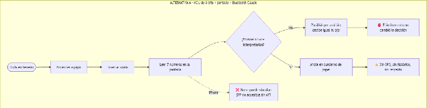

##### **Figura 1.0 “ Diagrama de Flujo Arquitectura 8 Bits \+ Bluetooth Classic”**

* **Instrumento autónomo con inferencia embebida y pantalla:** La versión seria de la alternativa anterior. Todo el sistema, incluido el motor de interpretación agronómica, viviría dentro del microcontrolador, sin depender de un teléfono.

  *Evaluación:* Es una alternativa técnicamente válida y resuelve bien el caso de un usuario que no quiere depender de su celular. Sus costos aparecen en otro lado: incorporar una pantalla activa aumenta el consumo y añade una ventana que es el punto débil de la estanqueidad; sin GPS ni conectividad se pierde la capa del motor que cruza la medición con el clima previsto; y corregir el conocimiento agronómico exigiría publicar un nuevo firmware y lograr que el usuario lo instale. Supera el filtro de viabilidad y llega a la etapa de puntuación. 

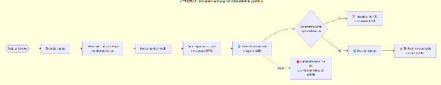

##### **Figura 1.1 “ Diagrama de Flujo Arquitectura de Sistema Embebido y Pantalla”**

* **Datalogger estacionario con telemetría celular:** La arquitectura típica de las parcelas de investigación: equipo fijo, alimentado por panel solar, con una sonda enterrada en un único punto y un módem celular que sube datos a una web por suscripción.

  *Evaluación:* Resuelve muy bien un problema distinto, y conviene decirlo sin descalificarla: entrega series continuas en el tiempo, algo que un instrumento portátil no puede ofrecer. Pero la variabilidad de un campo es también espacial, y mapear veinte puntos exigiría veinte instalaciones. Requiere cobertura celular exacta en el punto de instalación e impone una suscripción recurrente, incompatible con el principio de cero suscripciones. Incumple RO-4 y RO-5 para este caso de uso y queda clasificada como adecuada para monitoreo fijo, no para el recorrido de terreno.

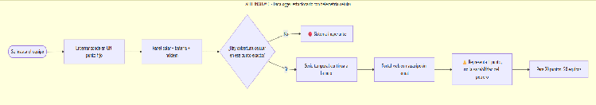

##### **Figura 1.2 “ Diagrama de Flujo Arquitectura con Datalogger Estacionario”**

* **Red de nodos LoRaWAN con estación concentradora predial:** Reemplaza el módem celular por una radio de largo alcance y bajísimo consumo hacia una estación concentradora en el predio.

  *Evaluación:* Es la alternativa técnicamente más elegante entre las descartadas y la que mejor resuelve el monitoreo distribuido y simultáneo. Su limitación para este proyecto es económica y operativa: la cantidad de nodos depende de la resolución espacial y temporal buscada, y alcanzar una cobertura comparable al recorrido de un operador exigiría un número de nodos con costo prohibitivo para la AFC, además de instalar infraestructura propia. Tampoco resuelve el caso de uso central: el agricultor está de pie sobre el punto cuando necesita la decisión, no a distancia. Cumple los requisitos y pasa a puntuar con esa reserva.

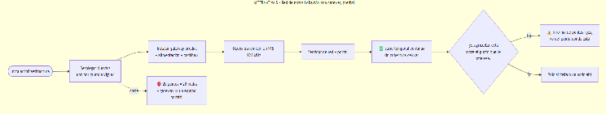

##### **Figura 1.3 “ Diagrama de Flujo Arquitectura de Nodos con LoRaWAN”**

* **Sonda conectada directo al teléfono (electrónica intermedia):** La alternativa más radical: eliminar la radio del medio y conectar la sonda al teléfono por cable, mediante un adaptador USB–RS-485 con fuente de alimentación propia.

  *Evaluación:* Es técnicamente realizable y hereda gratis todas las capacidades del teléfono, por lo que si se puntuara obtendría un resultado alto. Su costo está en la operación real: el teléfono no puede entregar por sí solo la tensión y corriente que exige la sonda industrial ni generar la señal diferencial, de modo que el cable exige igualmente un adaptador y una fuente externa; a eso se suman la compatibilidad del modo host USB entre modelos y fabricantes, y una ergonomía de trabajo peor, con el teléfono cableado al instrumento mientras el operador camina por el predio con guantes. Se conserva como alternativa viable a prototipar, no como arquitectura seleccionada.

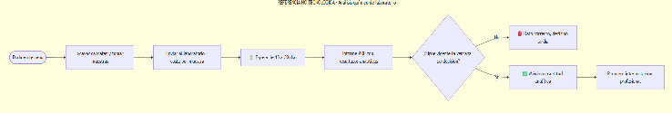

##### **Figura 1.4 “ Diagrama de Flujo Arquitectura de Sonda conecta a Celular”**

* **Instrumento portátil inalámbrico de bajo consumo, con el teléfono como intérprete:** La síntesis de las lecciones anteriores: un equipo portátil mínimo que resuelve únicamente lo que el teléfono no puede hacer (proveer la tensión, el protocolo y la medición física del suelo y del aire), y delega en el teléfono la interpretación, la posición geográfica, la pantalla y el almacenamiento mediante un enlace inalámbrico BLE (Bluetooth Low Energy).

  *Evaluación:* El teléfono reúne capacidades que duplicar en el instrumento sería un gasto innecesario, y el enlace inalámbrico preserva la libertad de movimiento durante el recorrido. Asume que el usuario dispone de un smartphone, supuesto razonable dada la penetración de telefonía móvil en zonas rurales. Cumple la totalidad de los requisitos obligatorios y pasa a puntuar.

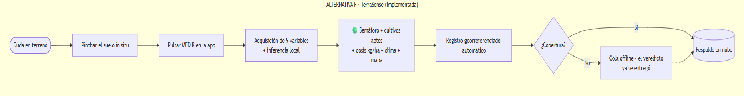

##### **Figura 1.5 “ Diagrama de Flujo Arquitectura de Sistema Embebido de Bajo Consumo”**

Para contrastar de un vistazo cómo circulan la información y la energía en las alternativas descartadas, se resumen sus rutas en el siguiente esquema comparativo:

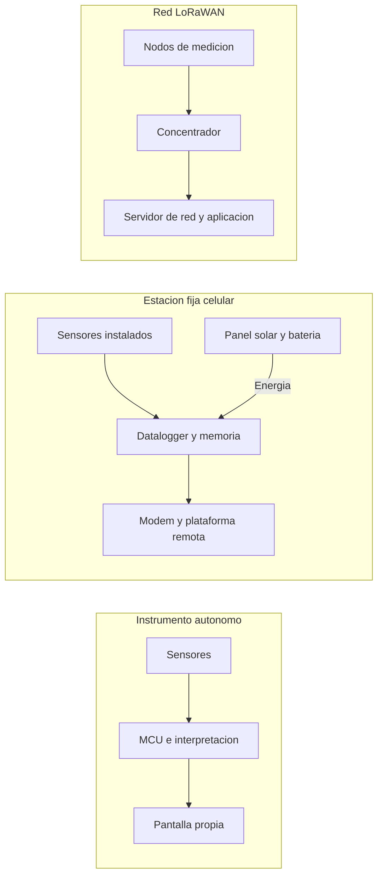

##### **Figura 1.6 “Rutas de Información y Alimentación de las Alternativas”**

La alternativa cableada merece un esquema propio, porque su descarte no se funda en una imposibilidad física sino en el conjunto de piezas que sigue exigiendo:

##### **Figura 1.7 “Alternativa Cableada con Electrónica Intermedia”**

**Matriz de Decisión:** Puntuando sólo a las arquitecturas que superaron el filtro.

| Criterio | Peso | Instrumento autónomo con inferencia embebida y pantalla | Red de nodos LoRaWAN con estación concentradora predial | Instrumento portátil inalámbrico de bajo consumo, con el teléfono como intérprete |
| :---: | :---: | :---: | :---: | :---: |
| **Cobertura espacial** | 15 % | 8 | 5 | 10 |
| **Calidad de interfaz** | 13 % | 4 | 7 | 10 |
| **Capacidad de interpretación** | 15 % | 6 | 8 | 10 |
| **Autonomía energética** | 14 % | 4 | 8 | 9 |
| **Costo total a 5 años** | 16 % | 6 | 2 | 8 |
| **Robustez mecánica** | 10 % | 6 | 9 | 9 |
| **Actualización del conocimiento** | 9 % | 5 | 8 | 10 |
| **Independencia de infraestructura** | 8 % | 9 | 5 | 7 |
| **Puntaje ponderado final** | **100 %** | **6,04** | **5,64** |  **9,20** |

###### **Tabla 1.4 “Matriz de Decisiones”**

* **Conclusión y Sensibilidad:** La arquitectura de un instrumento portátil inalámbrico de bajo consumo, con el teléfono como intérprete, gana con margen amplio por su ventaja en cobertura espacial, capacidad de interpretación y facilidad de actualización del software. Tras un análisis de sensibilidad elevando los pesos de distintos criterios, esta arquitectura mantiene su ventaja.

* **Alcance de la matriz:** Esta puntuación ordena preferencias respecto del caso de uso definido en la Tabla 1.3; no constituye una medición de laboratorio. Cada nota es un juicio de ingeniería sobre configuraciones típicas y no debe leerse como que una pantalla reduce la autonomía en un porcentaje universal ni como que una red LoRaWAN exige siempre un nodo por muestra. Por esa razón la matriz se acompaña de una comparación razonada de funciones y compromisos, que es la que soporta realmente la decisión:

| Arquitectura | Fortalezas | Trabajo adicional o limitación para este proyecto | Decisión |
| :---- | :---- | :---- | :---- |
| MCU de 8 bits, pantalla y Bluetooth Classic | Sencillez y bajo costo en instrumentación básica | Menor memoria; perfil serial clásico y compatibilidad móvil a resolver | No priorizada |
| MCU con inferencia y pantalla propia | Lectura autónoma sin depender del teléfono | Interfaz, actualizaciones, estanqueidad de la ventana y carcasa más complejas | Alternativa viable |
| Datalogger fijo con módem celular | Series continuas en el tiempo y acceso remoto | Instalación por zona, cobertura celular y servicio de comunicaciones recurrente | Adecuada para otro uso |
| Nodos LoRaWAN con concentrador | Cobertura simultánea de múltiples puntos fijos | Infraestructura propia y costo por nodo; recorrido de datos hasta la aplicación | Alternativa para monitoreo distribuido |
| Adaptador USB–RS-485 con fuente propia | Menos radio; el teléfono actúa como interfaz | Cableado, compatibilidad USB entre modelos, alimentación externa y ergonomía | Alternativa viable a prototipar |
| **ESP32 portátil, BME280 y BLE** | **Recorrido libre, interfaz móvil y sensores de suelo y ambiente reunidos** | **Gestión del enlace y consumo de la placa de desarrollo** | **Seleccionada** |

###### **Tabla 1.5 “Comparación Razonada de Arquitecturas”**

La preferencia por BLE responde a la libertad de movimiento y a la separación física entre instrumento y teléfono, no a que las alternativas sean imposibles. El equipo portátil ofrece una muestra por recorrido; una red fija puede medir simultáneamente y con mayor frecuencia. Son ventajas distintas, y el proyecto elige la que corresponde al problema que declaró resolver.

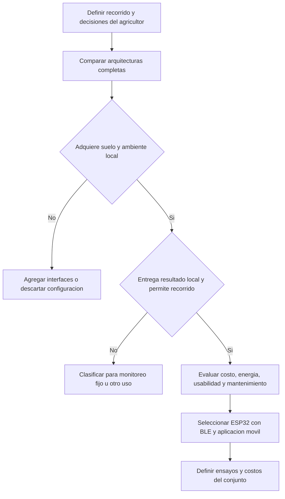

##### **Figura 1.8 “Diagrama de Flujo del Proceso de Selección de Arquitectura”**

**Selección de Componentes Base:** Decidida la arquitectura general, la segunda capa de decisiones define con qué componente concreto se construye cada bloque.   
Se aplicó la misma disciplina: evaluación de candidatos reales, criterios declarados antes de comparar, y honestidad explícita cuando la alternativa descartada es superior en alguna dimensión. Sobre once subsistemas evaluados, en siete existe una alternativa técnicamente superior en alguna métrica, y el proyecto lo declara en lugar de presentar una selección irreal donde el componente elegido gane en todo.

**Microcontrolador:** Se evaluaron cuatro candidatos: ESP32, nRF52840, STM32WB55 y ATmega328P+HC-05. Este último queda descartado de entrada por el mismo problema de compatibilidad con iOS visto en la evaluación de arquitecturas.

| Microcontrolador | Consumo BLE (Tx) | Wi-Fi / OTA | Núcleos | Puntaje Ponderado | Veredicto |
| :---: | :---: | :---: | :---: | :---: | :---: |
| **STM32WB55** | \~5-6 mA (Bajísimo) | No | 2 | 7,72 | Descartado |
| **nRF52840** | \~5-6 mA (Bajísimo) | No | 1 (ARM Cortex) | 8,10 | Descartado |
| **ESP32-WROOM-32** | **Más alto** | **Sí (Nativo)** | **2** | **8,98** |  **Seleccionado** |

###### **Tabla 1.6 “Comparativa de Microcontroladores”**

* **Justificación de la Selección:** Los chips nRF52840 y STM32WB55 superan claramente al ESP32 en eficiencia de radio, y el proyecto lo reconoce. La elección del ESP32 se sostiene en tres razones prácticas: Wi-Fi integrado para actualizar el firmware por aire sin hardware adicional, una disponibilidad y un ecosistema de bibliotecas y documentación que reducen el riesgo y el plazo de desarrollo, y un costo de placa de desarrollo compatible con la BOM objetivo. Corresponde precisar dos límites de esta justificación. Primero, el doble núcleo es una capacidad útil para separar la pila de radio de la temporización Modbus, pero no es una condición necesaria: una implementación mononúcleo bien programada también puede sostener ambas tareas. Segundo, no se afirma una mejora porcentual de autonomía frente a nRF52840 o STM32WB55, porque una comparación así exigiría medir configuraciones completas de cada plataforma y no se ha realizado. El componente se utiliza en formato de placa de desarrollo, lo que facilita programación y montaje inicial, pero incorpora al balance energético el regulador, el LED de alimentación y el puente USB-UART de esa placa.

**Sonda de Suelo**: Aporta 7 de las 10 magnitudes del sistema, siendo la decisión más crítica y la que concentra el 59,1 % del costo de materiales. Se comparó la Sonda 7-en-1 RS-485 contra instrumentos de grado de investigación (METER TEROS 12, Delta-T WET150, Stevens HydraProbe). 

| Sonda | Variables entregadas | Exactitud Pura | Viabilidad Económica | Puntaje Ponderado |
| :---: | :---: | :---: | :---: | :---: |
| **Grado Investigación (TEROS 12, etc.)** | 3 a 4 variables | 10 / 10 | Muy Baja (Costo x20) | 6,46 |
| **Sonda 7-en-1 RS-485** | 7 registros | 7 / 10 | Alta | 8,87 |

###### **Tabla 1.7 “Comparativa de Sondas de Suelo”**

* **Justificación:** Se sacrifica exactitud absoluta a cambio de viabilidad. Obtener las siete variables con sensores de investigación multiplicaría el costo del producto por veinte, lo que contradice el objetivo mismo del proyecto. La limitación técnica más importante se declara explícitamente: la estimación de N, P y K no se mide por electrodo ion-selectivo, sino que se deriva de la conductividad eléctrica. En suelo salino puede leer erróneamente un estado "fértil". Para mitigarlo, la App presenta el N/P/K como *clase ordinal* agrupada (bajo/medio/óptimo/excesivo), nunca para calcular dosis exactas, y levanta una alerta de baja confianza cuando la conductividad supera los 1.000 µS/cm. Ni una CE baja ni una tendencia estable prueban selectividad química de la sonda, y el informe no lo presenta como si lo hicieran.

**Sensor Ambiental:** Compite el Bosch BME280 contra el Sensirion SHT40 y contra el Bosch BMP280.

| Sensor | Exactitud Temperatura | Mide Humedad Relativa | Mide Presión Barométrica | Veredicto |
| :---: | :---: | :---: | :---: | :---: |
| **Sensirion SHT40** | ±0,2 °C | Sí | No | Descartado por función |
| **Bosch BMP280** | ±1,0 °C | No | Sí | Descartado por función |
| **Bosch BME280** | ±1,0 °C | Sí (±3 % HR) | Sí (±1,0 hPa) | **Seleccionado** |

###### **Tabla 1.8 “Comparativa de Sensores de Temperatura / Humedad / Presión Barométrica”**

* **Justificación:** Se elige por una razón funcional, no de desempeño. El BME280 es el único de los tres candidatos que entrega simultáneamente las tres magnitudes que la grilla 3×3 reserva al ambiente local. El SHT40 es más exacto en temperatura pero no mide presión; el BMP280, frecuentemente confundido con el BME280 por su encapsulado casi idéntico, no aporta humedad relativa y por lo tanto **no constituye un reemplazo funcional**. La presión barométrica se utiliza además para corregir el cálculo de evapotranspiración por altitud. Cabe precisar que la temperatura del BME280 se emplea también en la compensación interna del propio sensor, y su correspondencia con el aire exterior depende críticamente de su ubicación física dentro de la carcasa, requisito que se aborda en el diseño mecánico.

Cerrando esta capa de decisiones, la siguiente tabla resume la selección vigente por bloque funcional y el motivo de integración de cada uno:

| Bloque | Selección vigente | Motivo e integración |
| :---- | :---- | :---- |
| Control | ESP32-WROOM-32 en placa de desarrollo | UART para Modbus, I²C ambiental, BLE hacia el teléfono, Wi-Fi para OTA |
| Suelo | Sonda 7-en-1 RS-485 Modbus RTU | Captura multiparamétrica; ficha, tensión y mapa de registros dependen del SKU |
| Ambiente | Módulo Bosch BME280 I²C | Reúne temperatura del aire, humedad relativa y presión local |
| Interfaz diferencial | SP3485 a 3,3 V | Adapta el UART del ESP32 al bus RS-485; requiere terminación y protección |
| Energía | LiPo protegida de 2.000 mAh | Recarga y volumen compatibles con un instrumento portátil de mano |
| Carga y elevación | PCB combinada USB-C carga + boost | Una sola compra de $900; no se suman módulos discretos duplicados |
| Conexión de batería | Conector JST de tres pines con contraparte y cable | Confirmar pinout y función del tercer pin antes de cerrar el esquema |
| Alojamiento | Carcasa PETG impresa en 3D | Acceso de montaje, ventilación del BME280 y reposición por piezas |

###### **Tabla 1.9 “Selección de Componentes e Integración Eléctrica”**

Dos verificaciones quedan expresamente abiertas sobre esta tabla. La línea de sonda se diseña para la variante compatible con la rama prevista de 5 V, pero la interfaz RS-485 no determina por sí sola la tensión de alimentación: debe confirmarse contra la ficha del SKU efectivamente adquirido, incluyendo su comportamiento a batería baja, durante el arranque y durante la transmisión. Por su parte, el BME280 se comunica a 3,3 V por I²C, con GPIO21 como SDA y GPIO22 como SCL en el pinout de trabajo; la dirección 0x76 o 0x77 y la presencia de resistencias de pull-up dependen del módulo comprado.

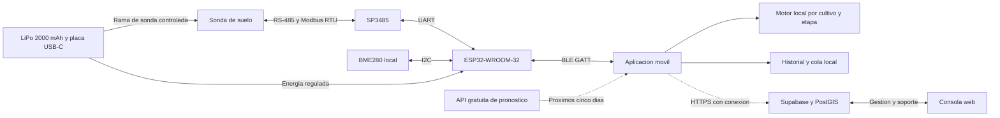

##### **Figura 1.9 “Arquitectura Objetivo de TerraSense y Origen de Cada Dato”**

La figura expresa el diseño objetivo completo. El decodificador de la trama de suelo y el guardado local ya existen en el repositorio del proyecto; la incorporación de las tres variables del BME280 al contrato BLE y la consulta de cinco días son trabajos de integración identificados más adelante en este mismo capítulo. No debe inferirse del diagrama que exista ya firmware terminado para todos los bloques.

**Arquitectura de Conectividad:**  

La estrategia de comunicación del sistema se divide en distintas etapas, cada una diseñada para optimizar los recursos energéticos y superar las barreras del entorno agrícola:

*  **Sonda de Suelo → ESP32 (Bus RS-485 Modbus RTU):** Se eligió esta interfaz frente a alternativas más simples (como UART directo) porque transmite una señal diferencial robusta e inmune al ruido electromagnético en campo abierto. Además, al ser el estándar universal para instrumentación industrial, permite intercambiar sondas de distintos fabricantes en el futuro sin necesidad de rediseñar la placa base del equipo. Conviene separar las dos capas involucradas: RS-485 define la capa eléctrica diferencial, mientras Modbus define la estructura de los mensajes; en su implementación serial RTU se verifican longitud, dirección, función, CRC-16 y temporización entre tramas.  
* **Sensor Ambiental BME280 → ESP32 (Bus I2C):** Para la captura de datos atmosféricos (temperatura del aire, humedad relativa y presión barométrica), se utiliza una comunicación serie de dos hilos (I²C). Al estar el sensor integrado para lectura ambiental local, directamente en la placa o a muy corta distancia del microcontrolador, el protocolo I²C es el estándar ideal por su simplicidad técnica y bajo consumo, sin verse afectado por las limitaciones de distancia que sufriría en campo abierto.  
* **ESP32 → Smartphone (Bluetooth Low Energy):** Se optó por un enlace BLE puntual debido a su bajo consumo energético. El equipo envía paquetes de datos muy pequeños (tramas de 16 bytes en el contrato vigente) y se conecta solo durante los segundos que dura la medición. Al utilizar BLE se evita la barrera de certificación MFi que afecta al perfil serial de Bluetooth Classic en iOS, habilitando compatibilidad con Android y Apple sin costos de hardware adicionales. Corresponde precisar que disponer de BLE no constituye por sí solo una prueba de compatibilidad terminada: el enlace requiere una compilación nativa de la aplicación (Expo Go no sustituye un build que incluya la biblioteca BLE) y debe comprobarse con permisos, reconexiones y versiones reales de sistema operativo en ambas plataformas.  
* **Smartphone → Nube (HTTPS / Supabase):** El sistema implementa una arquitectura estrictamente *offline-first*. La falta de cobertura en zonas rurales es la principal causa de fallo en agrotecnología, por lo que el motor de interpretación agronómica corre localmente en el teléfono sobre almacenamiento local persistente. La conexión a la nube ocurre de manera diferida y en segundo plano, interviniendo únicamente para sincronizar historiales y respaldar información cuando el teléfono detecta señal de internet. Esta independencia tiene un límite honesto: crear una cuenta, registrar un equipo nuevo o recuperar credenciales sí requieren conexión; lo que no la requiere es medir, diagnosticar y guardar.

Se adjunta un diagrama de flujo para comprender de manera visual la ruta de la información, desde la captura en terreno hasta el almacenamiento diferido en la nube:   
**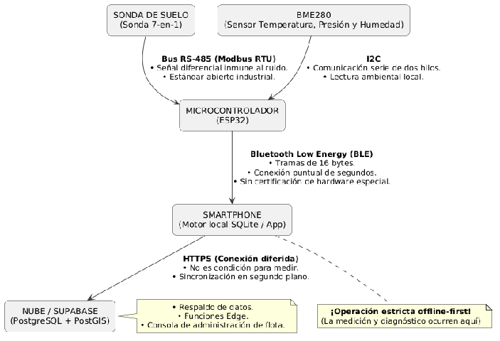**

##### **Figura 2.0 “Diagrama de Flujo Arquitectura de Conectividad”**

El ciclo de adquisición merece un detalle adicional, porque de él depende que un fallo de comunicación no se confunda jamás con un resultado agronómico. Una respuesta ausente de la sonda no debe convertirse en "cero humedad" ni en un semáforo rojo atribuido al suelo: debe presentarse como lo que es, un error de lectura. El siguiente diagrama describe el ciclo objetivo con los fallos diferenciados:

##### **Figura 2.1 “Ciclo de Adquisición y Transmisión con Fallos Diferenciados”**

**Análisis de Viabilidad Económica:**

El siguiente análisis detalla el dimensionamiento del mercado, la estructura de costos, la estrategia de precios, el plan operativo y las proyecciones financieras del proyecto TerraSense, dando respuesta a los objetivos específicos de evaluar la viabilidad económica y de dimensionar el mercado y la capacidad productiva.

El estudio vincula explícitamente las decisiones técnicas con la operación de una empresa. Cada instrumento necesita sonda, sensor ambiental, electrónica, carcasa, montaje, pruebas, embalaje y entrega; a ello se agregan adquisición de clientes, personal, contabilidad, soporte y servicios digitales. Un margen calculado solo como precio menos sonda no permitiría financiar estas actividades ni explicar la caja necesaria para iniciar la operación.

Las convenciones del modelo son las siguientes: la moneda es CLP nominal, el primer año operativo es **2027**, se aplica un reajuste general del **3 % anual**, el precio inicial es de **$349.990 con IVA** y el horizonte económico de evaluación es de **cinco años** con flujos calculados mes a mes. La fuente editable de costos y operación reside en un archivo de supuestos único (`finanzas/supuestos.json`), desde el cual se regeneran todas las tablas de este capítulo, el flujo de caja en Excel y la BOM. Esto significa que un cambio en el precio del sensor ambiental, en la carcasa o en el precio de venta se propaga automáticamente a inventario, caja e indicadores, sin posibilidad de que dos secciones del informe se contradigan entre sí.

**Dimensionamiento del Mercado:** 

Antes de proyectar una sola unidad vendida es necesario acotar el universo sobre el cual se proyecta. El dimensionamiento se construyó sobre fuente censal oficial: el Censo Agropecuario y Forestal 2021 del INE, que informa 138.628 unidades productivas agropecuarias y 36.928 unidades de autoconsumo.

| Nivel | Definición y filtros aplicados | Universo | Uso dentro del estudio |
| :---: | :---- | :---: | :---- |
| **TAM (universo de contexto)** | Unidades productivas censadas (138.628 UPA \+ 36.928 UAC) | 175.556 u | Dimensionar el sector; **no convierte cada unidad en una venta** |
| **SAM (servible)** | Productores y asesores con orientación comercial, smartphone y acceso al canal | A cuantificar por cultivo, región y canal | Acotar el mercado direccionable con cruces explícitos, no por atribución directa al censo |
| **SOM (meta 5 años)** | Equipos que el plan comercial propone vender en cinco años | 2.550 u | Meta derivada del presupuesto de ventas y de la capacidad productiva |

###### **Tabla 2.0 “Dimensionamiento del Mercado”**

Esta tabla incorpora una corrección metodológica importante respecto de versiones anteriores del estudio. El total censal describe el sector, pero **no equivale a clientes con intención de compra**, y por lo tanto no respalda por sí solo una cifra de mercado servible expresada en pesos. El segmento inicial se orienta al pequeño y mediano productor comercial, aproximadamente de 0,5 a 20 hectáreas, además de los asesores que utilizan el instrumento en más de un predio. La existencia de smartphone importa para la adopción, pero la cobertura permanente de internet no es un requisito para cada lectura local, precisamente por el diseño *offline-first*. El SOM, en consecuencia, se presenta como lo que es: una meta de ventas sostenida por un presupuesto comercial, no una fracción de una cifra censal.

**Plan de Ventas y Motor de Crecimiento:**

Toda esta evaluación económica se ha construido sobre un escenario base conservador respecto a la proyección de ventas anuales. La estimación es el supuesto más frágil de cualquier modelo, por lo que el escenario inicial contempla apenas 200 unidades el primer año, equivalentes a 17 unidades mensuales. Proyectar una colocación masiva para una marca nueva destruiría la credibilidad del estudio.

Cada salto de volumen responde a una causa presupuestada y a una inversión asociada. El crecimiento no es una extrapolación matemática, sino la consecuencia de acciones comerciales financiadas dentro del flujo, con la pauta publicitaria calculada a razón de **$30.000 por venta objetivo**:

* **Año 1 (200 unidades):** Sin agencia. Los socios gestionan directamente anuncios y demostraciones para documentar los primeros casos de éxito.
* **Año 2 (350 unidades):** Se incorpora capacidad técnica (0,5 FTE) y se activa el canal de asesores agronómicos.
* **Año 3 (500 unidades):** Se suma soporte dedicado y se consolida la base instalada.
* **Año 4 (650 unidades):** Se incorpora gestión de agencia y la primera postulación a compras institucionales.
* **Año 5 (850 unidades):** Cobertura multirregional apalancada por la base instalada y las recomendaciones.

<!-- INFORME:VENTAS:INICIO -->

| Año | Equipos | Pauta anual | Técnicos FTE | Soporte FTE | Agencia anual |
|---|---|---|---|---|---|
| 2027 | 200 | $6.000.000 | 0,0 | 0,0 | $0 |
| 2028 | 350 | $10.815.000 | 0,5 | 0,0 | $0 |
| 2029 | 500 | $15.913.500 | 0,5 | 0,5 | $0 |
| 2030 | 650 | $21.308.176 | 1,0 | 1,0 | $3.278.181 |
| 2031 | 850 | $28.700.475 | 1,5 | 1,5 | $3.376.526 |

###### **Tabla 2.1 “Plan de Ventas y Recursos Comerciales”**

El plan suma **2.550 equipos en cinco años**. A precio inicial constante, representa $892.474.500 brutos; el flujo nominal incorpora reajustes anuales. El SOM es una meta de ventas, no una cifra censal de compradores. La pauta del primer año es $6.000.000 y la agencia aparece desde 650 ventas anuales.

<!-- INFORME:VENTAS:FIN -->

La estrategia base utiliza venta directa, pauta digital, demostraciones y atención comercial de los socios; la distribución mayorista, el crédito a clientes y los convenios institucionales se consideran expansiones posibles, pero **no se contabilizan como ventas comprometidas** ni con el mismo margen de la venta directa.

Una advertencia de gestión que el modelo hace explícita: la pauta se calcula sobre la venta *objetivo* y no se reduce automáticamente cuando una campaña vende menos. El gasto puede ocurrir antes de saber cuántas ventas producirá, lo que convierte al seguimiento comercial (contactos, conversión, devolución, costo de adquisición y tiempo de soporte) en una función crítica y no accesoria. Las ventas mensuales, además, se distribuyen con pesos estacionales explícitos en lugar de asumir que los doce meses del año reciben el mismo ingreso.

**Estructura de Costos y Producción:**

El costo de capital de cada unidad se optimiza para mantener el equilibrio entre accesibilidad comercial y precisión técnica. El instrumento de medición (Sonda 7-en-1 RS-485) representa la variable crítica: **$48.000, equivalente al 59,1 % del costo de materiales**, lo que justifica la decisión de no sacrificar la lectura de variables clave del suelo a expensas de abaratar componentes.

<!-- INFORME:BOM:INICIO -->

| Material o servicio por equipo | Cantidad | Neto unitario CLP | Subtotal CLP |
|---|---|---|---|
| Sonda RS485 7-en-1 (SKU pendiente de ficha) | 1 | $48.000 | $48.000 |
| Placa de desarrollo ESP32-WROOM-32 | 1 | $6.723 | $6.723 |
| Módulo ambiental Bosch BME280 I2C | 1 | $2.941 | $2.941 |
| PCB combinada USB-C carga + boost | 1 | $900 | $900 |
| LiPo 2000 mAh protegida | 1 | $4.500 | $4.500 |
| SP3485 transceptor RS485 3.3 V | 1 | $900 | $900 |
| Conector JST batería 3 pines con contraparte/cable | 1 | $450 | $450 |
| Pulsador | 1 | $250 | $250 |
| LED SMD | 3 | $40 | $120 |
| Pasivos, protección y terminación RS485 | 1 | $1.200 | $1.200 |
| PCB portadora y montaje externo SMD | 1 | $2.500 | $2.500 |
| Carcasa impresa en 3D PETG (servicio externo) | 1 | $6.000 | $6.000 |
| Prensaestopas, fijaciones, juntas y respiradero BME280 | 1 | $1.500 | $1.500 |
| Cableado y conectores internos adicionales | 1 | $700 | $700 |
| Embalaje, manual y etiqueta | 1 | $2.000 | $2.000 |
| Flete de insumos y contingencia importación | 1 | $2.500 | $2.500 |
| **Total BOM** |  |  | **$81.184** |

###### **Tabla 2.2 “Estructura de Costos y Producción (BOM)”**

| Economía unitaria, año 1 | CLP |
|---|---|
| Precio con IVA | $349.990 |
| Ingreso neto de IVA | $294.109 |
| Materiales y servicios incluidos en BOM | $81.184 |
| Merma, 3 % de BOM | $2.436 |
| Reposiciones y garantía, 5 % de BOM | $4.059 |
| Envío | $6.000 |
| Comisión comercial, 5 % del bruto | $17.500 |
| **Costo variable total** | **$111.178** |
| **Margen de contribución** | **$182.931** |
| Margen / ingreso neto | 62,2 % |

###### **Tabla 2.3 “Economía Unitaria del Año 1”**

La sonda concentra **59,1 %** de los materiales. El BME280 cuesta **$3.500 finales**, equivalentes a $2.941,18 netos bajo el supuesto de IVA del 19 %. La carcasa 3D cuesta $6.000 netos y sus fijaciones, juntas y respiradero suman $1.500. Los subtotales se calculan antes de redondear; la presentación en pesos enteros puede producir diferencias de un peso al sumar visualmente las filas.

<!-- INFORME:BOM:FIN -->

Cuatro decisiones metodológicas sostienen estos números y conviene declararlas, porque son exactamente los puntos donde un modelo económico suele engañarse a sí mismo:

* **La mano de obra de ensamblaje final no se cuenta dos veces.** Está incorporada en la nómina de la empresa, dentro de los gastos fijos. Añadirla además como un costo variable por unidad, como ocurría en la versión anterior del informe, duplicaba el costo del trabajo. El montaje SMD externo que sí aparece en la BOM es un servicio distinto, realizado por un proveedor.
* **La impresión 3D externa tiene una frontera de costo definida.** Los $6.000 netos del proveedor ya incluyen material, energía, uso de máquina y acabado; no se vuelve a sumar filamento ni electricidad, ni se incorpora una impresora como activo mientras se mantenga esta modalidad. Si en el futuro se decidiera producir internamente, deberían recalcularse activo, depreciación, material, horas y tasa de rechazo.
* **No se supone un descuento automático por volumen.** La versión anterior asumía una reducción del 10 % en el costo de componentes hacia el quinto año. Aquí las compras se reajustan por inflación y el inventario conserva su costo promedio ponderado. Si se consiguen precios por volumen deberán incorporarse como una modificación explícita del modelo; hasta entonces, esa mejora no se utiliza para justificar rentabilidad.
* **Los precios brutos y netos no se mezclan.** El BME280 tiene un precio de $3.500 finales con IVA, equivalentes a $2.941,18 netos bajo IVA del 19 %; la placa combinada de carga y elevación mantiene $900 como costo completo sin crédito fiscal hasta disponer de factura. Los subtotales se calculan antes de redondear, por lo que la suma visual de las filas puede diferir en un peso.

La decisión de fabricar el gabinete mediante impresión 3D FDM, en lugar de inyección en molde, sigue siendo económicamente determinante: elimina el costo de utillaje, que ascendería a millones de pesos y solo se amortizaría vendiendo miles de unidades. Además permite modificar geometría, soportes y acceso a conectores durante el desarrollo sin comprometer un molde por cada cambio.

**Estrategia de Precios y Posicionamiento Competitivo:**

El precio de venta al público se ha fijado en **$349.990 CLP con IVA ($294.109 neto)**. Esta cifra no se calcula mediante un margen de adición estándar sobre el costo, sino que actúa como un techo estratégico declarado: es el máximo que el proyecto se permite cobrar para sostener su ventaja frente a la instrumentación importada, que parte en torno a US$294 por un medidor de tres o cuatro parámetros sin interpretación agronómica.

La consecuencia metodológica de este enfoque es fundamental: al estar el precio predefinido, la variable que el modelo debe resolver no es cuánto cobrar, sino cuántas unidades se deben vender para cubrir la estructura de costos completa. El precio se evalúa entonces por el margen que deja para sostener gastos fijos, soporte y capital de trabajo. El análisis de sensibilidad que se presenta más adelante demuestra por qué este techo no admite rebajas: a $299.990 el proyecto pasa a pérdida operacional en el primer año.

**Capacidad Productiva, Gastos Fijos y Punto de Equilibrio:**

La estructura de personal relaciona ventas con trabajo real, y no con una dotación fijada arbitrariamente. Se consideran 2,25 horas por equipo para ensamblaje y prueba final, 500 horas anuales combinadas aportadas por los socios a producción y 1.400 horas productivas anuales por cada equivalente de jornada completa contratado. Las funciones comercial y de soporte utilizan dos horas por venta más media hora anual por equipo activo, con 900 horas combinadas de los socios. La contratación aumenta en escalones de 0,5 FTE.

Conviene precisar que FTE representa capacidad equivalente y **no** medio contrato ni media persona; la forma de contratación y la distribución de tareas se resuelve al organizar la operación. Los tiempos incluyen una asignación de trabajo que debe comprobarse con el montaje completo, incluido el BME280: la lectura del sensor agrega poco material, pero el control de su ubicación, comunicación y respuesta térmica sí debe formar parte del procedimiento de calidad.

Para garantizar el realismo de la evaluación, los gastos fijos asumen una formalización inmediata. Los socios perciben remuneración bruta presupuestada por su trabajo desde el mes 1, con escalones base de $600.000, $700.000, $850.000, $1.000.000 y $1.200.000 mensuales por persona, más reajuste; el 35 % adicional es una reserva de sobrecosto laboral y no una tasa legal única ni un sueldo líquido. Se incorpora contabilidad externa desde el primer mes, junto con taller, administración y seguros. Evaluar este proyecto asumiendo un "costo cero" para el trabajo de los socios sería un autoengaño; por ello se integran como gasto fijo real.

<!-- INFORME:FIJOS:INICIO -->

| Concepto | 2027 | 2028 | 2029 | 2030 | 2031 |
|---|---|---|---|---|---|
| Nómina y cargas | $19.440.000 | $28.783.350 | $41.247.792 | $60.187.403 | $82.049.592 |
| Contabilidad | $1.440.000 | $1.606.800 | $1.782.312 | $2.098.036 | $2.431.099 |
| Servicios digitales | $1.920.000 | $2.317.500 | $2.928.084 | $3.769.908 | $4.895.963 |
| Gestión de agencia | $0 | $0 | $0 | $3.278.181 | $3.376.526 |
| Taller, administración y seguros | $3.360.000 | $3.460.800 | $3.564.624 | $3.671.563 | $3.781.710 |
| Pauta comercial | $6.000.000 | $10.815.000 | $15.913.500 | $21.308.176 | $28.700.475 |
| **Total gastos fijos** | $32.160.000 | $46.983.450 | $65.436.312 | $94.313.267 | $125.235.365 |

###### **Tabla 2.4 “Estructura de Gastos Fijos”**

| Año | Equilibrio operativo | Equilibrio con deuda | Ventas planificadas |
|---|---|---|---|
| 2027 | 176 | 205 | 200 |
| 2028 | 250 | 277 | 350 |
| 2029 | 337 | 364 | 500 |
| 2030 | 472 | 498 | 650 |
| 2031 | 608 | 634 | 850 |

###### **Tabla 2.5 “Punto de Equilibrio Operativo y con Deuda”**

En el primer año, $32.160.000 de gastos fijos se cubren con 176 unidades al margen calculado. Al añadir capital e intereses, el umbral sube a 205. La meta de 200 unidades cubre la operación, pero queda por debajo del equilibrio con deuda. Esta diferencia explica el uso de liquidez inicial durante el arranque; no se confunde una venta con caja libre inmediatamente distribuible.

<!-- INFORME:FIJOS:FIN -->

En el primer año, los $32.160.000 de gastos fijos se cubren con 176 unidades al margen calculado, de modo que la meta de 200 unidades deja un margen de seguridad del 12 % sobre el equilibrio operativo. Al añadir capital e intereses del crédito, sin embargo, el umbral sube a 205 unidades: **la meta del Año 1 cubre la operación pero queda cinco unidades por debajo del equilibrio con deuda**. Esta diferencia no es un defecto oculto del modelo sino su hallazgo más útil, porque explica exactamente por qué el proyecto necesita liquidez inicial durante el arranque y por qué una venta no equivale a caja libre inmediatamente distribuible.

El equilibrio operativo se calcula como gastos fijos divididos por el margen unitario, redondeado hacia arriba; el equilibrio con deuda añade capital e intereses al numerador. Este segundo umbral no incluye por sí solo el impuesto ni la acumulación de inventario, por lo que complementa —pero no sustituye— el análisis de flujo mensual y el indicador de cobertura de deuda (DSCR).

**Inversión Inicial y Estructura de Financiamiento:**

La puesta en marcha se estructura sobre fuentes de financiamiento por **$40.000.000 CLP**, distribuidas de la siguiente manera:

<!-- INFORME:INVERSION:INICIO -->

| Origen de fondos | CLP | Participación |
|---|---|---|
| Aporte socios | $9.000.000 | 22,5 % |
| Crédito | $31.000.000 | 77,5 % |
| **Total fuentes de financiamiento** | $40.000.000 | 100 % |

| Destino de fondos | CLP |
|---|---|
| Activos, desarrollo y formalización, con IVA presupuestado | $10.353.000 |
| Inventario inicial, IVA incluido | $964.378 |
| Gastos de apertura del crédito | $620.000 |
| Caja inicial, con reserva incluida | $28.062.622 |
| **Total destinos** | $40.000.000 |

###### **Tabla 2.6 “Financiamiento del Proyecto: Origen y Destino de Fondos”**

El desembolso de apertura es **$11.317.378**. Los $40.000.000 son fuentes de financiamiento y no deben denominarse inversión económica consumida: una parte permanece en caja. Para VAN y TIR, el capital comprometido en mes 0 es **$20.489.116**, compuesto por el desembolso y la caja mínima operativa independiente de la deuda.

| Plazo, años | Cuota mensual | Intereses totales | Saldo al año 5 | Mínimo sobre reserva, 24 meses |
|---|---|---|---|---|
| 5 | $680.007 | $9.800.394 | $0 | −$5.359.010 |
| 10 | $433.836 | $21.060.349 | $19.777.637 | $56.737 |
| 15 | $359.906 | $33.783.094 | $25.717.281 | $1.683.200 |

###### **Tabla 2.7 “Alternativas de Plazo del Crédito”**

La comparación utiliza el mismo principal y 12 % efectivo anual. Diez años reduce el servicio de arranque frente a cinco; quince reduce nuevamente la cuota pero aumenta intereses y exposición temporal. El crédito no desaparece al terminar la evaluación de cinco años: el saldo pendiente se muestra expresamente, y el Excel prolonga la amortización completa.

<!-- INFORME:INVERSION:FIN -->

Aquí se corrige una confusión frecuente y grave en evaluaciones de este tipo: **los $40.000.000 son fuentes de financiamiento, no inversión económica consumida**. El desembolso efectivo de apertura es de **$11.317.378**; el resto permanece en caja como capital de trabajo y reserva. Para el cálculo de VAN y TIR, el capital comprometido en el mes 0 es de **$20.489.116**, compuesto por ese desembolso más la caja mínima operativa que la actividad requiere con independencia de cómo se financie.

El tamaño de la estructura responde a un factor logístico y financiero concreto: el proyecto requiere liquidez para sostener el desfase entre compras, gastos y cobros durante el arranque. El modelo dimensiona el crédito en tramos de $100.000 hasta mantener, durante los primeros 24 meses, una reserva equivalente a tres meses de gastos fijos y tres cuotas, más un 10 % del desembolso inicial. Esa reserva está *dentro* de la caja y no se descuenta como un gasto adicional ni se suma dos veces al total. La política de inventario cubre dos meses de ventas, supuesto que debe ajustarse según el plazo real de entrega del proveedor de sondas.

La elección del plazo del crédito, comparada en la tercera tabla del bloque anterior sobre el mismo principal y la misma tasa, no es indiferente.

El plazo de cinco años sería preferible por costo financiero total, pero su cuota deja la reserva en terreno negativo durante los primeros 24 meses: el proyecto simplemente no sobreviviría al arranque. Quince años alivia aún más la cuota pero incrementa los intereses en más de $12 millones adicionales y prolonga la exposición. Diez años es el punto donde la reserva se mantiene positiva con el menor costo financiero posible. Se declara expresamente que **el crédito no desaparece al terminar la evaluación de cinco años**: quedan $19.777.637 de saldo pendiente, cifra que se muestra en su propia tabla y que el modelo extendido en Excel amortiza hasta el año 15.

La tasa se convierte a período mensual mediante la expresión `r_m = (1 + 0,12)^(1/12) − 1`, y no dividiendo simplemente por doce, porque está definida como efectiva anual. Con cuotas constantes, cada pago se separa en intereses y amortización: la cuota no es un gasto operativo completo, ya que el capital reduce la deuda mientras los intereses tienen tratamiento de financiamiento y tributario propio.

**Inventario, Impuestos y Construcción del Flujo de Caja:**

Las ventas se cobran en el mes de entrega. Las compras cubren las ventas del mes y de los dos siguientes, redondeadas a lotes de diez unidades, y el inventario inicial cubre los dos primeros meses. El modelo concilia unidades y valor mediante promedio ponderado. La consecuencia es que la compra consume caja antes de que todo el lote se venda, mientras el costo de venta solo reconoce las unidades entregadas: esta diferencia es la razón por la cual EBITDA y caja no coinciden, y por la cual una utilidad contable no puede presentarse como efectivo disponible.

El IVA se trata separado del ingreso neto. El stock comprado en el mes 0 genera crédito disponible desde el mes 1, excluyendo la placa combinada cuyo costo se toma sin recuperación fiscal por no disponer aún de factura; el IVA inicial recuperable no se deduce además como gasto de renta. Se mantiene una aproximación tributaria de caja con pérdidas arrastradas y reserva anual, utilizando las tasas de referencia del régimen Pro Pyme: **12,5 % para 2027, 15 % para 2028 y 25 % desde 2029**, sujetas al régimen y condiciones vigentes. El calendario del estudio no reproduce el formulario F29, los pagos provisionales mensuales ni la declaración de abril; esa limitación metodológica se declara en lugar de disimularse.

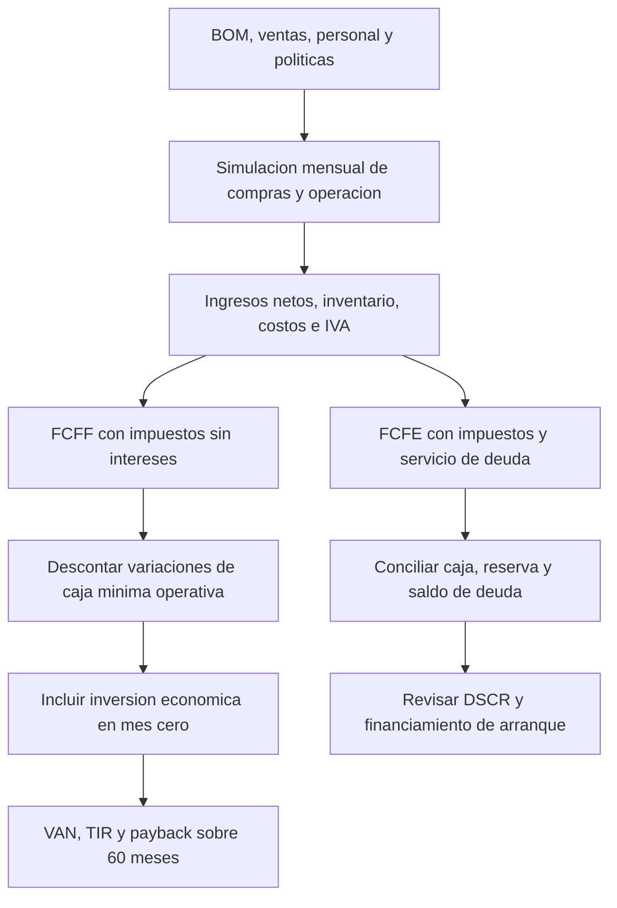

##### **Figura 2.2 “Construcción de Flujos e Indicadores desde los Supuestos de Operación”**

**Proyección de Resultados y Evaluación Financiera:**

<!-- INFORME:FLUJOS:INICIO -->

| Año | Venta neta | EBITDA | FCFF antes de caja mínima | FCFE | Caja final | DSCR |
|---|---|---|---|---|---|---|
| 2027 | $58.821.849 | $4.426.234 | $3.614.395 | −$1.591.640 | $26.470.982 | 0,69 |
| 2028 | $106.026.382 | $19.015.320 | $16.382.140 | $12.176.166 | $38.647.148 | 3,34 |
| 2029 | $156.010.248 | $31.680.620 | $23.048.763 | $18.590.260 | $57.237.408 | 4,57 |
| 2030 | $208.897.722 | $35.729.124 | $24.648.429 | $20.123.449 | $77.360.857 | 4,87 |
| 2031 | $281.369.163 | $49.915.370 | $37.321.742 | $32.722.306 | $110.083.164 | 7,29 |

###### **Tabla 2.8 “Proyección Anual de Resultados y Caja”**

| Período | Flujo económico para evaluación | Acumulado sin descuento |
|---|---|---|
| Mes 0 | −$20.489.116 | −$20.489.116 |
| 2027 | $3.614.395 | −$16.874.721 |
| 2028 | $12.676.278 | −$4.198.443 |
| 2029 | $18.435.548 | $14.237.105 |
| 2030 | $17.429.191 | $31.666.296 |
| 2031 | $29.591.217 | $61.257.513 |

###### **Tabla 2.9 “Flujo Económico para la Evaluación”**

En 2027, el EBITDA de $4.426.234 se transforma en FCFE de −$1.591.640 después de compras, IVA, impuestos y deuda. La caja final sigue positiva porque parte de la caja inicial. El **DSCR de 0,69** significa que la generación disponible para deuda no cubre por sí sola todo el servicio del primer año. Desde el año siguiente, el aumento de ventas mejora esa cobertura dentro del escenario base.

<!-- INFORME:FLUJOS:FIN -->

El resultado del primer ejercicio merece lectura detenida, porque es donde el proyecto muestra tanto su solidez como su punto de tensión. El EBITDA de 2027 es positivo ($4.426.234), pero se transforma en un FCFE de **−$1.591.640** después de compras de inventario, IVA, impuestos y servicio de deuda. La caja final permanece positiva ($26.470.982) porque parte de la caja inicial constituida con el financiamiento. El **DSCR de 0,69** significa que la generación disponible para deuda no cubre por sí sola todo el servicio del primer año; desde 2028 esa cobertura mejora sustancialmente hasta 3,34 y sigue creciendo. Presentar este dato es preferible a ocultarlo: identifica con precisión qué debe financiarse y durante cuánto tiempo.

**Metodología de VAN, TIR y Payback:**

El flujo del proyecto se evalúa **antes del financiamiento**, utilizando impuesto calculado sin deducir intereses. Se compromete en el mes 0 el desembolso más la caja mínima operativa, definida como tres meses de gastos fijos y contingencia; sus aumentos posteriores se descuentan del FCFF. La reserva destinada a cuotas pertenece al análisis financiero y no se incorpora como costo de una operación sin deuda. Esta decisión evita que cambiar el monto del préstamo altere artificialmente la rentabilidad del proyecto: el VAN económico responde a inversión, operación e impuestos de la actividad, mientras el flujo de los socios y su riesgo de caja sí cambian con cuotas, gastos de apertura y tasa del crédito.

Las definiciones se aplican sobre una única serie de 61 flujos mensuales `F_0, F_1, …, F_60`:

* **VAN:** `Σ F_m / (1 + k)^(m/12)`, incluyendo `F_0` negativo y `k = 20 %` anual.
* **TIR:** tasa mensual que anula el VAN, convertida a efectiva anual como `(1 + TIR_m)^12 − 1`.
* **Payback simple:** primer momento en que el acumulado de flujos sin descuento alcanza cero, interpolando dentro del mes.
* **Payback descontado:** mismo procedimiento, descontando cada flujo al 20 % anual.

No se añade venta final del negocio, valor terminal, rescate de activos ni recuperación de inventario o caja mínima al mes 60. Los indicadores corresponden, por lo tanto, a la operación del quinquenio bajo esa convención conservadora, y no a una liquidación de la empresa. El saldo de deuda al quinto año se muestra en su propia tabla y no se resta nuevamente al FCFF, que ya está definido antes de deuda.

**Resultados de la Evaluación por Escenario:**

Aplicando esta metodología sobre los tres escenarios de actividad definidos —base, estrés (ventas reducidas un 35 %, recalculando personal, inventario y servicios según actividad) y crecimiento (ventas y adquisición aumentadas un 50 %, ajustando capacidad)— se obtienen los siguientes indicadores:

<!-- INFORME:INDICADORES:INICIO -->

| Escenario | Inversión económica mes 0 | VAN al 20 % | TIR efectiva anual | Payback simple | Payback descontado al 20 % |
|---|---:|---:|---:|---:|---:|
| Base | $20.489.116 | $15.504.053 | 35,43 % | 34,61 meses (2,88 años) | 47,15 meses (3,93 años) |
| Estrés | $20.478.616 | −$50.774.058 | -30,28 % | No recupera en 60 meses | No recupera en 60 meses |
| Crecimiento | $23.661.182 | $69.653.316 | 76,70 % | 22,54 meses (1,88 años) | 23,30 meses (1,94 años) |

###### **Tabla 3.0 “Indicadores de Evaluación por Escenario”**

El **VAN base de $15.504.053** indica excedente económico después de remunerar el capital al 20 % anual. La **TIR de 35,43 %** supera esa tasa en 15,43 puntos porcentuales. El **payback simple de 34,61 meses** mide recuperación nominal; al reconocer el valor temporal del dinero se amplía a **47,15 meses**. Son preguntas distintas y por ello los dos plazos no deben mezclarse.

<!-- INFORME:INDICADORES:FIN -->

Los tres escenarios muestran que el margen técnico del equipo, el costo comercial y el ritmo de ventas deben analizarse en conjunto: una mayor capacidad de lectura o una BOM reducida no compensan por sí solas una estructura de adquisición de clientes ineficiente.

**Análisis de Sensibilidad y Punto de Quiebre:** Los indicadores anteriores corresponden al escenario base. Para verificar la robustez del modelo frente a desviaciones razonables, se recalculó el resultado del Año 1 y el VAN bajo variaciones individuales de las variables más frágiles, modificando una condición a la vez y manteniendo el principal del crédito:

<!-- INFORME:SENSIBILIDAD:INICIO -->

| Caso | Ventas año 1 | EBITDA año 1 | DSCR año 1 | VAN 5 años | Mínimo sobre reserva 24 meses |
|---|---|---|---|---|---|
| Base | 200 | $4.426.234 | 0,69 | $15.504.053 | $56.737 |
| Ventas −10 % | 180 | $779.610 | -0,01 | −$3.191.068 | −$5.634.752 |
| Ventas −25 % | 150 | −$4.690.325 | -1,06 | −$26.358.684 | −$13.602.239 |
| Ventas −35 % | 130 | −$8.336.948 | -1,76 | −$50.774.058 | −$19.433.131 |
| Precio $299.990 | 200 | −$3.477.128 | -0,82 | −$32.232.090 | −$13.484.007 |
| BOM +15 % | 200 | $1.795.877 | 0,17 | −$1.396.878 | −$5.307.551 |
| Tasa crédito 18 % | 200 | $4.426.234 | 0,57 | $15.504.053 | −$2.107.969 |

###### **Tabla 3.1 “Análisis de Sensibilidad”**

En estas sensibilidades se modifica una condición a la vez y se mantiene el principal del caso base. Menores ventas no reducen automáticamente la pauta. El caso BOM +15 % afecta materiales, inventario, merma y reposiciones; no equivale a aumentar todos los gastos de la empresa un 15 %. El alza de tasa altera deuda y caja del accionista, pero conserva el VAN del proyecto porque su FCFF se calcula antes del financiamiento.

<!-- INFORME:SENSIBILIDAD:FIN -->

La lectura de esta tabla es más exigente que la de versiones anteriores del estudio, y esa es precisamente su utilidad. El proyecto tolera desviaciones, pero su holgura es acotada: una caída del 10 % en el volumen ya lleva el VAN a terreno negativo y el DSCR prácticamente a cero. No existe holgura alguna sobre el precio: rebajarlo a $299.990 destruye el resultado con más severidad que perder un cuarto de las ventas, lo que confirma que $349.990 es un techo estratégico y no un punto de negociación. Un alza del 15 % en la BOM afecta materiales, inventario, merma y reposiciones —no equivale a subir todos los gastos de la empresa— y deja el VAN levemente negativo, señalando que el margen técnico del equipo no admite descuido en la cotización del SKU de sonda. Finalmente, el alza de tasa al 18 % altera la caja del accionista y la reserva pero **conserva el VAN del proyecto**, porque el FCFF se calcula antes del financiamiento: es la verificación de que la metodología está correctamente separada.

Estas sensibilidades orientan medidas de gestión concretas: revisar el costo del SKU que concentra los materiales, comparar canales por margen después de comisión, contratar según horas efectivas y observar la caja antes de ampliar compras.

Adicionalmente, se recalculó el VAN ante distintas tasas de descuento, para verificar que el resultado no dependa de una única exigencia de rentabilidad. Todas las filas descuentan exactamente la misma serie mensual, sin modificar ventas ni costos:

<!-- INFORME:DESCUENTO:INICIO -->

| Tasa efectiva anual | VAN | Interpretación |
|---|---|---|
| 5 % | $45.227.279 | Positivo |
| 8 % | $37.433.974 | Positivo |
| 10 % | $32.854.239 | Positivo |
| 15 % | $23.173.329 | Positivo |
| 20 % | $15.504.053 | Positivo |
| 30 % | $4.382.470 | Positivo |
| 40 % | −$3.043.155 | Negativo |
| TIR: 35,43 % | $0 | VAN aproximadamente cero |

###### **Tabla 3.2 “Análisis del VAN”**

Todas las filas descuentan exactamente la misma serie mensual. En este caso el VAN disminuye al elevar la tasa y cruza cero en la TIR. Esto corrige la tabla anterior, que mezclaba resultados de distintos modelos y mostraba un aumento del VAN al pasar de 15 % a 20 % sin cambiar los flujos.

<!-- INFORME:DESCUENTO:FIN -->

El VAN disminuye monótonamente al elevar la tasa y cruza cero exactamente en la TIR, como debe ocurrir. Esto corrige una inconsistencia de la versión anterior del informe, donde la tabla mezclaba resultados de distintos modelos y llegaba a mostrar un aumento del VAN al pasar de 15 % a 20 % sin que los flujos cambiaran. El resultado se mantiene positivo hasta exigencias de rentabilidad muy superiores al 20 % de referencia.

**Análisis de Riesgos y Plan de Mitigación:** La solidez de los indicadores financieros no exime al proyecto de riesgos concretos que deben gestionarse activamente. Se identifican los siguientes:

**Riesgos Técnicos:**

* **Dependencia de proveedor único de la sonda 7-en-1 (RS-485):** al concentrar el 59,1 % del costo de materiales y no existir múltiples proveedores calificados bajo el mismo mapa de registros, una discontinuación o alza abrupta de precio impactaría directamente el margen. *Mitigación:* calificar un segundo proveedor alternativo antes del lanzamiento comercial; el mapa de registros Modbus parametrizable contemplado en el diseño de firmware permite migrar de sonda sin rediseñar el sistema.  
* **Ficha del SKU no verificada:** la tensión de alimentación, el mapa de registros y el comportamiento en arranque de la variante concreta que se adquiera no están confirmados. *Mitigación:* declarado como bloqueante técnico previo a comprometer compra de volumen.  
* **Desviación entre la exactitud declarada por el fabricante y el desempeño real en suelos chilenos:** mitigado mediante el objetivo específico de validación instrumental contra un laboratorio de referencia acreditado, declarando método, profundidad y condición de humedad de cada comparación.
* **Autonomía no medida:** el balance energético del conjunto no se ha ensayado desde batería. *Mitigación:* la autonomía no se declara comercialmente hasta disponer de la medición, y ninguna cifra de campaña depende hoy de ese dato.

**Riesgos Económicos y Financieros:**

* **Riesgo cambiario:** al importar componentes críticos, una devaluación del peso incrementa el Costo Variable Unitario. El análisis de sensibilidad muestra que un alza del 15 % en la BOM lleva el VAN levemente a terreno negativo, por lo que este riesgo exige cobertura activa y no simple monitoreo.  
* **Riesgo de acceso a financiamiento:** la estructura de capital depende de obtener el crédito de largo plazo en condiciones cercanas al 12 % efectivo anual y a diez años de plazo. *Condición de mitigación:* confirmar con al menos dos o tres entidades bancarias la disponibilidad real de esta tasa y plazo antes de comprometer la inversión, considerando el uso de garantías estatales tipo FOGAPE.  
* **Riesgo de cobertura de deuda en el arranque:** el DSCR del Año 1 es de 0,69 y el equilibrio con deuda (205 unidades) supera la meta de ventas (200 unidades). *Condición de mitigación:* mantener íntegra la reserva de los primeros 24 meses y no distribuir utilidades durante ese período.  
* **Riesgo de dotación operativa:** la proyección asume una dotación reducida (entre 0 y 1,5 FTE contratados según el año, complementada por horas de los socios). *Condición de mitigación:* validar operativamente que esta dotación sea suficiente antes de escalar la producción del Año 2.  
* **Riesgo de demanda:** el escenario base es deliberadamente conservador, pero la sensibilidad muestra que la holgura frente a una caída de ventas es menor que la supuesta en versiones anteriores del estudio. Toda la estrategia comercial inicial debe orientarse a proteger el volumen del primer año.
* **Riesgo de licencia del servicio de pronóstico:** la aplicación utiliza actualmente un proveedor cuya modalidad gratuita está destinada a uso no comercial. *Condición de mitigación:* comprobar licencia, cupo y cobertura antes del lanzamiento, o presupuestar un plan pagado que hoy no está contratado.

Con el análisis de sensibilidad y de riesgos expuesto, la viabilidad económica del proyecto queda confirmada en su escenario base y bajo variaciones moderadas de tasa de descuento, con las condiciones de verificación señaladas. Bajo un horizonte de evaluación de 5 años y una Tasa de Descuento del 20 %, los resultados del negocio son los siguientes:

| Indicador | Valor Proyectado | Criterio de Éxito (5 años, 20 %) | Veredicto |
| :---- | :---- | :---- | :---- |
| **VAN (20 %)** | $15.504.053 | VAN \> 0 | **Cumple** |
| **TIR** | 35,43 % | TIR \> 20 % | **Cumple** |
| **Pay Back simple** | 34,61 meses (2,88 años) | ≤ 5 años | **Cumple** |
| **Pay Back descontado (20 %)** | 47,15 meses (3,93 años) | ≤ 5 años | **Cumple** |
| **DSCR Año 1** | 0,69 | ≥ 1,0 | **No cumple en Año 1** |

###### **Tabla 3.3 “Evaluación Financiera”**

La decisión económica del caso base es favorable. La planificación financiera añade, sin embargo, una segunda pregunta que este informe responde en lugar de evitar: cómo pagar los meses iniciales antes de alcanzar la escala proyectada. Por eso se publican también el DSCR, la reserva y la caja mensual. Retorno económico y cobertura temprana de deuda describen aspectos diferentes del mismo proyecto, y solo presentando ambos el estudio puede defenderse.

**Especificaciones Técnicas del Proyecto:**

**Arquitectura General y Estrategia de Hardware:** El diseño de hardware se articula en torno a una topología de bajo consumo, orientada a maximizar la autonomía del equipo en jornadas de terreno. La arquitectura separa lógicamente el sistema en un dominio de control digital (siempre energizado, pero capaz de entrar en reposo profundo) y un dominio de potencia analógico/periférico que se aísla mediante *power gating* cuando no está en ciclo de medición.

La fuente de energía primaria es **una celda LiPo protegida de 2.000 mAh a 3,7 V nominales**, equivalente a una energía de referencia de aproximadamente 7,4 Wh. Corresponde señalar que esta configuración sustituye al banco de dos celdas 18650 en paralelo (6.000 mAh) considerado en versiones anteriores del estudio; el cambio responde al formato de instrumento portátil de mano y obliga, como se detalla más adelante, a retirar todas las cifras de autonomía calculadas sobre aquella capacidad. La tensión de la celda alimenta un bus principal regulado, del cual derivan tres subramas:

* **Rama Digital Continua:** un regulador LDO de baja corriente de reposo reduce la tensión a 3,3 V para alimentar el microcontrolador y el sensor ambiental.  
* **Rama de Medición Conmutada:** un MOSFET controlado por GPIO habilita el paso de energía hacia el convertidor elevador que provee los 5 V DC necesarios para excitar la sonda de suelo RS-485.  
* **Rama de Interfaz:** lógica directa para los LEDs indicadores y un divisor resistivo (100 kΩ + 100 kΩ) para el muestreo del estado de batería por ADC.

La carga y la elevación de tensión se resuelven mediante una **PCB combinada USB-C de carga y boost**, adquirida como un solo componente de $900. Esta decisión reemplaza a los módulos discretos TP4056/TP5100 y MT3608 que figuraban en el diseño anterior; presentarlos hoy en la BOM significaría comprar dos veces la misma función.

**Sistema de Procesamiento y Conectividad:** El núcleo del procesamiento recae en el módulo ESP32-WROOM-32, utilizado en formato de placa de desarrollo. El procesador Xtensa LX6 de 32 bits y doble núcleo permite dedicar un núcleo a la pila de radio y al sistema operativo en tiempo real (FreeRTOS), mientras el segundo gestiona la temporización del protocolo Modbus RTU hacia la sonda. Como se indicó en la justificación de componentes, esta separación es una comodidad de diseño valiosa, no una condición sin la cual el sistema sería imposible.

| Especificación | Detalle Técnico |
| :---: | :---: |
| **Microcontrolador** | Módulo ESP32-WROOM-32 sobre placa de desarrollo |
| **Procesamiento** | Xtensa LX6, 32 bits, doble núcleo, hasta 240 MHz |
| **Memoria** | 520 KB SRAM interna / Flash SPI según variante de devkit (verificar particiones OTA) |
| **Conectividad** | Wi-Fi 802.11 b/g/n \+ **Bluetooth 4.2 (BR/EDR y BLE)** |
| **Consumo Dinámico** | 95–380 mA según estado del transceptor de radio (dato de chip, no de la placa completa) |
| **Consumo en reposo del chip** | 10 µA en *deep sleep* / 5 µA en hibernación (**no incluye** regulador, LED de alimentación ni puente USB-UART del devkit) |
| **Certificación RF** | Módulo pre-certificado FCC ID 2AC7Z-ESPWROOM32 (**no acredita** el equipo terminado) |

###### **Tabla 3.4 “Especificaciones Técnicas ESP32”**

Dos precisiones respecto de la versión anterior del informe. Primero, la ficha de Espressif especifica **Bluetooth 4.2 BR/EDR y BLE**, no BLE 5.0. Segundo, las cifras de consumo en reposo corresponden al chip y no a la placa de desarrollo: el regulador, el LED de alimentación y el puente USB-UART del devkit consumen adicionalmente, y ese consumo es precisamente el que domina el balance energético real del instrumento.

**Adquisición de Datos y Sensado:** 

* **Sonda de Suelo 7-en-1 (RS-485 Modbus RTU):** El nodo extrae 7 de las 10 magnitudes del sistema mediante una sonda multiparamétrica de grado industrial, construida en acero inoxidable 316L para prevenir la corrosión por picadura inducida por cloruros en el suelo.

| Parámetro | Rango de Operación | Exactitud Declarada por el fabricante |
| :---: | :---: | :---: |
| **Humedad Volumétrica** | 0 – 100 % | ±2 % (en rango 0–50 %) |
| **Temperatura de Suelo** | −40 °C a \+80 °C | ±0,3 °C |
| **Conductividad Eléctrica** | 0 – 20.000 µS/cm | ±3 % |
| **pH** | 3,0 – 9,0 | ±0,1 |
| **Macronutrientes (N, P, K)** | 1 – 1.999 mg/kg c/u | ±5 % (declarado; **valores derivados de la CE, no medidos por electrodo ion-selectivo**) |

###### **Tabla 3.5 “Especificaciones Técnicas Sonda”**

Estas cifras corresponden a lo declarado por el fabricante y deben verificarse contra la ficha del SKU efectivamente adquirido. La comunicación se establece a 9.600 baudios vía Modbus RTU, función 0x03 (lectura de registros *holding*), con verificación CRC-16 y respeto de los tiempos de silencio entre tramas. Para mitigar variaciones entre lotes de proveedores, el mapa de registros Modbus, la dirección del esclavo y los coeficientes de calibración no estarán fijados en el firmware, sino parametrizados en la memoria no volátil (NVS) del ESP32, permitiendo ajustes remotos vía OTA.

* **Sensor Ambiental (Bosch BME280):** Para las variables climáticas del punto de muestreo se integra un BME280 en el bus I²C a 3,3 V, aportando temperatura del aire (±1,0 °C), humedad relativa (±3 % HR) y presión barométrica (±1,0 hPa). El sensor opera en *forced mode*, realizando una adquisición y regresando por sí solo al reposo. Bosch especifica aproximadamente 3,6 µA de consumo promedio a una tasa de una actualización por segundo midiendo las tres magnitudes, y 0,1 µA en reposo del sensor; conviene precisar que el primer valor **es un promedio a esa configuración de muestreo específica** y no una corriente instantánea aplicable a cualquier régimen, y que a ambos debe sumarse el consumo del módulo *breakout* que aloja el chip.

**Contrato de Datos BLE:** El instrumento actúa como puente entre dos entornos distintos: hacia la sonda ejecuta una consulta Modbus RTU y verifica la respuesta; hacia el teléfono publica los datos ya decodificados en una característica GATT. La aplicación no necesita generar señales RS-485 ni procesar el cableado industrial, sino consumir un contrato de datos de aplicación. El contrato vigente, implementado en el decodificador de la aplicación, es de 16 bytes con valores multibyte en formato *big-endian*:

| Bytes | Contenido | Tipo y escala | Interpretación en la App |
| :---: | :---- | :---: | :---- |
| 0–1 | Humedad volumétrica de suelo | `uint16`, ÷10 | Porcentaje con un decimal |
| 2–3 | Temperatura de suelo | **`int16` con signo**, ÷10 | Grados Celsius, admite valores bajo cero |
| 4–5 | Conductividad eléctrica | `uint16` | µS/cm directo |
| 6–7 | pH | `uint16`, ÷10 | Unidades de pH con un decimal |
| 8–9 | Nitrógeno (N) | `uint16` | mg/kg, presentado como clase ordinal |
| 10–11 | Fósforo (P) | `uint16` | mg/kg, presentado como clase ordinal |
| 12–13 | Potasio (K) | `uint16` | mg/kg, presentado como clase ordinal |
| 14 | Batería | **`uint8`** | **Porcentaje 0–100, no milivoltios** |
| 15 | Reservado | — | Sin magnitud ambiental asignada |

###### **Tabla 3.6 “Contrato de Datos BLE (16 bytes)”**

Este nivel de detalle no es ornamental. Un cambio de orden de bytes o de escala puede producir cifras plausibles pero incorrectas, mucho más difíciles de detectar que una desconexión visible: una humedad de 35,0 % leída como 8.960 se advierte de inmediato, pero un pH mal escalado que arroje 6,5 en lugar de 5,6 puede pasar inadvertido y provocar una recomendación equivocada. Del contrato se desprende además una consecuencia de diseño explícita: **los tres datos ambientales del BME280 no caben en el byte reservado ni pueden colocarse sobre los registros existentes**. La integración requiere una trama versionada o una característica ambiental adicional; en ambos casos, suelo y ambiente deben asociarse a la misma captura mediante identificador, instante y estado de validez, y la versión permite conservar compatibilidad con equipos que solo entreguen la trama antigua, mostrando explícitamente que la lectura ambiental está incompleta.

**Mapeo de Pines:** La asignación de puertos del microcontrolador queda definida como sigue:

| GPIO | Conexión de hardware | Función |
| :---: | :---- | :---- |
| **GPIO16** | SP3485 pin 1 (RO) | UART2 recepción (RXD2) |
| **GPIO17** | SP3485 pin 4 (DI) | UART2 transmisión (TXD2) |
| **GPIO4** | SP3485 pines 2 y 3 (RE/DE) | Control de dirección del bus RS-485 (1 = Tx, 0 = Rx) |
| **GPIO5** | Compuerta del MOSFET de disparo | *Power gating* de la rama de 5 V de la sonda (1 = On, 0 = Off) |
| **GPIO21** | BME280 (SDA) | Bus de datos I²C |
| **GPIO22** | BME280 (SCL) | Bus de reloj I²C |
| **GPIO34** | Divisor 100 kΩ / 100 kΩ a VBAT | Monitoreo analógico de batería (ADC1) |
| **GPIO0** | Pulsador de muestreo | Disparo de lectura rápida |
| **GPIO2** | LED verde | Indicador de medición y batería correcta |
| **GPIO15** | LED azul | Indicador de enlace BLE activo |

###### **Tabla 3.7 “Mapeo de Pines del Instrumento”**

**Gestión Energética:** La viabilidad del dispositivo depende del esquema de *power gating* controlado por el ESP32.

| Componente de Potencia | Función en la Arquitectura |
| :---: | :---- |
| **PCB combinada USB-C (carga + boost)** | Carga de la celda de litio por USB-C con protecciones (sobrecarga, sobredescarga, cortocircuito) y elevación a 5 V para la sonda, en un solo módulo. |
| **Regulador LDO 3,3 V** | Alimentación de la rama digital continua: microcontrolador y sensor ambiental. |
| **MOSFET de aislamiento** | Actuador de corte de la rama de 5 V, gobernado por GPIO 5. |
| **Interruptor mecánico** | Aislamiento manual del banco de batería para mantenimiento o almacenamiento prolongado. |

###### **Tabla 3.8 “Especificaciones Técnicas de Gestión Energética”**

El principio de diseño se mantiene: un convertidor elevador presenta corriente quiescente incluso sin carga, del orden de decenas a cientos de microamperios, y si permaneciera conectado al bus de forma continua dominaría por sí solo el presupuesto de reposo del sistema. Por ello el microcontrolador secciona físicamente esa rama, energizándola solo durante los segundos que dura la rutina de lectura Modbus. Ahora bien, este informe corrige una afirmación de la versión anterior: **cortar la rama de la sonda no equivale a un consumo total de 0 µA del equipo**. El corte anula el consumo de esa rama, pero permanecen activos el ESP32, el regulador, el cargador, el circuito de protección de la celda y el divisor de batería —este último consume por sí solo alrededor de 18,5 µA a 3,7 V si queda permanentemente conectado—. La estrategia debe además comprobarse sobre la PCB combinada y sus pines de habilitación: no se presupone que desconectar únicamente la salida de 5 V anule también la corriente del elevador. Si se requiere un transistor externo adicional, debe identificarse dentro de la línea presupuestada de pasivos y protección al cerrar el esquema.

**Interfaz Física de Usuario:** El panel físico del equipo se reduce deliberadamente a lo mínimo indispensable para la operación en terreno. El panel frontal centraliza las interacciones físicas, aislando las entradas de cableado en la sección inferior:

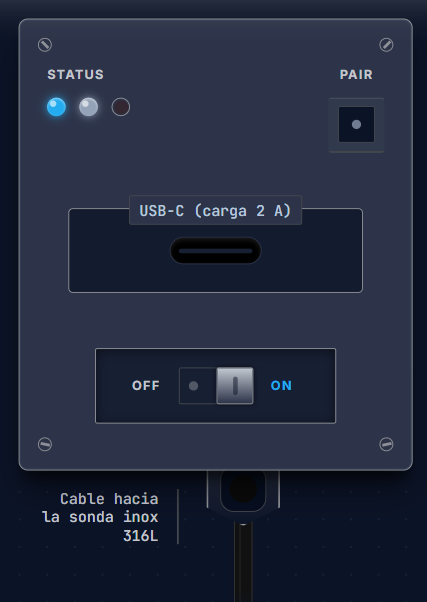

##### **Figura 2.3 “Representación Conceptual de Carcasa”**

La interfaz consta de luces indicadoras, un botón de muestreo y emparejamiento, un puerto USB-C de carga y un interruptor mecánico de encendido dimensionado para ser accionable incluso con guantes de trabajo pesados. Las luces comunican, mediante distintos patrones de encendido, los estados relevantes del equipo sin necesidad de abrir la aplicación:

| Estado Operativo | Indicador Activo | Patrón de Señalización | Significado Técnico |
| :---: | :---: | :---: | :---- |
| **Buscando conexión** | 🔵 Azul | Pulso suave (1 Hz) | Encendido, emitiendo *advertising* a la espera de un enlace BLE. |
| **Modo de emparejamiento** | 🔵 Azul | Parpadeo rápido (4 Hz) | Ventana de enlace abierta durante 30 s. |
| **Enlazado y listo** | 🟢 Verde | Iluminación fija | Conexión BLE establecida correctamente con el teléfono. |
| **Medición exitosa** | 🟢 Verde | Tres destellos rápidos | Lectura capturada y transmitida correctamente. |
| **Batería baja** | 🔴 Rojo | Pulso lento (0,5 Hz) | Tensión de batería bajo el umbral de aviso; requiere recarga por USB-C. |
| **Error de sonda** | 🔴 Rojo | Parpadeo rápido (2 Hz) | Fallo o tiempo de espera agotado en la comunicación Modbus. |

###### **Tabla 3.9 “Interfaz Hardware”**

Nótese que el patrón de error de sonda es distinto de cualquier indicación de resultado agronómico: la señalización física respeta la misma regla que la aplicación, según la cual un fallo de comunicación nunca se presenta como un diagnóstico del suelo.

**Aplicación Móvil y Motor de Razonamiento Agronómico:**

La aplicación está desarrollada con React Native, Expo y TypeScript. El motor agronómico y las definiciones de cultivos residen en código local; la persistencia utiliza almacenamiento local del dispositivo con estado administrado mediante Zustand. Corresponde precisar, frente a versiones anteriores del informe, que **no se implementa una base SQLite** en la versión revisada: la persistencia local existe y funciona, pero mediante otro mecanismo. Esta distinción importa porque describe con exactitud qué parte del sistema interpreta, cuál conserva una lectura y cuál solicita datos remotos.

El motor evalúa la medición contra una matriz de cultivos con umbrales declarados por especie:

| Cultivo | Temp. mínima | Temp. óptima | Rango de pH | CE máxima (µS/cm) | Observación agronómica |
| :---- | :---: | :---: | :---: | :---: | :---- |
| **Maíz grano / choclo** | 12,0 °C | 22,0 °C | 5,8 – 7,2 | 1.800 | Sensible al frío en germinación y a suelos fuertemente ácidos. |
| **Tomate de campo / invernadero** | 15,0 °C | 24,0 °C | 6,0 – 6,8 | 2.200 | Alta demanda de calcio y fósforo; no tolera anoxia radicular. |
| **Papa (tubérculo)** | 8,0 °C | 18,0 °C | 5,0 – 6,5 | 1.700 | Tolera suelos ligeramente ácidos; requiere suelo suelto y aireado. |
| **Trigo / cereales de invierno** | 4,0 °C | 16,0 °C | 6,0 – 7,5 | 2.500 | Resistente al frío; muy sensible a acidez extrema por toxicidad de aluminio. |
| **Lechuga, palto, vid y arándano** | Según especie | Según especie | Según especie | Según especie | Incluidos en la matriz; el arándano exige suelo ácido específico. |

###### **Tabla 4.0 “Matriz de Cultivos del Motor Agronómico”**

La interpretación de la humedad no es absoluta sino relativa a la textura del suelo declarada por el usuario, criterio que se apoya en la clasificación textural normalizada. Un 20 % de humedad volumétrica significa cosas opuestas en un suelo arenoso y en uno arcilloso, y el motor lo resuelve mediante cuatro umbrales por textura:

| Textura | Punto de marchitez | Umbral de riego | Capacidad de campo | Saturación |
| :---- | :---: | :---: | :---: | :---: |
| **Arenoso (suelto / ligero)** | 6,0 % | 10,0 % | 14,0 % | 30,0 % |
| **Franco (equilibrado)** | 12,0 % | 20,0 % | 28,0 % | 45,0 % |
| **Franco-arcilloso (pesado)** | 16,0 % | 25,0 % | 35,0 % | 52,0 % |
| **Arcilloso (muy pesado, drenaje lento)** | 20,0 % | 30,0 % | 42,0 % | — |

###### **Tabla 4.1 “Umbrales Hídricos por Textura de Suelo”**

Sobre esta base, la evaluación se ajusta además a una de las cuatro etapas fenológicas del ciclo productivo (pre-siembra, vegetativo, floración y cosecha), porque la misma lectura exige decisiones distintas según el momento del cultivo. El recorrido de uso completo en terreno es el siguiente:

##### **Figura 2.4 “Recorrido de Uso en Campo y Presentación del Diagnóstico”**

La presentación se organiza en tres páginas: grilla, diagnóstico y mapa. La grilla permite revisar las variables; el diagnóstico ordena los factores que explican el resultado y las recomendaciones; el mapa relaciona las lecturas georreferenciadas del recorrido. El semáforo se acompaña siempre de texto y explicación, de modo que el color no sea el único medio de comunicación, en línea con las pautas de accesibilidad adoptadas. Las decisiones se formulan como orientaciones cualitativas y cuantificadas hasta donde la evidencia lo permite: la aplicación **no** determina por sí sola litros exactos de lavado ni dosis de cal en kg/ha, porque hacerlo excedería lo que un instrumento de terreno puede sostener.

La ubicación es una ayuda para trazar el recorrido y no debe impedir guardar información útil: la app conserva también lecturas sin GPS, que quedan fuera de la representación cartográfica. Asimismo, el círculo dibujado alrededor de un punto en el mapa es un recurso de visualización y no demuestra que toda esa superficie tenga las mismas propiedades; debe diferenciarse del alcance físico de la sonda.

El guardado local antecede siempre al intento de envío. Cada medición recibe un identificador único de cliente (`client_uuid`) que se conserva al reintentar, y la cola se separa por cuenta de usuario. La operación remota utiliza ese identificador para evitar duplicación:

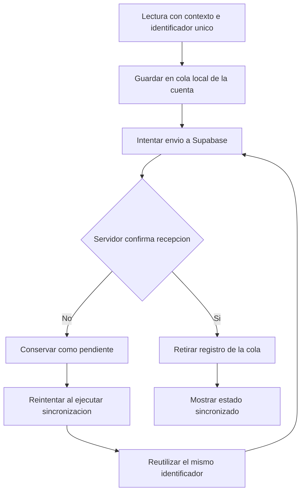

##### **Figura 2.5 “Persistencia Local y Sincronización Idempotente”**

Si falla internet, la lectura sigue pendiente; si el servidor confirma recepción, se retira de la cola. El código incluye estos mecanismos de sincronización, pero no se afirma que una aplicación cerrada mantenga un servicio continuo en segundo plano en cualquier teléfono, porque el comportamiento depende del sistema operativo y del fabricante.

**Estado de Integración del BME280 y del Pronóstico:**

Corresponde declarar con precisión qué parte de esta arquitectura está construida y qué parte constituye trabajo de integración identificado. El BME280 permanece obligatorio en el diseño y en los costos; lo que sigue registra el estado del código para guiar la implementación:

| Función | Estado en el código revisado | Integración requerida |
| :---- | :---- | :---- |
| Suelo por BLE | Decodificador de 16 bytes implementado | Contrastar con el firmware y la ficha de la sonda adquirida |
| Ambiente local | La trama actual no contiene los tres campos | Adquisición I²C, versión e identidad de captura, y transporte BLE |
| Grilla 3×3 | Siete registros de suelo, temperatura de API y lluvia del día | Reorganizar según la Tabla 1.1, agrupando N/P/K y reservando tres celdas al BME280 |
| Guardado ambiental | La temperatura procede del servicio climático; la humedad queda nula | Separar el origen de la temperatura, añadir presión y persistir validez y fecha |
| Pronóstico | Solicita `forecast_days=2` y utiliza el primer elemento diario | Consumir los cinco días siguientes con fechas locales y datos completos |
| Fallo de red | El servicio devuelve valor nulo | Mantener la lectura local y distinguir "pronóstico no disponible" de "sin dato" |

###### **Tabla 4.2 “Estado de Integración del BME280 y del Pronóstico”**

El contrato ambiental deberá representar temperatura con signo, humedad relativa, presión local, instante de captura y estado del sensor. La estructura de almacenamiento debe mantener el origen del dato: el campo ambiental de una medición no puede conservar indistintamente un valor del BME280 y uno de un modelo meteorológico sin informar esa diferencia, y también deben revisarse exportación, historial y mapa para que la distinción sobreviva al guardado. Respecto del horizonte, la integración debe verificar si el proveedor incluye el día actual en su respuesta y solicitar suficientes fechas para completar los cinco días posteriores a la lectura; para cada día se necesitan fecha, precipitación prevista y temperaturas extremas, mostrando como no disponibles los valores faltantes. La recomendación debe conservar qué pronóstico se utilizó, evitando que una actualización futura cambie el significado histórico de una lectura guardada.

##### **Figura 2.6 “Decisión Agronómica Local Complementada por Pronóstico”**

**Carcasa del Dispositivo:**

Aislada de la interfaz de usuario, la envolvente física se enfoca en la estanqueidad, la durabilidad y la integración de los sensores en entornos agrícolas agresivos.

* **Material y Estructura:** La carcasa se fabrica en PETG mediante impresión 3D FDM contratada como servicio externo. A diferencia del PLA o el ABS, el PETG resiste mejor la intemperie y la radiación UV. La rigidez frente a caídas sobre gravilla se busca mediante un relleno del 40–60 %, mientras la estanqueidad depende de la configuración de perímetros sólidos (≥ 4 capas, altura de 0,16–0,20 mm). Debe señalarse que la selección del material **no demuestra por sí sola** resistencia UV, estanqueidad ni tolerancia a caídas: influyen el filamento concreto, la orientación de capas, la geometría y el acabado, factores que deben evaluarse con la pieza fabricada.

**Sellado de Componentes:**

* **Junta Principal:** un *O-ring* de silicona comprimido de forma controlada mediante insertos roscados M3 entre la tapa y el cuerpo.  
* **Salida de Sonda:** el cable hacia la sonda de suelo emplea un prensaestopas industrial M12 en la base, que actúa como sellado y alivio de tracción; sin él, cualquier tirón transmitiría el esfuerzo mecánico directamente a las soldaduras de la PCB.

**El requisito opuesto: ventilación del sensor ambiental.** El diseño mecánico debe resolver simultáneamente dos exigencias contradictorias. El instrumento debe proteger la electrónica del agua y el barro, pero el BME280 necesita intercambio con el aire exterior para medir aquello que justifica su inclusión. Se resuelve mediante un alojamiento ventilado y protegido, apartado del ESP32, de los reguladores, del circuito de carga y del calor de la mano del operador. Sellar el sensor con resina o encerrarlo en una cámara sin intercambio invalidaría su lectura. La BOM presupuesta $6.000 netos de impresión del conjunto y $1.500 de fijaciones, juntas, prensaestopas y respiradero.

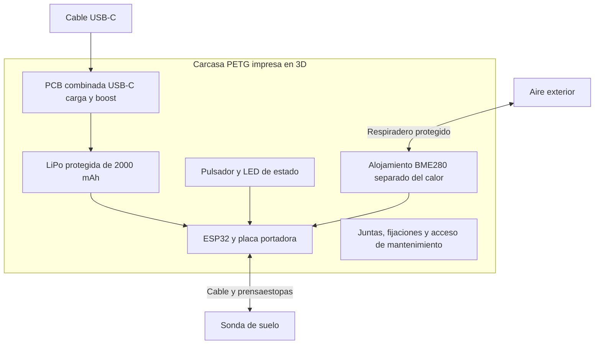

##### **Figura 2.7 “Distribución Funcional de la Carcasa”**

*(Esquema funcional, sin escala ni dimensiones de fabricación.)*

**Mantenimiento y reparabilidad.** El diseño debe permitir sustituir la batería, el módulo ambiental o una pieza de carcasa sin desechar el instrumento completo. Para ello se priorizan tornillos sobre uniones permanentes, conectores identificados y alivio de tracción. La documentación de montaje debe señalar polaridades, pares de apriete cuando corresponda y el procedimiento de comprobación después de abrir el equipo. Reparabilidad, precisión ambiental y protección mecánica son tres requisitos que deben resolverse en conjunto, porque optimizar cualquiera de ellos por separado perjudica a los otros dos.

**Criterios de Eficiencia Energética y Digitalización:**

Toda la ingeniería de energía del equipo se reduce a una sola regla, declarada de forma explícita y aplicada sin excepción a cada decisión de diseño, desde la elección del microcontrolador hasta el tipo de LED montado en el panel: 

***Toda energía que el instrumento consume fuera del instante de medición es energía desperdiciada, y esa energía desperdiciada se paga dos veces: en autonomía perdida para el usuario y en batería adicional que hay que comprar.*** 

Esta regla es la que explica, con hilo conductor, las decisiones de hardware adoptadas: por qué el equipo no lleva pantalla, por qué existe un MOSFET dedicado solo a cortar la alimentación de la sonda y por qué se prefirieron LEDs por sobre otros métodos de alerta o guía para el usuario.

**Digitalización del Proceso Agrícola:** El segundo eje de este criterio es la digitalización del proceso de toma de decisiones en terreno. TerraSense transforma un proceso hoy manual y no trazable —la estimación visual, la memoria del agricultor o, en el mejor de los casos, un cuaderno de papel— en un flujo digital estructurado: cada medición queda georreferenciada, con marca de tiempo y sincronizada a una base histórica consultable. Esta digitalización habilita capacidades imposibles bajo el modelo análogo: comparar la evolución de un mismo punto del predio entre temporadas, generar mapas de salud edáfica agregados por cooperativa o territorio, y exportar reportes estandarizados para asesorías técnicas o postulaciones a programas de fomento. El agricultor pasa de "estimar" a "medir y registrar", cerrando la brecha de datos que hoy impide a instituciones públicas y privadas focalizar sus políticas de apoyo al sector. 

**Arquitectura de la Gestión Eficiente de Energía:**

El rendimiento real lo dictan componentes básicos implementados estratégicamente. La sonda y sus circuitos de soporte, el elevador de tensión y el transceptor RS-485 no permanecen alimentados de forma continua: un MOSFET controlado directamente por el microcontrolador actúa como interruptor electrónico que corta ese consumo salvo durante los segundos exactos en que se toma una lectura. Sin este corte, el consumo de reposo del elevador y del transceptor sumaría entre 350 y 500 µA de forma continua, una cifra que por sí sola excedería en un orden de magnitud el presupuesto de reposo del resto del sistema. Este MOSFET cuesta menos de $1.000 CLP y es, proporcionalmente, la mejor inversión electrónica del diseño.

Sin embargo, el componente que más autonomía aporta no es electrónico, sino mecánico: el interruptor que permite al usuario apagar el equipo por completo en lugar de dejarlo emitiendo *advertising* Bluetooth de forma permanente. La diferencia entre un equipo apagado y uno en publicidad continua es de varios órdenes de magnitud en consumo, y la determina una pieza de menos de $1.000 CLP.

**Los Estados de Consumo:**

El equipo no tiene un único nivel de consumo, sino que transita entre estados bien delimitados. Dado que el dispositivo pasa la mayor parte de su vida útil en reposo, el diseño se enfoca en gestionar estas transiciones y en acotar el tiempo que permanece conectado:

| Estado | Qué permanece activo | Medida de diseño |
| :---- | :---- | :---- |
| **Almacenamiento** | Circuitos no desconectados por el interruptor y autodescarga de la celda | Identificar rutas reales de consumo y verificar el método de apagado |
| **Reposo** | Control, regulación y periféricos retenidos | Medir la corriente del conjunto; revisar LED de alimentación y puente USB-UART |
| **Publicidad y conexión** | Radio BLE y control | Ventanas acotadas de *advertising* y reintento controlado |
| **Medición** | Sonda, interfaces RS-485 y lectura ambiental | Habilitar solo durante estabilización y adquisición |
| **Entrega y espera** | Comunicación y procesamiento | Confirmar envío y regresar al estado de menor consumo |
| **Carga** | Circuito USB-C y celda | Verificar corriente, temperatura y efecto del calor sobre la lectura ambiental |

###### **Tabla 4.3 “Estados Energéticos y Medidas de Diseño”**

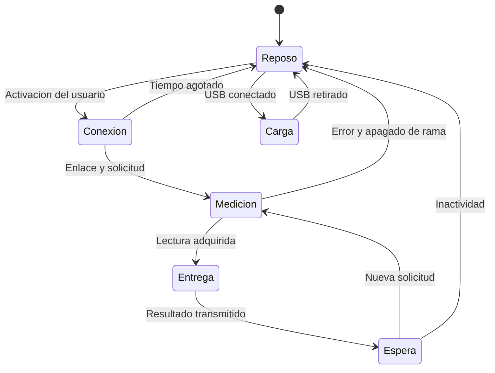

##### **Figura 2.8 “Estados Energéticos del Instrumento”**

**Modelo de Consumo por Ciclo de Medición:**

Cada vez que el usuario dispara una lectura, el equipo recorre tres fases consecutivas. Las corrientes que siguen son **valores supuestos en batería para explicar el método**, no resultados de ensayo sobre la placa de desarrollo:

| Fase Operativa | Sistemas Activos | Corriente | Duración | Carga por ciclo |
| :---: | :---- | :---: | :---: | :---: |
| **1. Publicidad y conexión** | Radio BLE y control | 40 mA | 12 s | 0,1333 mAh |
| **2. Adquisición del conjunto** | Elevador \+ sonda \+ transceptor \+ BME280 \+ ESP32 | 95 mA | 3 s | 0,0792 mAh |
| **3. Envío del resultado** | ESP32 transmitiendo | 60 mA | 1 s | 0,0167 mAh |
| **Total por ciclo** | — | Variable | **16 s** | **0,2292 mAh** |

###### **Tabla 4.4 “Fases de Operación y Consumo Energético”**

La relación utilizada es `Q_ciclo = Σ(I_mA × t_s) / 3.600`. A 3,7 V nominales, ese ciclo equivale a unos 0,848 mWh. Debe señalarse que la duración real de estabilización de la sonda y del sensor ambiental se determina experimentalmente: una lectura de tres segundos no garantiza por sí sola el equilibrio térmico del BME280. También conviene precisar que, al medir en batería, no debe volver a añadirse la eficiencia de conversión, pues ya está reflejada en la corriente registrada; si se parte de consumos por riel, en cambio, deben convertirse mediante `I_batería = Σ(V_riel × I_riel / eficiencia) / V_batería`.

**Sensibilidad al Consumo de Reposo:**

Aquí está la corrección más importante de este capítulo respecto de versiones anteriores del informe. El ciclo de medición no es lo que determina la autonomía: la determina el consumo entre mediciones. El siguiente ejercicio utiliza diez capturas diarias, cinco minutos adicionales de espera BLE a 18 mA, una capacidad útil supuesta de 1.600 mAh y una pérdida diaria simplificada por autodescarga de 1,3333 mAh (2 % mensual sobre 2.000 mAh):

| Reposo total supuesto | Consumo diario calculado | Cociente capacidad útil / consumo diario |
| :---: | :---: | :---: |
| **0,1 mA** | 7,51 mAh/día | 213,0 días |
| **1,0 mA** | 29,00 mAh/día | 55,2 días |
| **5,0 mA** | 124,49 mAh/día | 12,9 días |

###### **Tabla 4.5 “Efecto del Consumo de Reposo sobre la Autonomía”**

La comparación muestra por qué el reposo de la placa completa es decisivo: el mismo ciclo de lectura produce resultados que difieren en un factor de dieciséis al cambiar únicamente la corriente entre capturas. Por esta razón **se retiran expresamente de este informe las autonomías declaradas en versiones anteriores** —784 días en régimen estándar, 8 a 12 meses comerciales y "más de 2.000 mediciones reales"—. Aquellas cifras procedían de un banco de 6.000 mAh que ya no forma parte del diseño y de un presupuesto de reposo que nunca se midió sobre el conjunto ensamblado. La autonomía se publicará después de integrar el consumo medido con perfiles de uso, temperatura y reconexión, y no antes; declararla ahora sería exactamente el tipo de afirmación que este informe se propone evitar y que, además, expondría al proyecto a un incumplimiento frente a la normativa de publicidad no engañosa.

**Sostenibilidad Ambiental y Análisis Competitivo:**  
Al comparar el sistema contra los estándares de la industria, el proyecto enfrenta con honestidad las diferencias de arquitectura. Las referencias siguientes son dos casos puntuales documentados y no una descripción exhaustiva del mercado:

| Equipo | Fuente de energía especificada | Recambio y continuidad operativa | Parámetros medidos |
| :---: | :---- | :---- | :---- |
| **Bluelab Pulse** | 1 pila AA alcalina | Sustituir la pila agotada; conviene disponer de repuesto | 3 (conductividad, humedad y temperatura), con app |
| **Hanna HI9814** | 3 pilas AAA de 1,5 V | Sustituir el juego completo; ~600 horas de uso continuo declaradas | 4 (pH, EC, TDS y temperatura), en soluciones hidropónicas |
| **TerraSense**  | 1 celda LiPo recargable de 2.000 mAh, carga USB-C | Recargar la misma celda; sustituirla al degradarse | 7 registros de suelo \+ 3 ambientales, con interpretación agronómica móvil |

###### **Tabla 4.6 “Análisis Comparativo de Parámetros”**

TerraSense busca reducir el recambio habitual de pilas primarias al recuperar la carga de la misma celda durante muchos ciclos de uso, lo que para el agricultor significa menos compras de repuestos y la posibilidad de cargar el equipo antes de una jornada mediante USB-C. Conviene reconocer, sin embargo, la ventaja operativa que conservan las pilas intercambiables: permiten reanudar el trabajo de inmediato con un repuesto, mientras que la batería integrada obliga a planificar la carga y a asegurar acceso a energía.

Este informe retira además dos afirmaciones de la versión anterior. La primera es la métrica de "44 % menos energía por parámetro entregado": dividir energía por cantidad de parámetros favorece artificialmente a una sonda que entrega varios registros derivados de una misma señal, y por lo tanto no demostraba un beneficio comparable. La segunda es la distinción retórica entre llamar "sustentable" a un competidor y "sostenible" a TerraSense; la diferencia demostrable es concreta y no necesita adjetivos: pila primaria reemplazable frente a batería recargable, junto con las condiciones de reparación y vida útil del equipo.

Tampoco corresponde afirmar que una batería recargable produce residuos cero. Su fabricación, envejecimiento, reemplazo, electrónica de carga y disposición final forman parte del ciclo de vida; tanto las pilas agotadas como la celda LiPo retirada requieren gestión adecuada y no eliminación en la basura común. La Ley N° 20.920 identifica pilas, baterías y aparatos eléctricos y electrónicos dentro del marco de productos prioritarios \[9\], y el diseño responde a ello facilitando la separación de componentes y un canal de gestión al fin de la vida útil. La ventaja ambiental real del proyecto es reducir el flujo de pilas desechables y permitir la reparación por módulos, no eliminar el impacto.

Para sostener estas afirmaciones con evidencia en lugar de con declaraciones, se definen los indicadores que el proyecto se compromete a medir:

| Indicador | Forma de registro | Decisión que permite tomar |
| :---- | :---- | :---- |
| Energía por captura completa | Integración de potencia en batería y tiempo de sesión | Optimizar conexión, adquisición y entrega |
| Capacidad útil y degradación | Ensayos de ciclos y temperatura | Definir reemplazo y condiciones de uso |
| Reparación por módulo | Tiempo, piezas y resultado de la intervención | Reducir el descarte del equipo completo |
| Rechazo de impresión 3D | Masa de material y piezas fallidas por lote | Ajustar diseño y proceso de carcasa |
| Gestión al final de la vida útil | Baterías y electrónica recibidas y derivadas | Respaldar el compromiso ambiental con datos |

###### **Tabla 4.7 “Indicadores Ambientales y de Servicio a Medir”**

**Condiciones Técnicas y Normativas Respecto al Diseño:**

El marco regulatorio aplicable al proyecto TerraSense organiza su cumplimiento normativo en seis dominios fundamentales: hardware y seguridad eléctrica, radiofrecuencia y telecomunicaciones, buses industriales, estándares edafológicos, protección de datos y accesibilidad, y protección al consumidor. 

**Hardware:**

* **IEC 60529 \[10\]:** Define y clasifica los grados de protección proporcionados por las envolventes. El proyecto adopta **IP67 como objetivo de diseño** (estanco al polvo e inmersión a 1 metro durante 30 minutos), materializado mediante una envolvente en PETG con sellado intercapa, *O-ring* de silicona y prensaestopas M12. Debe precisarse un punto que la versión anterior del informe presentaba de forma incorrecta: **la norma no obliga a que un medidor agrícola sea IP67**, sino que permite clasificar la protección conforme al ensayo aplicable. Un *O-ring*, un tipo de filamento o una certificación del módulo de radio no acreditan automáticamente el equipo terminado. La clasificación solo podrá declararse tras el ensayo de ingreso de polvo y agua sobre el producto final, ensayo que además debe compatibilizarse con el respiradero que el sensor ambiental exige.  
* **UN 38.3 / IEC 62133-2 \[11\]:** Corresponden a ámbitos distintos y complementarios: IEC 62133-2 rige la seguridad de las celdas de ion-litio secundarias, mientras UN 38.3 define los ensayos exigibles para su transporte. El diseño lo aborda integrando una celda comercial con certificación de origen y protección electrónica incorporada, y exige reunir la documentación de la celda además de revisar la configuración de entrega del producto.  
* **RoHS 2011/65/EU y RoHS 3 (2015/863):** Restringe el uso de metales pesados en la electrónica. El proyecto exige el uso de soldadura sin plomo (aleación SAC305) y componentes con declaración de conformidad del proveedor.  
* **Ley N° 20.920 (Ley REP, Chile) \[9\]:** Establece la responsabilidad extendida del productor sobre residuos prioritarios, incluyendo pilas, baterías y aparatos eléctricos y electrónicos. Se responde mediante un diseño desmontable con herramientas comunes y celda extraíble, requiriendo habilitar un canal de recepción al fin de la vida útil del equipo y revisar las obligaciones concretas que apliquen al volumen de comercialización.

**Radiofrecuencia y Telecomunicaciones:**

* **Régimen de equipos de alcance reducido, SUBTEL \[12\]:** Norma técnica chilena para equipos que operan en bandas de uso libre. El enlace Bluetooth del proyecto opera a +9 dBm (equivalentes a unos 8 mW radiados), muy por debajo de los límites del régimen exento de licencia. Corresponde precisar que **la potencia radiada no equivale a la potencia consumida en bornes de batería** y que sus límites no deben confundirse entre sí.  
* **Actualización del régimen de certificación \[13\]:** SUBTEL mantiene un procedimiento vigente desde febrero de 2026 para equipos de alcance reducido. Su revisión debe realizarse sobre la configuración final del producto y la documentación exigible, **sin considerar una certificación FCC o CE como sustituto universal de los requisitos chilenos**. Este trámite queda declarado como pendiente de verificación formal antes del lanzamiento comercial.  
* **FCC, Título 47 CFR Parte 15, subpartes B y C \[14\]:** Límites de emisiones para dispositivos no licenciados. El proyecto parte de una posición favorable al utilizar el módulo ESP32-WROOM-32, pre-certificado con FCC ID 2AC7Z-ESPWROOM32; esa certificación cubre el módulo, no el equipo terminado.

**Buses Industriales:**

* **TIA/EIA-485-A \[15\]:** Define los niveles eléctricos y la terminación de un bus diferencial multipunto. Es el fundamento técnico-normativo para elegir RS-485 sobre I²C para la comunicación cableada en terreno, y determina los requisitos de polaridad A/B, referencia de masa, terminación y limitación de transitorios que el esquema debe resolver.  
* **Modbus Application Protocol Specification V1.1b3 \[16\]:** Rige la estructura de la comunicación, definiendo la función 0x03 (lectura de registros *holding*), el mecanismo de verificación CRC-16 y los tiempos de silencio exigidos entre tramas con la sonda de suelo. Estas verificaciones son las que permiten distinguir formalmente un error de comunicación de una lectura agronómica crítica.

**Estándares Edafológicos:**

* **ISO 10390:** Método de referencia para la determinación de pH en suelo. Fundamenta la interpretación de la lectura de pH y su contraste contra laboratorio.  
* **ISO 11265 \[17\]:** Método de referencia para la conductividad eléctrica específica del suelo. Fundamenta la normalización de la lectura de CE a 25 °C, aplicando un coeficiente térmico de 2 %/°C.  
* **ISO 11277 \[18\]:** Método de granulometría y textura. Actúa como base para la clasificación textural declarada por el usuario en la aplicación móvil, que alimenta los umbrales hídricos de la Tabla 4.1.  
* **Métodos oficiales SAG / INIA:** Criterios de interpretación agronómica nacional utilizados para calibrar los umbrales de la matriz de cultivos. La validación instrumental debe especificar método de referencia, profundidad y condición de humedad, reconociendo que una comparación entre lectura directa en terreno y extracto de laboratorio no evalúa exactamente el mismo procedimiento.

**Datos, Seguridad de la Información y Accesibilidad:**

* **Ley N° 19.628 y Ley N° 21.719 (Protección de Datos Personales, Chile) \[19\]:** Exigen consentimiento y garantizan derechos del titular. La **Ley N° 21.719 entra en vigor el 1 de diciembre de 2026**, por lo que el proyecto debe diseñarse directamente bajo ese marco y no bajo el régimen anterior. A nivel de arquitectura se aplica Seguridad a Nivel de Fila (*Row Level Security*) en la base de datos, garantizando aislamiento estricto por predio y rol, y los datos son exportables por el usuario. Corresponde precisar que el uso de RLS y autenticación ayuda a controlar accesos pero **no resuelve por sí solo todas las obligaciones de tratamiento**: deben definirse finalidad, información al titular, plazos de conservación, ejercicio de derechos y alojamiento de datos, con especial atención a la georreferenciación de predios, que constituye información sensible para el productor.  
* **ISO/IEC 27001:2022 e ISO/IEC 25010 \[20\]:** El desarrollo de la plataforma se rige por cifrado en tránsito (TLS) y en reposo, control de acceso segmentado y criterios internacionales de fiabilidad, usabilidad y mantenibilidad de software.  
* **WCAG 2.1, nivel AA \[21\]:** Pautas de accesibilidad digital implementadas en la app: área táctil mínima de 48×48 dp, contraste mínimo de 4,5:1 y prohibición del uso del color como único portador de información, razón por la cual el semáforo de diagnóstico siempre se acompaña de texto explicativo.

**Protección al Consumidor:**

* **Ley N° 21.398 ("Pro Consumidor") \[22\]:** Extiende la garantía legal a 6 meses y obliga a informar la vida útil y la disponibilidad de repuestos. A nivel de negocio, el proyecto incorpora una provisión del 5 % del costo de materiales para atender esta garantía —cuantificada en $4.059 por unidad en la Tabla 2.3— y asume el compromiso de mantener *stock* de partes, coherente con el diseño desmontable de la carcasa.  
* **Ley N° 19.496 \[23\]:** Prohíbe la publicidad engañosa. Constituye la barrera normativa formal por la cual el proyecto declara el equipo comercialmente como "diseñado conforme a IP67" en lugar de "certificado IP67" hasta que los laboratorios documenten el ensayo final, y por la cual **no se publicará cifra alguna de autonomía** hasta disponer de la medición sobre el equipo completo. Ambas restricciones son, antes que una exigencia legal, una decisión de honestidad técnica del proyecto.

**Criterios de Cierre Técnico:**

Para cerrar este capítulo corresponde declarar con precisión qué separa el diseño actual de un producto verificado. El archivo de PCB en KiCad no contiene todavía una placa ruteada y el repositorio no incluye el código fuente del firmware del ESP32; la existencia de un esquema, de un decodificador o de un diagrama no sustituye el cierre técnico. Ese cierre requiere que la cadena completa produzca capturas verificables y que el montaje coincida con los componentes presupuestados:

| Área | Comprobación propuesta | Evidencia que se conservará |
| :---- | :---- | :---- |
| **Sonda y Modbus** | Ficha, tensión, mapa de registros y respuestas ante fallo | SKU adquirido, capturas seriales y casos de prueba |
| **BME280** | Tres lecturas locales y respuesta dentro de la carcasa | Capturas I²C, referencia ambiental y disposición física |
| **BLE** | Versión, identidad de captura, escalas y reconexión | Paquetes capturados y comparación app/instrumento |
| **Aplicación** | Contexto de cultivo, grilla, datos faltantes y pronóstico | Casos de uso y pruebas por escenario |
| **Persistencia** | Sin GPS, sin red, reintento y cambio de cuenta | Registros locales y remotos conciliados |
| **Energía** | Corriente desde batería por estado y temperatura | Perfiles medidos y cálculo de carga por jornada |
| **Carcasa** | Montaje, acceso, ventilación, caída y sellado | CAD, proceso, fotografías y resultados de ensayo |
| **Producción** | Montaje y pruebas repetibles por equipo | Tiempo por operación, rechazo y retrabajo |

###### **Tabla 4.8 “Criterios de Cierre Técnico y Evidencia”**

6. #### **Conclusiones**

El desarrollo conceptual y la evaluación del proyecto TerraSense demuestran que es factible democratizar la tecnología agrícola sin sacrificar rigor técnico ni rentabilidad comercial. Desde la perspectiva ingenieril, la arquitectura seleccionada —un nodo portátil de captura basado en ESP32, sonda industrial RS-485, sensor ambiental BME280 y batería de litio recargable, que transfiere los datos al smartphone del usuario— resuelve de forma efectiva la barrera de adopción tecnológica. Su adecuación al recorrido de terreno proviene precisamente de esa distribución de funciones: el operador puede muestrear distintos puntos, revisar las causas del diagnóstico y conservar los antecedentes de la visita, sin depender de cobertura celular durante la medición. La comparación técnica reconoce, además, que estaciones fijas, redes LoRaWAN y conexiones cableadas resuelven de forma válida otros requerimientos; la elección de este proyecto responde al problema que declaró resolver, no a una supuesta superioridad universal.

El sensor ambiental BME280 ocupa una función central y claramente distinta de la API meteorológica. Temperatura del aire, humedad relativa y presión barométrica completan el tercio ambiental local de la grilla 3×3, mientras el pronóstico de cinco días complementa la planificación posterior y permite recomendar la revisión de una fecha de siembra ante lluvia o calor previstos. La reorganización propuesta de la grilla evita confundir nueve tarjetas con diez registros de sensores y conserva el carácter estrictamente informativo de los valores N/P/K, que se derivan de la conductividad eléctrica y no de una determinación química independiente.

La implementación de un diseño energético estricto, basado en *power gating* para cortar físicamente la alimentación de la rama de medición en reposo, sigue siendo la decisión correcta y la de mejor relación costo-beneficio del hardware. Corresponde sin embargo declarar con claridad lo que este informe corrige: la autonomía del equipo **no se declara** hasta medirla desde la batería con el conjunto completo, incluyendo el reposo real de la placa de desarrollo. Las cifras anteriores de 784 días y de 8 a 12 meses fueron calculadas sobre un banco de 6.000 mAh que ya no forma parte del diseño y sobre un presupuesto de reposo nunca ensayado. La ventaja ambiental frente a los instrumentos alimentados por pilas primarias es real —recarga de la misma celda por USB-C, carcasa desmontable y reparación por módulos— pero se sostiene en esas características concretas y en los indicadores comprometidos para medirlas, no en la eliminación total del impacto.

Desde el punto de vista financiero, el proyecto se sostiene como un modelo de negocio viable y auditable, aun proyectando un escenario de introducción de mercado conservador de 200 unidades el primer año.

<!-- INFORME:CIERRE:INICIO -->

En el escenario base, el proyecto presenta **VAN de $15.504.053**, **TIR efectiva anual de 35,43 %** y **payback simple de 34,61 meses**. La BOM completa asciende a **$81.184 netos por equipo**, con BME280 y carcasa 3D. El análisis mensual identifica el financiamiento de arranque y permite relacionar margen, producción, inventario y pagos de deuda con las decisiones comerciales.

<!-- INFORME:CIERRE:FIN -->

Ese nivel de detalle mensual, que una proyección anual agregada no habría revelado, expone las dos tensiones que el proyecto debe administrar y que este informe no oculta: el DSCR del primer año es de 0,69 y el equilibrio con deuda (205 unidades) supera ligeramente la meta de ventas, de modo que el arranque exige mantener íntegra la reserva de liquidez; y la sensibilidad muestra que no existe holgura alguna sobre el precio de venta, que constituye un techo estratégico y no un punto de negociación.

En síntesis, TerraSense cumple con éxito su objetivo general: lograr que una medición física se convierta, en el mismo lugar, en una decisión agronómica correcta. Al eliminar los costos recurrentes y transformar valores numéricos planos en instrucciones de manejo claras, el proyecto mitiga el riesgo de pérdida de cosechas, protege el patrimonio familiar del pequeño productor y fomenta la resiliencia hídrica del sector agrícola nacional. El resultado económico y el diseño técnico convergen en una misma decisión: construir una herramienta útil que pueda fabricarse, mantenerse y respaldarse con el margen presupuestado. Los próximos cierres se concentran en la integración ambiental de extremo a extremo, en la consulta del horizonte climático correcto y en los ensayos del conjunto ensamblado, trabajos que este informe deja identificados con su evidencia esperada precisamente para que puedan ejecutarse y defenderse.

7. #### **Referencias bibliográficas**

1. Instituto Nacional de Estadísticas (INE), Chile. (2021). Censo Agropecuario y Forestal 2021\. Resultados finales, gráficas nacionales. Recuperado de [https://www.ine.gob.cl/censoagropecuario/resultados-finales/graficas-nacionales](https://www.ine.gob.cl/censoagropecuario/resultados-finales/graficas-nacionales)  
2. ODEPA. (2021). Censo Agropecuario y Forestal 2021: distribución de las unidades productivas y sus cambios respecto al Censo 2007\. Recuperado de [https://www.odepa.gob.cl/publicaciones/articulos/censo-agropecuario-y-forestal-2021-distribucion-de-las-unidades-productivas](https://www.odepa.gob.cl/publicaciones/articulos/censo-agropecuario-y-forestal-2021-distribucion-de-las-unidades-productivas)  
3. INDAP. (s.f.). Agricultura Familiar Campesina. Recuperado de [https://www.indap.gob.cl/agricultura-familiar-campesina](https://www.indap.gob.cl/agricultura-familiar-campesina)  
4. Centro de Ciencia del Clima y la Resiliencia (CR)². (s.f.). Informe a la Nación: La mega sequía 2010–2015 una lección para el futuro. [Recuperado de https://www.cr2.cl/megasequia/](https://www.cr2.cl/megasequia/)  
5. ODEPA. (s.f.). Boletín macroeconómico y evolución reciente de los precios de los fertilizantes. Recuperado de [https://www.odepa.gob.cl/publicaciones/articulos/evolucion-reciente-de-los-precios-de-los-fertilizantes](https://www.odepa.gob.cl/publicaciones/articulos/evolucion-reciente-de-los-precios-de-los-fertilizantes)  
6. Bluelab. (s.f.). Pulse Multimedia EC/MC Meter y preguntas frecuentes sobre energía y uso. Recuperado de [https://support.bluelab.com/bluelab-pulse-meter-faq](https://support.bluelab.com/bluelab-pulse-meter-faq)  
7. Hanna Instruments. (s.f.). GroLine HI9814. Precio de referencia US$294. Recuperado de [https://hannainst.com/groline-waterproof-portable-ph-ec-tds-meter/](https://hannainst.com/groline-waterproof-portable-ph-ec-tds-meter/)  
8. Spectrum Technologies. (s.f.). FieldScout TDR 350\. Precio de referencia US$1.495. Recuperado de [https://www.specmeters.com/FieldScout-TDR350-Soil-Moisture-Meter](https://www.specmeters.com/FieldScout-TDR350-Soil-Moisture-Meter)  
9. Ministerio del Medio Ambiente. (2016). Ley N° 20.920: Marco para la gestión de residuos, la responsabilidad extendida del productor y fomento al reciclaje (REP). Recuperado de [https://www.bcn.cl/leychile/Navegar?idNorma=1090894](https://www.bcn.cl/leychile/Navegar?idNorma=1090894)   
10. International Electrotechnical Commission (IEC). (s.f.). *IEC 60529: Degrees of protection provided by enclosures (IP Code)*. Recuperado de [https://webstore.iec.ch/publication/2452](https://webstore.iec.ch/publication/2452)  
11. Organización de las Naciones Unidas (ONU) / IEC. (s.f.). *UN 38.3 / IEC 62133-2: Ensayos de transporte y seguridad de celdas y baterías secundarias de ion-litio*. Recuperado de [https://webstore.iec.ch/publication/60070](https://webstore.iec.ch/publication/60070)  
12. Subsecretaría de Telecomunicaciones (SUBTEL). (s.f.). *Equipos de alcance reducido: procedimiento vigente*. Recuperado de [https://www.subtel.gob.cl/equipos-de-alcance-reducido/](https://www.subtel.gob.cl/equipos-de-alcance-reducido/)  
13. Subsecretaría de Telecomunicaciones (SUBTEL). (2025). *Resolución N° 737: Actualización del régimen de certificación de equipos de telecomunicaciones, vigente desde febrero de 2026*. Recuperado de [https://www.subtel.gob.cl/](https://www.subtel.gob.cl/)  
14. Federal Communications Commission (FCC). (s.f.). *Título 47 CFR Parte 15, subpartes B y C*. Recuperado de [https://www.ecfr.gov/current/title-47/chapter-I/subchapter-A/part-15](https://www.ecfr.gov/current/title-47/chapter-I/subchapter-A/part-15)  
15. Telecommunications Industry Association (TIA). (1998). *Norma TIA/EIA-485-A: Características eléctricas de los generadores y receptores para su uso en sistemas multipunto digitales balanceados*. Recuperado de [https://global.ihs.com/](https://global.ihs.com/)  
16. Modbus Organization. (2006). *Modbus over Serial Line Specification and Implementation Guide V1.02 y Modbus Application Protocol Specification V1.1b3*. Recuperado de [https://www.modbus.org/file/secure/modbusoverserial.pdf](https://www.modbus.org/file/secure/modbusoverserial.pdf)  
17. Organización Internacional de Normalización (ISO). (1994). *ISO 11265: Calidad del suelo — Determinación de la conductividad eléctrica específica*. Recuperado de [https://www.iso.org/standard/19243.html](https://www.iso.org/standard/19243.html)  
18. Organización Internacional de Normalización (ISO). (2009). *ISO 11277: Calidad del suelo — Determinación de la distribución del tamaño de partícula en material de suelo mineral (granulometría y textura)*. Recuperado de [https://www.iso.org/standard/54151.html](https://www.iso.org/standard/54151.html)  
19. Ministerio Secretaría General de la Presidencia. (1999 y 2024). *Ley N° 19.628 sobre Protección de la Vida Privada y Ley N° 21.719 sobre protección y tratamiento de datos personales, vigente desde el 1 de diciembre de 2026*. Recuperado de [https://www.bcn.cl/leychile/Navegar?idNorma=1209272](https://www.bcn.cl/leychile/Navegar?idNorma=1209272)  
20. Organización Internacional de Normalización (ISO) / IEC. (2022). *ISO/IEC 27001:2022 (Sistemas de gestión de seguridad de la información) e ISO/IEC 25010 (Calidad de software)*. Recuperado de [https://www.iso.org/standard/27001.html](https://www.iso.org/standard/27001.html)  
21. World Wide Web Consortium (W3C). (2018). *Web Content Accessibility Guidelines (WCAG) 2.1, nivel AA*. Recuperado de [https://www.w3.org/TR/WCAG21/](https://www.w3.org/TR/WCAG21/)  
22. Ministerio de Economía, Fomento y Turismo. (2021). *Ley N° 21.398 ("Pro Consumidor")*. Recuperado de [https://www.bcn.cl/leychile/navegar?idNorma=1170464](https://www.bcn.cl/leychile/navegar?idNorma=1170464)  
23. Ministerio de Economía, Fomento y Turismo. (1997). *Ley N° 19.496: Establece normas sobre protección de los derechos de los consumidores*. Recuperado de [https://www.bcn.cl/leychile/navegar?idNorma=61438](https://www.bcn.cl/leychile/navegar?idNorma=61438)  
24. Espressif Systems. (s.f.). *ESP32-WROOM-32E / ESP32-WROOM-32UE Datasheet*. Recuperado de [https://documentation.espressif.com/esp32-wroom-32e\_esp32-wroom-32ue\_datasheet\_en.html](https://documentation.espressif.com/esp32-wroom-32e_esp32-wroom-32ue_datasheet_en.html)  
25. Bosch Sensortec. (s.f.). *BME280 Datasheet: sensor combinado de humedad, presión y temperatura*. Recuperado de [https://www.bosch-sensortec.com/media/boschsensortec/downloads/datasheets/bst-bme280-ds002.pdf](https://www.bosch-sensortec.com/media/boschsensortec/downloads/datasheets/bst-bme280-ds002.pdf)  
26. Open-Meteo. (s.f.). *Condiciones de acceso y licencia de la API meteorológica*. Recuperado de [https://open-meteo.com/en/pricing](https://open-meteo.com/en/pricing)  
27. Servicio de Impuestos Internos (SII). (2025). *Circular N° 53: tasas de referencia del régimen Pro Pyme*. Recuperado de [https://www.sii.cl/normativa\_legislacion/circulares/2025/circu53.pdf](https://www.sii.cl/normativa_legislacion/circulares/2025/circu53.pdf)  
28. Proyecto TerraSense. (2026). *Supuestos económicos, modelo mensual en Python, BOM y flujo de caja*. Repositorio del proyecto: `finanzas/supuestos.json`, `finanzas/modelo.py`, `PCB/BOM_TerraSense.xlsx` y `Flujo de caja y financiamiento - TerraSense.xlsx`.
