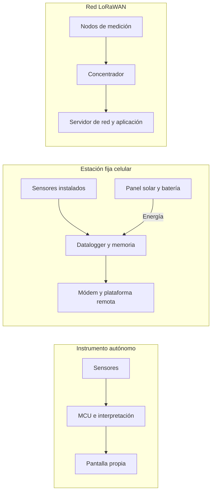
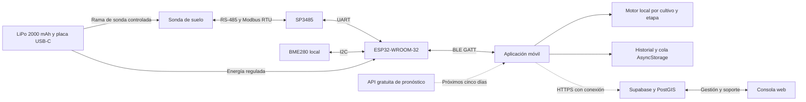
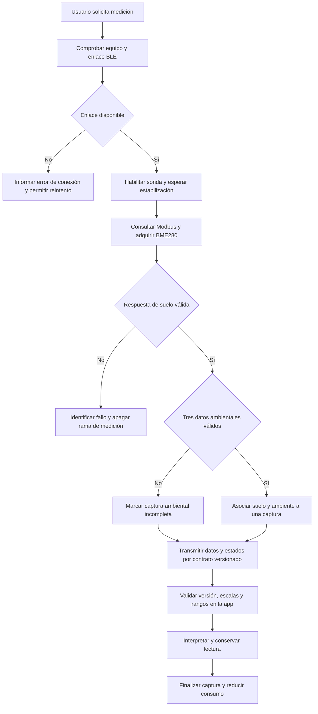
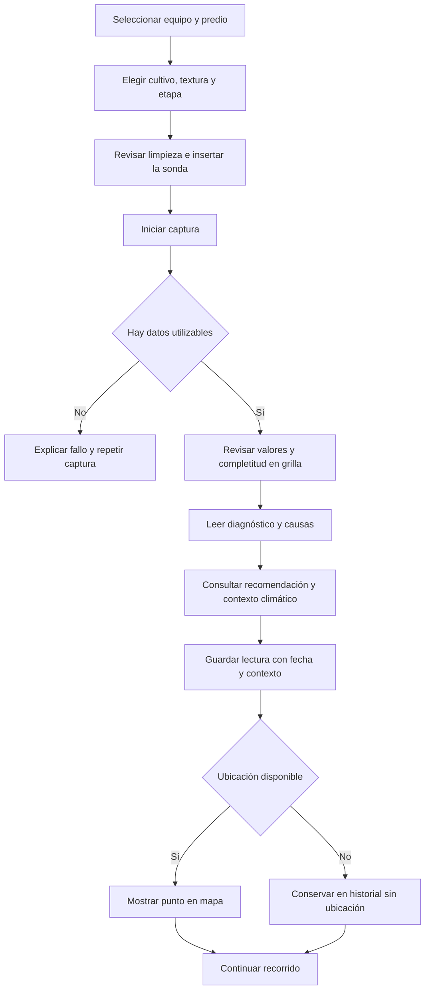
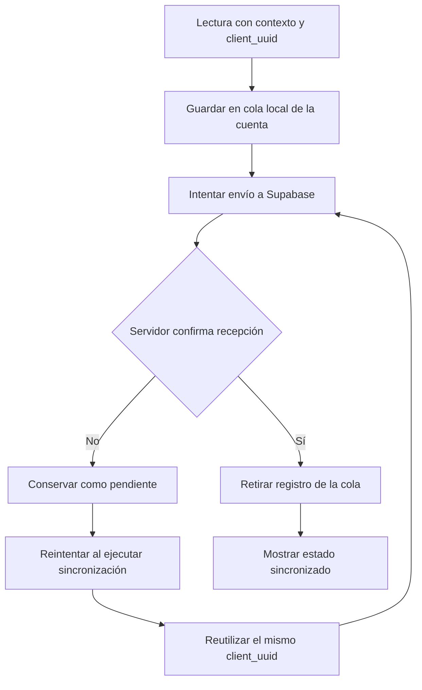
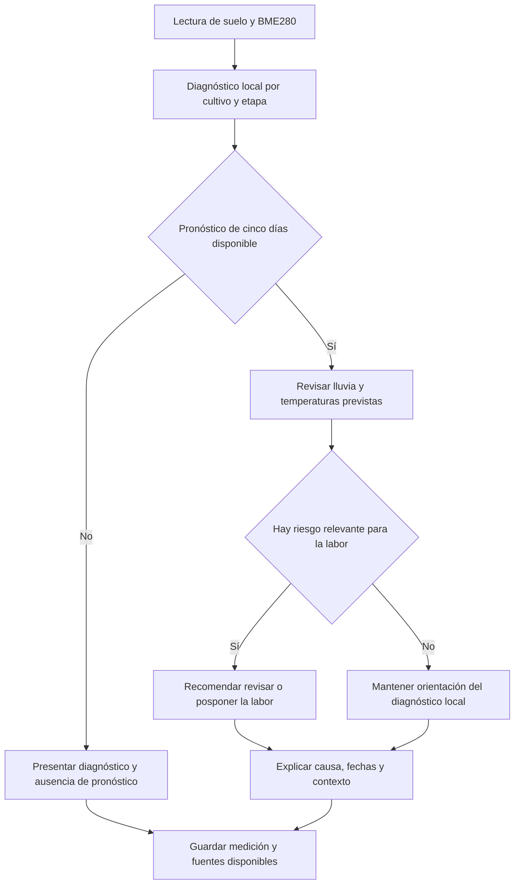
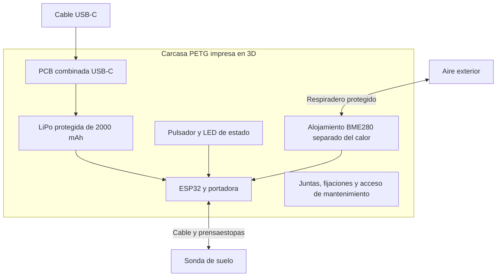
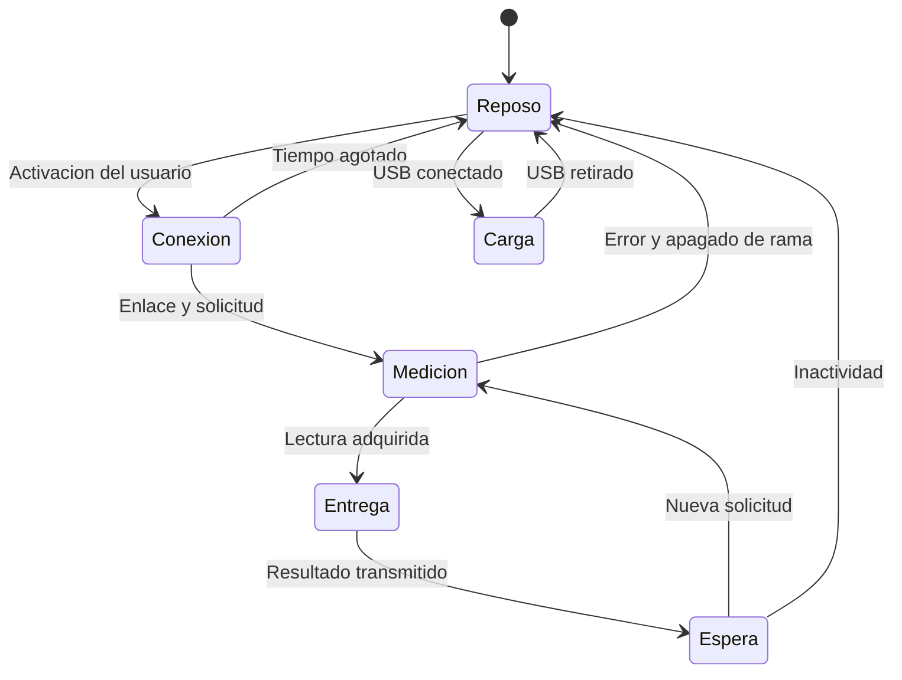

# Informe 1 — TerraSense

**Proyecto de Título: Ingeniería en Electrónica y Sistemas Inteligentes — INACAP**

**Autores:** Álvaro Nicolás Villena Torrejón y Alan Paul Escobar Rojas  
**Académico guía:** Carlos Alberto Castillo Torres  
**Lugar y año:** Santiago, Chile, 2026  
**Revisión:** 5 de septiembre de 2026

## Índice general

1. [Introducción](#introduccion)
2. [Descripción de la problemática](#problematica)
3. [Propuesta de solución tecnológica](#propuesta)
4. [Objetivos del proyecto](#objetivos)
5. [Ingeniería conceptual y viabilidad técnica](#viabilidad-tecnica)
6. [Eficiencia energética y sostenibilidad](#energia)
7. [Análisis económico y financiero](#analisis-economico)
8. [Condiciones técnicas, normativas y plan de comprobación](#condiciones)
9. [Conclusiones](#conclusiones)
10. [Referencias bibliográficas y fuentes del proyecto](#referencias)

## Índice de figuras

| Figura | Contenido |
|---|---|
| [1](#figura-1) | Flujo de selección de arquitectura |
| [2](#figura-2) | Alternativas autónoma, estacionaria y LoRaWAN |
| [3](#figura-3) | Alternativa cableada con adaptador USB–RS-485 |
| [4](#figura-4) | Arquitectura TerraSense y origen de los datos |
| [5](#figura-5) | Adquisición y comunicación BLE con control de errores |
| [6](#figura-6) | Recorrido del agricultor en la aplicación |
| [7](#figura-7) | Guardado local y sincronización con Supabase |
| [8](#figura-8) | Lectura local y decisión con pronóstico de cinco días |
| [9](#figura-9) | Distribución funcional de la carcasa impresa en 3D |
| [10](#figura-10) | Estados energéticos del instrumento |
| [11](#figura-11) | Construcción del flujo económico y evaluación |

Los diagramas se conservan como código Mermaid editable y se visualizan en GitHub. Las flechas continuas representan el recorrido indicado en cada figura; las discontinuas identifican extensiones o servicios complementarios cuando lo señala la leyenda. Son diagramas de arquitectura y operación, no planos de fabricación.

## Índice de tablas

Las tablas se agrupan en las secciones donde se interpretan: requisitos y alternativas (§5.1–5.2), selección de componentes (§5.3), contrato de medición y aplicación (§5.4–5.6), energía y comparación ambiental (§6), mercado y ventas (§7.1), BOM y margen (§7.2), capacidad y equilibrio (§7.3), financiamiento (§7.4), flujo e indicadores (§7.5–7.7), sensibilidad (§7.8) y comprobación técnica (§8). Las tablas económicas se regeneran desde `finanzas/supuestos.json` con `python finanzas/modelo.py`.

## 1. Introducción

La toma de decisiones agrícolas combina observación, experiencia y conocimiento del comportamiento del cultivo. Sin embargo, dos sectores de un mismo predio pueden presentar diferencias de humedad, temperatura o acumulación de sales que no resultan evidentes a simple vista. Cuando la decisión de sembrar, regar o intervenir el suelo depende exclusivamente del calendario o de una impresión general del terreno, se pierde la posibilidad de reconocer esas diferencias antes de actuar.

TerraSense aborda ese problema mediante un instrumento portátil de lectura de suelo y microclima, acompañado de una aplicación móvil que interpreta la información en el lugar de trabajo. El equipo reúne una sonda de suelo RS-485, un sensor ambiental BME280, un ESP32-WROOM-32 en placa de desarrollo, batería LiPo recargable de 2.000 mAh y carcasa impresa en 3D. El teléfono proporciona pantalla, localización, procesamiento y almacenamiento; el instrumento aporta el contacto físico con el suelo y el aire del punto muestreado.

El informe desarrolla la selección de esta arquitectura, la comunicación con la aplicación, la organización del diagnóstico y el modelo de energía. También explica cómo las decisiones técnicas se reflejan en materiales, montaje, mantenimiento, personal, inventario y financiamiento. La evaluación económica emplea un horizonte de cinco años y publica VAN, TIR y períodos de recuperación sobre una misma serie mensual.

La distinción entre medición y pronóstico ordena toda la propuesta. El BME280 registra el ambiente presente en el punto de lectura, mientras la API gratuita de clima aporta una previsión para los próximos cinco días. Así, el diagnóstico puede reconocer que el suelo está en condiciones favorables hoy y, al mismo tiempo, sugerir posponer una siembra por lluvias intensas previstas. La arquitectura busca convertir información comprensible en una decisión mejor fundamentada, conservando el origen y la fecha de cada dato.

## 2. Descripción de la problemática

### 2.1. Contexto agrícola y acceso a información

La disponibilidad de agua y las condiciones del suelo influyen directamente en el rendimiento y en los costos de manejo. La megasequía de Chile central documentada por CR2 muestra la relevancia de planificar bajo restricciones hídricas; esa referencia describe un proceso climático regional y no sustituye la observación meteorológica de una temporada o predio particular. [CR2, informe sobre megasequía](https://www.cr2.cl/megasequia/).

Para un productor de pequeña o mediana escala, medir con frecuencia puede ser difícil por el costo del instrumento, la necesidad de interpretar resultados o la disponibilidad de asesoría. Esta barrera no significa que todos los agricultores carezcan de conocimientos ni que toda la instrumentación comercial sea inaccesible: existe una combinación diversa de experiencia local, laboratorios, asesores y equipos. El espacio que busca ocupar TerraSense es el seguimiento portátil y frecuente, con explicaciones de manejo adecuadas al cultivo y a su etapa.

Una lectura de conductividad, por ejemplo, informa sobre la respuesta eléctrica del medio y ayuda a observar condiciones relacionadas con sales. Para interpretarla hay que considerar humedad, temperatura y procedimiento de medición. Presentar el valor junto con esas condiciones y una explicación resulta más útil que asignarle automáticamente una equivalencia en fertilizante. La aplicación debe ayudar a comprender qué está observando el instrumento y qué decisión puede apoyar con esa información.

### 2.2. Consecuencias en las etapas del cultivo

| Etapa | Decisión frecuente | Información que aporta una lectura de terreno |
|---|---|---|
| Preparación | Evaluar si corresponde intervenir antes de sembrar | Acidez, sales, humedad y condiciones de contacto |
| Pre-siembra | Elegir momento y punto de establecimiento | Temperatura y humedad del suelo, microclima y pronóstico posterior |
| Vegetativo | Revisar riego y evolución del terreno | Variación de humedad y conductividad entre visitas |
| Floración | Reconocer condiciones que exigen atención | Estado del suelo y exposición ambiental del punto |
| Cosecha | Registrar condiciones y preparar la siguiente campaña | Historial de mediciones y contexto de manejo |

El valor de la herramienta se produce al relacionar mediciones comparables en el tiempo. Una lectura aislada no representa automáticamente un potrero completo: deben definirse profundidad, puntos y condiciones de muestreo. El recorrido portátil permite aumentar la cobertura espacial sin instalar una estación por cada punto, a cambio de requerir el desplazamiento y tiempo del operador. Esta es una elección de operación, distinta del monitoreo continuo que ofrece una red fija.

### 2.3. Relación con laboratorios y asesoría

Los análisis de laboratorio proporcionan métodos y determinaciones que el instrumento portátil no reproduce. Su costo y plazo dependen del laboratorio, del tipo de muestra y del servicio contratado; por ello se elimina del estudio el plazo universal anterior de 15 a 30 días. Existen servicios que incluyen interpretación y recomendaciones, por lo que tampoco corresponde describir toda la oferta como una entrega de números sin apoyo. [Servicios de laboratorio de INIA](https://www.inia.cl/laboratorios/).

TerraSense complementa ese trabajo mediante seguimiento de terreno entre análisis. El productor puede identificar dónde o cuándo conviene tomar una muestra, registrar cambios después de una intervención y compartir antecedentes con su asesor. No se contabiliza cada lectura como un análisis químico evitado ni se atribuye un ahorro por hectárea sin un procedimiento de comparación. El beneficio propuesto consiste en mejorar oportunidad, trazabilidad y comprensión de las decisiones.

## 3. Propuesta de solución tecnológica

### 3.1. Distribución de funciones

El instrumento y el teléfono forman una unidad funcional. El ESP32 gestiona la adquisición y el intercambio con los sensores, verifica la comunicación y transmite el resultado. La aplicación interpreta los datos según cultivo, textura y etapa, presenta el diagnóstico y permite guardar el registro. Supabase incorpora identidad, permisos, persistencia remota y consulta geográfica. La consola web se orienta al fabricante y al soporte técnico.

Esta distribución aprovecha recursos que ya están presentes en el teléfono. Evita añadir al instrumento otra pantalla de navegación, memoria de usuario y receptor GPS, aunque traslada parte de la energía y de la compatibilidad al smartphone. La ventaja debe evaluarse considerando ambos dispositivos: reducir el consumo del instrumento no significa que el procesamiento o la visualización dejen de consumir energía.

### 3.2. BME280, lectura local y grilla 3×3

El **BME280 es obligatorio**. Sus tres magnitudes son temperatura del aire en °C, humedad relativa en % y presión barométrica local en hPa. Corresponden al tercio ambiental de la grilla 3×3. El sensor está incluido en la BOM a **$3.500 CLP finales** por equipo, según el precio indicado por el socio, con neto presupuestado de $2.941,18 al considerar IVA del 19 %.

Es necesario separar el número de registros de la cantidad de tarjetas de interfaz. La sonda ofrece siete registros, pero tres de ellos corresponden a N/P/K y no equivalen a tres análisis químicos independientes. Con el BME280 se transportarán diez magnitudes de sensores, mientras la grilla organiza nueve espacios de información. Para resolverlo, se propone agrupar los registros N/P/K en una tarjeta informativa y destinar otra tarjeta al estado de la lectura. Así se mantienen visibles las cuatro variables principales de suelo y las tres ambientales.

| Fila de la grilla propuesta | Columna 1 | Columna 2 | Columna 3 |
|---|---|---|---|
| Suelo físico | Humedad del suelo | Temperatura del suelo | Conductividad |
| Interpretación y calidad | pH | Registros N/P/K agrupados | Estado y completitud de lectura |
| Ambiente local | Temperatura del aire | Humedad relativa | Presión barométrica |

La tarjeta N/P/K informa su procedencia y limitación, sin construir un diagnóstico nutricional ni una dosis. La tarjeta de calidad indica si la muestra contiene las fuentes esperadas. Si falla el BME280, las tres tarjetas ambientales deben mostrar ausencia de lectura y el conjunto queda incompleto; no se completan con temperatura o lluvia de internet. La presión local tampoco debe confundirse con presión reducida al nivel del mar.

### 3.3. Pronóstico posterior a la lectura

La API gratuita consulta el pronóstico de los próximos cinco días por ubicación y fecha local. Sus variables se presentan en una sección de planificación, separadas de las observaciones del equipo. Una recomendación de aplazar la siembra puede surgir de precipitación intensa prevista, riesgo de saturación o temperaturas extremas, aun cuando la humedad y temperatura medidas del suelo sean adecuadas en ese momento.

La formulación debe expresar el riesgo: «Se prevén lluvias intensas; conviene revisar la fecha de siembra», en lugar de afirmar que las semillas necesariamente se perderán. El efecto real depende del suelo, drenaje, especie y manejo. Del mismo modo, una ola de calor prevista orienta una revisión de fecha o riego sin convertir el pronóstico en una medición local del BME280. Una sola lectura de presión no predice por sí sola un frente meteorológico.

### 3.4. Beneficiarios y propuesta de valor

El usuario principal es el pequeño o mediano agricultor comercial, junto con asesores, administradores y equipos de trabajo que recorren predios. La herramienta facilita que una observación no quede únicamente en la memoria de quien realizó la visita. Fecha, cultivo, punto y condiciones medidas permiten discutir la recomendación y comparar campañas.

El modelo comercial considera venta del instrumento con aplicación y sin cobro por lectura. Los costos de soporte, servicios digitales, mantenimiento y reposición permanecen en el presupuesto de la empresa. El usuario dispone de una herramienta de seguimiento, mientras los servicios de laboratorio y asesoría conservan su función en decisiones que requieren determinaciones específicas.

## 4. Objetivos del proyecto

### 4.1. Objetivo general

Diseñar y evaluar un sistema portátil de medición de suelo y ambiente que transmita los datos a una aplicación móvil, los interprete según el contexto del cultivo y entregue recomendaciones comprensibles en terreno, con una estructura económica que incluya fabricación, comercialización y soporte.

### 4.2. Objetivos específicos y resultado verificable

| Objetivo | Resultado esperado | Forma de evaluación |
|---|---|---|
| Seleccionar arquitectura | Comparación de alternativas y distribución de funciones | Requisitos, criterios y justificación de decisión |
| Integrar suelo y ambiente | Adquisición RS-485 e I²C con marca temporal | Capturas, errores controlados y comparación de valores |
| Comunicar con la aplicación | Contrato BLE definido y versionado | Pruebas de decodificación, conexión y compatibilidad |
| Interpretar el contexto | Motor por cultivo, textura y etapa | Casos agronómicos y revisión de reglas |
| Conservar información | Registro local y sincronización idempotente | Pruebas de desconexión, reintento y cambio de cuenta |
| Diseñar energía y carcasa | LiPo recargable, alimentación y alojamiento 3D | Balance energético y ensayos del conjunto |
| Evaluar costos y operación | BOM, personal, inventario y flujo mensual | Conciliación reproducible en Python y Excel |
| Evaluar retorno económico | VAN, TIR y payback a cinco años | Misma inversión, flujos y horizonte de evaluación |

La velocidad de diagnóstico se evaluará midiendo el tiempo completo desde que el usuario inicia la captura hasta que obtiene un resultado utilizable. El tiempo de lectura eléctrica de un sensor no representa por sí solo toda la experiencia: intervienen conexión, estabilización, transmisión, procesamiento y presentación. Los objetivos de autonomía, precisión y protección mecánica siguen este mismo criterio de medición del conjunto.

## 5. Ingeniería conceptual y viabilidad técnica

### 5.1. Requisitos antes de comparar alternativas

La selección comienza por el caso de uso: un operador recorre varios puntos y necesita interpretar una lectura en el mismo lugar. La arquitectura debe permitir esa operación sin depender de cobertura celular durante la captura. La red se reserva para acciones que sí la requieren, como alta de cuenta, respaldo remoto y pronóstico meteorológico.

| Código | Requisito obligatorio | Consecuencia de diseño |
|---|---|---|
| RO-1 | Alimentar e interrogar la sonda | Verificar tensión, corriente, interfaz diferencial y registros del SKU |
| RO-2 | Medir tres variables ambientales locales | Incluir BME280, ventilación y transporte de sus datos |
| RO-3 | Presentar interpretación en terreno | Disponer de reglas locales y una interfaz comprensible |
| RO-4 | Recorrer múltiples puntos | Priorizar portabilidad y un ciclo de operación repetible |
| RO-5 | Conservar la lectura sin cobertura | Persistencia local y estado de sincronización explícito |
| RO-6 | Poder construir y mantener el equipo | Componentes disponibles, carcasa desmontable y documentación |

Se distingue una alternativa técnicamente posible de una alternativa adecuada para el proyecto. Un datalogger fijo puede resolver muy bien el seguimiento continuo y conservar datos aunque pierda internet, pero no responde del mismo modo al recorrido portátil. Una conexión USB puede ser viable con un adaptador y fuente adecuados; no debe descartarse por atribuirle al teléfono una incapacidad absoluta para comunicarse mediante electrónica intermedia.

**Figura 1. Selección de arquitectura a partir del uso en terreno.**

### 5.2. Comparación razonada de arquitecturas

| Arquitectura | Fortalezas | Trabajo adicional o limitación para este proyecto | Decisión |
|---|---|---|---|
| MCU de 8 bits, pantalla y Bluetooth Classic | Sencillez en instrumentación básica | Menor memoria; perfil serial clásico y compatibilidad móvil a resolver | No priorizada |
| MCU con inferencia y pantalla propia | Lectura autónoma sin teléfono | Interfaz, actualizaciones y carcasa más complejas | Alternativa viable |
| Datalogger fijo con módem celular | Series continuas y acceso remoto | Instalación por zona y servicio de comunicaciones | Adecuado para otro uso |
| Nodos LoRaWAN con concentrador | Cobertura de múltiples sensores fijos | Infraestructura y recorrido de datos hasta la aplicación | Alternativa para monitoreo distribuido |
| Adaptador USB–RS-485 con fuente propia | Menos radio; uso del teléfono como interfaz | Cableado, compatibilidad USB, alimentación y ergonomía | Alternativa viable a prototipar |
| ESP32 portátil, BME280 y BLE | Recorrido, interfaz móvil y sensores reunidos | Gestión del enlace y consumo del devkit | Seleccionada |

La preferencia por BLE responde a la libertad de movimiento y a la separación física entre instrumento y teléfono. No depende de afirmar que toda arquitectura cableada sea imposible o que LoRaWAN obligue siempre a instalar exactamente veinte nodos para tomar veinte muestras. La cantidad de nodos depende de la resolución temporal y espacial buscada. El equipo portátil ofrece una muestra por recorrido; una red fija puede medir simultáneamente y con mayor frecuencia.

Tampoco se declara que incorporar una pantalla reduzca la autonomía en un porcentaje universal. Ese efecto depende del tipo de pantalla, brillo, tiempo de uso y procesamiento. El informe sustituye puntuaciones agregadas sin base reproducible por una comparación trazable de funciones y compromisos. Una matriz numérica puede incorporarse después si se fijan pesos, configuración de cada alternativa y evidencias comparables de costo, consumo y uso.

**Figura 2. Rutas de información y alimentación de las alternativas.**

**Figura 3. Alternativa cableada técnicamente realizable con electrónica intermedia.**

### 5.3. Selección de componentes e integración eléctrica

El ESP32-WROOM-32 se utiliza en una placa de desarrollo. Esta elección facilita programación, montaje inicial y acceso a bibliotecas, y reúne UART, I²C, Bluetooth y Wi-Fi. La ficha de la familia WROOM-32E describe un procesador de doble núcleo y Bluetooth 4.2, incluido BLE. La memoria flash y el circuito de regulación deben verificarse en la variante de devkit adquirida. [Espressif, ficha de módulo](https://documentation.espressif.com/esp32-wroom-32e_esp32-wroom-32ue_datasheet_en.html).

El doble núcleo es una capacidad útil, pero no constituye una condición necesaria para mantener Modbus y BLE a la vez: una implementación mononúcleo bien programada también puede manejar tareas y periféricos concurrentes. La selección prioriza disponibilidad, costo y experiencia de desarrollo. No se presenta al ESP32 como el radio de menor consumo ni se asigna una mejora porcentual de autonomía frente a nRF52840 o STM32WB55 sin comparar configuraciones completas.

| Bloque | Selección vigente | Motivo e integración |
|---|---|---|
| Control | ESP32-WROOM-32 en devkit | UART para Modbus, I²C ambiental, BLE hacia el teléfono |
| Suelo | Sonda 7-en-1 RS-485 | Captura multiparamétrica; ficha, tensión y registros dependen del SKU |
| Ambiente | Módulo Bosch BME280 | Reúne temperatura, humedad relativa y presión |
| Interfaz diferencial | SP3485 a 3,3 V | Adapta UART a bus RS-485; requiere cableado y protección apropiados |
| Energía | LiPo protegida de 2.000 mAh | Recarga y volumen compatibles con instrumento portátil |
| Carga y elevación | PCB combinada USB-C carga + boost | Una sola compra de $900; no sumar módulos discretos duplicados |
| Conexión de batería | JST de tres pines con cable y contraparte | Confirmar pinout y función del tercer pin |
| Alojamiento | Carcasa PETG impresa en 3D | Acceso de montaje, ventilación ambiental y reposición por piezas |

La línea de sonda se diseña para la variante compatible con la rama prevista de 5 V; la interfaz RS-485 no determina por sí sola la tensión de alimentación. Antes de cerrar el componente se debe verificar su funcionamiento a batería baja, durante arranque y durante transmisión. La protección y el transceptor se revisan junto con polaridad A/B, referencia de masa, terminación y limitación de transitorios.

El BME280 se comunica a 3,3 V por I²C, con GPIO21 como SDA y GPIO22 como SCL en el pinout de trabajo. La dirección 0x76 o 0x77 y los pull-ups se revisan en el módulo comprado. La ficha de Bosch documenta temperatura, humedad y presión; el BMP280 no aporta humedad relativa y por ello no constituye un reemplazo funcional. La temperatura obtenida también se utiliza en la compensación interna y su correspondencia con el aire exterior depende de la ubicación física. [Bosch, BME280](https://www.bosch-sensortec.com/media/boschsensortec/downloads/datasheets/bst-bme280-ds002.pdf).

**Figura 4. Arquitectura objetivo de TerraSense y origen de cada dato.**

La figura expresa el diseño completo. El decodificador de suelo y el guardado local existen en el repositorio; la incorporación de las tres variables BME280 al contrato BLE y la consulta de cinco días son trabajos de integración identificados en §5.6. No se debe inferir del diagrama que ya existe firmware terminado para todos los bloques.

### 5.4. Comunicación del instrumento con la aplicación

El ESP32 actúa como puente entre dos entornos distintos. Hacia la sonda realiza una consulta Modbus RTU por RS-485 y revisa la respuesta. Hacia el teléfono publica datos decodificados en una característica GATT. La aplicación no necesita generar señales RS-485 ni procesar directamente el cableado industrial; consume un contrato de datos de aplicación.

RS-485 define la capa eléctrica diferencial. Modbus define la estructura de mensajes y, en su implementación serial RTU, se verifican longitud, dirección, función, CRC y temporización. Estas verificaciones permiten distinguir un error de comunicación de una lectura agronómica crítica. Una respuesta ausente no debe convertirse en cero humedad ni en un semáforo rojo atribuido al suelo. [Modbus Organization, guía serial](https://www.modbus.org/file/secure/modbusoverserial.pdf).

El contrato de suelo que decodifica `App/src/services/probeService.ts` tiene 16 bytes, con valores multibyte en big-endian. Temperatura utiliza un entero con signo. El porcentaje de batería ocupa un byte; no corresponde a milivoltios. Este detalle es relevante porque cambios de orden o escala pueden producir cifras plausibles pero incorrectas, más difíciles de detectar que una desconexión visible.

| Bytes del contrato actual | Contenido | Interpretación en la app |
|---|---|---|
| 0–1 | Humedad de suelo | Entero sin signo dividido por 10 |
| 2–3 | Temperatura de suelo | Entero con signo dividido por 10 |
| 4–5 | Conductividad | Entero sin signo, µS/cm |
| 6–7 | pH | Entero sin signo dividido por 10 |
| 8–13 | Registros N, P y K | Tres registros sin validación química independiente |
| 14 | Batería | Porcentaje entre 0 y 100 |
| 15 | Reservado | Sin magnitud ambiental asignada |

Los tres datos ambientales no caben en el byte reservado ni deben colocarse sobre los registros existentes. La integración requiere una trama versionada o una característica ambiental adicional. En ambos casos, suelo y ambiente deben asociarse a la misma captura mediante identificador, instante y estado de validez. La versión permite conservar compatibilidad con equipos que solo entreguen la trama antigua, mostrando explícitamente que la lectura ambiental está incompleta.

**Figura 5. Ciclo objetivo de adquisición y transmisión con fallos diferenciados.**

El enlace BLE requiere una compilación nativa de la aplicación. Expo Go no sustituye un build que incluya `react-native-ble-plx`. Android e iOS deben comprobarse con permisos, reconexiones y versiones reales de sistema operativo; disponer de BLE no constituye por sí solo una prueba de compatibilidad terminada. La asociación con identidad del dispositivo y la ventana física de vinculación ayudan a evitar que el operador mida con un equipo distinto del seleccionado.

### 5.5. Diseño y funcionamiento de la aplicación

La aplicación está desarrollada con React Native, Expo y TypeScript. El motor agronómico y las definiciones de cultivos residen en código local; la persistencia utiliza AsyncStorage y estado administrado con Zustand. No se implementa una base SQLite en la versión revisada. Esta separación permite describir con precisión qué parte interpreta, cuál conserva una lectura y cuál solicita datos remotos.

El recorrido inicia con la identificación del equipo y del contexto: predio, cultivo, textura y etapa fenológica. Esos datos afectan la interpretación, por lo que no deben quedar ocultos después de medir. El usuario debe poder reconocer si está evaluando pre-siembra o desarrollo, y si el perfil de suelo seleccionado corresponde al punto muestreado. El resultado integra valor, unidad, significado y acción sugerida.

La presentación se organiza en tres páginas: grilla, diagnóstico y mapa. La grilla permite revisar las variables; el diagnóstico ordena los factores que explican el resultado y las recomendaciones; el mapa relaciona las lecturas georreferenciadas del recorrido. El semáforo se acompaña de texto y explicación para que el color no sea el único medio de comunicación. Las decisiones se formulan como orientaciones cualitativas: la app no determina por sí sola litros exactos de lavado ni dosis de cal en kg/ha.

**Figura 6. Recorrido de uso en campo y presentación del diagnóstico.**

La ubicación es una ayuda para trazar el recorrido y no debe impedir guardar información útil. La app conserva también lecturas sin GPS, que quedan fuera de la representación cartográfica. Asimismo, el círculo dibujado alrededor de un punto no demuestra que toda esa superficie tenga las mismas propiedades: representa un recurso de visualización y debe diferenciarse del alcance físico de la sonda.

El guardado local antecede al intento de envío. Cada medición recibe un `client_uuid` que se conserva al reintentar, y la cola se separa por cuenta. La operación remota utiliza ese identificador para evitar duplicación. Si falla internet, la lectura sigue pendiente; si el servidor confirma recepción, se retira de la cola. El código incluye mecanismos de sincronización, pero no se afirma que una aplicación cerrada mantenga un servicio continuo de fondo en cualquier teléfono.

**Figura 7. Persistencia local primero y sincronización idempotente.**

La operación local presupone una cuenta y un dispositivo previamente preparados. Crear una cuenta, registrar un equipo o recuperar credenciales puede requerir conexión. Delimitar esa preparación permite explicar correctamente el trabajo sin cobertura: el motor y la cola local no necesitan una respuesta de la nube para cada lectura, pero los servicios de identidad y pronóstico conservan sus dependencias de red.

### 5.6. Integración pendiente de BME280 y pronóstico de cinco días

Esta sección concentra la especificación antes separada en el documento de integración. El BME280 permanece obligatorio en el diseño y en los costos; el estado del código se registra para guiar el trabajo de implementación.

| Función | Código revisado | Integración requerida |
|---|---|---|
| Suelo por BLE | Decodificador de 16 bytes | Contrastar con firmware y ficha de la sonda adquirida |
| Ambiente local | La trama actual no contiene los tres campos | Adquisición I²C, versión/identidad de captura y transporte BLE |
| Grilla | Siete registros de suelo, temperatura de API y lluvia del día | Reorganizar como §3.2, agrupando N/P/K y reservando tres celdas al BME280 |
| Guardado ambiental | Temperatura procede actualmente del servicio climático; humedad queda nula | Separar origen de temperatura, añadir presión y persistir validez/fecha |
| Pronóstico | `forecast_days=2`, utiliza primer elemento diario | Consumir los cinco días siguientes con fechas locales y datos completos |
| Fallo de red | Servicio devuelve `null` | Mantener lectura local y distinguir pronóstico no disponible |

El contrato ambiental deberá representar temperatura con signo, humedad relativa, presión local, instante de captura y estado del sensor. La estructura de almacenamiento debe mantener el origen del dato: el campo ambiental de una medición no puede conservar indistintamente un valor BME280 y uno de un modelo meteorológico sin informar esa diferencia. También deben revisarse exportación, historial y mapa para que la distinción sobreviva al guardado.

El horizonte solicitado son los próximos cinco días posteriores a la fecha local de lectura. La integración debe revisar si el proveedor incluye el día actual en su respuesta y solicitar suficientes fechas para completar ese horizonte. Para cada día se necesitan fecha, precipitación prevista y temperaturas extremas; los valores faltantes se muestran como no disponibles. La recomendación debe conservar qué pronóstico se utilizó, evitando que una actualización futura cambie el significado histórico de una lectura guardada.

**Figura 8. Decisión agronómica local complementada por pronóstico.**

La API tiene costo directo de $0 en el estudio. La app actual utiliza Open-Meteo, cuya modalidad gratuita es para uso no comercial. La elección de una API gratuita para una operación comercial debe comprobar licencia, cupo y cobertura; no se contrata un plan pagado en este presupuesto. El costo del resto de los servicios digitales continúa separado. [Condiciones de Open-Meteo](https://open-meteo.com/en/pricing).

### 5.7. Carcasa, manufactura y mantenimiento

La carcasa se fabrica mediante impresión 3D FDM en PETG como servicio externo. Esta decisión permite modificar geometría, soportes y acceso a conectores durante el desarrollo, sin comprometer un molde por cada cambio. La selección de material no demuestra por sí sola resistencia UV, estanqueidad ni tolerancia a caídas: influyen el filamento concreto, orientación de capas, geometría y acabado. Estos factores deben evaluarse con la pieza fabricada.

La ventilación del BME280 introduce un requisito específico. El instrumento debe proteger la electrónica del agua y el barro, pero el sensor necesita intercambio con el aire exterior. Se propone un alojamiento ventilado y protegido, apartado del ESP32, reguladores, carga y calor de la mano. Sellar el sensor con resina o encerrarlo en una cámara sin intercambio perjudicaría la lectura que justifica su inclusión.

La BOM separa $6.000 netos de impresión del conjunto y $1.500 de fijaciones, juntas, prensaestopas y respiradero. La impresión incluye material, energía, uso de máquina y acabado del proveedor; el ensamblaje final se remunera en la nómina. No se añade una impresora como activo mientras se mantenga esta modalidad externa. Si se decide producir internamente, deberán recalcularse activo, depreciación económica, material, horas y tasa de rechazo.

**Figura 9. Distribución funcional propuesta de la carcasa, sin escala ni dimensiones de fabricación.**

El mantenimiento debe poder sustituir la batería, el módulo ambiental o una pieza de carcasa sin desechar el instrumento completo. Para ello se priorizan tornillos, conectores identificados y alivio de tracción. La documentación de montaje debe señalar polaridades, pares de apriete cuando corresponda y procedimiento de comprobación después de abrir el equipo. Reparabilidad, precisión ambiental y protección mecánica deben resolverse juntas.

## 6. Eficiencia energética y sostenibilidad

### 6.1. Batería y límites del balance

El diseño vigente utiliza **una LiPo protegida de 2.000 mAh**, no dos celdas 18650 ni un banco de 6.000 mAh. La energía nominal de referencia es aproximadamente `3,7 V × 2 Ah = 7,4 Wh`. La capacidad útil depende del corte de protección, temperatura, envejecimiento, corriente de descarga y conversión. Esos factores impiden trasladar directamente una autonomía calculada para otro banco de baterías.

La eficiencia debe medirse desde los bornes de la batería con el conjunto completo: devkit, cargador, elevador, transceptor, BME280, indicadores y sonda. El dato de reposo del chip ESP32 no incluye automáticamente regulador, LED de alimentación ni puente USB-UART del devkit. Del mismo modo, cortar la alimentación de la sonda no elimina el consumo de todos los componentes que permanecen conectados.

### 6.2. Gestión por estados y control del tiempo conectado

La energía diaria resulta de corriente multiplicada por duración en cada estado. Por eso no basta con elegir BLE o un sensor de pocos microamperios. Un enlace esperando comandos durante una sesión larga puede gastar más que varias lecturas breves. La estrategia es limitar activación de sonda, tiempo de publicidad, reintentos y espera conectada, conservando una respuesta cómoda para el usuario.

| Estado | Qué permanece activo | Medida de diseño |
|---|---|---|
| Almacenamiento | Circuitos que no se hayan desconectado y autodescarga | Identificar rutas reales de consumo y método de apagado |
| Reposo | Control, regulación y periféricos retenidos | Medir corriente del conjunto; revisar LED y USB-UART |
| Publicidad y conexión | Radio BLE y control | Ventanas acotadas y reintento controlado |
| Medición | Sonda, interfaces y lectura ambiental | Habilitar durante estabilización y adquisición |
| Entrega y espera | Comunicación y procesamiento | Confirmar envío y volver a estado de menor consumo |
| Carga | Circuito USB-C y celda | Verificar corriente, temperatura y lectura ambiental afectada por calor |

El BME280 puede operar en modo forzado, realizando una adquisición y regresando al reposo. Bosch especifica aproximadamente 3,6 µA **promedio a una actualización por segundo** para las tres magnitudes y 0,1 µA en reposo del sensor; el primer valor no es una corriente instantánea aplicable a cualquier configuración de muestreo. Deben añadirse los consumos del módulo que aloja el chip. [Bosch, datos de consumo](https://www.bosch-sensortec.com/en/products/environmental-sensors/humidity-sensors-bme280).

**Figura 10. Estados energéticos propuestos; transiciones a comprobar en firmware.**

El corte de potencia de la sonda es una estrategia de diseño que exige comprobar la PCB combinada y sus pines de habilitación. No se presupone que desconectar únicamente su salida de 5 V anule también la corriente del elevador. Si se necesita un transistor externo, debe identificarse dentro de la línea presupuestada de pasivos y protección o añadirse como componente al cerrar el esquema. La solución final debe impedir alimentación indirecta por señales cuando un periférico está apagado.

### 6.3. Ejemplo de cálculo y sensibilidad al reposo

Para explicar el método se conserva un ciclo numérico de trabajo con corrientes **supuestas en batería**. Se utiliza para comparar el efecto de los estados, no como resultado de ensayo del devkit. Al medir en batería no se vuelve a añadir eficiencia de conversión, pues ya estaría reflejada en la corriente registrada. Si se parte de consumos en cada riel, en cambio, deben convertirse mediante potencia y eficiencia: `I_batería = Σ(V_riel × I_riel / eficiencia) / V_batería`.

| Fase del ejemplo | Corriente en batería | Tiempo | Carga por ciclo |
|---|---|---|---|
| Publicidad y conexión | 40 mA | 12 s | 0,1333 mAh |
| Adquisición del conjunto | 95 mA | 3 s | 0,0792 mAh |
| Envío BLE | 60 mA | 1 s | 0,0167 mAh |
| **Total** | Variable | **16 s** | **0,2292 mAh** |

La relación utilizada es `Q_ciclo = Σ(I_mA × t_s) / 3.600`. A 3,7 V nominales, ese ciclo equivale a unos 0,848 mWh. La duración real de estabilización de la sonda y del ambiente debe determinarse experimentalmente; una lectura de tres segundos no garantiza por sí sola equilibrio térmico del sensor ambiental.

El siguiente ejercicio utiliza diez capturas diarias, cinco minutos adicionales de espera BLE a 18 mA, capacidad útil supuesta de 1.600 mAh y una pérdida diaria simplificada por autodescarga de `2.000 × 2 % / 30 = 1,3333 mAh`. El tiempo de reposo es el resto de las 24 horas: no se cuenta dos veces el período activo. La autodescarga se aproxima como cargo constante para facilitar la comparación; un modelo de vida útil detallado debe hacerla depender de carga y temperatura.

| Reposo total supuesto | Consumo diario calculado | Cociente capacidad útil / consumo diario |
|---|---|---|
| 0,1 mA | 7,51 mAh/día | 213,0 días |
| 1,0 mA | 29,00 mAh/día | 55,2 días |
| 5,0 mA | 124,49 mAh/día | 12,9 días |

La comparación muestra por qué el reposo de la placa completa es decisivo. El mismo ciclo de lectura puede producir resultados muy distintos al cambiar únicamente la corriente entre capturas. Por ello se retiran las autonomías anteriores de 784 días o de 8–12 meses y las afirmaciones de miles de mediciones «reales»: procedían de otra batería y supuestos que no describen el conjunto actual. La autonomía se publicará después de integrar el consumo medido con perfiles de uso, temperatura y reconexión.

### 6.4. Comparación con pilas y enfoque de sostenibilidad

La ventaja de la recarga puede exponerse de forma concreta. Bluelab declara una pila AA alcalina para Pulse y una duración de dos a cuatro meses según el uso; su equipo también utiliza una app y puede trabajar con Bluetooth después de la preparación inicial. Hanna especifica tres pilas AAA para HI9814 y aproximadamente 600 horas de uso continuo. Son dos referencias puntuales, no una descripción de todos los competidores. [Bluelab, FAQ de Pulse](https://support.bluelab.com/bluelab-pulse-meter-faq); [Hanna, HI9814](https://hannainst.com/groline-waterproof-portable-ph-ec-tds-meter/).

| Equipo | Fuente de energía especificada | Recambio y continuidad operativa | Alcance de comparación |
|---|---|---|---|
| Bluelab Pulse | Una AA alcalina | Sustituir la pila agotada; disponer de repuesto | Humedad, conductividad y temperatura, con app |
| Hanna HI9814 | Tres AAA de 1,5 V | Sustituir juego de pilas; autonomía declarada de uso continuo | pH, EC/TDS y temperatura en soluciones hidropónicas |
| TerraSense | LiPo recargable de 2.000 mAh y USB-C | Recargar la misma batería; sustituirla al degradarse | Suelo y BME280 local con interpretación móvil |

TerraSense busca reducir el recambio habitual de pilas primarias al recuperar la carga de la misma celda durante muchos ciclos de uso. Para el agricultor, eso puede reducir compras de repuestos y facilitar recarga antes de una jornada mediante USB-C. Las pilas intercambiables tienen, a su vez, una ventaja operativa: permiten reanudar el trabajo inmediatamente con un repuesto. La batería integrada requiere planificar la carga y asegurar acceso a energía.

Se utiliza **sostenibilidad** para describir el conjunto de decisiones ambientales, económicas y de mantenimiento. No se establece una jerarquía técnica basada en llamar «sustentable» a un rival y «sostenible» a TerraSense: la diferencia demostrable es pila primaria reemplazable frente a batería recargable, junto con las condiciones de reparación y vida útil. La ventaja debe sustentarse en esas características, no en la elección de una palabra.

Una batería recargable tampoco produce residuos cero. Su fabricación, envejecimiento, reemplazo, electrónica de carga y disposición final forman parte del ciclo de vida. Las pilas agotadas y la LiPo retirada requieren gestión adecuada, no eliminación en la basura común. La Ley 20.920 identifica pilas, baterías y aparatos eléctricos y electrónicos dentro del marco de productos prioritarios; el diseño debe facilitar separación y canal de gestión, revisando las obligaciones aplicables. [BCN, Ley 20.920](https://www.bcn.cl/leychile/Navegar?idNorma=1090894&idParte=9705091).

### 6.5. Indicadores ambientales y de servicio a medir

La comparación ambiental debe conservar una función equivalente: número de visitas útiles, vida del equipo y calidad del diagnóstico. Dividir energía por «cantidad de parámetros» puede favorecer artificialmente a una sonda que entrega varios registros derivados de la misma señal. Por eso se elimina la afirmación anterior de 44 % menos energía por parámetro, que no demostraba un beneficio comparable.

| Indicador | Forma de registro | Decisión que permite tomar |
|---|---|---|
| Energía por captura completa | Integración de potencia en batería y tiempo de sesión | Optimizar conexión, adquisición y entrega |
| Capacidad útil y degradación | Ensayos de ciclos y temperatura | Definir reemplazo y condiciones de uso |
| Reparación por módulo | Tiempo, piezas y resultado de intervención | Reducir descarte del equipo completo |
| Rechazo de impresión | Masa de material y piezas fallidas por lote | Ajustar diseño y proceso de carcasa |
| Gestión al final de vida | Baterías y electrónica recibidas y derivadas | Respaldar el compromiso ambiental |

## 7. Análisis económico y financiero

El estudio vincula decisiones técnicas con operación de empresa. Cada instrumento necesita sonda, sensor ambiental, electrónica, carcasa, montaje, pruebas, embalaje y entrega. A ello se agregan adquisición de clientes, personal, contabilidad, soporte y servicios digitales. Un margen calculado solo como precio menos sonda no permitiría financiar estas actividades ni explicar la caja necesaria para iniciar la operación.

La moneda es CLP nominal y el primer año operativo es 2027. Se aplica un reajuste general del 3 % anual, precio inicial de $349.990 con IVA y un horizonte económico de cinco años. El Excel mantiene quince años para visualizar la amortización completa de las alternativas de deuda; esa extensión no se agrega al VAN publicado de cinco años. La fuente editable de costos y operación es [supuestos.json](../finanzas/supuestos.json).

### 7.1. Mercado, metas y estrategia comercial

El Censo Agropecuario y Forestal 2021 informa 138.628 unidades productivas agropecuarias y 36.928 unidades de autoconsumo, que suman 175.556 unidades de contexto censal. Ese total no equivale a clientes con intención de adquirir TerraSense ni respalda automáticamente el mercado servible anterior de 120.000 compradores. [INE, resultados nacionales](https://www.ine.gob.cl/censoagropecuario/resultados-finales/graficas-nacionales).

| Nivel | Definición de trabajo | Uso dentro del estudio |
|---|---|---|
| Universo/TAM de contexto | 175.556 unidades censales | Dimensionar el sector, sin convertir cada unidad en una venta |
| SAM | Productores y asesores con uso compatible, smartphone y acceso comercial | Cuantificar por cultivo, región y canal; no atribuir un total al censo sin esos cruces |
| SOM | Equipos que el plan comercial propone vender en cinco años | Meta derivada del presupuesto de ventas y capacidad |

El segmento inicial se orienta al pequeño y mediano productor comercial, aproximadamente de 0,5 a 20 ha, además de asesores que utilizan el instrumento en más de un predio. La existencia de smartphone y la posibilidad de preparar la aplicación importan para adopción, pero la cobertura permanente de internet no es un requisito para cada lectura local. La cantidad de predios visitados por un asesor tampoco equivale necesariamente a la cantidad de equipos comprados.

La estrategia base utiliza venta directa, pauta digital, demostraciones y atención comercial de los socios. La contratación técnica y de soporte sigue la carga de trabajo; la gestión de agencia se incorpora desde el objetivo de 650 ventas anuales. Distribución mayorista, crédito a clientes y convenios institucionales se consideran posibles expansiones, pero no se contabilizan como ventas comprometidas ni con el mismo margen de la venta directa.

<!-- INFORME:VENTAS:INICIO -->

| Año | Equipos | Pauta anual | Técnicos FTE | Soporte FTE | Agencia anual |
|---|---|---|---|---|---|
| 2027 | 200 | $6.000.000 | 0,0 | 0,0 | $0 |
| 2028 | 350 | $10.815.000 | 0,5 | 0,0 | $0 |
| 2029 | 500 | $15.913.500 | 0,5 | 0,5 | $0 |
| 2030 | 650 | $21.308.176 | 1,0 | 1,0 | $3.278.181 |
| 2031 | 850 | $28.700.475 | 1,5 | 1,5 | $3.376.526 |

El plan suma **2.550 equipos en cinco años**. A precio inicial constante, representa $892.474.500 brutos; el flujo nominal incorpora reajustes anuales. El SOM es una meta de ventas, no una cifra censal de compradores. La pauta del primer año es $6.000.000 y la agencia aparece desde 650 ventas anuales.

<!-- INFORME:VENTAS:FIN -->

La pauta se calcula a $30.000 por venta objetivo y no se reduce automáticamente cuando una campaña vende menos. Es una diferencia relevante entre meta y resultado: el gasto puede ocurrir antes de saber cuántas ventas producirá. El seguimiento comercial debe medir contactos, conversión, devolución, costo de adquisición y tiempo de soporte. Las ventas mensuales se distribuyen con pesos estacionales explícitos, en lugar de asumir que todas las cuotas del año reciben el mismo ingreso.

### 7.2. BOM, costo variable y política de precio

La BOM incluye un módulo ambiental por equipo y distingue la impresión 3D de sus accesorios. El precio del BME280 proviene del socio y se interpreta como final con IVA. La placa combinada de carga/boost mantiene $900 como costo completo, sin crédito fiscal hasta disponer de factura. Los demás valores se presupuestan netos según las notas de cada línea. Esta separación evita mezclar precios brutos y netos al construir el margen.

<!-- INFORME:BOM:INICIO -->

| Material o servicio por equipo | Cantidad | Neto unitario CLP | Subtotal CLP |
|---|---|---|---|
| Sonda RS485 7-en-1 (SKU pendiente de ficha) | 1 | $48.000 | $48.000 |
| Placa de desarrollo ESP32-WROOM-32 | 1 | $6.723 | $6.723 |
| Módulo ambiental Bosch BME280 I2C | 1 | $2.941 | $2.941 |
| PCB combinada USB-C carga + boost | 1 | $900 | $900 |
| LiPo 2000 mAh protegida | 1 | $4.500 | $4.500 |
| SP3485 transceptor RS485 3.3 V | 1 | $900 | $900 |
| Conector JST batería 3 pines con contraparte/cable | 1 | $450 | $450 |
| Pulsador | 1 | $250 | $250 |
| LED SMD | 3 | $40 | $120 |
| Pasivos, protección y terminación RS485 | 1 | $1.200 | $1.200 |
| PCB portadora y montaje externo SMD | 1 | $2.500 | $2.500 |
| Carcasa impresa en 3D PETG (servicio externo) | 1 | $6.000 | $6.000 |
| Prensaestopas, fijaciones, juntas y respiradero BME280 | 1 | $1.500 | $1.500 |
| Cableado y conectores internos adicionales | 1 | $700 | $700 |
| Embalaje, manual y etiqueta | 1 | $2.000 | $2.000 |
| Flete de insumos y contingencia importación | 1 | $2.500 | $2.500 |
| **Total BOM** |  |  | **$81.184** |

| Economía unitaria, año 1 | CLP |
|---|---|
| Precio con IVA | $349.990 |
| Ingreso neto de IVA | $294.109 |
| Materiales y servicios incluidos en BOM | $81.184 |
| Merma, 3 % de BOM | $2.436 |
| Reposiciones y garantía, 5 % de BOM | $4.059 |
| Envío | $6.000 |
| Comisión comercial, 5 % del bruto | $17.500 |
| **Costo variable total** | **$111.178** |
| **Margen de contribución** | **$182.931** |
| Margen / ingreso neto | 62,2 % |

La sonda concentra **59,1 %** de los materiales. El BME280 cuesta **$3.500 finales**, equivalentes a $2.941,18 netos bajo el supuesto de IVA del 19 %. La carcasa 3D cuesta $6.000 netos y sus fijaciones, juntas y respiradero suman $1.500. Los subtotales se calculan antes de redondear; la presentación en pesos enteros puede producir diferencias de un peso al sumar visualmente las filas.

<!-- INFORME:BOM:FIN -->

El costo variable incluye merma, reposiciones, envío y comisión de venta. La merma y la garantía se modelan como desembolsos proporcionales a la BOM vendida, no como utilidades retenidas. El 5 % de comisión se calcula sobre el precio bruto y representa una hipótesis comercial agregada; no se atribuye a una tarifa contractual de Webpay o de otra pasarela. La cobertura de una garantía requiere piezas, atención y procedimiento, además de un porcentaje presupuestado.

La mano de obra de ensamblaje final ya está dentro de la nómina. Añadir nuevamente $9.000 por unidad, como ocurría en el informe anterior, duplicaría el costo. El montaje SMD externo incluido en BOM es un servicio diferente al ensamblaje final realizado por el personal. La impresión 3D externa también tiene su propia frontera de costo: no se agrega otra vez energía o filamento que ya forman parte del precio del proveedor.

El precio se evalúa por el margen que deja para sostener gastos fijos, soporte y capital. No se supone un descuento automático del 10 % en componentes al llegar al quinto año: las compras se reajustan y el inventario conserva su costo promedio. Si se consiguen precios por volumen, deben incorporarse como una modificación explícita del modelo; hasta entonces no se utiliza esa mejora para justificar rentabilidad.

### 7.3. Capacidad productiva, gastos fijos y equilibrio

La estructura de personal relaciona ventas con trabajo. Se consideran 2,25 horas por equipo para ensamblaje y prueba final, 500 horas anuales combinadas aportadas por los socios a producción y 1.400 horas productivas por equivalente de jornada completa contratado. Comercial y soporte utilizan dos horas por venta más media hora anual por equipo activo, con 900 horas combinadas de socios. La contratación aumenta en escalones de 0,5 FTE.

FTE representa capacidad equivalente y no medio contrato ni media persona. La forma de contratación, jornada y distribución de tareas debe resolverse al organizar la operación. Los tiempos incluyen una asignación de trabajo que debe comprobarse con el montaje completo, incluido el BME280. La lectura del sensor agrega poco material, pero el control de ubicación, comunicación y respuesta térmica sí debe formar parte del procedimiento de calidad.

Los socios reciben remuneración bruta presupuestada por su trabajo, con escalones base de $600.000, $700.000, $850.000, $1.000.000 y $1.200.000 mensuales por persona, más reajuste. El 35 % adicional es una reserva de sobrecosto laboral, no una tasa legal única ni sueldo líquido. Se incorpora contabilidad externa desde el primer mes. La selección de API gratuita mantiene costo directo de clima igual a cero, conservando tienda, backend, mapas y mantenimiento digital.

<!-- INFORME:FIJOS:INICIO -->

| Concepto | 2027 | 2028 | 2029 | 2030 | 2031 |
|---|---|---|---|---|---|
| Nómina y cargas | $19.440.000 | $28.783.350 | $41.247.792 | $60.187.403 | $82.049.592 |
| Contabilidad | $1.440.000 | $1.606.800 | $1.782.312 | $2.098.036 | $2.431.099 |
| Servicios digitales | $1.920.000 | $2.317.500 | $2.928.084 | $3.769.908 | $4.895.963 |
| Gestión de agencia | $0 | $0 | $0 | $3.278.181 | $3.376.526 |
| Taller, administración y seguros | $3.360.000 | $3.460.800 | $3.564.624 | $3.671.563 | $3.781.710 |
| Pauta comercial | $6.000.000 | $10.815.000 | $15.913.500 | $21.308.176 | $28.700.475 |
| **Total gastos fijos** | $32.160.000 | $46.983.450 | $65.436.312 | $94.313.267 | $125.235.365 |

| Año | Equilibrio operativo | Equilibrio con deuda | Ventas planificadas |
|---|---|---|---|
| 2027 | 176 | 205 | 200 |
| 2028 | 250 | 277 | 350 |
| 2029 | 337 | 364 | 500 |
| 2030 | 472 | 498 | 650 |
| 2031 | 608 | 634 | 850 |

En el primer año, $32.160.000 de gastos fijos se cubren con 176 unidades al margen calculado. Al añadir capital e intereses, el umbral sube a 205. La meta de 200 unidades cubre la operación, pero queda por debajo del equilibrio con deuda. Esta diferencia explica el uso de liquidez inicial durante el arranque; no se confunde una venta con caja libre inmediatamente distribuible.

<!-- INFORME:FIJOS:FIN -->

El equilibrio operativo se calcula como `gastos fijos / margen unitario`, redondeado hacia arriba. El equilibrio con deuda añade capital e intereses al numerador. Este segundo umbral no incluye por sí solo el impuesto ni la acumulación de inventario; por eso complementa, pero no sustituye, el flujo mensual. El DSCR incorpora la caja disponible para pagar deuda y permite observar las diferencias que un cálculo de unidades no captura.

### 7.4. Inversión inicial, capital de trabajo y financiamiento

La apertura incluye activos, desarrollo y validación, formalización e inventario. El capital propio de $9.000.000 se distribuye en $4.500.000 por socio. El modelo dimensiona el crédito en tramos de $100.000 hasta mantener la reserva inicial y la de los primeros 24 meses. El plazo base es diez años, con tasa efectiva anual del 12 % y gastos iniciales equivalentes al 2 % del préstamo.

La reserva financiera contiene tres meses de gastos fijos y tres cuotas, más 10 % del desembolso inicial. Está dentro de caja; no se descuenta como un gasto adicional ni se suma dos veces al total. El crédito excede el desembolso de apertura porque también financia el desfase de compras, gastos y cobros durante el arranque. Esto no implica que el tiempo de importación de todos los componentes sea de sesenta días: la cobertura de dos meses de inventario es una política del modelo y debe ajustarse al proveedor.

<!-- INFORME:INVERSION:INICIO -->

| Origen de fondos | CLP | Participación |
|---|---|---|
| Aporte socios | $9.000.000 | 22,5 % |
| Crédito | $31.000.000 | 77,5 % |
| **Total fuentes de financiamiento** | $40.000.000 | 100 % |

| Destino de fondos | CLP |
|---|---|
| Activos, desarrollo y formalización, con IVA presupuestado | $10.353.000 |
| Inventario inicial, IVA incluido | $964.378 |
| Gastos de apertura del crédito | $620.000 |
| Caja inicial, con reserva incluida | $28.062.622 |
| **Total destinos** | $40.000.000 |

El desembolso de apertura es **$11.317.378**. Los $40.000.000 son fuentes de financiamiento y no deben denominarse inversión económica consumida: una parte permanece en caja. Para VAN y TIR, el capital comprometido en mes 0 es **$20.489.116**, compuesto por el desembolso y la caja mínima operativa independiente de la deuda.

| Plazo, años | Cuota mensual | Intereses totales | Saldo al año 5 | Mínimo sobre reserva, 24 meses |
|---|---|---|---|---|
| 5 | $680.007 | $9.800.394 | $0 | −$5.359.010 |
| 10 | $433.836 | $21.060.349 | $19.777.637 | $56.737 |
| 15 | $359.906 | $33.783.094 | $25.717.281 | $1.683.200 |

La comparación utiliza el mismo principal y 12 % efectivo anual. Diez años reduce el servicio de arranque frente a cinco; quince reduce nuevamente la cuota pero aumenta intereses y exposición temporal. El crédito no desaparece al terminar la evaluación de cinco años: el saldo pendiente se muestra expresamente, y el Excel prolonga la amortización completa.

<!-- INFORME:INVERSION:FIN -->

La tasa se convierte a período mensual mediante `r_m = (1 + 0,12)^(1/12) − 1`; no se divide simplemente por doce si se ha definido como efectiva anual. Con cuotas constantes, cada pago se separa en intereses y amortización. La cuota no es un gasto operativo completo: el capital reduce la deuda, mientras los intereses tienen tratamiento de financiamiento y tributario propio.

### 7.5. Inventario, impuestos y construcción del flujo de caja

Las ventas se cobran en el mes de entrega. Las compras cubren ventas del mes y de los dos siguientes, redondeadas a lotes de diez; el inventario inicial cubre los dos primeros meses. El modelo concilia unidades y valor con promedio ponderado. La compra consume caja antes de que todo el lote se venda, mientras el costo vendido solo reconoce las unidades entregadas. Esta diferencia explica por qué EBITDA y caja no coinciden.

El IVA se trata separado del ingreso neto. El stock comprado en mes 0 genera crédito disponible desde mes 1, excluyendo la placa cuyo costo se toma sin recuperación fiscal. El IVA inicial recuperable no se deduce además como gasto de renta. Se mantiene una aproximación tributaria de caja con pérdidas arrastradas y reserva anual, utilizando tasas de referencia Pro Pyme de 12,5 % para 2027, 15 % para 2028 y 25 % después, sujetas al régimen y condiciones de la circular. [SII, Circular 53/2025](https://www.sii.cl/normativa_legislacion/circulares/2025/circu53.pdf).

El calendario del estudio no reproduce F29, pagos provisionales mensuales ni declaración de abril. Esa limitación metodológica se conserva en [MODELO_ECONOMICO.md](MODELO_ECONOMICO.md), junto con los supuestos laborales y bancarios. Dentro de la simulación, lo importante es no mezclar IVA, impuestos, intereses y amortización como si fueran una misma salida ni presentar una utilidad contable como efectivo disponible.

**Figura 11. Construcción de flujos e indicadores desde los supuestos de operación.**

<!-- INFORME:FLUJOS:INICIO -->

| Año | Venta neta | EBITDA | FCFF antes de caja mínima | FCFE | Caja final | DSCR |
|---|---|---|---|---|---|---|
| 2027 | $58.821.849 | $4.426.234 | $3.614.395 | −$1.591.640 | $26.470.982 | 0,69 |
| 2028 | $106.026.382 | $19.015.320 | $16.382.140 | $12.176.166 | $38.647.148 | 3,34 |
| 2029 | $156.010.248 | $31.680.620 | $23.048.763 | $18.590.260 | $57.237.408 | 4,57 |
| 2030 | $208.897.722 | $35.729.124 | $24.648.429 | $20.123.449 | $77.360.857 | 4,87 |
| 2031 | $281.369.163 | $49.915.370 | $37.321.742 | $32.722.306 | $110.083.164 | 7,29 |

| Período | Flujo económico para evaluación | Acumulado sin descuento |
|---|---|---|
| Mes 0 | −$20.489.116 | −$20.489.116 |
| 2027 | $3.614.395 | −$16.874.721 |
| 2028 | $12.676.278 | −$4.198.443 |
| 2029 | $18.435.548 | $14.237.105 |
| 2030 | $17.429.191 | $31.666.296 |
| 2031 | $29.591.217 | $61.257.513 |

En 2027, el EBITDA de $4.426.234 se transforma en FCFE de −$1.591.640 después de compras, IVA, impuestos y deuda. La caja final sigue positiva porque parte de la caja inicial. El **DSCR de 0,69** significa que la generación disponible para deuda no cubre por sí sola todo el servicio del primer año. Desde el año siguiente, el aumento de ventas mejora esa cobertura dentro del escenario base.

<!-- INFORME:FLUJOS:FIN -->

### 7.6. Metodología de VAN, TIR y payback

El flujo del proyecto se evalúa antes del financiamiento, utilizando impuesto calculado sin deducir intereses. Se compromete en mes 0 el desembolso más caja mínima operativa, definida como tres meses de gastos fijos y contingencia. Sus aumentos posteriores se descuentan del FCFF. La reserva destinada a cuotas pertenece al análisis financiero y no se incorpora como costo de una operación sin deuda.

Esta decisión evita que cambiar el monto del préstamo altere artificialmente la rentabilidad del proyecto. El VAN económico responde a inversión, operación e impuestos de la actividad, mientras el flujo de socios y su riesgo de caja sí cambian con cuotas, gastos de apertura y tasa del crédito. Las remuneraciones se mantienen dentro de nómina; no se suman como retorno de capital.

Se utilizan estas definiciones sobre una única serie `F_0, F_1, …, F_60`:

- **VAN:** `Σ F_m / (1 + k)^(m/12)`, incluyendo `F_0` negativo y `k = 20 %` anual.
- **TIR:** tasa mensual que hace cero el VAN, convertida a efectiva anual como `(1 + TIR_m)^12 − 1`.
- **Payback simple:** primer momento en que el acumulado de flujos sin descuento alcanza cero; se interpola dentro del mes.
- **Payback descontado:** mismo procedimiento, descontando cada flujo al 20 % anual.

Impuestos y reinversión pueden ocasionar varios cambios de signo en el flujo. El cálculo examina las raíces reales admisibles para no elegir arbitrariamente una TIR entre varias. Si no existe una tasa única, debe informarse ese resultado. Si la inversión no se recupera durante los sesenta meses, el payback se presenta como no alcanzado en el horizonte, aunque el modelo extendido incluya años posteriores.

No se añade venta final del negocio, valor terminal, rescate de activos ni recuperación de inventario o caja mínima al mes 60. Por tanto, los indicadores corresponden a la operación del quinquenio con esa convención, no a una liquidación de la empresa. El saldo de deuda al quinto año se muestra en su propia tabla y no se resta nuevamente al FCFF, que ya está definido antes de deuda.

### 7.7. Resultados e interpretación económica

<!-- INFORME:INDICADORES:INICIO -->

| Escenario | Inversión económica mes 0 | VAN al 20 % | TIR efectiva anual | Payback simple | Payback descontado al 20 % |
|---|---:|---:|---:|---:|---:|
| Base | $20.489.116 | $15.504.053 | 35,43 % | 34,61 meses (2,88 años) | 47,15 meses (3,93 años) |
| Estrés | $20.478.616 | −$50.774.058 | -30,28 % | No recupera en 60 meses | No recupera en 60 meses |
| Crecimiento | $23.661.182 | $69.653.316 | 76,70 % | 22,54 meses (1,88 años) | 23,30 meses (1,94 años) |

El **VAN base de $15.504.053** indica excedente económico después de remunerar el capital al 20 % anual. La **TIR de 35,43 %** supera esa tasa en 15,43 puntos porcentuales. El **payback simple de 34,61 meses** mide recuperación nominal; al reconocer el valor temporal del dinero se amplía a **47,15 meses**. Son preguntas distintas y por ello los dos plazos no deben mezclarse.

<!-- INFORME:INDICADORES:FIN -->

El escenario de estrés mantiene la pauta y reduce las ventas un 35 %, recalculando personal, inventario y servicios según actividad. Crecimiento aumenta un 50 % tanto ventas como adquisición y ajusta capacidad. Los resultados muestran que el margen técnico del equipo, el costo comercial y el ritmo de ventas deben analizarse juntos. Una mayor capacidad de lectura o una BOM reducida no compensan por sí solas una estructura de adquisición de clientes ineficiente.

La decisión económica del caso base es favorable bajo VAN positivo y TIR superior al descuento. La planificación financiera añade otra pregunta: cómo pagar los meses iniciales antes de alcanzar la escala proyectada. Por eso se publican también DSCR, reserva y caja mensual. Esta lectura permite defender el resultado del estudio sin ocultar que retorno económico y cobertura temprana de deuda describen aspectos diferentes.

### 7.8. Sensibilidad y decisiones de gestión

<!-- INFORME:SENSIBILIDAD:INICIO -->

| Caso | Ventas año 1 | EBITDA año 1 | DSCR año 1 | VAN 5 años | Mínimo sobre reserva 24 meses |
|---|---|---|---|---|---|
| Base | 200 | $4.426.234 | 0,69 | $15.504.053 | $56.737 |
| Ventas −10 % | 180 | $779.610 | -0,01 | −$3.191.068 | −$5.634.752 |
| Ventas −25 % | 150 | −$4.690.325 | -1,06 | −$26.358.684 | −$13.602.239 |
| Ventas −35 % | 130 | −$8.336.948 | -1,76 | −$50.774.058 | −$19.433.131 |
| Precio $299.990 | 200 | −$3.477.128 | -0,82 | −$32.232.090 | −$13.484.007 |
| BOM +15 % | 200 | $1.795.877 | 0,17 | −$1.396.878 | −$5.307.551 |
| Tasa crédito 18 % | 200 | $4.426.234 | 0,57 | $15.504.053 | −$2.107.969 |

En estas sensibilidades se modifica una condición a la vez y se mantiene el principal del caso base. Menores ventas no reducen automáticamente la pauta. El caso BOM +15 % afecta materiales, inventario, merma y reposiciones; no equivale a aumentar todos los gastos de la empresa un 15 %. El alza de tasa altera deuda y caja del accionista, pero conserva el VAN del proyecto porque su FCFF se calcula antes del financiamiento.

<!-- INFORME:SENSIBILIDAD:FIN -->

El análisis orienta medidas concretas: revisar el costo del SKU que concentra materiales, comparar canales por margen después de comisión, contratar según horas y observar caja antes de ampliar compras. La impresión 3D facilita ajustes de fabricación durante volúmenes iniciales, pero su capacidad, rechazo y costo deben revisarse si aumenta la demanda. El precio del sensor ambiental también debe conservarse separado para no volver a omitirlo al recalcular una versión de la BOM.

La sensibilidad a la tasa de descuento evalúa otra dimensión: la exigencia de retorno del capital, sin modificar ventas ni costos. No debe combinarse con un cambio simultáneo de préstamo o con una tabla calculada sobre otro capital inicial.

<!-- INFORME:DESCUENTO:INICIO -->

| Tasa efectiva anual | VAN | Interpretación |
|---|---|---|
| 5 % | $45.227.279 | Positivo |
| 8 % | $37.433.974 | Positivo |
| 10 % | $32.854.239 | Positivo |
| 15 % | $23.173.329 | Positivo |
| 20 % | $15.504.053 | Positivo |
| 30 % | $4.382.470 | Positivo |
| 40 % | −$3.043.155 | Negativo |
| TIR: 35,43 % | $0 | VAN aproximadamente cero |

Todas las filas descuentan exactamente la misma serie mensual. En este caso el VAN disminuye al elevar la tasa y cruza cero en la TIR. Esto corrige la tabla anterior, que mezclaba resultados de distintos modelos y mostraba un aumento del VAN al pasar de 15 % a 20 % sin cambiar los flujos.

<!-- INFORME:DESCUENTO:FIN -->

## 8. Condiciones técnicas, normativas y plan de comprobación

### 8.1. Criterios de cierre técnico

El informe distingue arquitectura, software presente y resultados físicos por completar. La PCB de KiCad no contiene una placa ruteada y el repositorio no incluye firmware fuente del ESP32. El cierre técnico requiere que la cadena completa produzca capturas verificables y que el montaje coincida con los componentes presupuestados. La existencia de un esquema, un decodificador o un diagrama no sustituye ese cierre.

| Área | Comprobación propuesta | Evidencia que se conservará |
|---|---|---|
| Sonda y Modbus | Ficha, tensión, registros y respuestas ante fallo | SKU, capturas seriales y casos de prueba |
| BME280 | Tres lecturas locales y respuesta dentro de carcasa | Capturas I²C, referencia ambiental y disposición física |
| BLE | Versión, identidad de captura, escalas y reconexión | Paquetes capturados y comparación app/instrumento |
| App | Contexto de cultivo, grilla, faltantes y pronóstico | Casos de uso y pruebas por escenario |
| Persistencia | Sin GPS, sin red, reintento y cambio de cuenta | Registros locales y remotos conciliados |
| Energía | Corriente desde batería por estado y temperatura | Perfiles medidos y cálculo de carga por jornada |
| Carcasa | Montaje, acceso, ventilación, caída y sellado | CAD, proceso, fotografías y resultados de ensayo |
| Producción | Montaje y pruebas repetibles por equipo | Tiempo por operación, rechazo y retrabajo |

La validación de suelo debe especificar método de referencia, profundidad y condición de humedad. Una comparación entre lectura directa y extracto de laboratorio no evalúa exactamente el mismo procedimiento y debe interpretar esa diferencia. Para N/P/K se mantiene el tratamiento informativo de registros: ni una CE baja ni una tendencia estable prueban selectividad química de la sonda.

### 8.2. Marco normativo relacionado con el diseño

| Dominio | Referencia y relación con el proyecto | Aplicación en el trabajo |
|---|---|---|
| Protección de envolvente | IEC 60529 clasifica grados IP | Definir nivel objetivo y ensayar el conjunto con respiradero y conectores |
| Batería y transporte | IEC 62133-2 y UN 38.3 corresponden a ámbitos distintos de seguridad/transporte | Reunir documentación de la celda y revisar configuración de entrega |
| Radio en Chile | Procedimiento vigente de equipos de alcance reducido de SUBTEL | Revisar expediente e información del producto terminado |
| Datos personales | Ley 19.628 y transición a Ley 21.719 | Definir tratamiento de cuentas, GPS, acceso, retención y transferencias |
| Consumidor y posventa | Información del producto, garantías y reparación | Manual, alcance de prestaciones y procedimiento de atención |
| Residuos | Marco de Ley 20.920 | Separación de batería/electrónica y gestión al final de vida |

IEC 60529 no obliga por sí misma a que cualquier medidor agrícola sea IP67; permite clasificar la protección conforme al ensayo aplicable. Un O-ring, un tipo de filamento o una certificación del módulo de radio no acreditan automáticamente el equipo terminado. De igual modo, la potencia radiada no equivale a potencia tomada de batería y no deben confundirse sus límites.

SUBTEL publica el régimen vigente desde febrero de 2026 para equipos de alcance reducido. Su revisión se realiza sobre la configuración final y la documentación exigible, sin considerar una certificación FCC/CE como sustituto universal de los requisitos chilenos. [SUBTEL, procedimiento vigente](https://www.subtel.gob.cl/equipos-de-alcance-reducido/).

La Ley 21.719 entra en vigor el 1 de diciembre de 2026. El uso de RLS y autenticación ayuda a controlar accesos, pero no resuelve por sí solo todas las obligaciones de tratamiento. Deben revisarse finalidad, información al titular, conservación, derechos y alojamiento de datos. El detalle normativo se mantiene en [MARCO_NORMATIVO_Y_ESTANDARES.md](MARCO_NORMATIVO_Y_ESTANDARES.md), con la [fuente legal de BCN](https://www.bcn.cl/leychile/Navegar?idNorma=1209272&idParte=10527471&idVersion=2026-12-01).

### 8.3. Trazabilidad y actualización del estudio

El Informe 1 concentra la explicación conceptual, técnica y económica; el README principal presenta el producto y sus resultados principales. Los supuestos financieros viven en JSON y las tablas se regeneran, para que un cambio en el BME280, la carcasa o el precio se propague a inventario, caja e indicadores. [MODELO_ECONOMICO.md](MODELO_ECONOMICO.md) conserva las convenciones y [PLAN_VALIDACION.md](PLAN_VALIDACION.md) las tareas técnicas.

Las pruebas financieras revisan casos de VAN/TIR/payback con resultados conocidos, conciliación de inventario y deuda, tratamiento del IVA inicial e independencia del flujo económico respecto al préstamo. La validación documental comprueba que las tablas coincidan con el modelo, los diagramas sean interpretables y los enlaces locales apunten a archivos o secciones vigentes. La documentación técnica se contrasta con `probeService.ts`, `weatherService.ts`, `measurementsService.ts`, `MeasureScreen.tsx` y el motor agronómico.

## 9. Conclusiones

La arquitectura seleccionada reúne medición de suelo y ambiente en un instrumento portátil y aprovecha el teléfono para interpretación, visualización y registro. Su adecuación al recorrido de terreno proviene de esa distribución de funciones: el operador puede tomar muestras en distintos puntos, revisar las causas del diagnóstico y conservar antecedentes de la visita. La comparación técnica reconoce que estaciones fijas, redes LoRaWAN y conexiones cableadas pueden resolver otros requerimientos de forma válida.

El BME280 ocupa una función central y distinta de la API meteorológica. Temperatura del aire, humedad relativa y presión barométrica completan el tercio ambiental local de la grilla. El pronóstico de cinco días complementa la planificación posterior y permite recomendar una revisión de fecha de siembra ante lluvia o calor previstos. La reorganización propuesta evita confundir nueve tarjetas con diez registros de sensores y conserva el carácter informativo de N/P/K.

La batería LiPo de 2.000 mAh y la recarga USB-C buscan reducir la sustitución habitual de pilas primarias. Esa ventaja se acompaña de carcasa desmontable, posibilidad de reparación y gestión de batería al final de vida. La eficiencia se debe demostrar midiendo todos los estados desde batería, especialmente reposo y conexión, y no trasladando autonomías de otra capacidad o de un chip aislado.

<!-- INFORME:CIERRE:INICIO -->

En el escenario base, el proyecto presenta **VAN de $15.504.053**, **TIR efectiva anual de 35,43 %** y **payback simple de 34,61 meses**. La BOM completa asciende a **$81.184 netos por equipo**, con BME280 y carcasa 3D. El análisis mensual identifica el financiamiento de arranque y permite relacionar margen, producción, inventario y pagos de deuda con las decisiones comerciales.

<!-- INFORME:CIERRE:FIN -->

El resultado económico y el diseño técnico se conectan en una misma decisión: construir una herramienta útil que pueda fabricarse, mantenerse y respaldarse con el margen presupuestado. Los próximos cierres se concentran en la integración ambiental de extremo a extremo, la consulta del horizonte climático correcto y los ensayos del conjunto. La actualización del informe proporciona una base consistente para desarrollar esos trabajos y defender las decisiones del proyecto.

## 10. Referencias bibliográficas y fuentes del proyecto

Fuentes consultadas para esta revisión; las cifras externas se utilizan únicamente para los alcances indicados en el texto.

1. **INE.** VIII Censo Nacional Agropecuario y Forestal, resultados finales. [Gráficas nacionales](https://www.ine.gob.cl/censoagropecuario/resultados-finales/graficas-nacionales).
2. **CR2.** Informe a la Nación: la megasequía en Chile. [Documento y antecedentes](https://www.cr2.cl/megasequia/).
3. **INIA.** Servicios de laboratorio. [Red de laboratorios](https://www.inia.cl/laboratorios/).
4. **Espressif Systems.** ESP32-WROOM-32E / ESP32-WROOM-32UE Datasheet. [Ficha oficial](https://documentation.espressif.com/esp32-wroom-32e_esp32-wroom-32ue_datasheet_en.html).
5. **Bosch Sensortec.** BME280 Datasheet. [Ficha de temperatura, humedad y presión](https://www.bosch-sensortec.com/media/boschsensortec/downloads/datasheets/bst-bme280-ds002.pdf).
6. **Bosch Sensortec.** BME280, datos de operación y consumo. [Página del producto](https://www.bosch-sensortec.com/en/products/environmental-sensors/humidity-sensors-bme280).
7. **Modbus Organization.** MODBUS over Serial Line Specification and Implementation Guide. [Guía serial](https://www.modbus.org/file/secure/modbusoverserial.pdf).
8. **Bluelab.** FAQ for the Bluelab Pulse Meter. [Energía, uso y aplicación](https://support.bluelab.com/bluelab-pulse-meter-faq).
9. **Hanna Instruments.** GroLine HI9814. [Especificaciones oficiales](https://hannainst.com/groline-waterproof-portable-ph-ec-tds-meter/).
10. **Open-Meteo.** Condiciones de acceso a la API meteorológica. [Planes y licencia de uso](https://open-meteo.com/en/pricing).
11. **SII.** Circular N.º 53 de 2025. [Tasas referenciales Pro Pyme](https://www.sii.cl/normativa_legislacion/circulares/2025/circu53.pdf).
12. **SUBTEL.** Equipos de alcance reducido. [Procedimiento vigente](https://www.subtel.gob.cl/equipos-de-alcance-reducido/).
13. **BCN.** Ley N.º 20.920. [Gestión de residuos y responsabilidad extendida del productor](https://www.bcn.cl/leychile/Navegar?idNorma=1090894&idParte=9705091).
14. **BCN.** Ley N.º 21.719. [Protección y tratamiento de datos personales](https://www.bcn.cl/leychile/Navegar?idNorma=1209272&idParte=10527471&idVersion=2026-12-01).
15. **TerraSense.** [Supuestos económicos](../finanzas/supuestos.json), [modelo mensual](../finanzas/modelo.py), [BOM](../PCB/BOM_TerraSense.xlsx) y [flujo de caja Excel](../Flujo%20de%20caja%20y%20financiamiento%20-%20TerraSense.xlsx).
16. **TerraSense.** [Aplicación](../App/README.md), [hardware](../PCB/README.md), [backend](../supabase/README.md) y [consola web](../Web/README.md).
